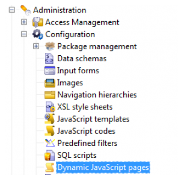

# Skapa anpassade tillägg{#creating-custom-extensions}

När du implementerar ett projekt har du vanligtvis anpassad kod i både AEM och Adobe Campaign. Med hjälp av det befintliga API:t kan du anropa din anpassade kod i Adobe Campaign från AEM eller från AEM till Adobe Campaign. I det här dokumentet beskrivs hur du gör det.

## Förutsättningar {#prerequisites}

Du måste ha följande installerat:

* Adobe Experience Manager
* Adobe Campaign 6.1

Mer information finns i [Integrera AEM med Adobe Campaign 6.1](/help/sites-administering/campaignonpremise.md) .

## Exempel 1: AEM till Adobe Campaign {#example-aem-to-adobe-campaign}

Standardintegrationen mellan AEM och Campaign baseras på JSON och JSSP (JavaScript Server Page). Dessa JSSP-filer finns i Campaign-konsolen och alla börjar med **amc** (Adobe Marketing Cloud).



>[!NOTE]
>
>[Det här exemplet finns i Geometrixx](/help/sites-developing/we-retail.md), som är tillgänglig från Paketresurs.

I det här exemplet skapar vi en ny anpassad JSSP-fil och anropar den från AEM-sidan för att hämta resultatet. Detta kan till exempel användas för att hämta data från Adobe Campaign eller för att spara data i Adobe Campaign.

1. Om du vill skapa en ny JSSP-fil i Adobe Campaign klickar du på ikonen **Nytt** .

   

1. Ange namnet på den här JSSP-filen. I det här exemplet använder vi **cus:custom.jssp** (vilket betyder att det kommer att finnas i **cus** -namnutrymmet).

   

1. Lägg in följande kod i jssp-filen:

   ```
   <%
   var origin = request.getParameter("origin");
   document.write("Hello from Adobe Campaign, origin : " + origin);
   %>
   ```

1. Spara ditt arbete. Det återstående arbetet är i AEM.
1. Skapa en enkel servlet på AEM-sidan för att anropa denna JSSP. I det här exemplet antar vi följande:

   * Anslutningen fungerar mellan AEM och Campaign
   * Kampanjmolntjänsten är konfigurerad på **/content/geometrixx-outdoor**
   Det viktigaste objektet i det här exemplet är **GenericCampaignConnector**, som gör att du kan anropa (hämta och posta) jssp-filer på Adobe Campaign-sidan.

   Här är ett litet kodfragment:

   ```
   @Reference
   private GenericCampaignConnector campaignConnector;
   ...
   Map<String, String> params = new HashMap<String, String>();
   params.put("origin", "AEM");
   CallResults results = campaignConnector.callGeneric("/jssp/cus/custom.jssp", params, credentials);
   return results.bodyAsString();
   ```

1. Som du ser i det här exemplet måste du skicka inloggningsuppgifterna till samtalet. Du kan få detta via metoden getCredentials() där du skickar en sida som har molntjänsten Campaign konfigurerad.

   ```xml
   // page containing the cloudservice for Adobe Campaign
   Configuration config = campaignConnector.getWebserviceConfig(page.getContentResource().getParent());
   CampaignCredentials credentials = campaignConnector.retrieveCredentials(config);
   ```

Den fullständiga koden är följande:

```java
import java.io.IOException;
import java.io.PrintWriter;
import java.util.HashMap;
import java.util.Map;

import javax.servlet.ServletException;

import org.apache.felix.scr.annotations.Reference;
import org.apache.felix.scr.annotations.sling.SlingServlet;
import org.apache.sling.api.SlingHttpServletRequest;
import org.apache.sling.api.SlingHttpServletResponse;
import org.apache.sling.api.servlets.SlingSafeMethodsServlet;
import org.slf4j.Logger;
import org.slf4j.LoggerFactory;

import com.day.cq.mcm.campaign.CallResults;
import com.day.cq.mcm.campaign.CampaignCredentials;
import com.day.cq.mcm.campaign.GenericCampaignConnector;
import com.day.cq.wcm.api.Page;
import com.day.cq.wcm.api.PageManager;
import com.day.cq.wcm.api.PageManagerFactory;
import com.day.cq.wcm.webservicesupport.Configuration;

@SlingServlet(paths="/bin/campaign", methods="GET")
public class CustomServlet extends SlingSafeMethodsServlet {

 private final Logger log = LoggerFactory.getLogger(this.getClass());

 @Reference
 private GenericCampaignConnector campaignConnector;

 @Reference
 private PageManagerFactory pageManagerFactory;

 @Override
 protected void doGet(SlingHttpServletRequest request,
   SlingHttpServletResponse response) throws ServletException,
   IOException {

  PageManager pm = pageManagerFactory.getPageManager(request.getResourceResolver());

  Page page = pm.getPage("/content/geometrixx-outdoors");

  String result = null;
  if ( page != null) {
   result = callCustomFunction(page);
  }
  if ( result != null ) {
   PrintWriter pw = response.getWriter();
   pw.print(result);
  }
 }

 private String callCustomFunction(Page page ) {
  try {
   Configuration config = campaignConnector.getWebserviceConfig(page.getContentResource().getParent());
   CampaignCredentials credentials = campaignConnector.retrieveCredentials(config);

   Map<String, String> params = new HashMap<String, String>();
   params.put("origin", "AEM");
   CallResults results = campaignConnector.callGeneric("/jssp/cus/custom.jssp", params, credentials);
   return results.bodyAsString();
  } catch (Exception e ) {
   log.error("Something went wrong during the connection", e);
  }
  return null;

 }

}
```

## Exempel 2: Adobe Campaign to AEM {#example-adobe-campaign-to-aem}

AEM erbjuder API:er som kan hämta objekt var som helst i platadminutforskarvyn.


>[!NOTE]
>
>[Det här exemplet finns i Geometrixx](/help/sites-developing/we-retail.md), som är tillgänglig från Paketresurs.

För varje nod i Utforskaren finns det ett API som är länkat till det. Exempel:

* [http://localhost:4502/siteadmin#/content/campaigns/geometrixx/scott-recommends](http://localhost:4502/siteadmin#/content/campaigns/geometrixx/scott-recommends)

API:t är:

* [http://localhost:4502/content/campaigns/geometrixx/scott-recommends.1.json](http://localhost:4502/content/campaigns/geometrixx/scott-recommends.2.json)

Slutet av URL:en **.1.json** kan ersättas med **.2.json**, **.3.json**, enligt antalet undernivåer som du vill ha För att få alla nyckelordens **oändlighet** kan användas:

* [http://localhost:4502/content/campaigns/geometrixx/scott-recommends.infinity.json](http://localhost:4502/content/campaigns/geometrixx/scott-recommends.2.json)

För att nu kunna använda API:t måste vi veta att AEM som standard använder grundläggande autentisering.

Ett JS-bibliotek med namnet **amcIntegration.js** är tillgängligt i 6.1.1 (build 8624 och senare) som implementerar den logiken bland flera andra.

### AEM API-anrop {#aem-api-call}

```java
loadLibrary("nms:amcIntegration.js");

var cmsAccountId = sqlGetInt("select iExtAccountId from NmsExtAccount where sName=$(sz)","aemInstance")
var cmsAccount = nms.extAccount.load(String(cmsAccountId));
var cmsServer = cmsAccount.server;

var request = new HttpClientRequest(cmsServer+"/content/campaigns/geometrixx.infinity.json")
aemAddBasicAuthentication(cmsAccount, request);
request.method = "GET"
request.header["Content-Type"] = "application/json; charset=UTF-8";
request.execute();
var response = request.response;
```

