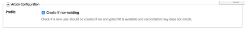

# Skapa anpassade formulärmappningar{#creating-custom-form-mappings}

När du skapar en anpassad tabell i Adobe Campaign kanske du vill skapa ett formulär i AEM som mappar till den anpassade tabellen.

I det här dokumentet beskrivs hur du skapar anpassade formulärmappningar. När du har slutfört stegen i det här dokumentet kommer du att förse dina användare med en eventsida där de kan registrera sig för ett kommande evenemang. Därefter följer du upp med dessa användare via Adobe Campaign.

## Förutsättningar {#prerequisites}

Du måste ha följande installerat:

* Adobe Experience Manager
* Adobe Campaign Classic

Mer information finns i [Integrera AEM med Adobe Campaign Classic](/help/sites-administering/campaignonpremise.md).

## Skapa anpassade formulärmappningar {#creating-custom-form-mappings-2}

Om du vill skapa anpassade formulärmappningar måste du följa de här stegen på hög nivå, som beskrivs i detalj i följande avsnitt:

1. Skapa en anpassad tabell.
1. Utöka tabellen **seed**.
1. Skapa en anpassad mappning.
1. Skapa en leverans baserat på den anpassade mappningen.
1. Bygg formuläret i AEM, som ska använda den skapade leveransen.
1. Skicka formuläret för att testa det.

### Skapa en anpassad tabell i Adobe Campaign {#creating-the-custom-table-in-adobe-campaign}

Börja med att skapa en anpassad tabell i Adobe Campaign. I det här exemplet använder vi följande definition för att skapa en händelsetabell:

```xml
<element autopk="true" label="Event" labelSingular="Event" name="event">
 <attribute label="Event Date" name="eventdate" type="date"/>
 <attribute label="Event Name" name="eventname" type="string"/>
 <attribute label="Email" name="email" type="string"/>
 <attribute label="Number of Seats" name="seats" type="long"/>
</element>
```

När du har skapat händelsetabellen kör du **guiden Uppdatera databasstruktur** för att skapa tabellen.

### Utöka dirigerad tabell {#extending-the-seed-table}

I Adobe Campaign väljer du **Lägg till** för att skapa ett tillägg till tabellen **dirigerade adresser (nms)**.


Använd nu fälten från tabellen **event** för att utöka tabellen **seed** :

```xml
<element label="Event" name="custom_cus_event">
 <attribute name="eventname" template="cus:event:event/@eventname"/>
 <attribute name="eventdate" template="cus:event:event/@eventdate"/>
 <attribute name="email" template="cus:event:event/@email"/>
 <attribute name="seats" template="cus:event:event/@seats"/>
 </element>
```

Efter detta kör du **guiden Uppdatera databas** för att tillämpa ändringarna.

### Skapa anpassad målmappning {#creating-custom-target-mapping}

I **Administration/kampanjhantering** t, gå till **Målmappningar** och lägg till en ny T **målmappning.**

>[!NOTE]
>
>Se till att du använder ett beskrivande namn för **Internt namn**.


### Skapa en anpassad leveransmall {#creating-a-custom-delivery-template}

I det här steget lägger du till en leveransmall som använder den skapade **målmappningen**.

I **Resurser/mallar** navigerar du till leveransmallen och duplicerar den befintliga AEM. När du klickar på **Till** väljer du **målmappning** för händelsen Skapa.


### Skapa formuläret i AEM {#building-the-form-in-aem}

I AEM kontrollerar du att du har konfigurerat en Cloud Service i **Sidegenskaper**.

På fliken **Adobe Campaign** väljer du sedan leveransen som skapades i [Skapa en anpassad leveransmall](#creating-a-custom-delivery-template).


När du konfigurerar fälten måste du ange unika elementnamn för formulärfälten.

När fälten har konfigurerats måste du ändra mappningen manuellt.

I CRXDE-lite går du till noden **jcr:content** (på sidan) och ändrar värdet **acMapping** till det interna namnet för **målmappningen**.


Kontrollera att du har markerat kryssrutan för att skapa om formuläret inte finns



### Skicka formuläret {#submitting-the-form}

Nu kan du skicka formuläret och validera om värdena sparas på Adobe Campaign-sidan.


## Felsökning {#troubleshooting}

**&quot;Ogiltig typ för värdet 02/02/2015 från elementet &#39;@eventdate&#39; (dokument av typen &#39;Event ([adb:event])&#39;)&quot;**

När formuläret skickas loggas det här felet i AEM **error.log**.

Detta beror på ett ogiltigt format för datumfältet. Du kan lösa problemet genom att ange **ååå-mm-dd** som värde.
