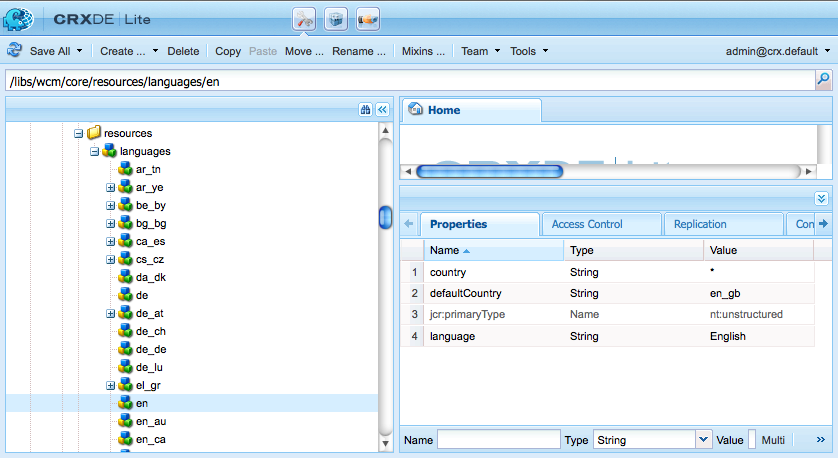

# Utöka Multi Site Manager{#extending-the-multi-site-manager}

På den här sidan kan du utöka funktionerna i Multi Site Manager:

* Läs mer om huvudmedlemmarna i MSM Java API.
* Skapa en synkroniseringsåtgärd som kan användas i en utrullningskonfiguration.
* Ändra standardspråk och landskoder.

<!-- * Remove the "Chapters" step in the Create Site wizard. -->

>[!NOTE]
>
>Den här sidan ska läsas tillsammans med [Återanvända innehåll: Multi Site Manager](/help/sites-administering/msm.md).
>
>Följande avsnitt av Omstrukturering av anläggningstillgångar kan också vara av intresse:
>* [Multi-site Manager-utkastkonfigurationer](https://experienceleague.adobe.com/docs/experience-manager-65/deploying/restructuring/sites-repository-restructuring-in-aem-6-5.html#multi-site-manager-blueprint-configurations)
>* [Konfiguration för utrullning av hanterare för flera platser](https://experienceleague.adobe.com/docs/experience-manager-65/deploying/restructuring/sites-repository-restructuring-in-aem-6-5.html#multi-site-manager-rollout-configurations)

>[!CAUTION]
>
>Multi Site Manager och dess API används vid utvecklingen av en webbplats, så de är bara avsedda att användas i en författarmiljö.

## Översikt över Java API {#overview-of-the-java-api}

Hantering av flera platser består av följande paket:

* [com.day.cq.wcm.msm.api](https://developer.adobe.com/experience-manager/reference-materials/6-5/javadoc/com/day/cq/wcm/msm/api/package-frame.html)
* [com.day.cq.wcm.msm.Commons](https://developer.adobe.com/experience-manager/reference-materials/6-5/javadoc/com/day/cq/wcm/msm/commons/package-frame.html)

De huvudsakliga MSM API-objekten interagerar på följande sätt (se även [Använda villkor](/help/sites-administering/msm.md#terms-used)):


* **`Blueprint`**

  En `Blueprint` (som i [blå konfiguration](/help/sites-administering/msm.md#source-blueprints-and-blueprint-configurations)) anger de sidor från vilka en live-kopia kan ärva innehåll.

  

   * Det är valfritt att använda en ritningskonfiguration ( `Blueprint`), men:

      * Tillåter författaren att använda alternativet **Rollout** på källan (för att (explicit) överföra ändringar till live-kopior som ärver från den här källan).
      * Gör att författaren kan använda **Skapa plats**. På så sätt kan användaren enkelt välja språk och konfigurera strukturen för live-kopian.
      * Definierar standardkonfigurationen för utrullning för alla resulterande live-kopior.

* **`LiveRelationship`**

  `LiveRelationship` anger anslutningen (relationen) mellan en resurs i livekopiegrenen och dess motsvarande källa/rityta.

   * Relationerna används vid arv och utrullning.
   * `LiveRelationship`-objekt ger åtkomst (referenser) till rollout-konfigurationerna ( `RolloutConfig`), `LiveCopy` och `LiveStatus`-objekt som är relaterade till relationen.

   * En live-kopia skapas till exempel i `/content/copy/us` från källan/ritningen på `/content/we-retail/language-masters`. Resurserna `/content/we.retail/language-masters/en/jcr:content` och `/content/copy/us/en/jcr:content` utgör en relation.

* **`LiveCopy`**

  `LiveCopy` innehåller konfigurationsinformation för relationerna ( `LiveRelationship`) mellan livekopieringsresurserna och deras käll-/planresurser.

   * Använd klassen `LiveCopy` för att komma åt sidans sökväg, sökvägen till käll-/ritningssidan, rollout-konfigurationerna och om underordnade sidor också inkluderas i `LiveCopy`.

   * En `LiveCopy`-nod skapas varje gång **Skapa plats** eller **Skapa Live-kopia** används.

* **`LiveStatus`**

  `LiveStatus`-objekt ger åtkomst till körningsstatus för `LiveRelationship`. Används för att fråga synkroniseringsstatusen för en live-kopia.

* **`LiveAction`**

  En `LiveAction` är en åtgärd som utförs på varje resurs som ingår i utrullningen.

   * LiveActions genereras endast av RolloutConfigs.

* **`LiveActionFactory`**

  Skapar `LiveAction` objekt med en `LiveAction`-konfiguration. Konfigurationer lagras som resurser i databasen.

* **`RolloutConfig`**

  `RolloutConfig` innehåller en lista med `LiveActions` som ska användas när den aktiveras. `LiveCopy` ärver `RolloutConfig` och resultatet finns i `LiveRelationship`.

   * När du konfigurerar en live-kopia för första gången används också en RolloutConfig (som utlöser LiveActions).

## Skapa en ny synkroniseringsåtgärd {#creating-a-new-synchronization-action}

Skapa anpassade synkroniseringsåtgärder som du kan använda med dina utrullningskonfigurationer. Skapa en synkroniseringsåtgärd när de [installerade åtgärderna](/help/sites-administering/msm-sync.md#installed-synchronization-actions) inte uppfyller dina specifika programkrav. Skapa då två klasser:

* En implementering av gränssnittet [`com.day.cq.wcm.msm.api.LiveAction`](https://developer.adobe.com/experience-manager/reference-materials/6-5/javadoc/com/day/cq/wcm/msm/api/LiveAction.html) som utför åtgärden.
* En OSGI-komponent som implementerar gränssnittet [`com.day.cq.wcm.msm.api.LiveActionFactory`](https://developer.adobe.com/experience-manager/reference-materials/6-5/javadoc/com/day/cq/wcm/msm/api/LiveActionFactory.html) och skapar instanser av klassen `LiveAction`.

`LiveActionFactory` skapar instanser av klassen `LiveAction` för en given konfiguration:

* `LiveAction`-klasser innehåller följande metoder:

   * `getName`: Returnerar åtgärdens namn. Namnet används för att referera till åtgärden, till exempel i utrullningskonfigurationer.
   * `execute`: Utför åtgärderna.

* `LiveActionFactory`-klasser innehåller följande medlemmar:

   * `LIVE_ACTION_NAME`: Ett fält som innehåller namnet på det associerade `LiveAction`. Det här namnet måste sammanfalla med värdet som returneras av metoden `getName` i klassen `LiveAction`.

   * `createAction`: Skapar en instans av `LiveAction`. Den valfria parametern `Resource` kan användas för att tillhandahålla konfigurationsinformation.

   * `createsAction`: Returnerar namnet på den associerade `LiveAction`.

### Åtkomst till konfigurationsnoden för LiveAction {#accessing-the-liveaction-configuration-node}

Använd konfigurationsnoden `LiveAction` i databasen för att lagra information som påverkar körningsbeteendet för instansen `LiveAction`. Noden i databasen som lagrar konfigurationen `LiveAction` är tillgänglig för objektet `LiveActionFactory` vid körning. Därför kan du lägga till egenskaper i konfigurationsnoden och använda dem i din `LiveActionFactory`-implementering efter behov.

En `LiveAction` måste till exempel lagra namnet på den som skapat ritningen. En egenskap för konfigurationsnoden innehåller egenskapsnamnet för den planeringssida som lagrar informationen. Vid körning hämtar `LiveAction` egenskapsnamnet från konfigurationen och hämtar sedan egenskapsvärdet.

Parametern för metoden [`LiveActionFactory.createAction`](https://developer.adobe.com/experience-manager/reference-materials/6-5/javadoc/com/day/cq/wcm/msm/api/LiveActionFactory.html) är ett `Resource`-objekt. Det här `Resource`-objektet representerar `cq:LiveSyncAction`-noden för den här live-åtgärden i rollout-konfigurationen. Se [Skapa en utrullningskonfiguration](/help/sites-administering/msm-sync.md#creating-a-rollout-configuration). Som vanligt när du använder en konfigurationsnod bör du anpassa den till ett `ValueMap`-objekt:

```java
public LiveAction createAction(Resource resource) throws WCMException {
        ValueMap config;
        if (resource == null || resource.adaptTo(ValueMap.class) == null) {
            config = new ValueMapDecorator(Collections.<String, Object>emptyMap());
        } else {
            config = resource.adaptTo(ValueMap.class);
        }
        return new MyLiveAction(config, this);
}
```

### Åtkomst till målnoder, Source-noder och LiveRelationship {#accessing-target-nodes-source-nodes-and-the-liverelationship}

Följande objekt anges som parametrar för metoden `execute` för objektet `LiveAction`:

* Ett [`Resource`](https://developer.adobe.com/experience-manager/reference-materials/6-5/javadoc/org/apache/sling/api/resource/Resource.html)-objekt som representerar källan för Live-kopian.
* Ett `Resource`-objekt som representerar målet för Live-kopian.
* Objektet [`LiveRelationship`](https://developer.adobe.com/experience-manager/reference-materials/6-5/javadoc/com/day/cq/wcm/msm/api/LiveRelationship.html) för live-kopian.
* Värdet `autoSave` anger om `LiveAction` ska spara ändringar som görs i databasen.

* Återställningsvärdet anger återställningsläget för utrullning.

Från dessa objekt kan du få all information om `LiveCopy`. Du kan också använda objekten `Resource` för att hämta objekten `ResourceResolver`, `Session` och `Node`. De här objekten är användbara för att hantera databasinnehåll:

I den första raden i följande kod är källan `Resource`-objektet på källsidan:

```java
ResourceResolver resolver = source.getResourceResolver();
Session session = resolver.adaptTo(javax.jcr.Session.class);
Node sourcenode = source.adaptTo(javax.jcr.Node.class);
```

>[!NOTE]
>
>`Resource`-argumenten kan vara `null`- eller `Resources`-objekt som inte anpassar sig till `Node`-objekt, till exempel [`NonExistingResource`](https://developer.adobe.com/experience-manager/reference-materials/6-5/javadoc/org/apache/sling/api/resource/NonExistingResource.html)-objekt.

## Skapa en ny utrullningskonfiguration {#creating-a-new-rollout-configuration}

Skapa en utrullningskonfiguration när de installerade utrullningskonfigurationerna inte uppfyller dina programkrav:

* [Skapa utrullningskonfigurationen](#create-the-rollout-configuration).
* [Lägg till synkroniseringsåtgärder i utrullningskonfigurationen](#add-synchronization-actions-to-the-rollout-configuration).

Den nya utrullningskonfigurationen är sedan tillgänglig för dig när du ställer in utrullningskonfigurationer på en ritnings- eller Live copy-sida.

>[!NOTE]
>
>Se även de [bästa sätten att anpassa rollouter](/help/sites-administering/msm-best-practices.md#customizing-rollouts).

### Skapa utrullningskonfiguration {#create-the-rollout-configuration}

1. Öppna CRXDE Lite, till exempel:
   [http://localhost:4502/crx/de](http://localhost:4502/crx/de)

1. Navigera till :
   `/apps/msm/<your-project>/rolloutconfigs`

   >[!NOTE]
   >Det här är projektets anpassade version av:
   >`/libs/msm/wcm/rolloutconfigs`
   >Om det här är din första konfiguration måste den här `/libs`-grenen användas som mall för att skapa den nya grenen under `/apps`.

   >[!NOTE]
   >
   >Ändra ingenting i sökvägen `/libs`.
   >Detta beror på att innehållet i `/libs` skrivs över nästa gång du uppgraderar din instans (och kan mycket väl skrivas över när du använder en snabbkorrigering eller ett funktionspaket).
   >Den rekommenderade metoden för konfiguration och andra ändringar är:
   >
   >* Återskapa det obligatoriska objektet (det vill säga som det finns i `/libs`) under `/apps`
   >* Gör ändringar i `/apps`

1. Under denna **Skapa** en nod med följande egenskaper:

   * **Namn**: Nodnamnet för utrullningskonfigurationen. md#installed-synchronization-actions), till exempel `contentCopy` eller `workflow`.
   * **Typ**: `cq:RolloutConfig`

1. Lägg till följande egenskaper i den här noden:
   * **Namn**: `jcr:title`

     **Typ**: `String`
     **Värde**: En identifierande titel som visas i användargränssnittet.
   * **Namn**: `jcr:description`

     **Typ**: `String`
     **Värde**: En valfri beskrivning.
   * **Namn**: `cq:trigger`

     **Typ**: `String`
     **Värde**: Utlösaren [som ska användas ](/help/sites-administering/msm-sync.md#rollout-triggers). Välj bland:
      * `rollout`
      * `modification`
      * `publish`
      * `deactivate`

1. Klicka på **Spara alla**.

### Lägg till synkroniseringsåtgärder i utrullningskonfigurationen {#add-synchronization-actions-to-the-rollout-configuration}

Utrullningskonfigurationer lagras under den [rollout-konfigurationsnod](#create-the-rollout-configuration) som du har skapat under noden `/apps/msm/<your-project>/rolloutconfigs`.

Lägg till underordnade noder av typen `cq:LiveSyncAction` för att lägga till synkroniseringsåtgärder i rollout-konfigurationen. Ordningen på synkroniseringsåtgärdsnoderna avgör i vilken ordning åtgärderna utförs.

1. Gå fortfarande till CRXDE Lite och markera noden [Konfiguration för utrullning](#create-the-rollout-configuration).

   Till exempel:
   `/apps/msm/myproject/rolloutconfigs/myrolloutconfig`

1. **Skapa** en nod med följande nodegenskaper:

   * **Namn**: Synkroniseringsåtgärdens nodnamn.
Namnet måste vara detsamma som **åtgärdsnamnet** i tabellen under [Synkroniseringsåtgärder](/help/sites-administering/msm-sync.md#installed-synchronization-actions), till exempel `contentCopy` eller `workflow`.
   * **Typ**: `cq:LiveSyncAction`

1. Lägg till och konfigurera så många noder för synkroniseringsåtgärder som du behöver. Ordna om åtgärdsnoderna så att ordningen matchar den ordning i vilken du vill att de ska visas. Den översta åtgärdsnoden inträffar först.

## Skapa och använda en enkel LiveActionFactory-klass {#creating-and-using-a-simple-liveactionfactory-class}

Följ anvisningarna i det här avsnittet för att utveckla en `LiveActionFactory` och använda den i en utrullningskonfiguration. I procedurerna används Maven och Eclipse för att utveckla och distribuera `LiveActionFactory`:

1. [Skapa maven-projektet](#create-the-maven-project) och importera det till Eclipse.
1. [Lägg till beroenden](#add-dependencies-to-the-pom-file) i POM-filen.
1. [Implementera `LiveActionFactory`-gränssnittet ](#implement-liveactionfactory) och distribuera OSGi-paketet.
1. [Skapa utrullningskonfigurationen](#create-the-example-rollout-configuration).
1. [Skapa live-kopian](#create-the-live-copy).

Maven-projektet och Java-klassens källkod är tillgängliga i det offentliga Git-arkivet.

KOD PÅ GITHUB

Koden för den här sidan finns på GitHub

* [Öppna ExperienceManager-java-msmrollout-projekt på GitHub](https://github.com/Adobe-Marketing-Cloud/experiencemanager-java-msmrollout)
* Hämta projektet som [en ZIP-fil](https://github.com/Adobe-Marketing-Cloud/experiencemanager-java-msmrollout/archive/master.zip)

### Skapa projektet Maven {#create-the-maven-project}

Följande procedur kräver att du har lagt till adobe-public-profilen i Maven-inställningsfilen.

* Mer information om profilen adobe-public finns i [Hämta plugin-programmet för innehållspaketet Maven](/help/sites-developing/vlt-mavenplugin.md#obtaining-the-content-package-maven-plugin)
* Mer information om inställningsfilen för Maven finns i [Inställningsreferens](https://maven.apache.org/settings.html) för Maven.

1. Öppna en terminal- eller kommandoradssession och ändra katalogen så att den pekar på den plats där projektet ska skapas.
1. Ange följande kommando:

   ```xml
   mvn archetype:generate -DarchetypeGroupId=com.day.jcr.vault -DarchetypeArtifactId=multimodule-content-package-archetype -DarchetypeVersion=1.0.0 -DarchetypeRepository=adobe-public-releases
   ```

1. Ange följande värden vid en interaktiv fråga:

   * `groupId`: `com.adobe.example.msm`
   * `artifactId`: `MyLiveActionFactory`
   * `version`: `1.0-SNAPSHOT`
   * `package`: `MyPackage`
   * `appsFolderName`: `myapp`
   * `artifactName`: `MyLiveActionFactory package`
   * `packageGroup`: `myPackages`

1. Starta Eclipse och [importera Maven-projektet](/help/sites-developing/howto-projects-eclipse.md#import-the-maven-project-into-eclipse).

### Lägg till beroenden till POM-filen {#add-dependencies-to-the-pom-file}

Lägg till beroenden så att Eclipse-kompilatorn kan referera till klasserna som används i `LiveActionFactory`-koden.

1. Öppna filen i Eclipse Project Explorer:

   `MyLiveActionFactory/pom.xml`

1. Klicka på fliken `pom.xml` i redigeraren och leta upp avsnittet `project/dependencyManagement/dependencies`.
1. Lägg till följande XML i elementet `dependencyManagement` och spara sedan filen.

   ```xml
    <dependency>
     <groupId>com.day.cq.wcm</groupId>
     <artifactId>cq-msm-api</artifactId>
     <version>5.6.2</version>
     <scope>provided</scope>
    </dependency>
    <dependency>
     <groupId>org.apache.sling</groupId>
     <artifactId>org.apache.sling.api</artifactId>
     <version>2.4.3-R1488084</version>
     <scope>provided</scope>
    </dependency>
    <dependency>
     <groupId>com.day.cq.wcm</groupId>
     <artifactId>cq-wcm-api</artifactId>
     <version>5.6.6</version>
     <scope>provided</scope>
    </dependency>
    <dependency>
     <groupId>org.apache.sling</groupId>
     <artifactId>org.apache.sling.commons.json</artifactId>
     <version>2.0.6</version>
     <scope>provided</scope>
    </dependency>
    <dependency>
     <groupId>com.day.cq</groupId>
     <artifactId>cq-commons</artifactId>
     <version>5.6.4</version>
     <scope>provided</scope>
    </dependency>
    <dependency>
     <groupId>org.apache.sling</groupId>
     <artifactId>org.apache.sling.jcr.jcr-wrapper</artifactId>
     <version>2.0.0</version>
     <scope>provided</scope>
    </dependency>
    <dependency>
     <groupId>com.day.cq</groupId>
     <artifactId>cq-commons</artifactId>
     <version>5.6.4</version>
     <scope>provided</scope>
    </dependency>
   ```

1. Öppna POM-filen för paketet från **Project Explorer** kl. `MyLiveActionFactory-bundle/pom.xml`.
1. Klicka på fliken `pom.xml` i redigeraren och leta upp avsnittet Projekt/beroenden. Lägg till följande XML i beroendeelementet och spara sedan filen:

   ```xml
    <dependency>
     <groupId>com.day.cq.wcm</groupId>
     <artifactId>cq-msm-api</artifactId>
    </dependency>
    <dependency>
     <groupId>org.apache.sling</groupId>
     <artifactId>org.apache.sling.api</artifactId>
    </dependency>
    <dependency>
     <groupId>com.day.cq.wcm</groupId>
     <artifactId>cq-wcm-api</artifactId>
    </dependency>
    <dependency>
     <groupId>org.apache.sling</groupId>
     <artifactId>org.apache.sling.commons.json</artifactId>
    </dependency>
    <dependency>
     <groupId>com.day.cq</groupId>
     <artifactId>cq-commons</artifactId>
    </dependency>
    <dependency>
     <groupId>org.apache.sling</groupId>
     <artifactId>org.apache.sling.jcr.jcr-wrapper</artifactId>
    </dependency>
    <dependency>
     <groupId>com.day.cq</groupId>
     <artifactId>cq-commons</artifactId>
    </dependency>
   ```

### Implementera LiveActionFactory {#implement-liveactionfactory}

Följande `LiveActionFactory`-klass implementerar en `LiveAction` som loggar meddelanden om käll- och målsidorna och kopierar egenskapen `cq:lastModifiedBy` från källnoden till målnoden. Den aktiva åtgärdens namn är `exampleLiveAction`.

1. Högerklicka på paketet `MyLiveActionFactory-bundle/src/main/java/com.adobe.example.msm` i Eclipse Project Explorer och klicka på **New** > **Class**. Ange `ExampleLiveActionFactory` som **namn** och klicka sedan på **Slutför**.
1. Öppna filen `ExampleLiveActionFactory.java`, ersätt innehållet med följande kod och spara filen.

   ```java
   package com.adobe.example.msm;
   
   import java.util.Collections;  
   
   import com.day.cq.wcm.api.NameConstants;
   import org.apache.sling.api.resource.Resource;
   import org.apache.sling.api.resource.ResourceResolver;
   import org.apache.sling.api.resource.ValueMap;
   import org.apache.sling.api.wrappers.ValueMapDecorator;
   import org.apache.sling.commons.json.io.JSONWriter;
   import org.apache.sling.commons.json.JSONException;
   
   import org.osgi.service.component.annotations.Component;
   import org.slf4j.Logger;
   import org.slf4j.LoggerFactory;
   
   import javax.jcr.Node;
   import javax.jcr.RepositoryException;
   import javax.jcr.Session;
   
   import com.day.cq.wcm.msm.api.ActionConfig;
   import com.day.cq.wcm.msm.api.LiveAction;
   import com.day.cq.wcm.msm.api.LiveActionFactory;
   import com.day.cq.wcm.msm.api.LiveRelationship;
   import com.day.cq.wcm.api.WCMException;
   
   @Component(
   service = LiveActionFactory.class,
   property = {LiveActionFactory.LIVE_ACTION_NAME + "=" + ExampleLiveActionFactory.LIVE_ACTION_NAME})
   public class ExampleLiveActionFactory implements LiveActionFactory<LiveAction> {
     private static final Logger logger = LoggerFactory.getLogger(ExampleLiveActionFactory.class);
   
     public static final String LIVE_ACTION_NAME = "CustomAction";
   
     public LiveAction createAction(Resource config) {
       ValueMap configs;
       /* Adapt the config resource to a ValueMap */
       if (config == null || config.adaptTo(ValueMap.class) == null) {
         configs = new ValueMapDecorator(Collections.<String, Object>emptyMap());
       } else {
         configs = config.adaptTo(ValueMap.class);
       }  
   
       return new ExampleLiveAction(LIVE_ACTION_NAME, configs);
     }
     public String createsAction() {
       return LIVE_ACTION_NAME;
     }  
   
     /************* LiveAction ****************/
     private static class ExampleLiveAction implements LiveAction {
       private String name;
       private ValueMap configs;
       private static final Logger log = LoggerFactory.getLogger(ExampleLiveAction.class);  
   
     public ExampleLiveAction(String nm, ValueMap config){
       name = nm;
       configs = config;
     }  
   
     public void execute(Resource source, Resource target,
                         LiveRelationship liverel, boolean autoSave, boolean isResetRollout)
                       throws WCMException {  
   
       String lastMod = null;  
   
       log.info(" *** Executing ExampleLiveAction *** ");  
   
       /* Determine if the LiveAction is configured to copy the cq:lastModifiedBy property */
       if ((Boolean) configs.get("repLastModBy")){  
   
         /* get the source's cq:lastModifiedBy property */
         if (source != null && source.adaptTo(Node.class) !=  null){
           ValueMap sourcevm = source.adaptTo(ValueMap.class);
           lastMod = sourcevm.get(NameConstants.PN_PAGE_LAST_MOD_BY, String.class);
         }  
   
         /* set the target node's la-lastModifiedBy property */
         Session session = null;
         if (target != null && target.adaptTo(Node.class) !=  null){
           ResourceResolver resolver = target.getResourceResolver();
           session = resolver.adaptTo(javax.jcr.Session.class);
           Node targetNode;
           try{
             targetNode=target.adaptTo(javax.jcr.Node.class);
             targetNode.setProperty("la-lastModifiedBy", lastMod);
             log.info(" *** Target node lastModifiedBy property updated: {} ***",lastMod);
           }catch(Exception e){
             log.error(e.getMessage());
           }
         }
         if(autoSave){
           try {
             session.save();
           } catch (Exception e) {
             try {
               session.refresh(true);
             } catch (RepositoryException e1) {
               e1.printStackTrace();
             }
             e.printStackTrace();
           }
         }
       }
     }
     public String getName() {
       return name;
     }  
   
     /************* Deprecated *************/
     @Deprecated
     public void execute(ResourceResolver arg0, LiveRelationship arg1,
                        ActionConfig arg2, boolean arg3) throws WCMException {
     }
     @Deprecated
     public void execute(ResourceResolver arg0, LiveRelationship arg1,
                         ActionConfig arg2, boolean arg3, boolean arg4)
                       throws WCMException {
     }
     @Deprecated
     public String getParameterName() {
       return null;
     }
     @Deprecated
       public String[] getPropertiesNames() {
         return null;
     }
     @Deprecated
     public int getRank() {
       return 0;
     }
     @Deprecated
     public String getTitle() {
       return null;
     }
     @Deprecated
     public void write(JSONWriter arg0) throws JSONException {
     }
   }
   ```

1. Använd terminal- eller kommandosessionen för att ändra katalogen till katalogen `MyLiveActionFactory` (Maven-projektkatalogen). Ange sedan följande kommando:

   ```shell
   mvn -PautoInstallPackage clean install
   ```

   AEM `error.log`-filen ska ange att paketet har startats.

   Exempel: [https://localhost:4502/system/console/status-slinglogs](https://localhost:4502/system/console/status-slinglogs).

   ```xml
   13.08.2013 14:34:55.450 *INFO* [OsgiInstallerImpl] com.adobe.example.msm.MyLiveActionFactory-bundle BundleEvent RESOLVED
   13.08.2013 14:34:55.451 *INFO* [OsgiInstallerImpl] com.adobe.example.msm.MyLiveActionFactory-bundle BundleEvent STARTING
   13.08.2013 14:34:55.451 *INFO* [OsgiInstallerImpl] com.adobe.example.msm.MyLiveActionFactory-bundle BundleEvent STARTED
   13.08.2013 14:34:55.453 *INFO* [OsgiInstallerImpl] com.adobe.example.msm.MyLiveActionFactory-bundle Service [com.adobe.example.msm.ExampleLiveActionFactory,2188] ServiceEvent REGISTERED
   13.08.2013 14:34:55.454 *INFO* [OsgiInstallerImpl] org.apache.sling.audit.osgi.installer Started bundle com.adobe.example.msm.MyLiveActionFactory-bundle [316]
   ```

### Skapa exempelkonfigurationen {#create-the-example-rollout-configuration}

Skapa den MSM-utrullningskonfiguration som använder `LiveActionFactory` som du skapade:

1. Skapa och konfigurera en [utrullningskonfiguration med standardproceduren](/help/sites-administering/msm-sync.md#creating-a-rollout-configuration) - och använd egenskaperna:

   * **Titel**: Exempel på konfiguration för utrullning
   * **Namn**: exampleLoutconfig
   * **cq:trigger**: `publish`

### Lägg till Live-åtgärden i exempelkonfigurationen för utrullning {#add-the-live-action-to-the-example-rollout-configuration}

Konfigurera den utrullningskonfiguration som du skapade i föregående procedur så att den använder klassen `ExampleLiveActionFactory`.

1. Öppna CRXDE Lite, till exempel [https://localhost:4502/crx/de](https://localhost:4502/crx/de).
1. Skapa följande nod under `/apps/msm/rolloutconfigs/examplerolloutconfig/jcr:content`:

   * **Namn**: `exampleLiveAction`
   * **Typ**: `cq:LiveSyncAction`

1. Klicka på **Spara alla**.
1. Markera noden `exampleLiveAction` och lägg till följande egenskap:

   * **Namn**: `repLastModBy`
   * **Typ**: `Boolean`
   * **Värde**: `true`

   Den här egenskapen anger för klassen `ExampleLiveAction` att egenskapen `cq:LastModifiedBy` ska replikeras från källan till målnoden.

1. Klicka på **Spara alla**.

### Skapa Live Copy {#create-the-live-copy}

[Skapa en live-kopia](/help/sites-administering/msm-livecopy.md#creating-a-live-copy-of-a-page) av engelska/produkter-grenen av webbbutikens referenswebbplats med din rollout-konfiguration:

* **Source**: `/content/we-retail/language-masters/en/products`

* **Konfiguration för utrullning**: Exempel på konfiguration för utrullning

Aktivera sidan **Produkter** (engelska) i källgrenen och observera de loggmeddelanden som genereras av klassen `LiveAction`:

```xml
16.08.2013 10:53:33.055 *INFO* [Thread-444535] com.adobe.example.msm.ExampleLiveActionFactory$ExampleLiveAction  ***ExampleLiveAction has been executed.***
16.08.2013 10:53:33.055 *INFO* [Thread-444535] com.adobe.example.msm.ExampleLiveActionFactory$ExampleLiveAction  ***Target node lastModifiedBy property updated: admin ***
```

<!--
## Removing the Chapters Step in the Create Site Wizard {#removing-the-chapters-step-in-the-create-site-wizard}

In some cases, the **Chapters** selection is not required in the create site wizard (only the **Languages** selection is required). To remove this step in the default We.Retail English blueprint:

1. In CRX Explorer, remove the node:
   `/etc/blueprints/weretail-english/jcr:content/dialog/items/tabs/items/tab_chap`.

1. Navigate to `/libs/wcm/msm/templates/blueprint/defaults/livecopy_tab/items` and create a node:

    1. **Name** = `chapters`; **Type** = `cq:Widget`.

1. Add following properties to the new node:

    1. **Name** = `name`; **Type** = `String`; **Value** = `msm:chapterPages`

    1. **Name** = `value`; **Type** = `String`; **Value** = `all`

    1. **Name** = `xtype`; **Type** = `String`; **Value** = `hidden`
-->

## Ändra språknamn och standardländer {#changing-language-names-and-default-countries}

AEM använder en standarduppsättning med språk- och landskoder.

* Standardspråkkoden är den gemena tvåbokstavskoden enligt ISO-639-1.
* Standardlandskoden är den gemena eller versala tvåbokstavskoden enligt ISO 3166.

MSM använder en lagrad lista med språk- och landskoder för att fastställa namnet på landet som är associerat med namnet på språkversionen av sidan. Du kan ändra följande delar av listan om det behövs:

* Språktitlar
* Landsnamn
* Standardländer för språk (för koder som `en`, `de` med flera)

Språklistan lagras under noden `/libs/wcm/core/resources/languages`. Varje underordnad nod representerar ett språk eller ett språkområde:

* Nodnamnet är språkkoden (till exempel `en` eller `de`) eller språkkoden (till exempel `en_us` eller `de_ch`).

* Egenskapen `language` för noden lagrar det fullständiga namnet på språket för koden.
* Egenskapen `country` för noden lagrar det fullständiga namnet på landet för koden.
* När nodnamnet bara består av en språkkod (till exempel `en`) är egenskapen country `*` och ytterligare en `defaultCountry`-egenskap lagrar koden för det språklandet som anger vilket land som ska användas.



Så här ändrar du språk:

1. Öppna CRXDE Lite i webbläsaren, till exempel [https://localhost:4502/crx/de](https://localhost:4502/crx/de)
1. Markera mappen `/apps`, klicka på **Skapa** och sedan på **Skapa mapp.**

   Namnge den nya mappen `wcm`.

1. Upprepa föregående steg för att skapa mappträdet `/apps/wcm/core`. Skapa en nod av typen `sling:Folder` i `core` med namnet `resources`. <!--  -->

1. Högerklicka på noden `/libs/wcm/core/resources/languages` och klicka på **Kopiera**.
1. Högerklicka på mappen `/apps/wcm/core/resources` och klicka på **Klistra in**. Ändra de underordnade noderna efter behov.
1. Klicka på **Spara alla**.
1. Klicka på **Verktyg**, **Åtgärder** och sedan på **Webbkonsol**. Från den här konsolen klickar du på **OSGi** och sedan på **Konfiguration**.
1. Leta upp och klicka på **Day CQ WCM Language Manager**, ändra värdet för **Språklista** till `/apps/wcm/core/resources/languages` och klicka sedan på **Spara**.

   

## Konfigurera MSM-lås på sidegenskaper (Touch-aktiverat gränssnitt) {#configuring-msm-locks-on-page-properties-touch-enabled-ui}

När du skapar en anpassad sidegenskap kan du behöva fundera på om den nya egenskapen ska kunna rullas ut till alla live-kopior.

Om till exempel två nya sidegenskaper läggs till:

* E-postadress:

   * Den här egendomen behöver inte lanseras eftersom den kommer att vara olika i varje land (eller varumärke osv.).

* Visuell huvudstil:

   * Projektkravet är att den här egenskapen ska rullas ut eftersom den (vanligtvis) är gemensam för alla länder (eller varumärken osv.).

Då måste du se till att:

* E-postadress:

* Utesluts från de utrullade egenskaperna. Se [Utesluta egenskaper och nodtyper från synkronisering](/help/sites-administering/msm-sync.md#excluding-properties-and-node-types-from-synchronization).

* Visuell huvudstil:

* Se till att du inte tillåts redigera den här egenskapen i det beröringsaktiverade användargränssnittet om inte arvet avbryts, även att du sedan kan återställa arvet. Detta styrs genom att klicka på kedjelänkarna/brutna kedjelänkarna som växlar för att ange anslutningsstatus.

Anger om en sidegenskap ska rullas ut och därför styrs arvet av egenskapen dialog, under förutsättning att arvet avbryts/återställs vid redigering:

* `cq-msm-lockable`

   * kan användas för objekt i en dialogruta med pekfunktioner
   * skapar kedjelänkssymbolen i dialogrutan
   * tillåter bara redigering om arv avbryts (kedjelänken bryts)
   * gäller endast den första underordnade nivån för resursen
      * **Typ**: `String`

      * **Värde**: innehåller namnet på den aktuella egenskapen (och är jämförbart med värdet för egenskapen `name`; se till exempel

        `/libs/foundation/components/page/cq:dialog/content/items/tabs/items/basic/items/column/items/title/items/title`

När `cq-msm-lockable` har definierats interagerar kedjan med MSM på följande sätt om kedjan bryts/stängs:

* om värdet för `cq-msm-lockable` är:

   * **Relativ** (till exempel `myProperty` eller `./myProperty`)

      * den lägger till och tar bort egenskapen från `cq:propertyInheritanceCancelled`.

   * **Absolut** (till exempel `/image`)

      * Om du bryter kedjan avbryts arvet genom att blanda `cq:LiveSyncCancelled` i `./image` och ställa in `cq:isCancelledForChildren` på `true`.

      * Om du stänger kedjan återställs arvet.

>[!NOTE]
>
>`cq-msm-lockable` gäller för den första underordnade nivån för resursen som ska redigeras och den fungerar inte på något djupare överordnat nivå, oavsett om värdet är definierat som absolut eller relativ.

>[!NOTE]
>
>När du återaktiverar arv synkroniseras inte egenskapen för live-kopieringssidan automatiskt med egenskapen source. Du kan begära en synkronisering manuellt om det behövs.
