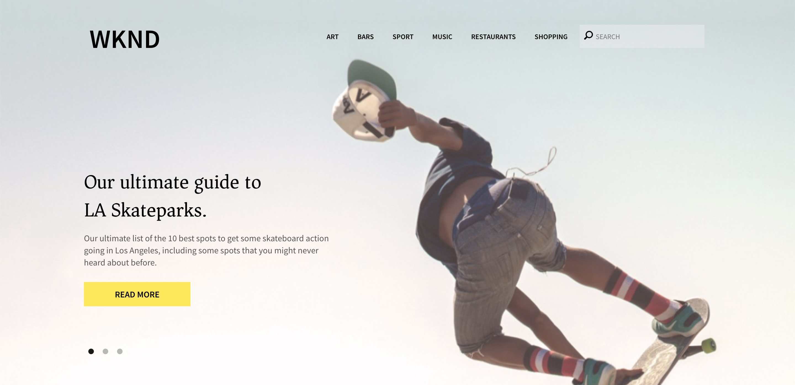

# Komma igång med utveckling i AEM Sites – WKND-självstudiekurs{#getting-started-developing-aem-sites-wknd-tutorial}

## Översikt {#overview}

Är du inte van vid att utveckla AEM? Behöver du en uppdatering av bästa praxis? Här börjar du!

Målet med den här självstudiekursen är att lära en utvecklare som är ny att AEM hur man implementerar en webbplats i AEM med de senaste standarderna och teknikerna. Hoppas att du kommer att förstå grunderna i den AEM plattformen och kunskaper om några av de gemensamma designmönstren.

## WKND Developer Tutorial {#wknd-developer-tutorial}

[WKND Developer Tutorial är tillgänglig ](https://docs.adobe.com/content/help/en/experience-manager-learn/getting-started-wknd-tutorial-develop/overview.html) här och vägleder dig genom att skapa ett AEM projekt med hjälp av den senaste tekniken och de bästa metoderna.

## Viktiga begrepp {#core-concepts}

Självstudiekursen utnyttjar många kraftfulla funktioner i AEM. Webbplatsen kommer att implementeras med:

* [HTL](https://docs.adobe.com/content/help/en/experience-manager-htl/using/overview.html)
* [Sling Models](https://sling.apache.org/documentation/bundles/models.html)
* [Pekgränssnitt](/help/sites-developing/touch-ui-concepts.md)
* [Kärnkomponenter](https://docs.adobe.com/content/help/en/experience-manager-core-components/using/introduction.html)
* [Redigerbara mallar](/help/sites-developing/page-templates-editable.md)

Gå igenom självstudiekursen innan du går in på de ovanstående begreppen i detalj.

## Nästa steg {#next-steps}

När du är klar med [självstudiekursen](https://helpx.adobe.com/experience-manager/kt/sites/using/getting-started-wknd-tutorial-develop.html) bör du överväga att läsa igenom dokumentet [AEM Core Concepts](/help/sites-developing/the-basics.md) för att få en bättre förståelse för vissa underliggande tekniker och utvecklingsparadigmer för AEM.
