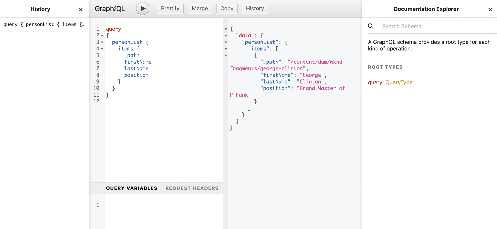

# Komma åt och leverera innehållsfragment Headless Quick Start Guide {#accessing-delivering-content-fragments}

Lär dig använda AEM Assets REST API för att hantera innehållsfragment och GraphQL API för headless-leverans av Content Fragment-innehåll.

## Vad är GraphQL och Assets REST API:er? {#what-are-the-apis}

[Nu när du har skapat några innehållsfragment,](create-content-fragment.md) kan du använda AEM-API:er för att leverera dem utan problem.

* [GraphQL API](/help/assets/content-fragments/graphql-api-content-fragments.md) gör att du kan skapa begäranden om åtkomst till och leverans av innehållsfragment.
   * Om du vill använda det här [slutpunkter måste definieras och aktiveras i AEM](/help/assets/content-fragments/graphql-api-content-fragments.md#enabling-graphql-endpoint)och, om det behövs, [GraphiQL-gränssnittet är installerat](/help/assets/content-fragments/graphql-api-content-fragments.md#installing-graphiql-interface).
* [Resursens REST API](/help/assets/assets-api-content-fragments.md) I kan du skapa och ändra innehållsfragment (och andra resurser).

Resten av guiden fokuserar på GraphQL åtkomst och leverans av innehållsfragment.

## Leverera ett innehållsfragment med GraphQL {#how-to-deliver-a-content-fragment}

Informationsarkitekterna måste utforma frågor för sina kanalslutpunkter för att kunna leverera innehåll. Dessa frågor behöver i allmänhet bara övervägas en gång per slutpunkt och modell. I den här guiden behöver vi bara skapa en.

1. Logga in AEM och få åtkomst till [GraphiQL-gränssnitt](/help/assets/content-fragments/graphiql-ide.md):
   * Till exempel: `http://<host>:<port>/aem/graphiql.html`.

1. GraphiQL är en frågeredigerare i webbläsaren för GraphQL. Du kan använda den för att skapa frågor för att hämta innehållsfragment och leverera dem i headlessskick som JSON.
   * I den vänstra panelen kan du skapa din fråga.
   * Resultatet visas på den högra panelen.
   * Frågeredigeraren har funktioner för kodkomplettering och snabbtangenter för att enkelt köra frågan.
      

1. Anta att modellen vi skapade anropades `person` med fält `firstName`, `lastName`och `position`kan vi skapa en enkel fråga för att hämta innehållet i vårt innehållsfragment.

   ```text
   query 
   {
     personList {
       items {
         _path
         firstName
         lastName
         position
       }
     }
   }
   ```

1. Skriv frågan i den vänstra panelen.

<!--
   
-->

1. Klicka på **Kör fråga** (högerpil) eller använd `Ctrl-Enter` snabbtangenten och resultatet visas som JSON i den högra panelen.
   

1. Klicka på:
   * **Dokument** längst upp till höger på sidan om du vill visa sammanhangsberoende dokumentation som hjälper dig att skapa frågor som anpassar sig till dina egna modeller.
   * **Historik** i det övre verktygsfältet om du vill visa tidigare frågor.
   * **Spara som** och **Spara** för att spara dina frågor, därefter kan du visa och hämta dem från **Beständiga frågor** panel och **Publicera**.
      

GraphQL möjliggör strukturerade frågor som inte bara kan rikta sig till specifika datauppsättningar eller enskilda dataobjekt, utan också kan leverera specifika element i objekten, kapslade resultat, har stöd för frågevariabler och mycket annat.

GraphQL kan undvika både iterativa API-begäranden och överleverans, och i stället tillåter massleverans av exakt det som behövs för återgivning som svar på en enda API-fråga. Den resulterande JSON kan användas för att leverera data till andra webbplatser eller appar.

## Nästa steg {#next-steps}

Så ja! Ni har nu en grundläggande förståelse för innehållshantering utan problem i AEM. Det finns förstås många fler resurser där du kan fördjupa dig i en heltäckande bild av de funktioner som finns.

* **[Konfigurationsläsaren](create-configuration.md)** - Mer information om AEM Configuration Browser
* **[Innehållsfragment](/help/assets/content-fragments/content-fragments.md)** - Mer information om hur du skapar och hanterar innehållsfragment
* **[GraphiQL IDE](/help/assets/content-fragments/graphiql-ide.md)** för mer information om hur du använder GraphiQL IDE
* **[Beständiga frågor](/help/assets/content-fragments/persisted-queries.md)** för mer information om beständiga frågor
* **[Stöd för innehållsfragment i AEM Assets HTTP API](/help/assets/assets-api-content-fragments.md)** - Mer information om hur du får åtkomst till AEM direkt via HTTP API, via CRUD-åtgärder (Create, Read, Update, Delete)
* **[GraphQL API](/help/assets/content-fragments/graphql-api-content-fragments.md)** - Mer information om hur du levererar innehållsfragment utan problem
