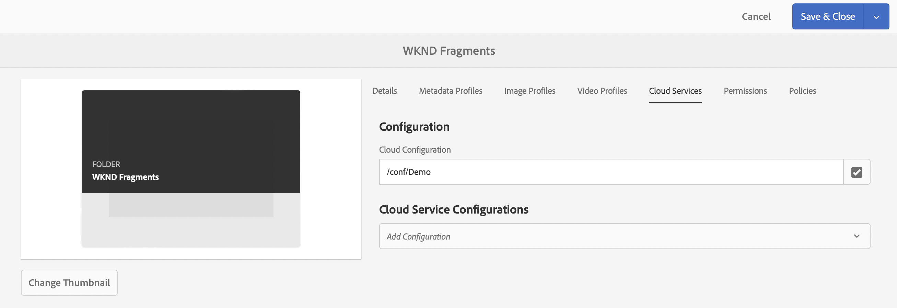

# Skapa en startguide för Assets Folder Headless {#creating-an-assets-folder}

Använd AEM Content Fragment Models för att definiera strukturen för Content Fragments, som är grunden för ditt headless-innehåll. Innehållsfragment lagras sedan i resursmappar.

## Vad är en Assets-mapp? {#what-is-an-assets-folder}

[Nu när du har skapat modeller för innehållsfragment](create-content-model.md) som definierar den struktur som du vill ha för framtida innehållsfragment, är du antagligen redo att skapa några fragment.

Du måste dock först skapa en resursmapp där du lagrar dem.

Assets-mappar används för att [ordna traditionella innehållsresurser](/help/assets/manage-assets.md), som bilder och video- och innehållsfragment.

## Så här skapar du en Assets-mapp {#how-to-create-an-assets-folder}

En administratör behöver bara skapa mappar då och då för att ordna innehållet när det skapas. I den här guiden behöver vi bara skapa en mapp.

1. Logga in i AEM och välj **Navigering > Assets > Filer** på huvudmenyn.
1. Klicka på **Skapa > Mapp**.
1. Ange en **titel** och ett **namn** för din mapp.
   * **Rubriken** ska vara beskrivande.
   * **Namn** blir nodnamnet i databasen.
      * Den genereras automatiskt baserat på titeln och justeras enligt [AEM namnkonventioner.](/help/sites-developing/naming-conventions.md)
      * Den kan vid behov justeras.

   
1. Markera mappen som du skapade och välj sedan **Egenskaper** i verktygsfältet (eller använd `p` [kortkommandot.](/help/sites-authoring/keyboard-shortcuts.md))
1. I fönstret **Egenskaper** väljer du fliken **Molntjänster** .
1. För **molnkonfigurationen** väljer du den [konfiguration du skapade tidigare.](create-configuration.md)
   
1. Klicka på **Spara och stäng**.
1. Klicka på **OK** i bekräftelsefönstret.

   

Du kan skapa ytterligare undermappar i den mapp du skapade. Undermapparna ärver den överordnade mappens **molnkonfiguration**. Detta kan dock åsidosättas om du vill använda modeller från en annan konfiguration.

Om du använder en lokaliserad platsstruktur kan du [skapa en språkrot](/help/assets/multilingual-assets.md) under den nya mappen.

## Nästa steg {#next-steps}

Nu när du har skapat en mapp för dina innehållsfragment kan du gå vidare till den fjärde delen av guiden Komma igång och [skapa innehållsfragment.](create-content-fragment.md)

>[!TIP]
>
>Fullständig information om hur du hanterar innehållsfragment finns i [dokumentationen för innehållsfragment](/help/assets/content-fragments/content-fragments.md)
