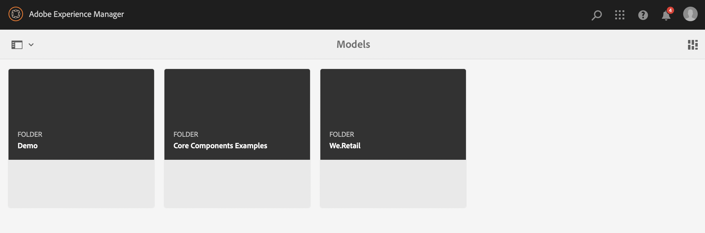
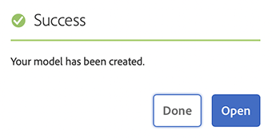
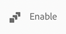

# Skapa innehållsfragmentmodeller Headless Quick Start Guide {#creating-content-fragment-models}

Definiera strukturen för det innehåll du skapar och betjänar med hjälp av Adobe Experience Manager (AEM) headless-funktioner med hjälp av Content Fragment-modeller.

## Vad är Content Fragment Models? {#what-are-content-fragment-models}

[Nu när du har skapat en konfiguration ](create-configuration.md) kan du använda den för att skapa modeller för innehållsfragment.

Modeller för innehållsfragment definierar strukturen för data och innehåll som du skapar och hanterar i AEM. De fungerar som en sorts ställningar för ert innehåll. När du väljer att skapa innehåll väljer författarna bland de innehållsfragmentsmodeller du definierar, som vägleder dem när de skapar innehåll.

## Så här skapar du en innehållsfragmentmodell {#how-to-create-a-content-fragment-model}

En informationsarkitekt skulle utföra dessa uppgifter endast sporadiskt när nya modeller behövs. I den här guiden för att komma igång skapar du bara en modell.

1. Logga in på AEM och välj **Verktyg > Assets > Content Fragment Models** på huvudmenyn.
1. Klicka på den mapp som skapades när du skapade konfigurationen.

   
1. Klicka på **Skapa**.
1. Ange en **modelltitel**, **taggar** och **beskrivning**. Du kan också markera/avmarkera **Aktivera modell** för att kontrollera om modellen aktiveras omedelbart när den skapas.

   
1. Klicka på **Öppna** i bekräftelsefönstret för att konfigurera modellen.

   
1. Använd **Modellredigeraren för innehållsfragment** och skapa innehållsfragmentmodellen genom att dra och släppa fält från kolumnen **Datatyper**.

   

1. När du har placerat ett fält måste du konfigurera dess egenskaper. Redigeraren växlar automatiskt till fliken **Egenskaper** för det tillagda fältet där du kan ange de obligatoriska fälten.

   
1. När du är klar med att skapa modellen klickar du på **Spara**.

1. Läget för den nyskapade modellen beror på om du valde **Aktivera modell** när du skapade modellen:
   * vald - den nya modellen är redan **aktiverad**
   * inte markerad - den nya modellen skapas i läget **Utkast**

1. Om modellen inte redan är aktiverad måste den vara **Enabled** för att kunna använda den.
   1. Markera modellen som du skapade och klicka sedan på **Aktivera**.

      
   1. Bekräfta aktiveringen av modellen genom att trycka på eller klicka på **Aktivera** i bekräftelsedialogrutan.

      
1. Modellen är nu aktiverad och klar att användas.

   

**Modellredigeraren för innehållsfragment** stöder många olika datatyper, till exempel enkla textfält, resursreferenser, referenser till andra modeller och JSON-data.

Du kan skapa flera modeller. Modeller kan referera till andra innehållsfragment. Använd [konfigurationer](create-configuration.md) för att ordna dina modeller.

## Nästa steg {#next-steps}

Nu när du har definierat strukturen för dina innehållsfragment genom att skapa modeller kan du gå vidare till den tredje delen av guiden Komma igång och [skapa mappar där du lagrar fragmenten.](create-assets-folder.md)

>[!TIP]
>
>Fullständig information om modeller för innehållsfragment finns i [Dokumentation för modeller för innehållsfragment](/help/assets/content-fragments/content-fragments-models.md)
