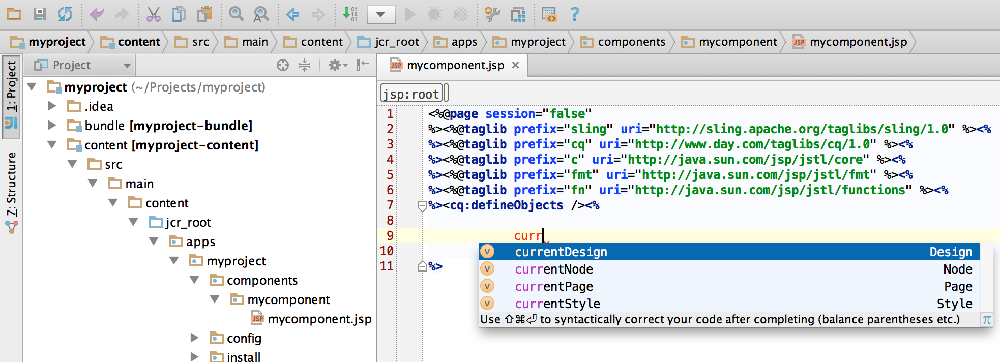
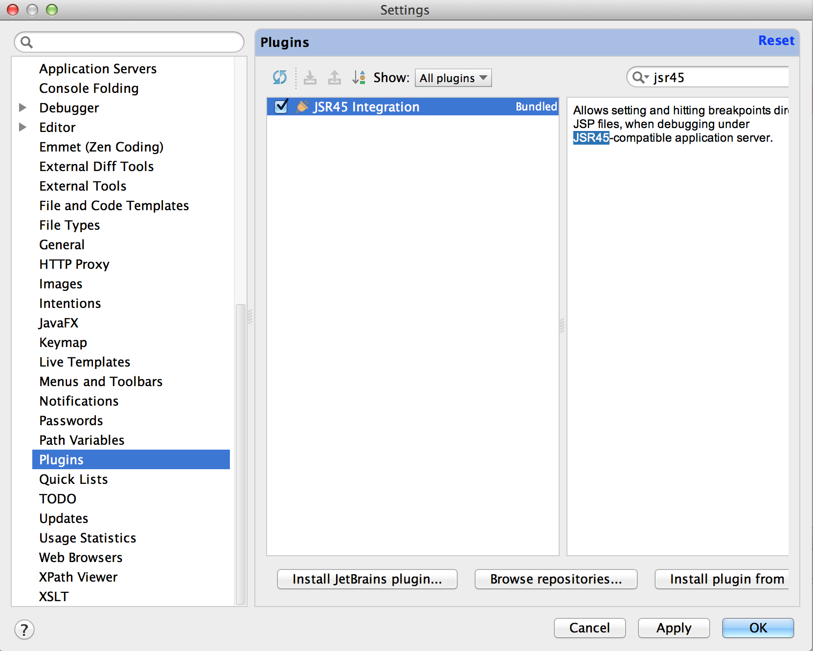

# Utveckla AEM-projekt med IntelliJ IDEA{#how-to-develop-aem-projects-using-intellij-idea}

## Översikt {#overview}

För att komma igång med AEM-utveckling på IntelliJ krävs följande steg.

Var och en av dem förklaras mer ingående i resten av handboken.

* Installera IntelliJ
* Konfigurera ditt AEM-projekt baserat på Maven
* Förbered JSP-stöd för IntelliJ i Maven POM
* Importera Maven Project till IntelliJ

>[!NOTE]
>
>Den här guiden bygger på IntelliJ IDEA Ultimate Edition 12.1.4 och AEM 5.6.1.

### Installera IntelliJ IDEA {#install-intellij-idea}

Hämta IntelliJ IDEA från [nedladdningssidan på JetBrains](https://www.jetbrains.com/idea/download/index.html).

Följ sedan installationsanvisningarna på den sidan.

### Konfigurera ditt AEM-projekt baserat på Maven {#set-up-your-aem-project-based-on-maven}

Konfigurera sedan projektet med Maven enligt [How-To Build AEM Projects med Apache Maven](/help/sites-developing/ht-projects-maven.md).

För att börja arbeta med AEM-projekt i IntelliJ IDEA räcker det med grundinställningarna i [Komma igång om 5 minuter](https://maven.apache.org/guides/getting-started/maven-in-five-minutes.html) .

### Förbered JSP-stöd för IntelliJ IDEA {#prepare-jsp-support-for-intellij-idea}

IntelliJ IDEA kan också ge stöd vid arbete med JSP, t.ex.

* automatisk komplettering av taggbibliotek
* medvetenhet om objekt som definieras av `<cq:defineObjects />` och `<sling:defineObjects />`

För att det ska fungera följer du instruktionerna i [How-To Work with JSPs](/help/sites-developing/ht-projects-maven.md#how-to-work-with-jsps) in [How-To Build AEM Projects using Apache Maven](/help/sites-developing/ht-projects-maven.md).

### Importera projektet Maven {#import-the-maven-project}

1. Öppna dialogrutan **Importera** i IntelliJ IDEA av

   * markera **Importera projekt** på välkomstskärmen om du inte har något projekt öppet än
   * välj **Arkiv -> Importera projekt** på huvudmenyn

1. Välj POM-filen för projektet i dialogrutan Importera.

   

1. Fortsätt med standardinställningarna som visas i dialogrutan nedan.

   

1. Fortsätt genom följande dialogrutor genom att klicka på **Nästa** och **Slutför**.
1. Du är nu konfigurerad för AEM Development med IntelliJ IDEA

   

### Felsöka JSP:er med IntelliJ IDEA {#debugging-jsps-with-intellij-idea}

Följande steg är nödvändiga för att felsöka JSP:er med IntelliJ IDEA

* Konfigurera en webbaspekt i projektet
* Installera JSR45 support-plugin
* Konfigurera en felsökningsprofil
* Konfigurera AEM för felsökningsläge

#### Konfigurera en webbaspekt i projektet {#set-up-a-web-facet-in-the-project}

IntelliJ IDEA behöver förstå var JSP:er för felsökning ska hittas. Eftersom IDEA inte kan tolka `content-package-maven-plugin` inställningarna måste detta konfigureras manuellt.

1. Gå till **Arkiv -> Projektstruktur**
1. Markera **innehållsmodulen**
1. Klicka **+** ovanför listan med moduler och välj **Webb**
1. Som webbresurskatalog väljer du `content/src/main/content/jcr_root subdirectory` projektversion enligt skärmbilden nedan.


#### Installera JSR45 support-plugin {#install-the-jsr-support-plugin}

1. Gå till rutan **Plugins** i IntelliJ IDEA-inställningarna
1. Navigera till **JSR45 Integration** Plugin och markera kryssrutan bredvid den
1. Klicka på **Använd**
1. Starta om IntelliJ IDEA när du ombeds att



#### Konfigurera en felsökningsprofil {#configure-a-debug-profile}

1. Gå till **Kör -> Redigera konfigurationer**
1. Tryck på **+** och välj **JSR45 Remote**
1. I konfigurationsdialogrutan väljer du **Konfigurera** bredvid **Programserver** och konfigurerar en allmän server
1. Ange en lämplig URL för startsidan om du vill öppna en webbläsare när du startar felsökningen
1. Ta bort alla uppgifter **innan du startar** om du använder automatisk synkronisering eller konfigurera lämpliga Maven-åtgärder om du inte gör det
1. Justera porten vid behov i fönstret **Start/Anslutning** .
1. Kopiera kommandoradsargumenten som IntelliJ IDEA föreslår

 

#### Konfigurera AEM för felsökningsläge {#configure-aem-for-debug-mode}

Det sista steget som krävs är att starta AEM med de JVM-alternativ som föreslås av IntelliJ IDEA.

Du kan göra detta genom att starta AEM jar-filen direkt och lägga till dessa alternativ, till exempel med följande kommandorad:

`java -Xdebug -Xrunjdwp:transport=dt_socket,address=58242,suspend=n,server=y -Xmx1024m -XX:MaxPermSize=256M -jar cq-quickstart-5.6.1.jar`

Du kan också lägga till dessa alternativ i startskriptet `crx-quickstart/bin/start` enligt nedan.

```shell
# ...

# default JVM options
if [ -z "$CQ_JVM_OPTS" ]; then
 CQ_JVM_OPTS='-server -Xmx1024m -XX:MaxPermSize=256M -Djava.awt.headless=true'
fi

CQ_JVM_OPTS="$CQ_JVM_OPTS -Xdebug -Xrunjdwp:transport=dt_socket,address=58242,suspend=n,server=y"

# ...
```

#### Starta felsökning {#start-debugging}

Du är nu redo att felsöka JSP:er i AEM.

1. Välj **Kör -> Felsök -> Din felsökningsprofil**
1. Ange brytpunkter i komponentkoden
1. Öppna en sida i webbläsaren


### Felsökningspaket med IntelliJ IDEA {#debugging-bundles-with-intellij-idea}

Kod i paket kan felsökas med en allmän fjärrfelsökningsanslutning som standard. Du kan följa [Jetbrain-dokumentationen om fjärrfelsökning](https://www.jetbrains.com/idea/webhelp/run-debug-configuration-remote.html).
