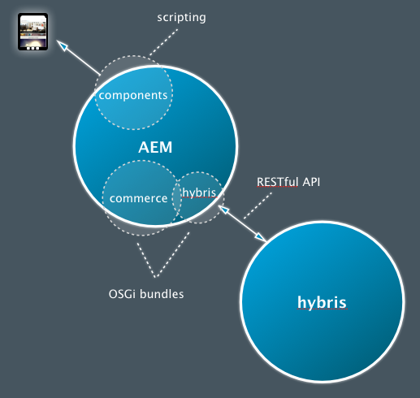

# Utveckla med SAP Commerce Cloud{#developing-with-sap-commerce-cloud}

>[!NOTE]
>
>e-handelsramverket kan användas med alla e-handelslösningar. Vissa detaljer och exempel som behandlas här avser [SAP Commerce Cloud](https://www.hybris.com/) -lösningen.

Integreringsramverket innehåller ett integreringslager med ett API. På så sätt kan du:

* koppla in ett e-handelssystem och hämta produktdata till AEM
* bygga AEM-komponenter för handelsfunktioner oberoende av e-handelsmotorn



>[!NOTE]
>
>[API-dokumentation](/help/sites-developing/ecommerce.md#api-documentation) finns också tillgänglig.

Ett antal färdiga AEM-komponenter finns för att använda integreringslagret. För närvarande är följande:

* en produktvisningskomponent
* en kundvagn
* utcheckning

För sökningar finns en integreringsfunktion som gör att du kan använda AEM-sökningen, sökningen i e-handelssystemet, en tredjepartssökning (som Search&amp;Promote) eller en kombination av dessa.

## Val av e-handelsmotor {#ecommerce-engine-selection}

eCommerce-ramverket kan användas med alla e-handelslösningar, och den motor som används måste kunna identifieras av AEM:

* eCommerce Engines är OSGi-tjänster som stöder `CommerceService` gränssnittet

   * Motorer kan särskiljas av en `commerceProvider` tjänsteegenskap

* AEM har stöd `Resource.adaptTo()` för `CommerceService` och `Product`

   * Implementeringen `adaptTo` söker efter en `cq:commerceProvider` egenskap i resursens hierarki:

      * Om det hittas används värdet för att filtrera e-handelstjänstens sökning.
      * Om den inte hittas används den mest rankade e-handelstjänsten.
   * En `cq:Commerce` mixin används så att `cq:commerceProvider` det kan läggas till i starkt typbestämda resurser.


* Egenskapen `cq:commerceProvider` används också för att referera till lämplig definition av handelsfabrik.

   * En `cq:commerceProvider` egenskap med värdet `hybris` korrelerar till exempel till OSGi-konfigurationen för **Day CQ Commerce Factory för Hybris** (com.adobe.cq.commerce.hybris.impl.HybrisServiceFactory), där parametern `commerceProvider` också har värdet `hybris`.

   * Här finns ytterligare egenskaper, som [**katalogversionen **, som kan konfigureras](#configuringthecatalogversion)(när det är lämpligt och tillgängligt).

Se följande exempel nedan:

| `cq:commerceProvider = geometrixx` | I en AEM-standardinstallation krävs en specifik implementering. Exempel på geometrixx, som innehåller minimala tillägg till det generiska API:t |
|---|---|
| `cq:commerceProvider = hybris` | hybriimplementering |

### Exempel {#example}

```shell
/content/store
+ cq:commerceProvider = hybris
  + mens
    + polo-shirt-1
    + polo-shirt-2
    + employee
+ cq:commerceProvider = jcr
  + adobe-logo-shirt
    + cq:commerceType = product
    + price = 12.50
  + adobe-logo-shirt_S
    + cq:commerceType = variant
    + size = S
  + adobe-logo-shirt_XL
    + cq:commerceType = variant
    + size = XL
    + price = 14.50
```

>[!NOTE]
>
>Med CRXDE Lite kan du se hur detta hanteras i produktkomponenten för hybris-implementeringen:
>
>`/apps/geometrixx-outdoors/components/hybris/product/product.jsp`

### Utveckling för hybris 4 {#developing-for-hybris}

Utbyggnaden av hybris i eCommerce Integration Framework har uppdaterats för att stödja Hybris 5, samtidigt som bakåtkompatibiliteten med Hybris 4 bibehålls.

Standardinställningarna i koden ställs in för Hybris 5.

För att utveckla för Hybris 4 krävs följande:

* När du anropar maven lägger du till följande kommandoradsargument till kommandot
   `-P hybris4`
Den hämtar den förkonfigurerade distributionen av Hybris 4 och bäddar in den i paketet:

   ```
   cq-commerce-hybris-server
   ```

* I OSGi-konfigurationshanteraren:

   * Inaktivera stöd för Hybris 5 för tjänsten Default Response Parser.
   * Se till att tjänsten Hybris Basic Authentication Handler har en lägre prioritetsordning än tjänsten Hybris OAuth Handler.

### Sessionshantering {#session-handling}

hybris använder en användarsession för att lagra information som kundens kundvagn. Sessions-ID returneras från hybris i en `JSESSIONID` cookie som måste skickas på efterföljande begäran till hybris. För att undvika att lagra sessions-ID i databasen kodas det i en annan cookie som lagras i kundens webbläsare. Följande steg utförs:

* På den första begäran anges ingen cookie på köparens begäran. så att en begäran skickas till hybris-instansen för att skapa en session.
* Sessionskakorna extraheras från svaret, kodas i en ny cookie (till exempel `hybris-session-rest`) och anges i svaret till kunden. Kodningen i en ny cookie krävs eftersom den ursprungliga cookien bara är giltig för en viss sökväg och annars inte skulle skickas tillbaka från webbläsaren i efterföljande begäranden. Sökvägsinformationen måste också läggas till i cookie-filens värde.
* På efterföljande begäranden avkodas cookies från `hybris-session-<*xxx*>` cookies och anges på HTTP-klienten som används för att begära data från hybris.

>[!NOTE]
>
>En ny anonym session skapas när den ursprungliga sessionen inte längre är giltig.

#### CommerceSession {#commercesession}

* Den här sessionen&quot;äger&quot; **kundvagnen**

   * utför Lägg till/ta bort/etc
   * utför de olika beräkningarna av varukorgen,
      `commerceSession.getProductPrice(Product product)`

* Äger *lagringsplatsen* för **orderdata**
   `CommerceSession.getUserContext()`

* Äger även **betalningshanteringsanslutningen**
* Äger även **leveransanslutningen**

### Produktsynkronisering och -publicering {#product-synchronization-and-publishing}

Produktdata som underhålls i hybris måste finnas tillgängliga i AEM. Följande mekanism har implementerats:

* En initial belastning av ID:n tillhandahålls av hybris som foder. Denna feed kan uppdateras.
* hybris kommer att tillhandahålla uppdateringsinformation via en feed (som AEM polls).
* När AEM använder produktdata skickar det tillbaka begäranden till hybris om aktuella data (villkorlig begäran om hämtning med det senaste ändringsdatumet).
* På hybris är det möjligt att ange foderinnehållet på ett deklarativt sätt.
* Mappning av matningsstrukturen till AEM-innehållsmodellen sker i matningsadaptern på AEM-sidan.


* Importören (b) används för den första konfigurationen av sidträdstrukturen i AEM för kataloger.
* Katalogförändringar i hybris anges till AEM via en feed, som sedan sprids till AEM (b)

   * Produkt som lagts till/tagits bort/ändrats i förhållande till katalogversionen.
   * Produkten är godkänd.

* Tillägget hybris erbjuder en polling-importör (&quot;hybris&quot;-schema&quot;) som kan konfigureras att importera ändringar till AEM med ett angivet intervall (t.ex. var 24:e timme där intervallet anges i sekunder):

   * `https://localhost:4502/content/geometrixx-outdoors/en_US/jcr:content.json`

      ```
       {
        "jcr:mixinTypes": ["cq:PollConfig"],
        "enabled": true,
        "source": "hybris:outdoors",
        "jcr:primaryType": "cq:PageContent",
        "interval": 86400
       }
      ```

* Katalogkonfigurationen i AEM känner igen katalogversionerna **Staged** och **Online** .

* För att kunna synkronisera produkter mellan katalogversioner måste man (ta bort) aktivera motsvarande AEM-sida (a, c)

   * Om du vill lägga till en produkt i en **katalogversion online** måste du aktivera produktens sida.
   * Borttagning av en produkt kräver inaktivering.

* Aktivera en sida i AEM (c) kräver en kontroll (b) och är bara möjligt om

   * Produkten finns i en **katalogversion online** för produktsidor.

   * De produkter som det hänvisas till finns i en **katalogversion online** för andra sidor (t.ex. kampanjsidor).

* Aktiverade produktsidor måste ha tillgång till produktdatans **onlineversion** (d).

* AEM-publiceringsinstansen kräver åtkomst till hybris för hämtning av produktdata och personaliserade data (d).

### Arkitektur {#architecture}

#### Arkitektur för produkt och varianter {#architecture-of-product-and-variants}

En och samma produkt kan ha flera variationer. den kan till exempel variera beroende på färg och/eller storlek. En produkt måste definiera vilka egenskaper som driver variationen. vi kallar dessa *variantaxlar*.

Alla egenskaper är dock inte olika axlar. Variationer kan också påverka andra egenskaper. Priset kan till exempel vara beroende av storleken. Dessa egenskaper kan inte väljas av kunden och betraktas därför inte som olika axlar.

Varje produkt och/eller variant representeras av en resurs och mappar därför 1:1 till en databasnod. Det är en extra konsekvens att en specifik produkt och/eller variant kan identifieras unikt genom sin sökväg.

Produkt-/variantresursen innehåller inte alltid den faktiska produktinformationen. Det kan vara en representation av data som faktiskt finns i ett annat system (t.ex. hybris). Produktbeskrivningar, priser osv. lagras inte i AEM, utan hämtas i realtid från eCommerce-motorn.

Alla produktresurser kan representeras av en `Product API`. De flesta anrop i produkt-API:t är variationsspecifika (även om variationer kan ärva delade värden från ett överordnat element), men det finns också anrop som listar variantuppsättningen ( `getVariantAxes()`, `getVariants()`osv.).

>[!NOTE]
>
>I själva verket bestäms en variantaxel av vad som än `Product.getVariantAxes()` returnerar:
>
>* hybris definierar den för hybris-implementeringen
>
>
Produkter (i allmänhet) kan ha många olika axlar, men produktkomponenten som finns i paketet hanterar bara två:
>
>1. `size`
   >
   >
1. plus ytterligare
   >   Den här ytterligare varianten väljs via egenskapen `variationAxis` för produktreferensen (vanligtvis `color` för Geometrixx Outdoor).
>


#### Produktreferenser och produktdata {#product-references-and-product-data}

I allmänhet:

* produktdata finns under `/etc`

* och produktreferenser under `/content`.

Det måste finnas en 1:1-karta mellan produktvariationer och produktdatanoder.

Produktreferenser måste också ha en nod för varje variant som presenteras - men det finns inget krav på att presentera alla variationer. Om en produkt till exempel har variationer i S, M och L kan produktinformationen vara:

```shell
etc
  commerce
    products
      shirt
        shirt-s
        shirt-m
        shirt-l
```

En stor och hög katalog kanske bara innehåller:

```shell
content
  big-and-tall
    shirt
      shirt-l
```

Slutligen finns det inget krav på att använda produktdata. Du kan placera alla produktdata under referenserna i katalogen; men du kan inte ha flera kataloger utan att duplicera alla produktdata.

**API**

#### com.adobe.cq.commerce.api.Product interface {#com-adobe-cq-commerce-api-product-interface}

```java
public interface Product extends Adaptable {

    public String getPath();            // path to specific variation
    public String getPagePath();        // path to presentation page for all variations
    public String getSKU();             // unique ID of specific variation

    public String getTitle();           // shortcut to getProperty(TITLE)
    public String getDescription();     // shortcut to getProperty(DESCRIPTION)
    public String getImageUrl();        // shortcut to getProperty(IMAGE_URL)
    public String getThumbnailUrl();    // shortcut to getProperty(THUMBNAIL_URL)

    public <T> T getProperty(String name, Class<T> type);

    public Iterator<String> getVariantAxes();
    public boolean axisIsVariant(String axis);
    public Iterator<Product> getVariants(VariantFilter filter) throws CommerceException;
}
```

#### com.adobe.cq.commerce.api.VariantFilter {#com-adobe-cq-commerce-api-variantfilter}

```java
/**
 * Interface for filtering variants and AxisFilter provided as common implementation
 *
 * The <code>VariantFilter</code> is used to filter variants,
 * e.g. when using {@link Product#getVariants(VariantFilter filter)}.
 */
public interface VariantFilter {
    public boolean includes(Product product);
}

/**
 * A {@link VariantFilter} for filtering variants by the given
 * axis and value. The following example returns a list of
 * variant products that have a value of <i>blue</i> on the
 * <i>color</i> axis.
 *
 * <p>
 * <code>product.getVariants(new AxisFilter("color", "blue"));</code>
 */
public class AxisFilter implements VariantFilter {

    private String axis;
    private String value;

    public AxisFilter(String axis, String value) {
        this.axis = axis;
        this.value = value;
    }

    /**
     * {@inheritDoc}
     */
    public boolean includes(Product product) {
        ValueMap values = product.adaptTo(ValueMap.class);

        if(values != null) {
            String v = values.get(axis, String.class);

            return v != null && v == value;
        }

        return false;
    }
}
```

* **Allmän lagringsmekanism**

   * Produktnoder är inte:ostrukturerade.
   * En produktnod kan vara antingen:

      * En referens med produktdata lagrade någon annanstans:

         * Produktreferenser innehåller en `productData` egenskap som pekar på produktdata (vanligtvis under `/etc/commerce/products`).

         * Produktinformationen är hierarkisk. produktattribut ärvs från en produktdatanodens överordnade.
         * Produktreferenser kan också innehålla lokala egenskaper som åsidosätter de som anges i deras produktdata.
      * En produkt i sig:

         * Utan en `productData` egenskap.
         * En produktnod som innehåller alla egenskaper lokalt (och inte innehåller någon productData-egenskap) ärver produktattribut direkt från sina egna överordnade.


* **AEM-generisk produktstruktur**

   * Varje variant måste ha en egen lövnod.
   * Produktgränssnittet representerar både produkter och varianter, men den relaterade databasnoden är specifik för vilken den är.
   * Produktnoden beskriver produktattribut och variantaxlar.

#### Exempel {#example-1}

```shell
+ banyan_shirt
    - cq:commerceType = product
    - cq:productAttributes = [jcr:title, jcr:description, size, price, color]
    - cq:productVariantAxes = [color, size]
    - jcr:title = Banyan Shirt
    - jcr:description = Flowery, all-cotton shirt.
    - price = 14.00
    + banyan_shirt_s
        - cq:commerceType = variant
        - size = S
        + banyan_shirt_s_red
            - cq:commerceType = variant
            - color = red
        + banyan_shirt_s_blue
            - cq:commerceType = variant
            - color = blue
    + banyan_shirt_m
        - cq:commerceType = variant
        - size = M
        + banyan_shirt_m_red
            - cq:commerceType = variant
            - color = red
        + banyan_shirt_m_blue
            - cq:commerceType = variant
            - color = blue
    + banyan_shirt_l
        - cq:commerceType = variant
        - size = L
        + banyan_shirt_l_red
            - cq:commerceType = variant
            - color = red
        + banyan_shirt_l_blue
            - cq:commerceType = variant
            - color = blue
    + banyan_shirt_xl
        - cq:commerceType = variant
        - size = XL
        - price = 18.00
```

#### Arkitektur för kundvagnen {#architecture-of-the-shopping-cart}

**Komponenter**

* Kundvagnen ägs av `CommerceSession:`

   * Lägg till/ta bort/etc. `CommerceSession` utförs.
   * De olika beräkningarna av vagnen utförs också `CommerceSession` . &quot;

* Även om den inte är direkt kundvagnsrelaterad måste `CommerceSession` den även tillhandahålla katalogprisinformation (eftersom den äger prissättningen)

   * Priset kan innehålla flera modifieringar:

      * Kvantitetsrabatter.
      * Olika valutor.
      * momspliktig och momsfri.
   * Modifierarna är helt öppna med följande gränssnitt:

      * `int CommerceSession.getQuantityBreakpoints(Product product)`
      * `String CommerceSession.getProductPrice(Product product)`


**Lagring**

* Lagring

   * I hybris-fallet äger hybris-servern kundvagnen.
   * I det generiska AEM-fallet lagras kundvagnar i [ClientContext](/help/sites-administering/client-context.md).

**Personalisering**

* Personalisering bör alltid drivas via [ClientContext](/help/sites-administering/client-context.md).
* En ClientContext `/version/` i kundvagnen skapas i samtliga fall:

   * Produkterna ska läggas till med hjälp av `CommerceSession.addCartEntry()` metoden.

* Följande illustrerar ett exempel på kundvagnsinformation i ClientContext cart:


#### Arkitektur för utcheckning {#architecture-of-checkout}

**Kundvagn- och orderdata**

De tre elementen `CommerceSession` äger:

1. Kundvagnsinnehåll
1. Priser
1. Orderinformation

1. **Kundvagnsinnehåll**

   Schemat för kundvagnens innehåll har korrigerats av API:

   ```java
       public void addCartEntry(Product product, int quantity);
       public void modifyCartEntry(int entryNumber, int quantity);
       public void deleteCartEntry(int entryNumber);
   ```

1. **Priser**

   Prisschemat är också fast av API:

   ```java
       public String getCartPreTaxPrice();
       public String getCartTax();
       public String getCartTotalPrice();
       public String getOrderShipping();
       public String getOrderTotalTax();
       public String getOrderTotalPrice();
   ```

1. **Beställningsinformation**

   Beställningsinformationen har dock *inte* åtgärdats av API:t:

   ```java
       public void updateOrderDetails(Map<String, String> orderDetails);
       public Map<String, String> getOrderDetails();
       public void submitOrder();
   ```

**Leveransberäkningar**

* Beställningsblanketter måste ofta innehålla flera olika leveransalternativ (och priser).
* Priserna kan baseras på artiklar och detaljer i beställningen, t.ex. vikt och/eller leveransadress.
* De `CommerceSession` har tillgång till alla beroenden, så de kan behandlas på liknande sätt som produktpriser:

   * Det `CommerceSession` egna fraktpriset.
   * Kan hämta/uppdatera leveransinformation med `updateOrder(Map<String, Object> delta)`

>[!NOTE]
>
>Du kan implementera en leveransväljare; till exempel:
>
>`yourProject/commerce/components/shippingpicker`:
>
>* Detta kan i princip vara en kopia av `foundation/components/form/radio`men med återanrop till `CommerceSession` for: >
   >    * Kontrollera om metoden är tillgänglig
   >    * Lägga till prisinformation
   >    * Att göra det möjligt för kunderna att uppdatera ordersidan i AEM (inklusive överflödet av leveransmetoder och texten som beskriver dem), samtidigt som de fortfarande har möjlighet att visa relevant `CommerceSession` information.
>


**Betalningshantering**

* Betalningsanslutningen äger också `CommerceSession` anslutningen för betalningshantering.
* Implementerare måste lägga till specifika anrop (till den valda betalningshanteringstjänsten) till `CommerceSession` implementeringen.

**Orderuppfyllelse**

* Servern äger också `CommerceSession` leveransanslutningen.
* Implementerare måste lägga till specifika anrop (till den valda betalningshanteringstjänsten) till `CommerceSession` implementeringen.

### Sökdefinition {#search-definition}

I enlighet med standardtjänstens API-modell innehåller e-handelsprojektet en uppsättning sökrelaterade API:er som kan implementeras av enskilda e-handelsmotorer.

>[!NOTE]
>
>För närvarande är det bara hybris-motorn som implementerar söknings-API:t.
>
>Söknings-API:t är dock allmänt och kan implementeras av varje enskild CommerceService.

eCommerce-projektet innehåller en standardsökkomponent som finns i:

`/libs/commerce/components/search`


Detta använder söknings-API:t för att fråga den valda e-handelsmotorn (se [eCommerce Engine Selection](#ecommerce-engine-selection)):

#### Söknings-API {#search-api}

Det finns flera allmänna/hjälpklasser i huvudprojektet:

1. `CommerceQuery`
Används för att beskriva en sökfråga (innehåller information om frågetext, aktuell sida, sidstorlek, sortering och valda aspekter). Alla e-handelstjänster som implementerar söknings-API:t får instanser av den här klassen för att kunna utföra sökningen. En `CommerceQuery` instans kan skapas från ett begäranobjekt ( `HttpServletRequest`).

1. `FacetParamHelper`
Är en verktygsklass som innehåller en statisk metod - `toParams` - som används för att generera `GET` parametersträngar från en lista med facets och ett växlat värde. Detta är användbart på användargränssnittssidan, där du behöver visa en hyperlänk för varje värde i varje aspekt, så att respektive värde växlas när användaren klickar på hyperlänken (d.v.s. om den markerats tas det bort från frågan, annars läggs det till). Detta tar hand om all logik för hantering av flera-/enkelvärdesfaktorer, åsidosättningsvärden osv.

Startpunkten för söknings-API är den `CommerceService#search` metod som returnerar ett `CommerceResult` objekt. Mer information om det här avsnittet finns i [API-dokumentationen](/help/sites-developing/ecommerce.md#api-documentation) .

### Användarintegrering {#user-integration}

Integrering sker mellan AEM och olika e-handelssystem. Detta kräver en strategi för att synkronisera kunder mellan de olika systemen så att AEM-specifik kod bara behöver känna till om AEM och vice versa:

* AuthenticationAEM antas vara den *enda* frontwebben och utför därför *all* autentisering.

* SlavkontonAEM skapar ett slavkonto i hybris för varje kund. Slavkontots användarnamn är samma som AEM-användarnamnet. Ett kryptografiskt slumpmässigt lösenord genereras automatiskt och lagras (krypteras) i AEM.

#### Befintliga användare {#pre-existing-users}

En AEM-front kan placeras framför en befintlig hybris-implementering. En hybris-motor kan också läggas till i en befintlig AEM-installation. För att göra detta måste systemen kunna hantera befintliga användare på ett effektivt sätt i båda systemen:

* AEM -> hybris

   * När du loggar in på hybris, om AEM-användaren inte redan finns:

      * skapa en ny hybris-användare med ett kryptografiskt slumpmässigt lösenord
      * lagra hybris-användarnamnet i AEM-användarens användarkatalog
   * Se: `com.adobe.cq.commerce.hybris.impl.HybrisSessionImpl#login()`


* hybris -> AEM

   * När du loggar in på AEM, om systemet känner igen användaren:

      * försök att logga in på hybris med angivet användarnamn/pwd
      * Om det lyckas skapar du den nya användaren i AEM med samma lösenord (AEM-specifikt salt-värde ger AEM-specifik hash-kod)
   * Ovanstående algoritm implementeras i en Sling `AuthenticationInfoPostProcessor`

      * Se: `com.adobe.cq.commerce.hybris.impl.user.LazyUserImporter.java`


### Anpassa importprocessen {#customizing-the-import-process}

Så här bygger du på befintliga funktioner i din anpassade importhanterare:

* måste implementera `ImportHandler` gränssnittet

* kan utöka `DefaultImportHandler`

```java
/**
 * Services implementing the <code>ImportHandler</code> interface are
 * called by the {@link HybrisImporter} to create actual commerce entities
 * such as products.
 */
public interface ImportHandler {

    /**
     * Not used.
     */
    public void createTaxonomie(ImporterContext ctx);

    /**
     * Creates a catalog with the given name.
     * @param ctx   The importer context
     * @param name  The catalog's name
     * @return Path of created catalog
     */
    public String createCatalog(ImporterContext ctx, String name) throws Exception;

    /**
     * Creates a product from the given values.
     * @param ctx                The importer context
     * @param values             The product's properties
     * @param parentCategoryPath The containing category's path
     * @return Path of created product
     */
    public String createProduct(ImporterContext ctx, ValueMap values, String parentCategoryPath) throws Exception;

    /**
     * Creates a variant product from the given values.
     * @param ctx             The importer context
     * @param values          The product's properties
     * @param baseProductPath The base product's path
     * @return Path of created product
     */
    public String createVariantProduct(ImporterContext ctx, ValueMap values, String baseProductPath) throws Exception;

    /**
     * Creates an asset for a product. This is usually a product
     * image.
     * @param ctx             The importer context
     * @param values          The product's properties
     * @param baseProductPath The product's path
     * @return Path of created asset
     */
    public String createAsset(ImporterContext ctx, ValueMap values, String productPath) throws Exception;

    /**
     * Creates a category from the given values.
     * @param ctx           The importer context
     * @param values        The category's properties
     * @param parentPath    Path of parent category or base path of import in case of root category
     * @return Path of created category
     */
    public String createCategory(ImporterContext ctx, ValueMap values, String parentCategoryPath) throws Exception;
}
```

För att din anpassade hanterare ska identifieras av importören måste den ange `service.ranking`egenskapen med ett värde över 0. till exempel:

```java
@Component
@Service
@Property(name = "service.ranking", value = 100)
public class MyImportHandler extends DefaultImportHandler {
    ...
}
```
