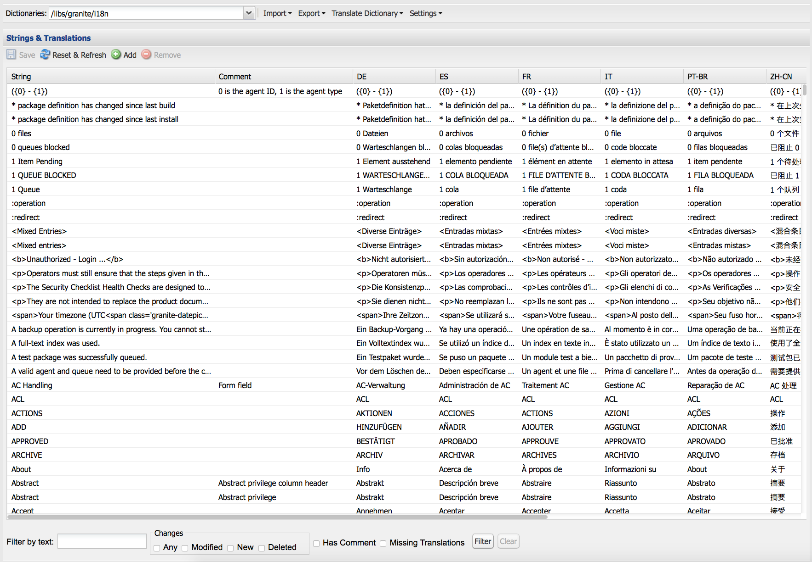

# Använda översättare för att hantera ordlistor{#using-translator-to-manage-dictionaries}

AEM tillhandahåller en konsol för hantering av olika översättningar av texter som används i komponentens användargränssnitt. Den här konsolen är tillgänglig på

`https://<hostname>:<port-number>/libs/cq/i18n/translator.html`

Använd översättningsverktyget för att hantera engelska strängar och deras översättningar. Ordlistorna skapas i databasen, till exempel /apps/myproject/i18n.

Observera att översättningsverktyget och de ordlistor du hanterar är till för att presentera komponentgränssnitt på olika språk. Om du vill översätta sida eller användargenererat innehåll läser du [Översätta innehåll för flerspråkiga webbplatser](/help/sites-administering/translation.md) och [Översättning av användargenererat innehåll](/help/communities/translate-ugc.md).

>[!CAUTION]
>
>Redigera bara ordlistor som har skapats för ditt projekt och som finns under `/apps`.
>
>AEM-systemordlistor finns också i det här verktyget. Ändra inte AEM-systemordlistorna eftersom detta kan orsaka problem med AEM-användargränssnittet. Dessutom kan ändringar gå förlorade vid uppgraderingen. AEM-systemordlistor finns under `/libs`.

>[!NOTE]
>
>Även om översättningsverktyget har ett klassiskt användargränssnitt används det för översättning av fraser oavsett vilket gränssnitt som dessa fraser finns i.

Översättaren listar de texter som används i AEM med olika språköversättningar tillsammans:



Du kan söka efter, filtrera och redigera den engelska och översatta texten. Du kan också exportera ordlistor till XLIFF-format för översättning och sedan importera översättningarna tillbaka till ordlistorna.

Det går också att lägga till i18n-ordlistorna i ett översättningsprojekt från den här konsolen. Du kan antingen skapa en ny eller lägga till i ett befintligt projekt.

1. Klicka på **Översätt ordlista**.

   

1. Välj Skapa eller Lägg till beroende på behov. En dialogruta öppnas.

   

1. Fyll i fälten efter behov och klicka på OK. 

1. Nu kan du klicka på **OK** eller se målordlistan.

   >[!NOTE]
   >
   >Mer information om översättningsprojekt finns i [Hantera översättningsprojekt](/help/sites-administering/tc-manage.md).

## Skapa en ordlista {#creating-a-dictionary}

Skapa en ordlista för hantering av lokaliserade gränssnittssträngar. När du har skapat en ordlista kan du använda översättningsverktyget för att hantera den.

1. Med CRXDE Lite lägger du till rotnoden ( `sling:Folder`) för den nya ordlistan som den struktur som ska innehålla språkdefinitionerna:

   ` /apps/<projectName>/i18n`

   Exempel, `/apps/myProject/i18n`

1. Lägg till den språkstruktur som krävs under den här roten. Exempel:

   ```shell
   /apps/myProject/i18n [sling:Folder]
       - de.json [nt:file] [mix:language]
           + jcr:language = de
       - fr.json [nt:file] [mix:language]
           + jcr:language = fr
   ```

   >[!NOTE]
   >
   >Detta är strukturen från modulen [](https://sling.apache.org/site/internationalization-support.html)Sling i18n.

1. Läs in konverteraren och ordlistesökvägen igen (t.ex. `/apps/myProject/i18n`) är tillgängligt i den nedrullningsbara väljaren i verktygsfältet. Välj det här om du vill börja lägga till strängar och deras översättningar.

   >[!NOTE]
   >
   >Översättaren sparar endast översättningar för språk som finns under sökvägen (t.ex. `/apps/myProject/i18n`).
   >
   >Kontrollera att de motsvarar de språk som visas i rutnätet.

## Hantera ordlistesträngar {#managing-dictionary-strings}

Använd översättningsverktyget för att hantera strängarna i dina ordlistor. Du kan lägga till, ändra och ta bort engelska strängar och även tillhandahålla översatta strängar.

>[!CAUTION]
>
>Redigera bara ordlistor som har skapats för ditt projekt och som finns under `/apps`.
>
>Ändra inte AEM-systemordlistorna eftersom detta kan orsaka problem med AEM-användargränssnittet. Dessutom kan ändringar gå förlorade vid uppgraderingen. AEM-systemordlistor finns under `/libs`.

### Lägga till, ändra och ta bort strängar {#adding-changing-and-removing-strings}

Lägg till engelska strängar i ett lexikon som din komponent har internationaliserat. Lägg bara till strängar som är internationaliserade så att du inte slösar bort resurser genom att översätta strängar som inte används.

Strängarna som du lägger till i ett lexikon måste exakt matcha strängen som anges i koden. Om den engelska standardsträngen som används i koden inte matchar den engelska strängen i en ordlista, visas den översatta strängen inte i användargränssnittet när det behövs. Strängar är skiftlägeskänsliga.

**Tillhandahålla översättningstips**

Använd egenskapen Commenet för ordlistesträngen för att ange information till översättaren för att förtydliga strängens betydelse. Användargränssnittet hjälper användaren oftast att avgöra innebörden av tvetydiga ord. Översättaren kan dock inte se strängen i gränssnittets kontext. Översättningstipset tar bort tvetydigheten. En kommentar hjälper till exempel översättaren att förstå att det engelska ordet Request används som ett substantiv i stället för som ett verb.

Översättningstipsen skiljer också på strängar som är identiska och har olika innebörd. Till exempel kan ordet Sök vara ett substantiv eller ett verb, vilket kräver två sökposter i ordlistan med två olika översättningstips. Koden som begär strängen innehåller också översättningstipset så att rätt sträng används i användargränssnittet.

**Inkludera indexerade variabler**

Inkludera variabler i den lokaliserade strängen för att skapa sammanhangsbaserad betydelse i en mening. När du har loggat in i ett webbprogram visas till exempel meddelandet &quot;Welcome back Administrator&quot; på startsidan. Du har två meddelanden i din inkorg.&quot; Sidkontexten bestämmer användarnamnet och antalet meddelanden.

Om du vill ta med variabler i den lokaliserade strängen placerar du index inom hakparentes på variabelns plats i det första argumentet i get-metoden. Använd lokaliseringstipset för att beskriva värdena. Översättaren måste förstå vad variablerna betyder, eftersom olika språk använder olika meningsstrukturer.

Observera att koden [som begär den översatta strängen](/help/sites-developing/i18n-dev.md#including-variables-in-localized-sentences) innehåller värden för de indexerade variablerna enligt sammanhanget.

Följande sträng visas till exempel när en användare loggar in på en webbplats och ingår i ordlistan:

`Welcome back {0}. You have {1} messages.`

I följande kommentar beskrivs variablerna:

`{0} = the user name, {1} = the number of items in the user's inbox`

**Ändra strängar**

Ändra eller ta bort engelska strängar när de ändras eller tas bort i koden. När du ändrar en sträng behålls den ursprungliga strängen och en ny sträng skapas som återspeglar ändringen. Innan du tar bort en sträng bör du kontrollera att den inte används av någon kod.

Använd följande procedur för att lägga till en sträng.

1. I listrutan Ordlistor väljer du det lexikon som du vill lägga till en sträng i. I listrutan representeras ordlistor av deras sökväg i databasen.
1. Ovanför tabellen Strängar och översättningar klickar du på Lägg till.

   

1. Skriv den engelska strängen i rutan String i dialogrutan Lägg till sträng. I rutan Kommentar skriver du ett översättningstips för översättaren om det behövs.
1. Klicka på OK.
1. Klicka på Spara.

   

Använd följande procedur för att ändra en sträng i ett lexikon.

1. I listrutan Ordlistor väljer du det lexikon som innehåller strängen som ska ändras.
1. Dubbelklicka på strängen som du vill ändra.
1. I dialogrutan Redigera sträng väljer du Ändra sträng eller Kommentar (Skapar en kopia).

   

1. Ändra strängen eller kommentaren och klicka på OK.
1. Klicka på Spara.

   

Använd följande procedur för att ta bort en sträng från ett lexikon.

1. I listrutan Ordlistor väljer du det lexikon du vill ta bort en sträng från.
1. Klicka på Ta bort.

   

1. Klicka på Spara.

   

### Söker efter strängar {#searching-for-strings}

Sökfältet längst ned i översättningsverktyget innehåller alternativ för strängval:

* **** Filtrera efter text: Ett mönster som matchar den engelska strängen, kommentaren eller översättningen. Endast objekt som matchar hela eller delar av mönstret visas i tabellen.
* **** Ändringar: Valfri, ändrad, ny, borttagen: Visa objekt som har ändrats och inte sparats.

   * Alla: Visa objekt som har ändrats, lagts till eller tagits bort.
   * Ändrad: Visa objekt som har ändrats.
   * Nytt: Visa objekt som har lagts till.
   * Borttagen: Visa objekt som ska tas bort.
   * Flera markeringar: Visa objekt som har alla markerade egenskaper.

* **Har kommentar**: Visa objekt som har kommentarer för översättare.
* **** Översättningar saknas: Visa objekt där minst ett språk inte har någon översättning.


1. Välj filtreringsalternativ i sökfältet.
1. Om du vill filtrera med alternativen klickar du på Filter.
1. Om du vill ta bort filtren och se alla objekt i ordlistan klickar du på Radera.

### Redigera översatta strängar {#editing-translated-strings}

När du har lagt till den engelska strängen i ett lexikon kan du lägga till översättningar av strängen. Du kan också [exportera ordlistan](/help/sites-developing/i18n-translator.md#exporting-a-dictionary) så att den översätts av en tredje part.

1. Välj [din projektspecifika ordlista](#creating-a-dictionary) så som den anger sökvägen i databasen som innehåller översättningarna. Välj till exempel **Ordlistor** som:

   `/apps/myProject/i18n`

   >[!CAUTION]
   >
   >Redigera bara ordlistor som har skapats för ditt projekt och som finns under `/apps`.
   >
   >AEM-systemordlistor finns också i det här verktyget. Ändra inte AEM-systemordlistorna eftersom detta kan orsaka problem med AEM-användargränssnittet. Dessutom kan ändringar gå förlorade vid uppgraderingen. AEM-systemordlistor finns under `/libs`.

1. Om du vill redigera den översatta texten för en av strängarna kan du antingen:

   * Dubbelklicka på rätt språk för strängen för att redigera den enskilda texten:
   

   * Dubbelklicka på fälten **String** eller **Comment** för strängen för att öppna dialogrutan **Redigera sträng** , redigera översättningen/översättningarna efter behov och klicka sedan på **OK** för att stänga dialogrutan:
   

1. Klicka på **Spara** i verktygsfältet för att genomföra ändringarna.

   >[!NOTE]
   >
   >Om du klickar på **Återställ och uppdatera** (i stället för att **spara**) återställs alla ändringar i den föregående texten.

## Använda tredjepartsöversättare {#using-third-party-translators}

Översättningsverktyget ger stöd för användning av översättningstjänster från tredje part och gör det möjligt att exportera och importera ordlistor.

### Exportera en ordlista {#exporting-a-dictionary}

Exportera ett lexikon till en XLIFF-fil så att en tredjepartstjänst kan översätta lexikonsträngarna.

* Exportera en ordlista och inkludera engelska och de översatta termerna för ett språk.
* Exportera några eller alla endast engelska strängar.

När du exporterar en XLIFF-fil och inkluderar ett språk, måste nodstrukturen för ordlistan i databasen innehålla det språket. Om språket inte inkluderas uppstår fel. Om du till exempel vill exportera den franska XLIFF-filen måste lexikonmappen innehålla den `mix:language` underordnade noden `fr`. (Se [Skapa en ordlista](/help/sites-developing/i18n-translator.md#creating-a-dictionary).)

Gör så här för att exportera en XLIFF-fil för ett visst språk.

1. Öppna översättningsverktyget `http://<host>:<port>/libs/cq/i18n/translator.html`
1. Använd listrutan Ordlistor för att välja det lexikon som ska exporteras.
1. Klicka på Exportera > Exportera fullständiga *XX* Xliff-alternativ, där *XX* är den språkkod med två bokstäver som DE eller FR.

   XLIFF-filen öppnas i en ny flik eller i ett nytt fönster.

1. Använd webbläsarkommandona för att spara sidan som en fil i filsystemet, till exempel Arkiv > Spara sida som.

Använd följande procedur för att exportera alla eller några av de engelska strängarna.

1. Öppna översättningsverktyget. `http://<host>:<port>/libs/cq/i18n/translator.html`
1. Använd listrutan Ordlistor för att välja det lexikon som ska exporteras.
1. Om du exporterar en delmängd av strängarna markerar du de objekt i ordlistan som ska exporteras. Om du inte markerar några objekt exporteras alla objekt.
1. Klicka på Exportera > Exportera markering som XLIFF (endast strängar).
1. I dialogrutan som visas kopierar du texten och klistrar in den i en textfil.

### Importera en ordlista {#importing-a-dictionary}

Importera en XLIFF-fil till ett lexikon för att fylla i lexikonet. När ordlistan innehåller en översättning för en engelsk sträng och XLIFF-filen innehåller en annan översättning för samma sträng, ersätts ordlisteöversättningen.

1. Öppna översättningsverktyget `http://<host>:<port>/libs/cq/i18n/translator.html`
1. Klicka på Importera > XLIFF-översättningar.
1. Markera filen som ska importeras och klicka på OK.

## Hantera språk som stöds {#managing-supported-lanuages}

Lägg till eller ta bort språk som stöds av översättningsverktyget och som tillhandahålls användare av dina webbsidor.

### Ändra de språk som visas i ordlistetabellen {#changing-languages-listed-in-the-dictionary-table}

Översättningsverktyget innehåller följande språk i ordlistetabellen:

* de - Tyska
* fr - franska
* it - italienska
* es - Spanska
* ja - japanska
* pt-br - Portugisiska (Brasilien)
* zh-cn - förenklad kinesiska
* zh-tw - Traditionell kinesiska (begränsat stöd)
* ko-kr - koreanska

Använd följande procedur för att lägga till eller ta bort språk.

1. Skapa en ny nod med CRXDE Lite:

   `/etc/languages`

1. Skapa en egenskap på den här noden:

   * **Namn**: `languages`
   * **Typ**: `Multi-String`
   * **Värde**: listan med språk som du vill visa. Exempel:

      * fr
      * es
   >[!NOTE]
   >
   >Språkkoderna måste vara små.

1. Klicka på **Spara alla** i CRXDE Lite och läs in konverteraren igen. Rutnätet uppdateras för att visa definierade språk.

   >[!NOTE]
   >
   >Översättaren sparar endast översättningar för språk som faktiskt finns [i ordlistan](#creating-a-dictionary) (t.ex. under ordlistans sökväg `/apps/myProject/i18n`).
   >
   >Kontrollera att de motsvarar de språk som visas i rutnätet.

### Göra språk tillgängliga för författare {#making-languages-available-to-authors}

När du har definierat en ordlista för ett språk som är nytt för din AEM-instans måste du göra den tillgänglig för författare (t.ex. för användning i **Inställningar**):

1. Så här ändrar du listan över tillgängliga språk i **Inställningar** i **säkerhetskonsolen** :

   1. Skapa en övertäckning i programkoden för:

      ```
              /libs/cq/security/widgets/source/widgets/security/Preferences.js
       and update as required.
      ```

1. Om du vill göra språket tillgängligt i **Inställningar** från **webbplatskonsolen** måste du göra följande ändringar i programmet:

   1. Skapa en övertäckning för strukturen under:

      `/libs/cq/security/content/tools/userProperties`

   1. I övertäckningen uppdaterar du språklistan under:

      `items/common/items /lang/options`

1. Spara allt och ladda om rätt konsol.

### Ändra språknamn och standardländer {#changing-language-names-and-default-countries}

I olika länder används samma språk, till exempel i USA, Storbritannien och Australien används alla engelska. Detta anges med en kod som anger både språk och land som `en_US`, `en_GB` och `en_AU`.

Standardländerna används när flaggor visas (t.ex. i dialogrutan för språkkopiering). De används för att tolka landet för en språkkod.

>[!NOTE]
>
>För lokaliseringar som hanteras av översättaren ovan fungerar bara det exakta språket. Om listrutan för språkinställningar används `en_uk`måste det finnas en `en_uk` ordlista i databasen.

Så här ändrar du standarddefinitionerna:

1. En språklista lagras under:

   `/libs/wcm/core/resources/languages`

   Lägg över detta genom att kopiera det till:

   `/apps/wcm/core/resources/languages`

   Ändra eller utöka listan där. Egenskapen `defaultCountry` för en språknod (t.ex. `ja`) måste innehålla den fullständiga koden, t.ex. `ja_jp`, som skulle definiera `jp` som standardland för språket `ja`.

1. Uppdatera **CQ WCM Language Manager**.

   * **Språklista**:

      Sökvägen till språklistan i databasen. Ange det här för platsen som används för övertäckning:

      ```
             /apps/wcm/core/resources/languages
      ```
   Du kan göra detta med OSGi-webbkonsolen:

   ```shell
   https://<hostname>:<port-number>/system/console/configMgr/com.day.cq.wcm.core.impl.LanguageManagerImpl
   ```

## Publiceringsordlistor {#publishing-dictionaries}

Lägg in dina ordlistor i processen för versionshantering av AEM-programmen. Ta till exempel med ordlistan i programinnehållspaketet för distribution till publiceringsinstansen. Denna strategi ger följande fördelar:

* Ordlistor är tillgängliga för komponenter i deras publiceringsmiljö.
* Ändringar i gränssnittssträngar för komponenter distribueras tillsammans med de uppdaterade översättningarna.

På samma sätt bör testning av ordlistesträngar utföras som en del av den normala programutvecklingscykeln.

>[!NOTE]
>
>Regelbunden publiceringsfunktion, eller replikering, ska inte användas för ordlistor. Ordlistor ska i stället behandlas på samma sätt som kod och konfiguration. Detta inkluderar att använda källkontroll för att spåra ändringar och att använda innehållspaket för att tillämpa ändringar på författare och publicering.

>[!NOTE]
>
>När du använder Dispatcher måste du [göra cachelagrade sidor](https://helpx.adobe.com/experience-manager/dispatcher/using/page-invalidate.html) ogiltiga för att inkludera nya ordbokssträngar i återgivna komponentsträngar.

