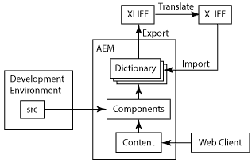

# Internationalisering av komponenter{#internationalizing-components}

Internationalisera dina komponenter och dialogrutor så att deras gränssnittssträngar kan presenteras på olika språk. Komponenter som är utformade för internationalisering gör att UI-strängar kan externaliseras, översättas och sedan importeras till databasen. Vid körning avgör användarens språkinställningar eller sidans språkområde vilket språk som visas i användargränssnittet.

Använd följande process för att internationalisera dina komponenter och ange användargränssnittet på olika språk:

1. [Implementera dina komponenter med kod som internationaliserar strängar.](/help/sites-developing/i18n-dev.md) Koden identifierar strängarna som ska översättas och väljer språket som ska visas vid körning.
1. [Skapa ordlistor](/help/sites-developing/i18n-translator.md#creating-a-dictionary) och [lägg till](/help/sites-developing/i18n-translator.md#adding-changing-and-removing-strings) de engelska strängarna som ska översättas.

1. [Exportera](/help/sites-developing/i18n-translator.md#exporting-a-dictionary) ordlistan till XLIFF-format, översätt strängarna och [importera](/help/sites-developing/i18n-translator.md#importing-a-dictionary) sedan XLIFF-filerna tillbaka till AEM. Du kan också lägga till översättningar  manuellt i ordlistan.

1. [Lägg in ordboken i processen för versionshantering av ditt program](/help/sites-developing/i18n-translator.md#publishing-dictionaries).

>[!NOTE]
>
>De metoder som beskrivs här för internationalisering av komponenter är avsedda för översättning av statiska strängar. När komponentsträngar förväntas ändras bör du använda konventionella översättningsarbetsflöden. Om en författare till exempel kan redigera en gränssnittssträng med hjälp av egenskaper i dialogrutan Redigera för en komponent, bör du inte använda ett språklexikon för att internationalisera strängen.

## Språkordlistor {#language-dictionaries}

I AEM-internationaliseringsramverket används ordlistor i databasen för att lagra engelska strängar och deras översättningar på andra språk. I ramverket används engelska som standardspråk. Strängar identifieras med hjälp av deras engelska version. Vanligtvis använder internationaliseringsramverk alfanumeriska ID:n för gränssnittssträngar. Att använda den engelska versionen av strängen som ID har flera fördelar:

* Koden är lätt att läsa.
* Standardspråket är alltid tillgängligt.

Lokaliserade strängar kan lagras i flera ordlistor i databasen. AEM-systemordlistor finns under `/libs` noden. Du kan skapa ordlistor för dina komponenter under `/apps` noden. I AEM-internationaliseringsramverket kombineras ordlistorna och de blir tillgängliga i Sling som ett enda `ResourceBundle` objekt. När komponenter återges hämtar de översatta strängarna från resurspaketet. De kombinerade ordlistorna distribueras också på webbservern i JSON-format för att tillhandahålla översatta strängar till Javascript-kod på webbsidor.

Med [översättningsverktyget](/help/sites-developing/i18n-translator.md) kan du dessutom hantera alla ordlistor från en central plats.

>[!NOTE]
>
>Ändra inte AEM-systemordlistorna som finns under `/libs` noden.

### Ersätta strängar i systemordlistor {#overlaying-strings-in-system-dictionaries}

Strängar i ordlistor nedanför noden åsidosätter dubblettsträngar i ordlistor som finns under `/apps` `/libs` noden. Om dina komponenter använder strängar som ingår i AEM-systemordlistorna duplicerar du strängen i din egen ordlista. Alla komponenter använder strängarna från din ordlista.

Observera att du inte kan förutsäga vilken översättning som används när strängar dupliceras i ordlistor som alla finns under `/apps` noden.
