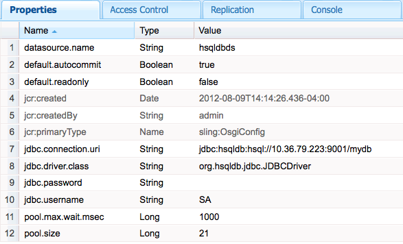

# Ansluta till SQL-databaser{#connecting-to-sql-databases}

Få tillgång till en extern SQL-databas så att CQ-programmen kan interagera med data:

1. [Skapa eller hämta ett OSGi-paket som exporterar JDBC-drivrutinspaketet](#bundling-the-jdbc-database-driver).
1. [Konfigurera en JDBC-datakällans poolprovider](#configuring-the-jdbc-connection-pool-service).
1. [Hämta ett datakällobjekt och skapa anslutningen i koden](#connecting-to-the-database).

## Paketera JDBC-databasdrivrutinen {#bundling-the-jdbc-database-driver}

Vissa databasleverantörer tillhandahåller JDBC-drivrutiner i ett OSGi-paket, till exempel [MySQL](https://www.mysql.com/downloads/connector/j/). Om JDBC-drivrutinen för din databas inte är tillgänglig som ett OSGi-paket hämtar du JAR-drivrutinen och lägger den i ett OSGi-paket. Paketet måste exportera de paket som krävs för interaktion med databasservern. Paketet måste också importera de paket som det refererar till.

I följande exempel används [Bundle-pluginen för Maven](https://felix.apache.org/site/apache-felix-maven-bundle-plugin-bnd.html) för att kapsla in HSQLDB-drivrutinen i ett OSGi-paket. POM instruerar plugin-programmet att bädda in filen hsqldb.jar som identifieras som ett beroende. Alla org.hsqldb-paket exporteras.

Plugin-programmet bestämmer automatiskt vilka paket som ska importeras och visar dem i filen MANIFEST.MF i paketet. Om något av paketen inte är tillgängligt på CQ-servern startar inte paketet vid installationen. Två möjliga lösningar är följande:

* Ange i POM att paketen är valfria. Använd den här lösningen när JDBC-anslutningen egentligen inte kräver paketmedlemmarna. Använd elementet Import-Package för att ange valfria paket som i följande exempel:

   `<Import-Package>org.jboss.*;resolution:=optional,*</Import-Package>`
* Lägg in de JAR-filer som innehåller paketen i ett OSGi-paket som exporterar paketen och distribuera paketet. Använd den här lösningen när paketmedlemmarna krävs under kodkörningen.

Om du känner till källkoden kan du bestämma vilken lösning som ska användas. Du kan också testa båda lösningarna och utföra testning för att validera lösningen.

### POM som innehåller hsqldb.jar {#pom-that-bundles-hsqldb-jar}

```xml
<project xmlns="https://maven.apache.org/POM/4.0.0"
  xmlns:xsi="https://www.w3.org/2001/XMLSchema-instance"
  xsi:schemaLocation="https://maven.apache.org/POM/4.0.0 https://maven.apache.org/xsd/maven-4.0.0.xsd">
  <modelVersion>4.0.0</modelVersion>

  <groupId>com.adobe.example.myapp</groupId>
  <artifactId>hsqldb-jdbc-driver-bundle</artifactId>
  <version>0.0.1-SNAPSHOT</version>
  <name>wrapper-bundle-hsqldb-driver</name>
  <url>www.adobe.com</url>
  <description>Exports the HSQL JDBC driver</description>
  <packaging>bundle</packaging>
  <properties>
    <project.build.sourceEncoding>UTF-8</project.build.sourceEncoding>
  </properties>
  <build>
    <plugins>
      <plugin>
        <groupId>org.apache.felix</groupId>
        <artifactId>maven-bundle-plugin</artifactId>
        <version>1.4.3</version>
        <extensions>true</extensions>
        <configuration>
         <instructions>
            <Embed-Dependency>*</Embed-Dependency>
            <_exportcontents>org.hsqldb.*</_exportcontents>
          </instructions>
        </configuration>
      </plugin>
    </plugins>
  </build>
  <dependencies>
    <dependency>
      <groupId>hsqldb</groupId>
      <artifactId>hsqldb</artifactId>
      <version>2.2.9</version>
    </dependency>
  </dependencies>
</project>
```

Följande länkar öppnar hämtningssidorna för några populära databasprodukter:

* [Microsoft SQL Server](https://www.microsoft.com/en-us/download/details.aspx?displaylang=en&id=11774)
* [Oracle](https://www.oracle.com/technetwork/database/features/jdbc/index-091264.html)
* [IBM DB2](https://www-01.ibm.com/support/docview.wss?uid=swg27007053)

### Konfigurera tjänsten JDBC-anslutningspool {#configuring-the-jdbc-connection-pool-service}

Lägg till en konfiguration för tjänsten JDBC Connections Pool som använder JDBC-drivrutinen för att skapa datakällobjekt. Programkoden använder den här tjänsten för att hämta objektet och ansluta till databasen.

JDBC Connections Pool ( `com.day.commons.datasource.jdbcpool.JdbcPoolService`) är en fabrikstjänst. Om du behöver anslutningar som använder olika egenskaper, till exempel läsbehörighet eller läs-/skrivåtkomst, skapar du flera konfigurationer.

När du arbetar med CQ finns det flera metoder för att hantera konfigurationsinställningarna för sådana tjänster. Mer information finns i [Konfigurera OSGi](/help/sites-deploying/configuring-osgi.md) .

Följande egenskaper är tillgängliga för att konfigurera en poolad anslutningstjänst. Egenskapsnamnen visas så som de visas i webbkonsolen. Motsvarande namn för en `sling:OsgiConfig` nod visas inom parentes. Exempelvärden visas för en HSQLDB-server och en databas som har aliaset `mydb`:

* JDBC-drivrutinsklass ( `jdbc.driver.class`): Den Java-klass som ska användas som till exempel implementerar gränssnittet java.sql.Driver `org.hsqldb.jdbc.JDBCDriver`. Datatypen är `String`.

* JDBC Connection URI ( `jdbc.connection.uri`): URL:en för den databas som ska användas för att skapa anslutningen, till exempel `jdbc:hsqldb:hsql//10.36.79.223:9001/mydb`. URL-formatet måste vara giltigt för användning med metoden getConnection i klassen java.sql.DriverManager. Datatypen är `String`.

* Användarnamn ( `jdbc.username`): Användarnamnet som ska användas för att autentisera med databasservern. Datatypen är `String`.

* Lösenord ( `jdbc.password`): Lösenordet som ska användas för autentisering av användaren. Datatypen är `String`.

* Valideringsfråga ( `jdbc.validation.query`): Den SQL-sats som ska användas för att verifiera att anslutningen lyckas, till exempel `select 1 from INFORMATION_SCHEMA.SYSTEM_USERS`. Datatypen är `String`.

* Skrivskyddad som standard (default.readonly): Välj det här alternativet om du vill att anslutningen ska ge skrivskyddad åtkomst. Datatypen är `Boolean`.
* Genomför automatiskt som standard ( `default.autocommit`): Välj det här alternativet om du vill skapa separata transaktioner för varje SQL-kommando som skickas till databasen, och varje transaktion verkställs automatiskt. Välj inte det här alternativet när du implementerar transaktioner explicit i koden. Datatypen är `Boolean`.

* Poolstorlek ( `pool.size`): Antalet samtidiga anslutningar som ska göras tillgängliga för databasen. Datatypen är `Long`.

* Poolväntetid ( `pool.max.wait.msec`): Den tid det tar innan en anslutningsbegäran tar slut. Datatypen är `Long`.

* Namn på datakälla ( `datasource.name`): Namnet på den här datakällan. Datatypen är `String`.

* Ytterligare serviceegenskaper ( `datasource.svc.properties`): En uppsättning namn/värde-par som du vill lägga till i anslutnings-URL:en. Datatypen är `String[]`.

Tjänsten JDBC Connections Pool är en fabrik. Om du använder en `sling:OsgiConfig` nod för att konfigurera anslutningstjänsten måste därför nodens namn innehålla fabrikstjänstens PID följt av *`-alias`*. Aliaset som du använder måste vara unikt för alla konfigurationsnoder för det PID:t. Ett exempel på nodnamn är `com.day.commons.datasource.jdbcpool.JdbcPoolService-myhsqldbpool`.



### Ansluta till databasen {#connecting-to-the-database}

I Java-koden använder du tjänsten DataSourcePool för att hämta ett `javax.sql.DataSource` objekt för konfigurationen som du skapade. Tjänsten DataSourcePool tillhandahåller den `getDataSource` metod som returnerar ett `DataSource` objekt för ett angivet datakällnamn. Som metodargument använder du värdet för den datakällenamn (eller `datasource.name`) som du angav för JDBC-anslutningspoolkonfigurationen.

I följande exempel hämtas en instans av hsqldbds-datakällan, en enkel SQL-fråga körs och antalet resultat som returneras visas.

#### JSP som utför en databassökning {#jsp-that-performs-a-database-lookup}

```java
<%@include file="/libs/foundation/global.jsp"%><%
%><%@page session="false"%><%
%><%@ page import="com.day.commons.datasource.poolservice.DataSourcePool" %><%
%><%@ page import="javax.sql.DataSource" %><%
%><%@ page import="java.sql.Connection" %><%
%><%@ page import="java.sql.SQLException" %><%
%><%@ page import="java.sql.Statement" %><%
%><%@ page import="java.sql.ResultSet"%><%
%><html>
<cq:include script="head.jsp"/>
<body>
<%DataSourcePool dspService = sling.getService(DataSourcePool.class);
  try {
     DataSource ds = (DataSource) dspService.getDataSource("hsqldbds");
     if(ds != null) {
         %><p>Obtained the datasource!</p><%
         %><%final Connection connection = ds.getConnection();
          final Statement statement = connection.createStatement();
          final ResultSet resultSet = statement.executeQuery("SELECT * from INFORMATION_SCHEMA.SYSTEM_USERS");
          int r=0;
          while(resultSet.next()){
             r=r+1;
          }
          resultSet.close();
          %><p>Number of results: <%=r%></p><%
      }
   }catch (Exception e) {
        %><p>error! <%=e.getMessage()%></p><%
    }
%></body>
</html>
```

>[!NOTE]
>
>Om metoden getDataSource genererar ett undantag eftersom datakällan inte kan hittas kontrollerar du att tjänstkonfigurationen för anslutningspoolen är korrekt. Kontrollera egenskapsnamnen, värdena och datatyperna.


>[!NOTE]
>
>Mer information om hur du injicerar en DataSourcePool i ett OSGi-paket finns i [Inmatning av en DataSourcePool-tjänst i ett Adobe Experience Manager OSGi-paket](https://helpx.adobe.com/experience-manager/using/datasourcepool.html).

