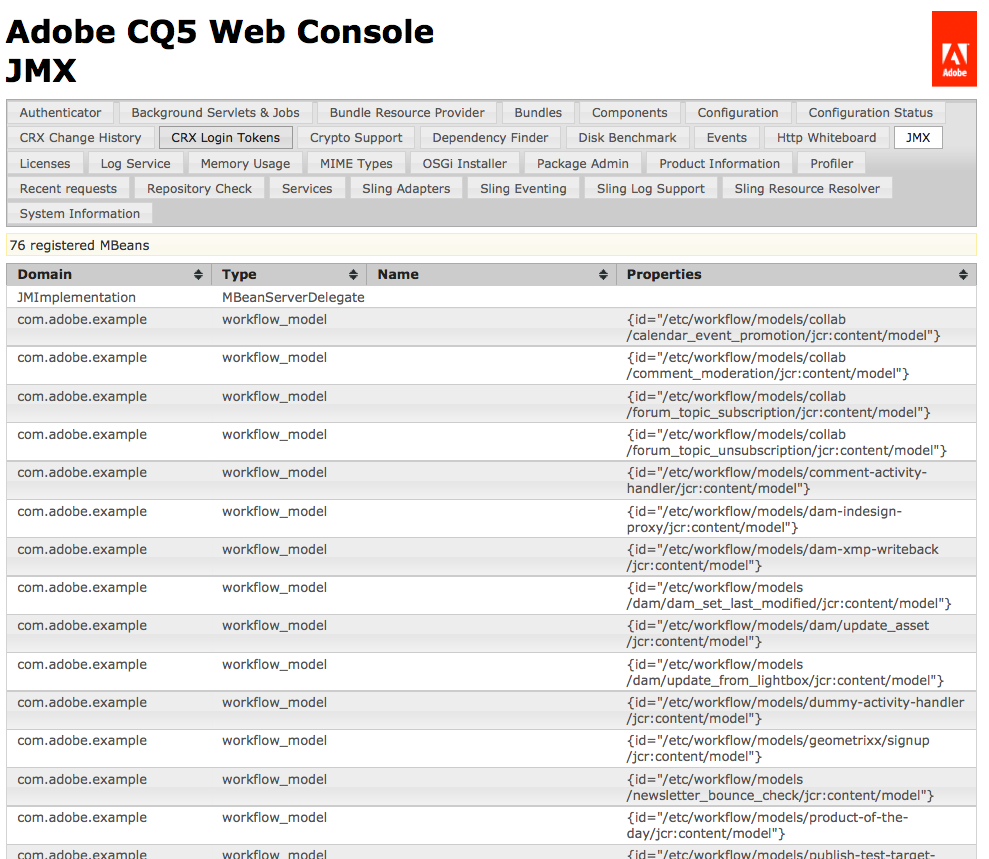

# Integrera tjänster med JMX-konsolen{#integrating-services-with-the-jmx-console}

Skapa och distribuera MBeans för att hantera tjänster med JMX Console. Visa tjänstattribut och åtgärder så att administrationsåtgärder kan utföras.

Mer information om hur du använder JMX-konsolen finns i [Övervaka serverresurser med JMX-konsolen](/help/sites-administering/jmx-console.md).

## JMX Framework i Felix och CQ5 {#the-jmx-framework-in-felix-and-cq}

På Apache Felix-plattformen driftsätter du MBeans som OSGi-tjänster. När en MBean-tjänst registreras i OSGi-tjänstregistret registrerar Aries JMX Whiteboard-modulen automatiskt MBean med MBean-servern. MBean är sedan tillgängligt för JMX-konsolen som visar de publika attributen och åtgärderna.


## Skapa MBeans för CQ5 och CRX {#creating-mbeans-for-cq-and-crx}

De MBeans du skapar för CQ5- eller CRX-resurser baseras på gränssnittet javax.management.DynamicMBean. För att skapa dem följer du de vanliga designmönstren i JMX-specifikationen:

* Skapa hanteringsgränssnittet, inklusive get, set och är metoder för att definiera attribut och andra metoder för att definiera åtgärder.
* Skapa implementeringsklassen. Klassen måste implementera DynamicMBean eller utöka en implementeringsklass för DynamicMBean.
* Följ den vanliga namnkonventionen så att namnet på implementeringsklassen är gränssnittsnamnet med suffixet MBean.

Förutom att definiera hanteringsgränssnittet definierar gränssnittet även OSGi-tjänstgränssnittet. Implementeringsklassen implementerar OSGi-tjänsten.

### Använda anteckningar för att tillhandahålla MBean-information {#using-annotations-to-provide-mbean-information}

Paketet [com.adobe.granite.jmx.annotation](https://helpx.adobe.com/experience-manager/6-5/sites/developing/using/reference-materials/javadoc/com/adobe/granite/jmx/annotation/package-summary.html) innehåller flera anteckningar och klasser för att enkelt tillhandahålla MBean-metadata till JMX-konsolen. Använd dessa anteckningar och klasser i stället för att lägga till information direkt i MBeanInfo-objektet.

**Anteckningar**

Lägg till anteckningar i hanteringsgränssnittet för att ange MBean-metadata. Informationen visas i JMX-konsolen för varje implementeringsklass som distribueras. Följande anteckningar är tillgängliga (för fullständig information, se JavaDocs [på](https://helpx.adobe.com/experience-manager/6-5/sites/developing/using/reference-materials/javadoc/com/adobe/granite/jmx/annotation/package-summary.html)com.adobe.granite.jmx.annotation):

* **** Beskrivning: Innehåller en beskrivning av klassen eller metoden MBean. När det används i klassdeklarationen visas beskrivningen på JMX-konsolsidan för MBean. När den används på en metod visas beskrivningen som hovringstext för motsvarande attribut eller åtgärd.
* **** Effekt: En metods påverkan. Giltiga parametervärden är de fält som definieras av [javax.management.MBeanOperationInfo](https://docs.oracle.com/javase/1.5.0/docs/api/javax/management/MBeanOperationInfo.html).

* **** Namn: Anger namnet som ska visas för en åtgärdsparameter. Använd den här anteckningen för att åsidosätta det faktiska namnet på metodparametern som används i gränssnittet.
* **** OpenTypeInfo: Anger den klass som ska användas för att representera sammansatta data eller tabelldata i JMX-konsolen. För användning med Open MBeans
* **** TabularTypeInfo: Används för att kommentera klassen som används för att representera tabelldata.

**Klasser**

Klasser finns för att skapa dynamiska MBeans som använder de anteckningar du lägger till i deras gränssnitt:

* **** AnnotatedStandardMBean: En underklass till klassen javax.management.StandardMBean som automatiskt förser JMX-konsolen med anteckningens metadata.
* **** OpenAnnotatedStandardMBean: En underklass till klassen AnnotatedStandardMBean för att skapa Open Mans som använder OpenTypeInfo-anteckningen.

### Utveckla MBeans {#developing-mbeans}

Vanligtvis är din MBean en spegling av den OSGi-tjänst som du vill hantera. På Felix-plattformen skapar du MBean på samma sätt som du gör för andra Java-serverplattformar. En viktig skillnad är att du kan använda anteckningar för att ange MBean-information:

* Hanteringsgränssnitt: Definierar attribut med get-, set- och is-metoder. Definierar åtgärder med någon annan offentlig metod. Använder anteckningar för att ange metadata för BeanInfo-objektet.
* Klassen MBean: Implementerar hanteringsgränssnittet. Utökar klassen AnnotatedStandardMBean så att den bearbetar anteckningarna i gränssnittet.

I följande exempel innehåller MBean information om CRX-databasen. Gränssnittet använder beskrivningsanteckningen för att ge information till JMX-konsolen.

#### Hanteringsgränssnitt {#management-interface}

```java
package com.adobe.example.myapp;

import com.adobe.granite.jmx.annotation.Description;

@Description("Example MBean that exposes repository properties.")
public interface ExampleMBean {

    @Description("The name of the repository.")
    String getRepositoryName();

    @Description("The vendor of the repository.")
    String   getRepositoryVendor();

    @Description("The URL of repository vendor.")
    String getVendorUrl();
}
```

Implementeringsklassen använder tjänsten SlingRepository för att hämta information om CRX-databasen.

#### MBean-implementeringsklass {#mbean-implementation-class}

```java
package com.adobe.example.myapp;

import org.apache.felix.scr.annotations.*;
import org.apache.sling.jcr.api.SlingRepository;

import com.adobe.granite.jmx.annotation.AnnotatedStandardMBean;

import javax.management.*;

public class ExampleMBeanImpl extends AnnotatedStandardMBean implements ExampleMBean {

    @Reference(cardinality = ReferenceCardinality.OPTIONAL_UNARY)
    private SlingRepository repository;

    public ExampleMBeanImpl() throws NotCompliantMBeanException {
        super(ExampleMBean.class);
    }

    public String getRepositoryName() {
        return repository.getDescriptor("jcr.repository.name");
    }

    public String getRepositoryVendor() {
        return repository.getDescriptor("jcr.repository.vendor");
    }

    public String getVendorUrl() {
        return repository.getDescriptor("jcr.repository.vendor.url");
    }
}
```

I följande bild visas sidan för det här MBean i JMX-konsolen.


### Registrerar MBeans {#registering-mbeans}

När du registrerar MBeans som en OSGi-tjänst registreras de automatiskt med MBean-servern. Om du vill installera en MBean på CQ5 inkluderar du den i ett paket och exporterar tjänsten MBean på samma sätt som du gör med andra OSGi-tjänster.

Förutom OSGi-relaterade metadata måste du även tillhandahålla metadata som krävs för att Aries JMX Whiteboard-modulen ska kunna registrera MBean med MBean-servern:

* **** Namnet på DynamicMBean-gränssnittet: Deklarera att MBean-tjänsten implementerar `javax.management.DynamicMBea`n-gränssnittet. Den här deklarationen meddelar Aries JMX Whiteboard-modulen att tjänsten är en MBean-tjänst.

* **** Egenskaperna för MBean-domänen och nyckeln: På Felix anger du den här informationen som en egenskap för tjänsten OSGi i MBean. Det här är samma information som du vanligtvis anger för MBean-servern i ett `javax.management.ObjectName` objekt.

När din MBean är en spegling av en enskild tjänst behövs bara en instans av tjänsten MBean. Om du i det här fallet använder Felix SCR Maven-pluginen kan du använda Apache Felix Service Component Runtime-anteckningar (SCR) på implementeringsklassen MBean för att ange JMX-relaterade metadata. Om du vill instansiera flera MBean-instanser kan du skapa en annan klass som utför registreringen av MBean-tjänsten OSGi. I det här fallet genereras JMX-relaterade metadata vid körning.

**Enkelt MBean**

MBeans som du kan definiera alla attribut och åtgärder för i designläge kan distribueras med SCR-anteckningar i implementeringsklassen MBean. I följande exempel deklarerar attributet `value` för `Service` anteckningen att tjänsten implementerar `DynamicMBean` gränssnittet. Attributet `name` för `Property` anteckningen anger JMX-domänen och nyckelegenskaperna.

#### MBean-implementeringsklass med SCR-anteckningar {#mbean-implementation-class-with-scr-annotations}

```java
package com.adobe.example.myapp;

import org.apache.felix.scr.annotations.*;
import org.apache.sling.jcr.api.SlingRepository;

import com.adobe.granite.jmx.annotation.AnnotatedStandardMBean;

import javax.management.*;

@Component(immediate = true)
@Property(name = "jmx.objectname", value="com.adobe.example:type=CRX")
@Service(value = DynamicMBean.class)
public class ExampleMBeanImpl extends AnnotatedStandardMBean implements ExampleMBean {

    @Reference(cardinality = ReferenceCardinality.OPTIONAL_UNARY)
    private SlingRepository repository;

    public ExampleMBeanImpl() throws NotCompliantMBeanException {
        super(ExampleMBean.class);
    }

    public String getRepositoryName() {
        return repository.getDescriptor("jcr.repository.name");
    }

    public String getRepositoryVendor() {
        return repository.getDescriptor("jcr.repository.vendor");
    }

    public String getVendorUrl() {
        return repository.getDescriptor("jcr.repository.vendor.url");
    }
}
```

**Flera MBean-tjänstinstanser**

Om du vill hantera flera instanser av en hanterad tjänst skapar du flera instanser av motsvarande MBean-tjänst. Dessutom bör MBean-tjänstinstanser skapas eller tas bort när hanterade instanser startas eller stoppas. Du kan skapa en MBean-hanterarklass för att instansiera MBean-tjänster vid körning och hantera tjänstens livscykel.

Använd BundleContext för att registrera MBean som en OSGi-tjänst. Inkludera den JMX-relaterade informationen i Dictionary-objektet som du använder som argument i metoden BundleContext.registerService.

I följande kodexempel registreras tjänsten ExampleMBean programmatiskt. ComponentContext-objektet är ComponentContext, som ger åtkomst till BundleContext.

#### Kodfragment: Programmatisk MBean Service Registration {#code-snippet-programmatic-mbean-service-registration}

```java
Dictionary mbeanProps = new Hashtable();
mbeanProps.put("jmx.objectname", "com.adobe.example:type=CRX");
ExampleMBeanImpl mbean = new ExampleMBeanImpl();
ServiceRegistration serviceregistration =
            componentContext.getBundleContext().registerService(DynamicMBean.class.getName(), mbean, mbeanProps);
```

Exemplet MBean i nästa avsnitt innehåller mer information.

En MBean-tjänsthanterare är användbar när tjänstkonfigurationer lagras i databasen. Hanteraren kan hämta tjänstinformation och använda den för att konfigurera och skapa motsvarande MBean. Klassen manager kan även lyssna efter databasändringshändelser och uppdatera MBean-tjänster därefter.

## Exempel: Övervaka arbetsflödesmodeller med JMX {#example-monitoring-workflow-models-using-jmx}

MBean i det här exemplet innehåller information om CQ5-arbetsflödesmodellerna som lagras i databasen. En MBean-hanterarklass skapar MBeans baserat på arbetsflödesmodeller som lagras i databasen och registrerar sin OSGi-tjänst vid körning. Det här exemplet består av ett enda paket som innehåller följande medlemmar:

* WorkflowMBean: Hanteringsgränssnittet.
* WorkflowMBeanImpl: Implementeringsklassen MBean.
* WorkflowMBeanManager: Gränssnittet för klassen MBean-hanterare.
* WorkflowMBeanManagerImpl: Implementeringsklassen för MBean-hanteraren.

**** Obs! För enkelhetens skull utför koden i det här exemplet inte loggning eller reagerar på utlösta undantag.

WorkflowMBeanManagerImpl innehåller en metod för komponentaktivering. När komponenten aktiveras utför metoden följande uppgifter:

* Hämtar en BundleContext för paketet.
* Frågar databasen för att hämta sökvägarna till de befintliga arbetsflödesmodellerna.
* Skapar MBeans för varje arbetsflödesmodell.
* Registrerar MBeans i OSGi-tjänstregistret.

Metadata för MBean visas i JMX-konsolen med domänen com.adobe.example, typen workflow_model och Properties är sökvägen till konfigurationsnoden för arbetsflödesmodellen.



### Exempel på MBean {#the-example-mbean}

Det här exemplet kräver ett MBean-gränssnitt och en implementering som reflekterar gränssnittet `com.day.cq.workflow.model.WorkflowModel` . MBean är mycket enkelt så att exemplet kan fokusera på design- och driftsättningsaspekter. MBean visar ett enda attribut, modellnamnet.

#### WorkflowMBean-gränssnitt {#workflowmbean-interface}

```java
package com.adobe.example.myapp.api;

import com.adobe.granite.jmx.annotation.Description;

@Description("Example MBean that exposes Workflow model properties.")
public interface WorkflowMBean {

 @Description("The name of the Workflow model.")
 String getModelName();
}
```

#### WorkflowMBeanImpl {#workflowmbeanimpl}

```java
package com.adobe.example.myapp.impl;

import javax.management.NotCompliantMBeanException;

import com.day.cq.workflow.model.WorkflowModel;
import com.adobe.example.myapp.api.WorkflowMBean;
import com.adobe.granite.jmx.annotation.AnnotatedStandardMBean;

public class WorkflowMBeanImpl extends AnnotatedStandardMBean implements WorkflowMBean {

 WorkflowModel model;

 protected WorkflowMBeanImpl(WorkflowModel inmodel)
   throws NotCompliantMBeanException {
  super(WorkflowMBean.class);
  model=inmodel;
 }

 public String getModelName() {
  return model.getTitle();
 }
}
```

### Exempel på MBean Manager {#the-example-mbean-manager}

WorkflowMBeanManager-tjänsten innehåller komponentaktiveringsmetoden som skapar WorkflowMBean-tjänster. Tjänstimplementeringen innehåller följande metoder:

* aktivera: Komponentaktiveraren. Skapar JCR-sessionen för läsning av WorkflowModel-konfigurationsnoder. Rotnoden där modellkonfigurationer lagras definieras i ett statiskt fält. Namnet på konfigurationsnoden definieras också i ett statiskt fält. Den här metoden anropar andra metoder som hämtar nodmodellsökvägarna och skapar modellen WorkflowMBeans.
* getModelIds: Går igenom databasen under rotnoden och hämtar sökvägen för varje modellnod.
* makeMBean: Använder modellsökvägen för att skapa ett WorkflowModel-objekt, skapar ett WorkflowMBean för det och registrerar dess OSGi-tjänst.

>[!NOTE]
>
>Implementeringen av WorkflowMBeanManager skapar bara MBean-tjänster för modellkonfigurationer som finns när komponenten aktiveras. En mer robust implementering lyssnar efter databashändelser för nya modellkonfigurationer och ändringar eller borttagningar av befintlig modellkonfiguration. När en ändring inträffar kan hanteraren skapa, ändra eller ta bort motsvarande WorkflowMBean-tjänst.


#### WorkflowMBeanManager-gränssnitt {#workflowmbeanmanager-interface}

```java
package com.adobe.example.myapp.api;

public interface WorkflowMBeanManager {

}
```

#### WorkflowMBeanManagerImpl {#workflowmbeanmanagerimpl}

```java
package com.adobe.example.myapp.impl;

import java.util.*;

import org.apache.felix.scr.annotations.*;

import javax.jcr.Session;
import javax.jcr.Node;
import javax.jcr.NodeIterator;
import javax.jcr.RepositoryException;
import javax.management.ObjectName;

import org.apache.sling.jcr.api.SlingRepository;
import org.osgi.framework.ServiceRegistration;
import org.osgi.service.component.ComponentContext;

import org.slf4j.Logger;
import org.slf4j.LoggerFactory;

import com.day.cq.workflow.WorkflowService;
import com.day.cq.workflow.WorkflowSession;
import com.adobe.example.myapp.api.WorkflowMBean;
import com.adobe.example.myapp.api.WorkflowMBeanManager;

/**Instantiates and registers WorkflowMBean services */
@Component(immediate=true)
@Service(value=WorkflowMBeanManager.class)
public class WorkflowMBeanManagerImpl implements WorkflowMBeanManager {
 //The ComponentContext provides access to the BundleContext
 private ComponentContext componentContext;

 //Use the SlingRepository service to read model nodes
 @Reference
        private SlingRepository repository = null;

 //Use the WorkflowService service to create WorkflowModel objects
 @Reference
 private WorkflowService workflowservice = null;

  private Session session;

         //Details about model nodes
  private static final String MODEL_ROOT ="/etc/workflow/models";
  private static final String MODEL_NODE = "model";

  private Set<String> modelIds = new HashSet<String>();

        //Storage for ServiceRegistrations for MBean services
  private Collection<ServiceRegistration> mbeanRegistrations= new Vector<ServiceRegistration>(0,1);

 @Activate
        protected void activate(ComponentContext ctx) {
             //Traverse the repository and load the model nodes
             try {
                   session = repository.loginAdministrative(null);
                   // load and store model node paths
                   if (session.nodeExists(MODEL_ROOT)) {
                          getModelIds(session.getNode(MODEL_ROOT));
                   }
                   //Create MBeans for each model
                   for(String modid: modelIds){
                    makeMBean(modid);
                    }
             }catch(Exception e){ }
          }

        /**
         * Add JMX domain and key properties to a collection
         * Instantiate a WorkflowModel and its WorkflowMBeanImpl object
         * Register the MBean OSGi service
         */
 private void makeMBean(String modelId) {
             // create MBean for the model
             try {
                 Dictionary<String, String> mbeanProps = new Hashtable<String, String>();
                 //These properties appear on the JMX Console home page
                 mbeanProps.put("jmx.objectname", "com.adobe.example:type=workflow_model,id=" + ObjectName.quote(modelId));
                 WorkflowSession wfsession = workflowservice.getWorkflowSession(session);
                 WorkflowMBeanImpl mbean = new WorkflowMBeanImpl(wfsession.getModel(modelId));

                ServiceRegistration serviceregistration = componentContext.getBundleContext().registerService(WorkflowMBean.class.getName(), mbean, mbeanProps);
                //Store the ServiceRegistration objects for deactivation
                mbeanRegistrations.add(serviceregistration);
             } catch (Throwable t) {}
         }

        /**
         * Traverses the repository branch below a given Node. Stores the path of each model node.
         */
 private void getModelIds(Node node) throws RepositoryException {
  try{
                     NodeIterator iter = node.getNodes();
                     while (iter.hasNext()) {
                           Node n = iter.nextNode();
                           //Look for "jcr:content" nodes
                           if (n.getName().equals("jcr:content")) {
                                //get the path of the model node and save it
                                if(n.hasNode(MODEL_NODE)){
                                      modelIds.add(n.getNode(MODEL_NODE).getPath());
                                 }
                           } else{
                                   //Scan child nodes
                                   getModelIds(n);
                           }
                       }
  }catch(Exception e){ }
       }

        /**
         * Log out of the JCR session and unregister WorkflowMBean services
         */
        @Deactivate
        protected void deactivate() {
          session.logout();
          session=null;
          for(ServiceRegistration sr:mbeanRegistrations){
         sr.unregister();
          }
        }
}
```

### POM-filen för exempelfilen MBean {#the-pom-file-for-the-example-mbean}

För enkelhetens skull kan du kopiera och klistra in följande XML-kod i din pom.xml-projektfil för att skapa komponentpaketet. POM refererar till flera nödvändiga plugin-program och beroenden.

**Plugins:**

* Apache Maven Compiler Plugin: Kompilerar Java-klasser från källkoden.
* Apache Felix Maven Bundle Plugin: Skapar paketet och manifestet
* Apache Felix Maven SCR Plugin: Skapar komponentbeskrivningsfilen och konfigurerar tjänstkomponentens manifesthuvud.

**** Obs! Vid skrivandet är maven scr-pluginen inte kompatibel med m2e-pluginen för Eclipse. (Se [Felix bug 3170](https://issues.apache.org/jira/browse/FELIX-3170).) Om du vill använda Eclipse IDE installerar du Maven och använder kommandoradsgränssnittet för att utföra byggen.

#### Exempel på POM-fil {#example-pom-file}

```xml
<project xmlns="https://maven.apache.org/POM/4.0.0"
  xmlns:xsi="https://www.w3.org/2001/XMLSchema-instance"
  xsi:schemaLocation="https://maven.apache.org/POM/4.0.0 https://maven.apache.org/xsd/maven-4.0.0.xsd">
  <modelVersion>4.0.0</modelVersion>
  <groupId>com.adobe.example.myapp</groupId>
  <artifactId>workflow-mbean</artifactId>
  <version>0.0.2-SNAPSHOT</version>
  <name>mbean-simple</name>
  <url>www.adobe.com</url>
  <description>A simple MBean</description>
  <packaging>bundle</packaging>
    <properties>
        <project.build.sourceEncoding>UTF-8</project.build.sourceEncoding>
    </properties>
    <build>
        <plugins>
        <plugin>
            <groupId>org.apache.maven.plugins</groupId>
            <artifactId>maven-compiler-plugin</artifactId>
            <configuration>
                <source>1.5</source>
                <target>1.5</target>
            </configuration>
        </plugin>
            <plugin>
                <groupId>org.apache.felix</groupId>
                <artifactId>maven-scr-plugin</artifactId>
                <version>1.7.2</version>
                <executions>
                    <execution>
                        <id>generate-scr-scrdescriptor</id>
              <goals>
                 <goal>scr</goal>
              </goals>
            </execution>
         </executions>
            </plugin>
             <plugin>
            <groupId>org.apache.felix</groupId>
            <artifactId>maven-bundle-plugin</artifactId>
            <version>1.4.3</version>
            <extensions>true</extensions>
            <configuration>
                <instructions>
                    <Export-Package>com.adobe.example.myapp.*;version=${project.version}</Export-Package>
                </instructions>
            </configuration>
        </plugin>
        </plugins>
    </build>
    <dependencies>
        <dependency>
            <groupId>org.apache.felix</groupId>
            <artifactId>org.apache.felix.scr.annotations</artifactId>
            <version>1.6.0</version>
            <scope>provided</scope>
        </dependency>
         <dependency>
            <groupId>org.apache.sling</groupId>
            <artifactId>org.apache.sling.api</artifactId>
            <version>2.0.8</version>
            <scope>provided</scope>
        </dependency>
         <dependency>
            <groupId>org.apache.felix</groupId>
            <artifactId>org.apache.felix.scr</artifactId>
            <version>1.6.1-R1236132</version>
            <scope>provided</scope>
        </dependency>
        <dependency>
            <groupId>org.apache.sling</groupId>
            <artifactId>org.apache.sling.jcr.api</artifactId>
            <version>2.0.4</version>
        </dependency>
        <dependency>
            <groupId>com.adobe.granite</groupId>
            <artifactId>com.adobe.granite.jmx</artifactId>
            <version>0.1.6</version>
            <scope>provided</scope>
        </dependency>
        <dependency>
       <groupId>com.day.cq.wcm</groupId>
       <artifactId>cq-wcm-mobile-api</artifactId>
       <version>5.5.2</version>
       <scope>provided</scope>
      </dependency>
      <dependency>
       <groupId>com.day.cq.workflow</groupId>
       <artifactId>cq-workflow-api</artifactId>
       <version>5.5.0</version>
       <scope>provided</scope>
      </dependency>
      <dependency>
       <groupId>javax.jcr</groupId>
       <artifactId>jcr</artifactId>
       <version>2.0</version>
       <scope>provided</scope>
      </dependency>
      <dependency>
                <groupId>org.slf4j</groupId>
  <artifactId>slf4j-api</artifactId>
  <version>1.6.4</version>
  <scope>provided</scope>
 </dependency>
    </dependencies>
</project>
```

Lägg till följande profil i din maven-inställningsfil för att använda den offentliga Adobe-databasen.

#### Maven Profile {#maven-profile}

```xml
<profile>
    <id>adobe-public</id>
    <activation>
         <activeByDefault>false</activeByDefault>
    </activation>
    <properties>
         <releaseRepository-Id>adobe-public-releases</releaseRepository-Id>
         <releaseRepository-Name>Adobe Public Releases</releaseRepository-Name>
         <releaseRepository-URL>https://repo.adobe.com/nexus/content/groups/public</releaseRepository-URL>
    </properties>
    <repositories>
         <repository>
             <id>adobe-public-releases</id>
             <name>Adobe Basel Public Repository</name>
             <url>https://repo.adobe.com/nexus/content/groups/public</url>
             <releases>
                 <enabled>true</enabled>
                 <updatePolicy>never</updatePolicy>
             </releases>
             <snapshots>
                 <enabled>false</enabled>
             </snapshots>
         </repository>
     </repositories>
     <pluginRepositories>
         <pluginRepository>
             <id>adobe-public-releases</id>
             <name>Adobe Basel Public Repository</name>
             <url>https://repo.adobe.com/nexus/content/groups/public</url>
             <releases>
                 <enabled>true</enabled>
                 <updatePolicy>never</updatePolicy>
             </releases>
             <snapshots>
                 <enabled>false</enabled>
             </snapshots>
         </pluginRepository>
     </pluginRepositories>
</profile>
```
