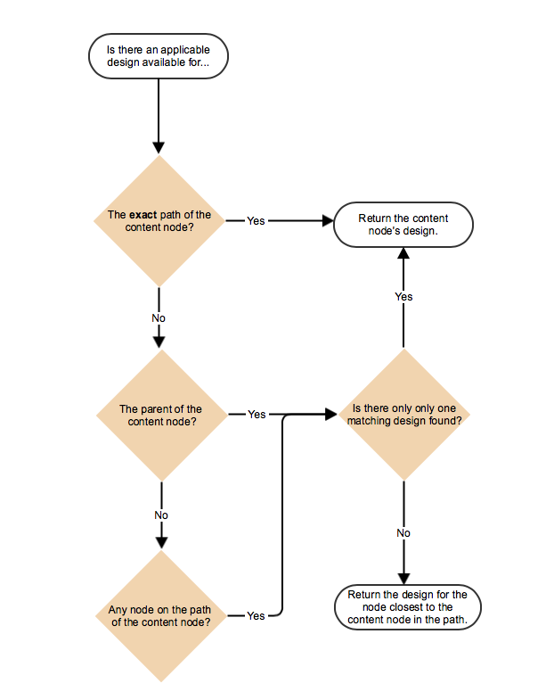

# Sidmallar - statiska{#page-templates-static}

En mall används för att skapa en sida och definierar vilka komponenter som kan användas i det valda omfånget. En mall är en hierarki med noder som har samma struktur som den sida som ska skapas, men utan något verkligt innehåll.

Varje mall visar ett urval av komponenter som är tillgängliga för användning.

* Mallar består av [komponenter](/help/sites-developing/components.md).
* Komponenterna använder och tillåter åtkomst till widgetar och dessa används för att återge innehållet.

>[!NOTE]
>
>[Redigerbara mallar](/help/sites-developing/page-templates-editable.md) finns också tillgängliga och är den rekommenderade typen av mallar för större flexibilitet och de senaste funktionerna.

## Egenskaper och underordnade noder för en mall {#properties-and-child-nodes-of-a-template}

En mall är en nod av typen cq:Template och har följande egenskaper och underordnade noder:

<table>
 <tbody>
  <tr>
   <td><strong>Namn   </strong></td>
   <td><strong>Typ   </strong></td>
   <td><strong>Beskrivning   </strong></td>
  </tr>
  <tr>
   <td>.   </td>
   <td> cq:Template</td>
   <td>Aktuell mall. En mall är av nodtypen cq:Template.  </td>
  </tr>
  <tr>
   <td> allowedChildren </td>
   <td> Sträng[]</td>
   <td>Sökväg till en mall som kan vara underordnad den här mallen.  </td>
  </tr>
  <tr>
   <td> allowedParents</td>
   <td> Sträng[]</td>
   <td>Sökväg till en mall som kan vara överordnad den här mallen.  </td>
  </tr>
  <tr>
   <td> allowedPaths</td>
   <td> Sträng[]</td>
   <td>Sökväg till en sida som kan baseras på den här mallen.  </td>
  </tr>
  <tr>
   <td> jcr:skapad</td>
   <td> Date</td>
   <td>Datum när mallen skapades.  </td>
  </tr>
  <tr>
   <td> jcr:description</td>
   <td> Sträng</td>
   <td>Beskrivning av mallen.  </td>
  </tr>
  <tr>
   <td> jcr:title</td>
   <td> Sträng</td>
   <td>Mallens namn.  </td>
  </tr>
  <tr>
   <td> rankning</td>
   <td> Lång</td>
   <td>Mallens rangordning. Används för att visa mallen i användargränssnittet.  </td>
  </tr>
  <tr>
   <td> jcr:innehåll</td>
   <td> cq:PageContent</td>
   <td>Nod som innehåller mallens innehåll.  </td>
  </tr>
  <tr>
   <td> thumbnail.png</td>
   <td>  nt:fil</td>
   <td>Mallens miniatyrbild.  </td>
  </tr>
  <tr>
   <td> icon.png</td>
   <td>  nt:fil</td>
   <td>Mallens ikon.  </td>
  </tr>
 </tbody>
</table>

En mall är grunden för en sida.

Om du vill skapa en sida måste mallen kopieras (nodträd `/apps/<myapp>/template/<mytemplate>`) till motsvarande position i platsträdet: detta är vad som händer om en sida skapas med fliken **Webbplatser** .

Den här kopieringsåtgärden ger även sidan dess ursprungliga innehåll (vanligtvis innehåll på översta nivån) och egenskapen sling:resourceType, sökvägen till sidkomponenten som används för att återge sidan (allt i den underordnade noden jcr:content).

## Hur mallar är strukturerade {#how-templates-are-structured}

Det finns två aspekter att tänka på:

* mallens struktur
* strukturen för det innehåll som skapas när en mall används

### Strukturen i en mall {#the-structure-of-a-template}

En mall skapas under en nod av typen **cq:Template**.

Du kan ange olika egenskaper, särskilt:

* **jcr:title** - mallens titel; visas i dialogrutan när du skapar en sida.
* **jcr:description** - beskrivning av mallen; visas i dialogrutan när du skapar en sida.

Den här noden innehåller en jcr:content-nod (cq:PageContent) som används som bas för innehållsnoden på de resulterande sidorna. den här referensen, med sling:resourceType, den komponent som ska användas för att återge det faktiska innehållet på en ny sida.

Den här komponenten används för att definiera innehållets struktur och design när en ny sida skapas.

### Innehållet som skapas av en mall {#the-content-produced-by-a-template}

Mallar används för att skapa sidor av typen `cq:Page` (som tidigare nämnts är en sida en speciell typ av komponent). Varje AEM-sida har en strukturerad nod `jcr:content`. Detta:

* är av typen cq:PageContent
* är en strukturerad nodtyp som innehåller en definierad innehållsdefinition
* har en egenskap `sling:resourceType` som refererar till komponenten som innehåller de snedskriftsskript som används för att återge innehållet

### Standardmallar {#default-templates}

AEM levereras med ett antal standardmallar som är tillgängliga direkt. I vissa fall kanske du vill använda mallarna som de är. I så fall måste du se till att mallen är tillgänglig för din webbplats.

Exempel: AEM innehåller flera mallar, bland annat en innehållssida och en hemsida.

| **Titel** | **Komponent** | **Plats** | **Syfte** |
|---|---|---|---|
| Hemsida | hemsida | geometrixx | Mallen för startsidan för Geometrixx. |
| Innehållssida |  innehållsida | geometrixx | Mallen för innehållssidan i Geometrixx. |

#### Visa standardmallar {#displaying-default-templates}

Om du vill se en lista över alla mallar i databasen gör du så här:

1. Öppna menyn **Verktyg** i CRXDE Lite och klicka på **Fråga**.

1. På fliken Fråga
1. Som **Typ** väljer du **XPath**.

1. Ange följande sträng i **indatafältet för** fråga:
//element(*, cq:Template)

1. Klicka på **Kör**. Listan visas i resultatrutan.

I de flesta fall tar du en befintlig mall och skapar en ny för eget bruk. Mer information finns i [Utveckla sidmallar](#developing-page-templates) .

Om du vill aktivera en befintlig mall för webbplatsen och du vill att den ska visas i dialogrutan **Skapa sida** när du skapar en sida direkt under **Webbplatser** från konsolen **Webbplatser** anger du egenskapen allowedPaths för mallnoden till: **/content(/.*)?**

## Hur malldesigner används {#how-template-designs-are-applied}

När format definieras i användargränssnittet med [designläge](/help/sites-authoring/default-components-designmode.md)bevaras designen med den exakta sökvägen till den innehållsnod som formatet definieras för.

>[!CAUTION]
>
>Adobe rekommenderar att du bara använder design i [designläge](/help/sites-authoring/default-components-designmode.md).
>
>Det är till exempel inte bra att ändra designen i CRX DE och tillämpningen av den kan variera från förväntat beteende.

Om du bara använder designläge gäller inte följande avsnitt, [Design Path Resolution](/help/sites-developing/page-templates-static.md#design-path-resolution), [Decision Tree](/help/sites-developing/page-templates-static.md#decision-tree)och [Example](/help/sites-developing/page-templates-static.md#example) .

### Design Path-upplösning {#design-path-resolution}

När du återger innehåll baserat på en statisk mall försöker AEM att använda den mest relevanta designen och formaten på innehållet baserat på en genomgång av innehållshierarkin.

AEM bestämmer den mest relevanta stilen för en innehållsnod i följande ordning:

* Om det finns en design för den fullständiga och exakta sökvägen för innehållsnoden (som när designen definieras i designläge) använder du den designen.
* Om det finns en design för den överordnade noden ska du använda den designen.
* Om det finns en design för en nod på innehållsnodens sökväg använder du den designen.

Om det finns mer än en tillämplig design i de två sista fallen använder du den som ligger närmast noden content.

### Beslutsträd {#decision-tree}

Det här är en grafisk representation av [logiken för upplösning](/help/sites-developing/page-templates-static.md#design-path-resolution) av designsökväg.

### Exempel {#example}

Här följer en enkel innehållsstruktur där en design kan användas på alla noder:

`/root/branch/leaf`

I följande tabell beskrivs hur AEM väljer en design.

<table>
 <tbody>
  <tr>
   <td><strong>Söker efter design för  </strong></td>
   <td><strong>Det finns design för  </strong></td>
   <td><strong>Design vald  </strong></td>
   <td><strong>Kommentar</strong></td>
  </tr>
  <tr>
   <td><code class="code">leaf
      </code></td>
   <td>
<code>root</code>
 
<code>branch</code>
 
<code>leaf</code>
 </td>
   <td><code>leaf</code></td>
   <td>Den mest exakta matchningen används alltid.  </td>
  </tr>
  <tr>
   <td><code>leaf</code></td>
   <td>
<code>root</code>
 
<code>branch</code>
 </td>
   <td><code>branch</code></td>
   <td>Gå tillbaka till närmaste träff i trädet.</td>
  </tr>
  <tr>
   <td><code>leaf</code></td>
   <td><code>root</code></td>
   <td><code>root</code></td>
   <td>Om allt annat misslyckas, ta det som återstår.  </td>
  </tr>
  <tr>
   <td><code>branch</code></td>
   <td><code>branch</code></td>
   <td><code>branch</code></td>
   <td> </td>
  </tr>
  <tr>
   <td><code>branch</code></td>
   <td>
<code>branch</code>
 
<code class="code">leaf
       </code>
 </td>
   <td><code>branch</code></td>
   <td> </td>
  </tr>
  <tr>
   <td><code>branch</code></td>
   <td>
<code>root</code>
 
<code class="code">branch
       </code>
 </td>
   <td><code>branch</code></td>
   <td> </td>
  </tr>
  <tr>
   <td><code>branch</code></td>
   <td>
<code>root</code>
 
<code class="code">leaf
       </code>
 </td>
   <td><code>root</code></td>
   <td>
Om det inte finns någon exakt matchning tar du den längre ned i trädet.
 
Antagandet är att detta alltid kommer att vara tillämpligt, men vidare kan trädet vara för specifikt.  
 </td>
  </tr>
 </tbody>
</table>

## Utveckla sidmallar {#developing-page-templates}

AEM-sidmallar är helt enkelt modeller som används för att skapa nya sidor. De kan innehålla så lite, eller så mycket, initialt innehåll som behövs, och deras roll är att skapa rätt initiala nodstrukturer, med de nödvändiga egenskaperna (främst sling:resourceType) inställda för redigering och återgivning.

### Skapa en ny mall (baserad på en befintlig mall) {#creating-a-new-template-based-on-an-existing-template}

Det behöver inte sägas att en ny mall kan skapas helt från grunden, men ofta kopieras och uppdateras en befintlig mall för att spara både tid och arbete. Mallarna i Geometrixx kan till exempel användas för att hjälpa dig komma igång.

Så här skapar du en ny mall baserad på en befintlig mall:

1. Kopiera en befintlig mall (helst med en definition som ligger så nära den du vill uppnå) till en ny nod.

   Mallar lagras vanligtvis i **/appar/&lt;webbplatsnamn>/templates/&lt;template-name>**.

   >[!NOTE]
   >
   >Listan med tillgängliga mallar beror på den nya sidans plats och de placeringsbegränsningar som anges i respektive mall. Se [Malltillgänglighet](#templateavailibility).

1. Ändra **jcr:title** för den nya mallnoden så att den återspeglar dess nya roll. Du kan även uppdatera **jcr:description** om det behövs. Var noga med att ändra malltillgängligheten för sidan efter behov.

   >[!NOTE]
   >
   >Om du vill att mallen ska visas i dialogrutan **Skapa sida** när du skapar en sida direkt under **Webbplatser** från konsolen **Webbplatser** anger du mallnodens `allowedPaths` egenskap till: `/content(/.*)?`

   

1. Kopiera komponenten som mallen baseras på (detta anges av **sling:resourceType** -egenskapen för **jcr:content** -noden i mallen) för att skapa en ny instans.

   Komponenter lagras vanligtvis i **/appar/&lt;website-name>/components/&lt;component-name>**.

1. Uppdatera den nya komponentens **jcr:title** och **jcr:description** .
1. Ersätt thumbnail.png om du vill att en ny miniatyrbild ska visas i mallurvalslistan (storlek 128 x 98 px).
1. Uppdatera **sling:resourceType** för mallens **jcr:content** -nod så att den refererar till den nya komponenten.
1. Gör ytterligare ändringar av mallens och/eller dess underliggande komponenters funktionalitet eller utformning.

   >[!NOTE]
   >
   >Ändringar som görs i noden **/apps/&lt;webbplats>/templates/&lt;mallnamn>** påverkar mallinstansen (som i urvalslistan).
   Ändringar som görs i **/appar/&lt;webbplats>/komponenter/&lt;komponentnamn>** -noden påverkar innehållssidan som skapas när mallen används.

   Nu kan du skapa en sida på webbplatsen med den nya mallen.

>[!NOTE]
Redigerarens klientbibliotek förutsätter att `cq.shared` namnutrymmet finns på innehållssidorna, och om det inte finns något kommer JavaScript-felet att `Uncaught TypeError: Cannot read property 'shared' of undefined` uppstå.
Alla exempelinnehållssidor innehåller `cq.shared`så allt innehåll som baseras på dem inkluderar automatiskt `cq.shared`. Om du däremot bestämmer dig för att skapa egna innehållssidor från grunden utan att basera dem på exempelinnehåll, måste du se till att inkludera `cq.shared` namnutrymmet.
Mer information finns i [Använda bibliotek](/help/sites-developing/clientlibs.md) på klientsidan.

## Göra en befintlig mall tillgänglig {#making-an-existing-template-available}

I det här exemplet visas hur du tillåter att en mall används för vissa innehållssökvägar. De mallar som är tillgängliga för sidförfattaren när nya sidor skapas bestäms av logiken som definieras i [Malltillgänglighet](/help/sites-developing/templates.md#template-availability).

1. I CRXDE Lite navigerar du till mallen som du vill använda för sidan, till exempel mallen Newsletter.
1. Ändra `allowedPaths` egenskapen och andra egenskaper som används för [malltillgänglighet](/help/sites-developing/templates.md#template-availability). Till exempel `allowedPaths`: `/content/geometrixx-outdoors/[^/]+(/.*)?` betyder att den här mallen är tillåten i alla sökvägar under `/content/geometrixx-outdoors`.

   
