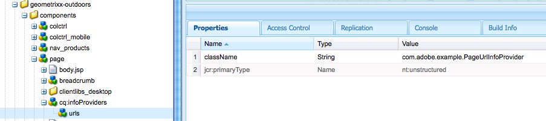

# Hämta sidinformation i JSON-format{#obtaining-page-information-in-json-format}

Om du vill hämta sidinformationen skickar du en begäran till PageInfo-servern för att hämta sidans metadata i JSON-format.

PageInfo-servern returnerar information om resurser i databasen. Servern är bunden till URL-adressen `https://<server>:<port>/libs/wcm/core/content/pageinfo.json` och använder `path` parametern för att identifiera resursen. Följande exempel-URL returnerar information om `/content/we-retail/us/en` noden:

```shell
http://localhost:4502/libs/wcm/core/content/pageinfo.json?path=/content/we-retail/us/en
```

>[!NOTE]
>
>Om du behöver sidinformation i JSON-format för att kunna leverera innehåll till kanaler som inte är traditionella AEM-webbsidor, till exempel:
>
>* Enkelsidiga program
>* Inbyggda mobilprogram
>* Andra kanaler och kontaktpunkter utanför AEM
>
>
Se dokumentet [JSON Exporter for Content Services](/help/sites-developing/json-exporter.md).

## Sidinformationsleverantörer {#page-information-providers}

Sidkomponenter kan kopplas till en eller flera `com.day.cq.wcm.api.PageInfoProvider` tjänster som genererar sidmetadata. PageInfo-servern anropar varje PageInfoProvider-tjänst och samlar in metadata:

1. HTTP-klienten skickar en begäran till PageInfo-servern, som innehåller sidans URL.
1. PageInfo-servleten upptäcker vilken komponent som återger sidan.
1. PageInfo-servern anropar varje PageInfoProvider som är associerad med komponenten.
1. Servern samlar in de metadata som varje PageInfoProvider returnerar och lägger till metadata i HTTP-svaret i ett JSON-objekt.


>[!NOTE]
>
>Precis som för PageInfoProviders använder du ListInfoProviders för att uppdatera listor med information i JSON-format. (Se [Anpassa administrationskonsolen](/help/sites-developing/customizing-siteadmin.md)för webbplatser.)

## Standardleverantörer av sidinformation {#default-page-information-providers}

Komponenten `/libs/foundation/components/page` är kopplad till följande PageInfoProvider-tjänster:

* **** Standardsidstatusprovider: Information om sidstatus, t.ex. om sidan är låst, om sidan är nyttolasten för ett aktivt arbetsflöde och vilka arbetsflöden som är tillgängliga för sidan.
* **** Provider för Live Relationship Info: Information om Multi Site Management (MSM), t.ex. om sidan är en del av en blå utskrift och om den är en Live-kopia.
* **** Språkserver för innehåll: Den aktuella sidans språk och information om varje språk som sidan finns på.
* **** Statusprovider för arbetsflöde: Statusinformation om det arbetsflöde som körs och som har sidan som nyttolast.
* **** Info-provider för arbetsflödespaket: Information om varje arbetsflödespaket som lagras i databasen och om varje paket innehåller den aktuella resursen.
* **** Emulatorinformationsprovider: Information om de emulatorer för mobila enheter som är tillgängliga för den här resursen. Om sidkomponenten inte återger mobilsidor finns inga emulatorer tillgängliga.
* **** Anteckningsinformationsprovider: Information om anteckningar som finns på sidan.

PageInfo-servern returnerar till exempel följande JSON-svar för `/content/we-retail/us/en` noden:

```
{
   "status":{
      "path":"/content/we-retail/us/en",
      "isLocked":false,
      "lockOwner":"",
      "canUnlock":false,
      "lastModified":1467202845038,
      "lastModifiedBy":"admin",
      "timeUntilValid":0,
      "onTime":0,
      "offTime":0,
      "replication":{
         "numQueued":0
      },
      "isDesignable":true,
      "isDeveloper":true
   },
   "isPage":true,
   "pageResourceType":"weretail/components/structure/page",
   "enableFragmentIdentifier":false,
   "workflow":{
      "isRunning":false
   },
   "workflows":{
      "wcm":{
         "models":[
            {
               "wid":"/etc/workflow/models/dam/adddamsize/jcr:content/model",
               "label":"Add Asset Size",
               "label_xss":"Add Asset Size"
            },
            {
               "wid":"/etc/workflow/models/ac-newsletter-workflow-simple/jcr:content/model",
               "label":"Approve for Adobe Campaign",
               "label_xss":"Approve for Adobe Campaign"
            },
            {
               "wid":"/etc/workflow/models/dam/dam-autotag-assets/jcr:content/model",
               "label":"DAM Smart Tag Assets",
               "label_xss":"DAM Smart Tag Assets"
            },
            {
               "wid":"/etc/workflow/models/dam/update_asset/jcr:content/model",
               "label":"DAM Update Asset",
               "label_xss":"DAM Update Asset"
            },
            {
               "wid":"/etc/workflow/models/cloudservices/DTM_bundle_download/jcr:content/model",
               "label":"Default DTM Bundle Download",
               "label_xss":"Default DTM Bundle Download"
            },
            {
               "wid":"/etc/workflow/models/dam/dam_download_asset/jcr:content/model",
               "label":"Download Asset",
               "label_xss":"Download Asset"
            },
            {
               "wid":"/etc/workflow/models/dam/dynamic-media-video-thumbnail-replacement/jcr:content/model",
               "label":"Dynamic Media Video Thumbnail Replacement",
               "label_xss":"Dynamic Media Video Thumbnail Replacement"
            },
            {
               "wid":"/etc/workflow/models/dam/dynamic-media-video-user-uploaded-thumbnail/jcr:content/model",
               "label":"Dynamic Media Video User Uploaded Thumbnail Process",
               "label_xss":"Dynamic Media Video User Uploaded Thumbnail Process"
            },
            {
               "wid":"/etc/workflow/models/projects/approval_workflow/jcr:content/model",
               "label":"Project Approval Workflow",
               "label_xss":"Project Approval Workflow"
            },
            {
               "wid":"/etc/workflow/models/publish_example/jcr:content/model",
               "label":"Publish Example",
               "label_xss":"Publish Example"
            },
            {
               "wid":"/etc/workflow/models/publish_to_campaign/jcr:content/model",
               "label":"Publish to Adobe Campaign",
               "label_xss":"Publish to Adobe Campaign"
            },
            {
               "wid":"/etc/workflow/models/s7dam/request_to_publish_to_youtube/jcr:content/model",
               "label":"Publish to YouTube",
               "label_xss":"Publish to YouTube"
            },
            {
               "wid":"/etc/workflow/models/projects/request_copy/jcr:content/model",
               "label":"Request Copy",
               "label_xss":"Request Copy"
            },
            {
               "wid":"/etc/workflow/models/request_for_activation/jcr:content/model",
               "label":"Request for Activation",
               "label_xss":"Request for Activation"
            },
            {
               "wid":"/etc/workflow/models/request_for_deactivation/jcr:content/model",
               "label":"Request for Deactivation",
               "label_xss":"Request for Deactivation"
            },
            {
               "wid":"/etc/workflow/models/request_for_deletion/jcr:content/model",
               "label":"Request for Deletion",
               "label_xss":"Request for Deletion"
            },
            {
               "wid":"/etc/workflow/models/request_to_complete_move_operation/jcr:content/model",
               "label":"Request to complete Move operation",
               "label_xss":"Request to complete Move operation"
            },
            {
               "wid":"/etc/workflow/models/screens-update-asset/jcr:content/model",
               "label":"Screens Update Asset",
               "label_xss":"Screens Update Asset"
            },
            {
               "wid":"/etc/workflow/models/s7dam/request_to_remove_from_youtube/jcr:content/model",
               "label":"Unpublish from YouTube",
               "label_xss":"Unpublish from YouTube"
            },
            {
               "wid":"/etc/workflow/models/wcm-translation/create_language_copy/jcr:content/model",
               "label":"WCM: Create Language Copy",
               "label_xss":"WCM: Create Language Copy"
            },
            {
               "wid":"/etc/workflow/models/wcm-translation/prepare_translation_project/jcr:content/model",
               "label":"WCM: Prepare Translation Project",
               "label_xss":"WCM: Prepare Translation Project"
            },
            {
               "wid":"/etc/workflow/models/wcm-translation/translate-i18n-dictionary/jcr:content/model",
               "label":"WCM: Prepare and Translate I18n-Dictionary",
               "label_xss":"WCM: Prepare and Translate I18n-Dictionary"
            },
            {
               "wid":"/etc/workflow/models/wcm-translation/sync_translation_job/jcr:content/model",
               "label":"WCM: Sync Translation Job",
               "label_xss":"WCM: Sync Translation Job"
            },
            {
               "wid":"/etc/workflow/models/wcm-translation/update_language_copy/jcr:content/model",
               "label":"WCM: Update Language Copy",
               "label_xss":"WCM: Update Language Copy"
            }
         ]
      },
      "translation":{
         "models":[
            {
               "wid":"/etc/workflow/models/dam/adddamsize/jcr:content/model",
               "label":"Add Asset Size",
               "label_xss":"Add Asset Size"
            },
            {
               "wid":"/etc/workflow/models/ac-newsletter-workflow-simple/jcr:content/model",
               "label":"Approve for Adobe Campaign",
               "label_xss":"Approve for Adobe Campaign"
            },
            {
               "wid":"/etc/workflow/models/dam/dam-autotag-assets/jcr:content/model",
               "label":"DAM Smart Tag Assets",
               "label_xss":"DAM Smart Tag Assets"
            },
            {
               "wid":"/etc/workflow/models/cloudservices/DTM_bundle_download/jcr:content/model",
               "label":"Default DTM Bundle Download",
               "label_xss":"Default DTM Bundle Download"
            },
            {
               "wid":"/etc/workflow/models/dam/dam_download_asset/jcr:content/model",
               "label":"Download Asset",
               "label_xss":"Download Asset"
            },
            {
               "wid":"/etc/workflow/models/dam/dynamic-media-video-thumbnail-replacement/jcr:content/model",
               "label":"Dynamic Media Video Thumbnail Replacement",
               "label_xss":"Dynamic Media Video Thumbnail Replacement"
            },
            {
               "wid":"/etc/workflow/models/dam/dynamic-media-video-user-uploaded-thumbnail/jcr:content/model",
               "label":"Dynamic Media Video User Uploaded Thumbnail Process",
               "label_xss":"Dynamic Media Video User Uploaded Thumbnail Process"
            },
            {
               "wid":"/etc/workflow/models/projects/approval_workflow/jcr:content/model",
               "label":"Project Approval Workflow",
               "label_xss":"Project Approval Workflow"
            },
            {
               "wid":"/etc/workflow/models/publish_to_campaign/jcr:content/model",
               "label":"Publish to Adobe Campaign",
               "label_xss":"Publish to Adobe Campaign"
            },
            {
               "wid":"/etc/workflow/models/s7dam/request_to_publish_to_youtube/jcr:content/model",
               "label":"Publish to YouTube",
               "label_xss":"Publish to YouTube"
            },
            {
               "wid":"/etc/workflow/models/projects/request_copy/jcr:content/model",
               "label":"Request Copy",
               "label_xss":"Request Copy"
            },
            {
               "wid":"/etc/workflow/models/request_for_deletion/jcr:content/model",
               "label":"Request for Deletion",
               "label_xss":"Request for Deletion"
            },
            {
               "wid":"/etc/workflow/models/request_to_complete_move_operation/jcr:content/model",
               "label":"Request to complete Move operation",
               "label_xss":"Request to complete Move operation"
            },
            {
               "wid":"/etc/workflow/models/screens-update-asset/jcr:content/model",
               "label":"Screens Update Asset",
               "label_xss":"Screens Update Asset"
            },
            {
               "wid":"/etc/workflow/models/translation/jcr:content/model",
               "label":"Translation Prepare",
               "label_xss":"Translation Prepare"
            },
            {
               "wid":"/etc/workflow/models/s7dam/request_to_remove_from_youtube/jcr:content/model",
               "label":"Unpublish from YouTube",
               "label_xss":"Unpublish from YouTube"
            }
         ]
      }
   },
   "translation":{

   },
   "design":{
      "path":"/conf/we-retail/settings/wcm/templates/hero-page/policies",
      "lastModified":0
   },
   "componentsRef":"/libs/wcm/core/content/components.1497341312569.json",
   "editableTemplate":"/conf/we-retail/settings/wcm/templates/hero-page",
   "msm":{
      "msm:isLiveCopy":true,
      "msm:isInBlueprint":false,
      "msm:isSource":false
   },
   "launches":{
      "isLaunch":false,
      "isInLaunch":false
   },
   "language":"en",
   "languages":{
      "rows":[
         {
            "path":"/content/we-retail/us/en",
            "exists":true,
            "hasContent":true,
            "lastModified":0,
            "iso":"en",
            "country":"gb",
            "language":"English"
         },
         {
            "path":"/content/we-retail/us/es",
            "exists":true,
            "hasContent":true,
            "lastModified":0,
            "iso":"es",
            "country":"es",
            "language":"Spanish"
         }
      ]
   },
   "workflowInfo":{
      "isRunning":false
   },
   "workflowPackageInfo":{
      "workflowPackages":[

      ],
      "selectedWorkflowPackages":[

      ],
      "runningSelectedWorkflowPackages":[

      ]
   },
   "emulators":{
      "groups":{
         "responsive":{
            "title":"Responsive Devices",
            "description":"The devices in this group are able to display a website built using responsive design patterns.",
            "path":"/etc/mobile/groups/responsive",
            "galaxy5":{
               "text":"Galaxy S5",
               "action":"start",
               "path":"/libs/wcm/mobile/components/emulators/galaxy5",
               "canRotate":true,
               "hasTouchScrolling":true,
               "contentCssPath":"/etc/mobile/groups/responsive/static.css",
               "width":1080,
               "height":1920,
               "device-pixel-ratio":3
            },
            "ipad":{
               "text":"iPad",
               "action":"start",
               "path":"/libs/wcm/mobile/components/emulators/ios/ipad",
               "canRotate":true,
               "hasTouchScrolling":true,
               "contentCssPath":"/etc/mobile/groups/responsive/static.css",
               "width":768,
               "height":1024,
               "device-pixel-ratio":1
            },
            "iphone5":{
               "text":"iPhone 5",
               "action":"start",
               "path":"/libs/wcm/mobile/components/emulators/ios/iphone5",
               "canRotate":true,
               "hasTouchScrolling":true,
               "contentCssPath":"/etc/mobile/groups/responsive/static.css",
               "width":640,
               "height":1136,
               "device-pixel-ratio":2
            },
            "iphone6":{
               "text":"iPhone 6",
               "action":"start",
               "path":"/libs/wcm/mobile/components/emulators/ios/iphone6",
               "canRotate":true,
               "hasTouchScrolling":true,
               "contentCssPath":"/etc/mobile/groups/responsive/static.css",
               "width":750,
               "height":1334,
               "device-pixel-ratio":2
            },
            "iphone4":{
               "text":"iPhone 4",
               "action":"start",
               "path":"/libs/wcm/mobile/components/emulators/ios/iphone4",
               "canRotate":true,
               "hasTouchScrolling":true,
               "contentCssPath":"/etc/mobile/groups/responsive/static.css",
               "width":640,
               "height":960,
               "device-pixel-ratio":2
            },
            "iphone6plus":{
               "text":"iPhone 6 Plus",
               "action":"start",
               "path":"/libs/wcm/mobile/components/emulators/ios/iphone6plus",
               "canRotate":true,
               "hasTouchScrolling":true,
               "contentCssPath":"/etc/mobile/groups/responsive/static.css",
               "width":1080,
               "height":1920,
               "device-pixel-ratio":2.6
            },
            "nexuss":{
               "text":"Nexus S",
               "action":"start",
               "path":"/libs/wcm/mobile/components/emulators/nexuss",
               "canRotate":true,
               "hasTouchScrolling":true,
               "contentCssPath":"/etc/mobile/groups/responsive/static.css",
               "width":320,
               "height":533,
               "device-pixel-ratio":1
            }
         }
      }
   },
   "annotations":[

   ],
   "permissions":{
      "modify":true,
      "replicate":true,
      "read":true,
      "create":true,
      "delete":true,
      "acl_read":true,
      "acl_edit":true
   },
   "isTargetable":"true",
   "responsive":{
      "breakpoints":{
         "phone":{
            "width":650,
            "title":"Smaller Screen"
         },
         "tablet":{
            "width":1200,
            "title":"Tablet"
         }
      }
   }
}
```

## Filtrerar information om arbetsflödespaket {#filtering-workflow-package-information}

Konfigurera tjänsten Dag CQ WCM Workflow Package Info Provider så att den returnerar information om endast de arbetsflödespaket som du är intresserad av. Som standard returnerar Info Provider-tjänsten för arbetsflödespaket information om alla arbetsflödespaket i databasen. Om du itererar över en delmängd av arbetsflödespaket används mindre serverresurser.

>[!NOTE]
>
>Fliken Arbetsflöde i Sidekick använder PageInfo-servern för att hämta en lista med arbetsflödespaket. I listan kan du välja det paket som den aktuella sidan ska läggas till i. De filter du skapar påverkar den här listan.


Tjänstens ID är `com.day.cq.wcm.workflow.impl.WorkflowPackageInfoProvider`. Om du vill skapa ett filter anger du ett värde för en `workflowpackageinfoprovider.filter` egenskap.

Egenskapsvärden prefixeras med tecknet + eller - följt av paketsökvägen:

* Sökvägen är sökvägen till rotnoden i arbetsflödespaketet. Sökvägen använder FileVault-syntax.
* Om du vill ta med ett paket använder du prefixet +.
* Om du vill exkludera ett paket använder du prefixet -.

Tjänsten tillämpar det kumulativa resultatet för alla filter. Följande filtervärden exkluderar till exempel alla arbetsflödespaket utom de i mappen Utgåvor:

```
-/etc/workflow/packages(/.*)?
+/etc/workflow/packages/Editions(/.&ast;)?
```

>[!NOTE]
>
>När du arbetar med AEM finns det flera metoder för att hantera konfigurationsinställningarna för sådana tjänster. Mer information finns i [Konfigurera OSGi](/help/sites-deploying/configuring-osgi.md) .

Så här konfigurerar du till exempel tjänsten med CRXDE Lite:

1. Öppna CRXDE Lite ([http://localhost:4502/crx/de](http://localhost:4502/crx/de)).
1. Skapa en nod i konfigurationsmappen för programmet:

   * Namn: `com.day.cq.wcm.workflow.impl.WorkflowPackageInfoProvider`
   * Typ: `sling:OsgiConfig`

1. Markera noden och lägg till en egenskap:

   * Namn: `workflowpackageinfoprovider.filter`
   * Typ: `String[]`
   * Värde: Sökvägen till arbetsflödespaketet med rätt format.

1. Klicka på Spara alla.

Så här konfigurerar du tjänsten i din projektkälla:

1. Leta reda på eller skapa konfigurationsmappen för ditt AEM-program i projektkällan.

   Om du t.ex. använde en flermodulsarketyp för plugin-programmet för innehållspaket Maven för att skapa ditt projekt blir mappsökvägen `<projectroot>/content/src/ for example content/src/main/content/jcr_root/apps/<appname>/config`.
1. Skapa en textfil med namnet com.day.cq.wcm.workflow.impl.WorkflowPackageInfoProvider.xml i konfigurationsmappen
1. Kopiera följande text till filen:

   ```
   <?xml version="1.0" encoding="UTF-8"?>
    <jcr:root xmlns:sling="https://sling.apache.org/jcr/sling/1.0"
    xmlns:jcr="https://www.jcp.org/jcr/1.0"
    jcr:primaryType="sling:OsgiConfig"
    workflowpackageinfoprovider.filter="[]"/>
   ```

1. I hakparenteserna (`[]`) som omger `workflowpackageinfoprovider.filter` egenskapen skriver du en kommaavgränsad lista med filtervärden som liknar följande exempel:

   `workflowpackageinfoprovider.filter="[-/etc/workflow/packages(/.*)?,+/etc/workflow/packages/Editions(/.*)?]"/>`

1. Spara filen.

## Skapa en sidinformationsleverantör {#creating-a-page-information-provider}

Skapa en anpassad tjänst för sidinformationsleverantör för att lägga till metadata som programmet enkelt kan hämta.

1. Implementera `com.day.cq.wcm.api.PageInfoProvider` gränssnittet.
1. Paketera och distribuera klassen som en OSGi-tjänst.
1. Skapa en sidkomponent i programmet. Använd `foundation/components/page` som värde för `sling:resourceSuperType` egenskapen.

1. Lägg till en nod under komponentnoden med namnet `cq:infoProviders`.
1. Under `cq:infoProviders` noden lägger du till en nod för PageInfoProvider-tjänsten. Du kan ange valfritt namn för noden.
1. Lägg till följande egenskap i PageInfoProvider-noden:

   * Namn: className
   * Typ:Sträng
   * Värde: PID för PageInfoProvider-tjänsten.

För resurser där programsidans komponent används som `sling:resourceType`standard returnerar PageInfo-servleten de anpassade PageInfoProvider-metadatan förutom standardmetadatan för PageInfoProvider.

### Exempel på implementering av PageInfoProvider {#example-pageinfoprovider-implementation}

Följande Java-klass implementerar [PageInfoProvider](https://helpx.adobe.com/experience-manager/6-5/sites/developing/using/reference-materials/javadoc/index.html) och returnerar den publicerade URL:en för den aktuella sidresursen.

```java
package com.adobe.example;

import org.apache.felix.scr.annotations.Component;
import org.apache.felix.scr.annotations.Properties;
import org.apache.felix.scr.annotations.Property;
import org.apache.felix.scr.annotations.ReferenceCardinality;
import org.apache.felix.scr.annotations.Service;
import org.apache.felix.scr.annotations.Reference;

import org.apache.sling.api.SlingHttpServletRequest;
import org.apache.sling.api.resource.Resource;
import org.apache.sling.api.resource.ResourceResolver;

import org.apache.sling.commons.json.JSONException;
import org.apache.sling.commons.json.JSONObject;

import com.day.cq.wcm.api.Page;
import com.day.cq.wcm.api.PageInfoProvider;

@Component(metatype = false)
@Properties({
 @Property(name="service.description", value="Returns the public URL of a resource.")
})
@Service
public class PageUrlInfoProvider implements PageInfoProvider {

 @Reference(cardinality = ReferenceCardinality.OPTIONAL_UNARY)
 private com.day.cq.commons.Externalizer externalizer;

 private String fetchExternalUrl(ResourceResolver rr, String path) {
  return externalizer.publishLink(rr, path);
 }

 public void updatePageInfo(SlingHttpServletRequest request, JSONObject info, Resource resource)
   throws JSONException {

  Page page = resource.adaptTo(Page.class);
  JSONObject urlinfo = new JSONObject();
  urlinfo.put("publishURL", fetchExternalUrl(null,page.getPath()));
  info.put("URLs",urlinfo);
 }
}
```

I följande exempel i CRXDE Lite visas den sidkomponent som är konfigurerad att använda tjänsten PageUrlInfoProvider:



Tjänsten PageUrlInfoProvider returnerar följande data för `/content/we-retail/us/en` noden:

```xml
"URLs": {
    "publishURL": "http://localhost:4503/content/we-retail/us/en"
}
```

