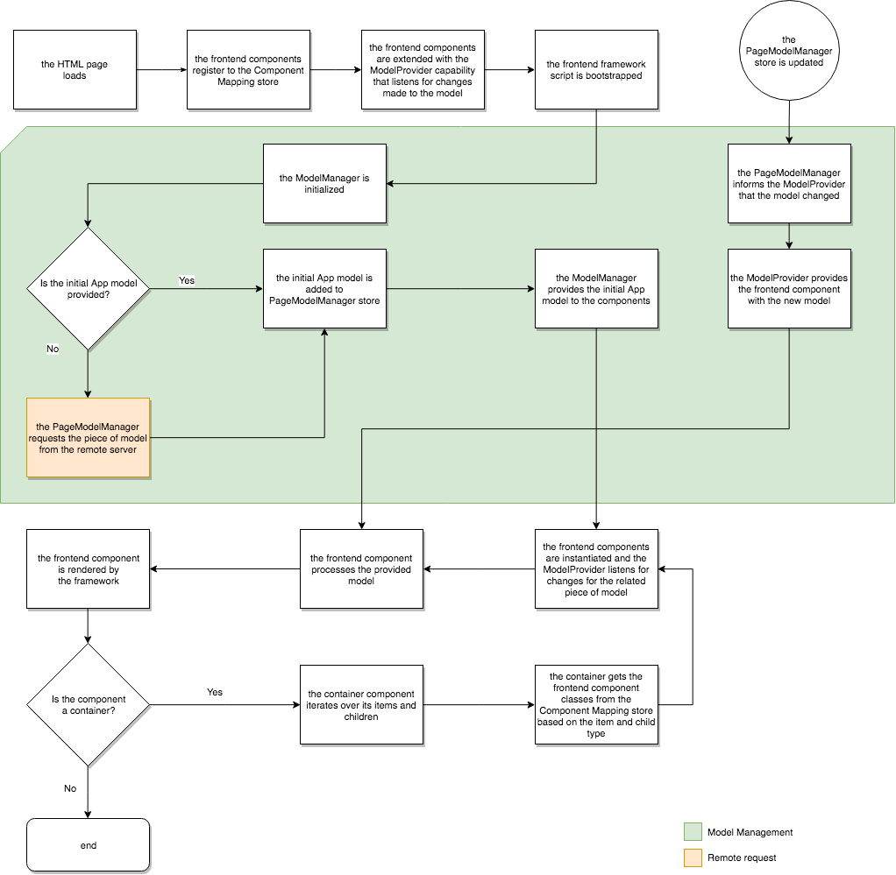

# Dynamisk mappning av modell till komponent för SPA{#dynamic-model-to-component-mapping-for-spas}

I det här dokumentet beskrivs hur den dynamiska mappningen av modell till komponent sker i Javascript SPA SDK för AEM.

>[!NOTE]
>
>SPA-redigeraren är den rekommenderade lösningen för projekt som kräver SPA-ramverksbaserad rendering på klientsidan (t.ex. React eller Angular).

## ComponentMapping-modul {#componentmapping-module}

Modulen `ComponentMapping` tillhandahålls som ett NPM-paket till frontendprojektet. Det lagrar komponenter för användargränssnitt och erbjuder ett sätt för Single Page Application att mappa komponenter för användargränssnitt till AEM-resurstyper. Detta aktiverar en dynamisk upplösning för komponenter när JSON-modellen för programmet analyseras.

Varje objekt i modellen innehåller ett `:type` fält som visar en AEM-resurstyp. När den är monterad kan den främre komponenten återge sig själv med det fragment av modellen som den har fått från de underliggande biblioteken.

Mer information om modellparsning och åtkomst för komponenter i gränssnittet finns i [SPA](/help/sites-developing/spa-blueprint.md) -utkast-dokumentet.

Se även npm-paketet: [https://www.npmjs.com/package/@adobe/cq-spa-component-mapping](https://www.npmjs.com/package/@adobe/cq-spa-component-mapping)

## Modellstyrt Single Page-program {#model-driven-single-page-application}

Single Page-program som utnyttjar Javascript SPA SDK för AEM är modelldrivna:

1. Front-end-komponenter registrerar sig själva för [Component Mapping Store](/help/sites-developing/spa-dynamic-model-to-component-mapping.md#componentmapping-module).
1. När [behållaren](/help/sites-developing/spa-blueprint.md#container)har levererats med en modell av [modellprovidern](/help/sites-developing/spa-blueprint.md#the-model-provider)itererar den sedan över sitt modellinnehåll ( `:items`).

1. För en sida hämtar dess underordnade ( `:children`) först en komponentklass från [komponentmappningen](/help/sites-developing/spa-blueprint.md#componentmapping) och instansierar den sedan.

## Programinitiering {#app-initialization}

Varje komponent utökas med funktionerna i [`ModelProvider`](/help/sites-developing/spa-blueprint.md#the-model-provider). Initieringen har därför följande allmänna form:

1. Varje modellprovider initierar sig själv och lyssnar efter ändringar som gjorts i den del av modellen som motsvarar dess inre komponent.
1. Initieringen [ `PageModelManager`](/help/sites-developing/spa-blueprint.md#pagemodelmanager) måste initieras så som den representeras av [initieringsflödet](/help/sites-developing/spa-blueprint.md).

1. När sidmodellhanteraren har lagrats returnerar den hela appmodellen.
1. Den här modellen skickas sedan till [rotbehållarkomponenten](/help/sites-developing/spa-blueprint.md#container) i början av programmet.
1. Delar av modellen sprids slutligen till varje enskild underordnad komponent.

