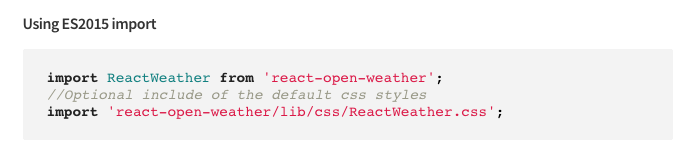

# Implementera en React Component for SPA{#implementing-a-react-component-for-spa}

Single page applications (SPAs) can offer compelling experiences for website users. Utvecklare vill kunna skapa webbplatser med SPA-ramverk och författare vill smidigt redigera innehåll i Adobe Experience Manager (AEM) för en webbplats som byggts med SPA-ramverk.

SPA-funktionen är en omfattande lösning för SPA-program i AEM. I den här artikeln finns ett exempel på hur du anpassar en enkel, befintlig React-komponent till AEM SPA Editor.

{{ue-over-spa}}

## Introduktion {#introduction}

Tack vare det enkla och lätta avtal som AEM kräver och som upprättas mellan SPA och SPA Editor är det enkelt att ta ett befintligt JavaScript-program och anpassa det för användning med SPA i AEM.

I den här artikeln visas exemplet på väderkomponenten i exemplet SPA för Web.Retail Journal.

Du bör känna till [strukturen för ett SPA-program för AEM](/help/sites-developing/spa-getting-started-react.md) innan du läser den här artikeln.

>[!CAUTION]
>Det här dokumentet använder appen [We.Retail Journal](https://github.com/adobe/aem-sample-we-retail-journal) endast i demonstrationssyfte. Använd den inte för något projektarbete.
>
>Alla AEM-projekt ska använda [AEM Project Archetype](https://experienceleague.adobe.com/docs/experience-manager-core-components/using/developing/archetype/overview.html?lang=sv-SE), som har stöd för SPA-projekt med React eller Angular och som använder SPA SDK.

## Väderkomponenten {#the-weather-component}

väderkomponenten finns i det övre vänstra hörnet i appen We.Retail Journal. Den visar det aktuella vädret på en angiven plats och drar in väderdata dynamiskt.

### Använda Widgeten Väder {#using-the-weather-widget}


När du redigerar innehåll i SPA i SPA-redigeraren visas väderkomponenten som vilken annan AEM-komponent som helst, komplett med ett verktygsfält, och kan redigeras.


Staden kan uppdateras i en dialog precis som andra AEM-komponenter.


Ändringen kvarstår och komponenten uppdateras automatiskt med nya väderdata.


### Implementering av väderkomponent {#weather-component-implementation}

väderkomponenten baseras på en allmänt tillgänglig React-komponent som kallas [React Open Weather](https://www.npmjs.com/package/react-open-weather). Den har anpassats för att fungera som en komponent i exempelprogrammet för Web.Retail Journal.

Nedan följer NPM-dokumentation om hur komponenten React Open Weather används.

 

Granska koden för den anpassade väderkomponenten ( `Weather.js`) i programmet We.Retail Journal:

* **Rad 16**: Widgeten React Open Weather läses in efter behov.
* **Rad 46**: Funktionen `MapTo` relaterar den här React-komponenten till en motsvarande AEM-komponent så att den kan redigeras i SPA-redigeraren.

* **Rader 22-29**: `EditConfig` definieras, kontrollerar om staden har fyllts i och definierar värdet om den är tom.

* **Rader 31-44**: Weather-komponenten utökar klassen `Component` och tillhandahåller nödvändiga data enligt NPM-användningsdokumentationen för komponenten React Open Weather och återger komponenten.

```javascript
/*~~~~~~~~~~~~~~~~~~~~~~~~~~~~~~~~~~~~~~~~~~~~~~~~~~~~~~~~~~~~~~~~~~~~~~~~~~~~~~
 ~ Copyright 2018 Adobe Systems Incorporated
 ~
 ~ Licensed under the Apache License, Version 2.0 (the "License");
 ~ you may not use this file except in compliance with the License.
 ~ You may obtain a copy of the License at
 ~
 ~     https://www.apache.org/licenses/LICENSE-2.0
 ~
 ~ Unless required by applicable law or agreed to in writing, software
 ~ distributed under the License is distributed on an "AS IS" BASIS,
 ~ WITHOUT WARRANTIES OR CONDITIONS OF ANY KIND, either express or implied.
 ~ See the License for the specific language governing permissions and
 ~ limitations under the License.
 ~~~~~~~~~~~~~~~~~~~~~~~~~~~~~~~~~~~~~~~~~~~~~~~~~~~~~~~~~~~~~~~~~~~~~~~~~~~~~*/
import React, {Component} from 'react';
import ReactWeather from 'react-open-weather';
import {MapTo} from '@adobe/aem-react-editable-components';

require('./Weather.css');

const WeatherEditConfig = {

    emptyLabel: 'Weather',

    isEmpty: function() {
        return !this.props || !this.props.cq_model || !this.props.cq_model.city || this.props.cq_model.city.trim().length < 1;
    }
};

class Weather extends Component {

    render() {
        let apiKey = "12345678901234567890";
        let city;

        if (this.props.cq_model) {
            city = this.props.cq_model.city;
            return <ReactWeather key={'react-weather' + Date.now()} forecast="today" apikey={apiKey} type="city" city={city} />
        }

        return null;
    }
}

MapTo('we-retail-journal/global/components/weather')(Weather, WeatherEditConfig);
```

Även om det redan finns en backend-komponent kan frontendutvecklaren använda React Open Weather-komponenten i Web.Retail Journal SPA med lite kodning.

## Nästa steg {#next-step}

Mer information om hur du utvecklar SPA för AEM finns i artikeln [Utveckla SPA för AEM](/help/sites-developing/spa-architecture.md).
