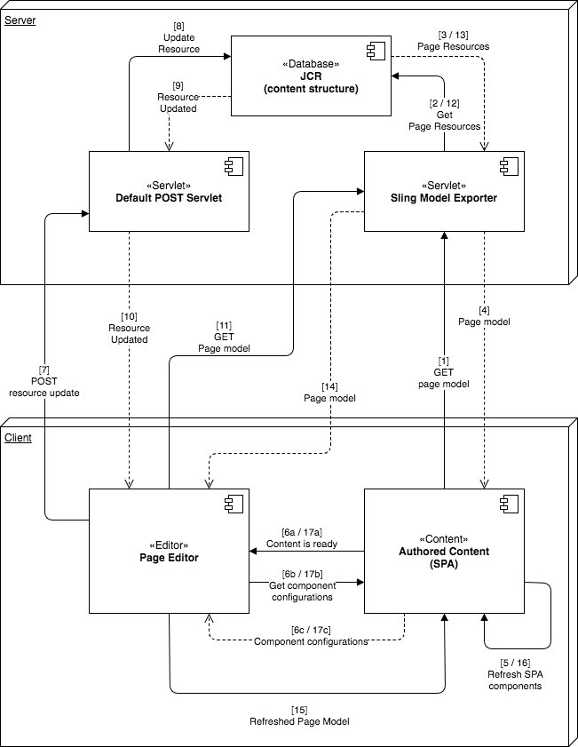
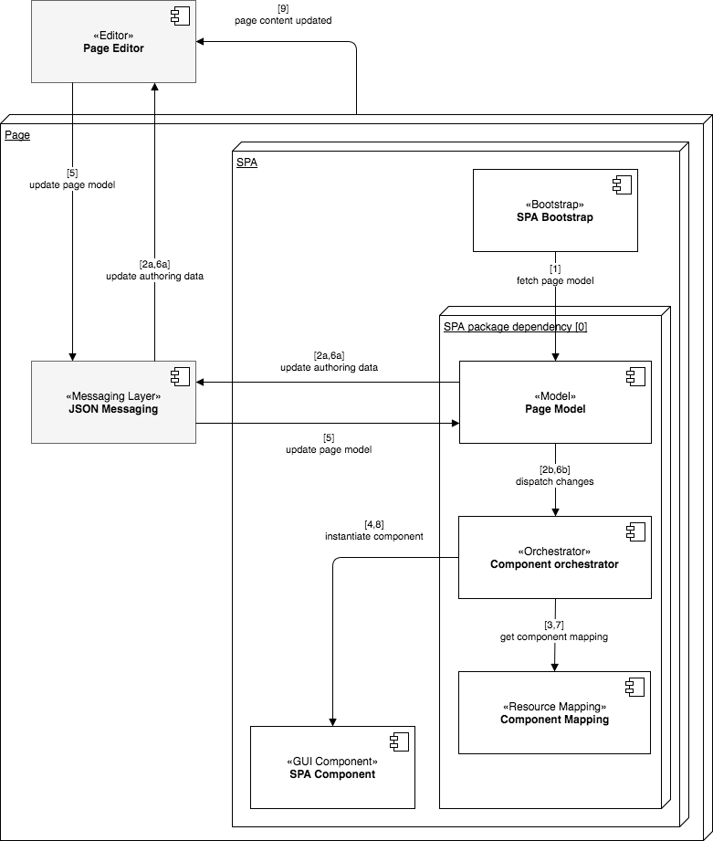

# SPA Editor - översikt{#spa-editor-overview}

Single page applications (SPAs) can offer compelling experiences for website users. Utvecklare vill kunna bygga webbplatser med SPA-ramverk och författare vill smidigt redigera innehåll i AEM för en webbplats som skapats med sådana ramverk.

SPA-redigeraren är en omfattande lösning för stöd av SPA-program i AEM. Den här sidan ger en översikt över hur stöd för SPA är strukturerat i AEM, hur SPA-redigeraren fungerar och hur SPA-ramverket och AEM synkroniseras.

>[!NOTE]
>
>SPA-redigeraren är den rekommenderade lösningen för projekt som kräver SPA-ramverksbaserad rendering på klientsidan (t.ex. React eller Angular).

## Introduktion {#introduction}

Webbplatser som byggts med vanliga SPA-ramverk som React och Angular läser in sitt innehåll via dynamisk JSON och tillhandahåller inte den HTML-struktur som krävs för att AEM Page Editor ska kunna placera redigeringskontroller.

För att göra det möjligt att redigera SPA i AEM krävs en mappning mellan JSON-utdata för SPA och innehållsmodellen i AEM-databasen för att spara ändringar i innehållet.

Stöd för SPA i AEM introducerar ett tunt JS-lager som interagerar med SPA JS-koden när den läses in i sidredigeraren, som händelser kan skickas med och platsen för redigeringskontrollerna kan aktiveras för redigering i sitt sammanhang. Den här funktionen bygger på API-slutpunktskonceptet för innehållstjänster eftersom innehållet från SPA måste läsas in via innehållstjänster.

Mer information om SPA i AEM finns i följande dokument:

* [SPA Blueprint](/help/sites-developing/spa-blueprint.md) för de tekniska kraven för ett SPA
* [Getting Started with SPAs in AEM](/help/sites-developing/spa-getting-started-react.md) for a quick tour of a simple SPA

## Design {#design}

Sidkomponenten för en SPA tillhandahåller inte HTML-elementen för dess underordnade komponenter via JSP- eller HTML-filen. Den här åtgärden har delegerats till SPA-ramverket. Representationen av underordnade komponenter eller modeller hämtas som en JSON-datastruktur från JCR. SPA-komponenterna läggs sedan till på sidan enligt den strukturen. Det här beteendet skiljer sidkomponentens ursprungliga brödkomposition från icke-SPA-motsvarigheter.

### Sidmodellshantering {#page-model-management}

Upplösningen och hanteringen av sidmodellen delegeras till ett angivet `PageModel` bibliotek. SPA måste använda sidmodellbiblioteket för att kunna initieras och redigeras av SPA-redigeraren. Sidmodellbiblioteket som indirekt tillhandahålls till AEM Page-komponenten via `cq-react-editable-components` npm. Sidmodellen är en tolk mellan AEM och SPA och måste därför alltid finnas. När sidan har skapats `cq.authoring.pagemodel.messaging` måste ytterligare ett bibliotek läggas till för att kommunikationen med sidredigeraren ska kunna aktiveras.

Om SPA-sidkomponenten ärver från sidhuvudkomponenten finns det två alternativ för att göra klientbibliotekskategorin tillgänglig: `cq.authoring.pagemodel.messaging`

* Om mallen är redigerbar lägger du till den i sidprincipen.
* Eller lägg till kategorierna med hjälp av `customfooterlibs.html`.

För varje resurs i den exporterade modellen kommer SPA att mappa en faktisk komponent som utför återgivningen. Modellen, som representeras som JSON, återges sedan med komponentmappningarna i en behållare.

>[!CAUTION]
>
>Inkluderingen av `cq.authoring.pagemodel.messaging` kategorin bör begränsas till SPA-redigeraren.

### Kommunikationsdatatyp {#communication-data-type}

När `cq.authoring.pagemodel.messaging` kategorin läggs till på sidan skickas ett meddelande till sidredigeraren för att fastställa JSON-kommunikationens datatyp. När kommunikationsdatatypen är JSON, kommunicerar GET-förfrågningarna med Sling Model-slutpunkterna för en komponent. När en uppdatering har gjorts i sidredigeraren skickas JSON-representationen av den uppdaterade komponenten till sidmodellsbiblioteket. Sidmodellbiblioteket informerar sedan SPA om uppdateringar.

## Arbetsflöde {#workflow}

Du kan förstå hur interaktionen mellan SPA och AEM ser ut genom att tänka på SPA-redigeraren som en medlare mellan de båda.

* Kommunikationen mellan sidredigeraren och SPA görs med JSON i stället för HTML.
* Sidredigeraren tillhandahåller den senaste versionen av sidmodellen till SPA via API:t för iframe och meddelanden.
* Sidmodellhanteraren meddelar redigeraren att den är klar för utgåva och skickar sidmodellen som en JSON-struktur.
* Redigeraren ändrar inte eller har inte ens åtkomst till DOM-strukturen för sidan som författas, utan tillhandahåller den senaste sidmodellen.

### Grundläggande arbetsflöde för SPA-redigeraren {#basic-spa-editor-workflow}

Med tanke på de viktigaste elementen i SPA-redigeraren ser det högnivåarbetsflödet för redigering av en SPA i AEM ut åt författaren enligt följande.

1. SPA Editor läses in.
1. SPA läses in i en separat bildruta.
1. SPA begär JSON-innehåll och återger komponenter på klientsidan.
1. SPA Editor identifierar återgivna komponenter och skapar övertäckningar.
1. Författaren klickar på övertäckningen och visar komponentens redigeringsverktygsfält.
1. SPA Editor består av redigeringar med en POST-begäran till servern.
1. SPA Editor begär uppdaterad JSON till SPA Editor, som skickas till SPA med en DOM-händelse.
1. SPA återger den berörda komponenten och uppdaterar dess DOM.

>[!NOTE]
>
>Kom ihåg:
>
>* Det är alltid SPA som ansvarar för visningen.
>* SPA-redigeraren är isolerad från själva SPA-programmet.
>* I produktion (publicering) läses SPA-redigeraren aldrig in.
>

### Sidredigeringsarbetsflöde för klient-server {#client-server-page-editing-workflow}

Detta är en mer detaljerad översikt över klient-server-interaktionen när du redigerar en SPA.

1. SPA initierar sig själv och begär sidmodellen från Sling Model Exporter.
1. Sling Model Exporter begär de resurser som utgör sidan från databasen.
1. Databasen returnerar resurserna.
1. Sling Model Exporter returnerar sidans modell.
1. SPA instansierar sina komponenter baserat på sidmodellen.
1. **6a** Innehållet informerar redigeraren om att det är klart för redigering.

   **6b** Sidredigeraren begär komponentens redigeringskonfigurationer.

   **6c** Sidredigeraren tar emot komponentkonfigurationerna.
1. När författaren redigerar en komponent skickar sidredigeraren en ändringsbegäran till standardservern för POST.
1. Resursen uppdateras i databasen.
1. Den uppdaterade resursen tillhandahålls POST-servern.
1. Standardservern för POST informerar sidredigeraren om att resursen har uppdaterats.
1. Sidredigeraren begär den nya sidmodellen.
1. Resurserna som utgör sidan begärs från databasen.
1. Resurserna som utgör sidan tillhandahålls av databasen till Sling Model Exporter.
1. Den uppdaterade sidmodellen returneras till redigeraren.
1. Sidredigeraren uppdaterar sidmodellreferensen för SPA.
1. SPA uppdaterar sina komponenter baserat på den nya sidmodellreferensen.
1. Komponentkonfigurationerna för sidredigerarna uppdateras.

   **17a** SPA signalerar till sidredigeraren att innehållet är klart.

   **17b** Sidredigeraren förser SPA med komponentkonfigurationer.

   **17c** SPA tillhandahåller uppdaterade komponentkonfigurationer.

### Redigeringsarbetsflöde {#authoring-workflow}

Det här är en mer detaljerad översikt som fokuserar på redigeringsupplevelsen.

1. SPA hämtar sidmodellen.
1. **2a** Sidmodellen förser redigeraren med de data som krävs för att skapa.

   **2b** När det meddelas uppdaterar komponentens orchestrator sidans innehållsstruktur.
1. Komponentkoordinatorn efterfrågar mappningen mellan en AEM-resurstyp och en SPA-komponent.
1. Komponentkoordinatorn instansierar dynamiskt SPA-komponenten baserat på sidmodellen och komponentmappningen.
1. Sidredigeraren uppdaterar sidmodellen.
1. **6a** Sidmodellen innehåller uppdaterade redigeringsdata för sidredigeraren.

   **6b** Sidmodellen skickar ändringar till komponenten orchestrator.
1. Komponentkoordinatorn hämtar komponentmappningen.
1. Komponentkoordinatorn uppdaterar sidans innehåll.
1. När SPA-filen har uppdaterat innehållet på sidan läses redigeraren in i redigeringsmiljön.

## Krav och begränsningar {#requirements-limitations}

Om du vill att författaren ska kunna använda sidredigeraren för att redigera innehållet i ett SPA-avtal måste ditt SPA-program implementeras för att kunna interagera med AEM SPA Editor SDK. Se [Komma igång med SPA:er i AEM](/help/sites-developing/spa-getting-started-react.md) -dokumentet för att se om du behöver veta hur du kommer igång.

### Ramverk som stöds {#supported-frameworks}

SPA Editor SDK har stöd för följande minimiversioner:

* Reaktion 16.3
* Vinkel 6.x

Tidigare versioner av dessa ramverk kan fungera med AEM SPA Editor SDK, men stöds inte.

### Ytterligare ramar {#additional-frameworks}

Ytterligare SPA-ramverk kan implementeras för att fungera med AEM SPA Editor SDK. I [SPA-designdokumentet](/help/sites-developing/spa-blueprint.md) finns information om vilka krav ett ramverk måste uppfylla för att kunna skapa ett ramverksspecifikt lager som består av moduler, komponenter och tjänster som ska fungera med AEM SPA-redigeraren.

### Begränsningar {#limitations}

AEM SPA Editor SDK introducerades med AEM 6.4 Service Pack 2. Det stöds fullt ut av Adobe, och som en ny funktion fortsätter den att förbättras och utökas. Följande AEM-funktioner stöds ännu inte av SPA-redigeraren:

* Målläge
* ContextHub
* Redigering av infogad bild
* Redigera konfigurationer (t.ex. avlyssnare)
* Formatsystem
* Ångra/Gör om
* Sidskillnader och tidsförvrängning
* Funktioner som utför HTML-omskrivning på serversidan, t.ex. Länkkontroll, CDN-omskrivartjänst, URL-förkortning etc.
* Utvecklarläge
* AEM Launches
