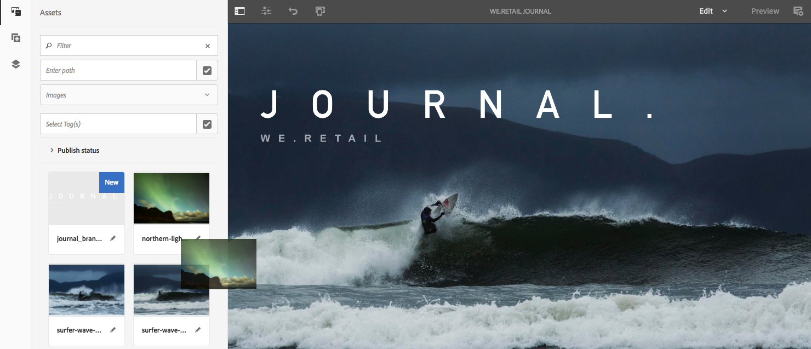
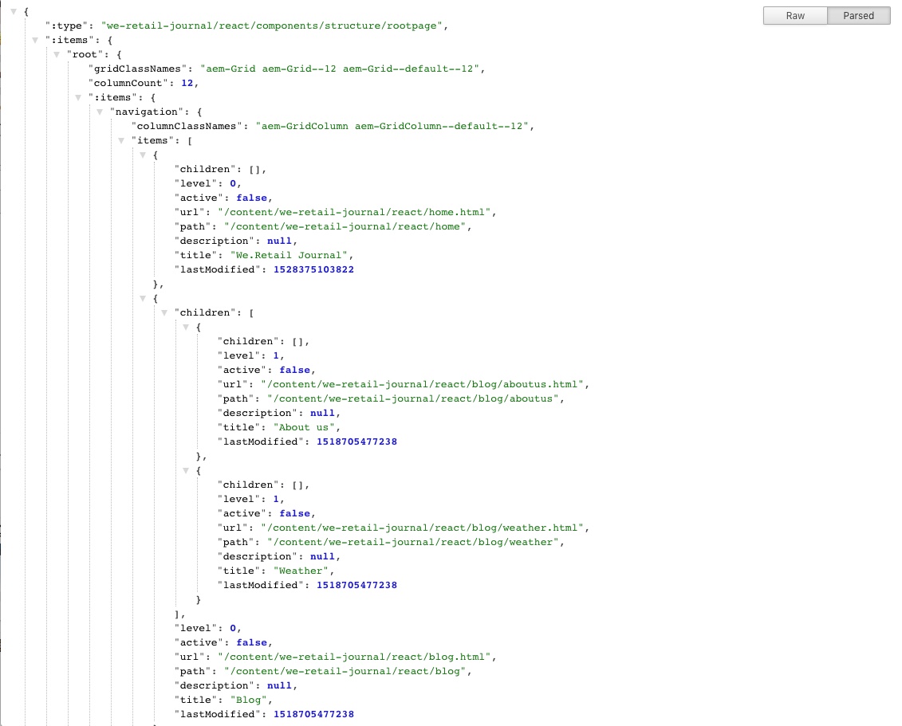

# Introduktion och genomgång av SPA{#spa-introduction-and-walkthrough}

Single page applications (SPAs) can offer compelling experiences for website users. Utvecklare vill kunna bygga webbplatser med SPA-ramverk och författare vill smidigt redigera innehåll i AEM för en webbplats som skapats med sådana ramverk.

SPA-redigeraren är en omfattande lösning för stöd av SPA-program i AEM. I den här artikeln går vi igenom hur du använder ett grundläggande SPA-program för att skapa och visar hur det är relaterat till den underliggande AEM SPA-redigeraren.

>[!NOTE]
>
>SPA-redigeraren är den rekommenderade lösningen för projekt som kräver SPA-ramverksbaserad rendering på klientsidan (t.ex. React eller Angular).

## Introduktion {#introduction}

### Artikelsyfte {#article-objective}

I den här artikeln beskrivs de grundläggande begreppen för SPA-program innan du leder läsaren genom en genomgång av SPA-redigeraren genom att använda ett enkelt SPA-program för att demonstrera grundläggande innehållsredigering. Sedan går det ned på hur sidan byggs och hur SPA-programmet relaterar till och interagerar med AEM SPA-redigeraren.

Målet med den här introduktionen och genomgången är att visa för en AEM-utvecklare varför SPA är relevanta, hur de i allmänhet fungerar, hur en SPA hanteras av AEM SPA Editor och hur det skiljer sig från en vanlig AEM-applikation.

Genomgången baseras på standardfunktioner för AEM och exempelappen We.Retail Journal. Följande krav måste vara uppfyllda:

* [AEM version 6.4 med Service Pack 2 eller senare
   ](/help/release-notes/sp-release-notes.md)
* [Installera exempelappen We.Retail Journal som finns på GitHub här.](https://github.com/Adobe-Marketing-Cloud/aem-sample-we-retail-journal)

### Vad är en SPA? {#what-is-a-spa}

Ett enkelsidigt program (SPA) skiljer sig från en konventionell sida genom att det återges på klientsidan och i huvudsak är Javascript-drivet, eftersom Ajax anropar för att läsa in data och dynamiskt uppdatera sidan. Det mesta eller allt innehåll hämtas en gång på en sida, och ytterligare resurser läses in asynkront efter behov baserat på användarinteraktionen med sidan.

Detta minskar behovet av siduppdatering och ger användaren en upplevelse som är smidig, snabb och som känns mer som en appupplevelse.

Med AEM SPA Editor kan gränssnittsutvecklare skapa SPA som kan integreras i en AEM-webbplats, vilket gör att innehållsförfattarna kan redigera SPA-innehållet lika enkelt som annat AEM-innehåll.

### Varför en SPA? {#why-a-spa}

Genom att vara snabbare, smidigare och mer som ett systemspecifikt program blir en SPA en mycket attraktiv upplevelse inte bara för besökaren på webbsidan, utan även för marknadsförare och utvecklare på grund av hur SPA fungerar.


**Besökare**

* Besökarna vill ha upplevelser som påminner om varandra när de interagerar med innehållet.
* Det finns tydliga data om att ju snabbare en sida är, desto troligare blir konverteringen.

**Marknadsförare**

* Marknadsförarna vill erbjuda innehållsrika, verklighetstrogna upplevelser som lockar besökarna att engagera sig fullt ut i innehållet.
* Personalisering kan göra dessa upplevelser ännu mer övertygande.

**Utvecklare**

* Utvecklarna vill att det ska finnas tydliga skillnader mellan innehåll och presentation.
* Ren separation gör systemet mer utbyggbart samt möjliggör oberoende framend-utveckling.

### Hur fungerar en SPA? {#how-does-a-spa-work}

Den främsta idén bakom ett SPA är att anrop och beroende av en server minskas för att minimera fördröjningar som orsakas av serveranrop så att SPA närmar sig svarstiden för ett systemspecifikt program.

På en traditionell, sekventiell webbsida läses bara de data som behövs för den omedelbara sidan in. Det innebär att när besökaren flyttar till en annan sida anropas servern för de extra resurserna. Ytterligare anrop kan behövas eftersom besökaren interagerar med element på sidan. Dessa anrop kan ge en känsla av fördröjning eller fördröjning eftersom sidan måste hinna ifatt besökarens önskemål.


För en smidigare upplevelse, som närmar sig vad en besökare förväntar sig av mobilappar, inbyggda appar, läser en SPA in alla nödvändiga data för besökaren vid den första inläsningen. Detta kan ta lite längre tid i början, men eliminerar sedan behovet av ytterligare serveranrop.

Genom att återge på klientsidan reagerar sidelementet snabbare och besökarens interaktion med sidan är omedelbar. Ytterligare data som kan behövas anropas asynkront för att maximera sidans hastighet.

>[!NOTE]
>
>Teknisk information om hur SPA fungerar i AEM finns i artikeln [Komma igång med SPA i AEM](/help/sites-developing/spa-getting-started-react.md).
>
>Mer information om design, arkitektur och tekniska arbetsflöden i SPA-redigeraren finns i artikeln [SPA-redigeraren - översikt](/help/sites-developing/spa-overview.md).

## Innehållsredigering med SPA {#content-editing-experience-with-spa}

När en SPA byggs för att utnyttja AEM SPA-redigeraren märker innehållsförfattaren ingen skillnad när innehållet redigeras och skapas. Vanliga AEM-funktioner är tillgängliga och inga ändringar i författarens arbetsflöde krävs.

>[!NOTE]
>
>Genomgången baseras på standardfunktioner för AEM och exempelappen We.Retail Journal. Följande krav måste vara uppfyllda:
>
>* [AEM version 6.4 med Service Pack 2](/help/release-notes/sp-release-notes.md)
>* [Installera exempelappen We.Retail Journal som finns på GitHub här.](https://github.com/Adobe-Marketing-Cloud/aem-sample-we-retail-journal)
>


1. Redigera appen We.Retail Journal i AEM.

   `https://localhost:4502/editor.html/content/we-retail-journal/react.html`

   

1. Markera en rubrikkomponent och lägg märke till att ett verktygsfält ser ut som en annan komponent. Välj **Redigera**.

   

1. Redigera innehållet som vanligt i AEM och notera att ändringarna bevaras.

   

1. Använd Resursläsaren för att dra och släppa en ny bild i en bildkomponent.

   

1. Ändringen är beständig.

   

Ytterligare redigeringsverktyg som att dra och släppa ytterligare komponenter på sidan, ordna om komponenter och ändra layouten stöds som i andra program än SPA.

>[!NOTE]
>
>SPA-redigeraren ändrar inte programmets DOM. Själva SPA är ansvarig för DOM.
>
>Om du vill se hur det fungerar går du vidare till nästa avsnitt i den här artikeln [SPA-appar och AEM SPA-redigeraren](/help/sites-developing/spa-walkthrough.md#spa-apps-and-the-aem-spa-editor).

## SPA-appar och AEM SPA-redigeraren {#spa-apps-and-the-aem-spa-editor}

Att se hur en SPA fungerar för slutanvändaren och sedan inspektera SPA-sidan hjälper till att bättre förstå hur en SAP-app fungerar med SPA-redigeraren i AEM.

### Använda ett SPA-program {#using-an-spa-application}

1. Läs in programmet We.Retail Journal på publiceringsservern eller med alternativet **View as Published** (Visa som publicerad **) på menyn** Page Information(Sidinformation) i sidredigeraren.

   `/content/we-retail-journal/react.html`

   

   Lägg märke till sidstrukturen, inklusive navigering till underordnade sidor, väderwidget och artiklar.

1. Navigera till en underordnad sida via menyn och se att sidan läses in omedelbart utan att behöva uppdateras.

   

1. Öppna webbläsarens inbyggda utvecklarverktyg och övervaka nätverksaktiviteten när du navigerar bland de underordnade sidorna.

   

   Trafiken är mycket liten när du går från sida till sida i appen. Sidan läses inte in igen och endast de nya bilderna efterfrågas.

   SPA hanterar innehållet och routningen enbart på klientsidan.

Så om sidan inte läses in igen när du navigerar genom de underordnade sidorna, hur läses den in?

I nästa avsnitt, [Läsa in ett SPA-program](/help/sites-developing/spa-walkthrough.md#loading-an-spa-application), beskrivs hur du läser in SPA-filen och hur innehåll kan läsas in synkront och asynkront.

### Läsa in ett SPA-program {#loading-an-spa-application}

1. Om den inte redan är inläst läser du in programmet We.Retail Journal på publiceringsservern eller med alternativet **Visa som publicerad** på menyn **Sidinformation** i sidredigeraren.

   `/content/we-retail-journal/react.html`

   

1. Använd det inbyggda verktyget i webbläsaren för att visa sidans källa.
1. Observera att källans innehåll är extremt begränsat.

   ```
   <!DOCTYPE HTML>
   <html lang="en-CH">
       <head>
       <meta charset="UTF-8">
       <title>We.Retail Journal</title>
   
       <meta name="template" content="we-retail-react-template"/>
   
   <link rel="stylesheet" href="/etc.clientlibs/we-retail-journal/react/clientlibs/we-retail-journal-react.css" type="text/css">
   
   <link rel="stylesheet" href="/libs/wcm/foundation/components/page/responsive.css" type="text/css">
   
   </head>
       <body class="page basicpage">
   
   <div id="page"></div>
   
   <script type="text/javascript" src="/etc.clientlibs/we-retail-journal/react/clientlibs/we-retail-journal-react.js"></script>
   
       </body>
   </html>
   ```

   Sidan har inget innehåll i sin brödtext. Den består huvudsakligen av formatmallar och ett anrop till ett React-skript `we-retail-journal-react.js`.

   Det här React-skriptet är den primära drivrutinen för det här programmet och ansvarar för återgivningen av allt innehåll.

1. Använd webbläsarens inbyggda verktyg för att inspektera sidan. Se innehållet i DOM som är fullständigt inläst.

   

1. Växla till fliken Nätverk i panelen Granska och läs in sidan igen.

   Observera att de primära resurser som har lästs in för sidan är själva sidan, CSS, React Javascript, dess beroenden samt JSON-data för sidan.

   

1. Läs in `react.model.json` i en ny flik.

   `/content/we-retail-journal/react.model.json`

   

   AEM SPA Editor använder [AEM Content Services](/help/assets/content-fragments.md) för att leverera hela sidans innehåll som en JSON-modell.

   Genom att implementera specifika gränssnitt tillhandahåller Sling Models den information som krävs för SPA. Leveransen av JSON-data delegeras nedåt till varje komponent (från sida, stycke, komponent osv.).

   Varje komponent väljer vad den visar och hur den återges (på serversidan med HTML eller på klientsidan med React). Naturligtvis fokuserar den här artikeln på klientåtergivning med React.

1. Modellen kan också gruppera sidor så att de läses in synkront, vilket minskar antalet sidomladdningar som behövs.

   I exemplet med We.Retail Journal läses sidorna `home`, `blog`och `aboutus` in synkront eftersom besökare vanligtvis besöker alla dessa sidor. Sidan läses dock in asynkront eftersom det är mindre troligt att besökarna kommer att besöka den. `weather`

   Detta beteende är inte obligatoriskt och är helt definierbart.

   

1. Om du vill visa den här skillnaden i beteende läser du in sidan igen och rensar nätverksaktiviteten för inspektören. Navigera till bloggen och till sidorna på sidan och se att ingen nätverksaktivitet har rapporterats.

   Navigera till vädersidan och se att den `weather.model.json` anropas asynkront.

   

### Interaktion med SPA-redigeraren {#interaction-with-the-spa-editor}

Med exempelprogrammet We.Retail Journal är det tydligt hur appen beter sig och läses in när den publiceras, och utnyttjar innehållstjänster för JSON-innehållsleverans samt asynkron inläsning av resurser.

Dessutom är det smidigt för innehållsförfattaren att skapa innehåll med en SPA-redigerare i AEM.

I följande avsnitt utforskar vi det avtal som gör det möjligt för SPA-redigeraren att koppla komponenter inom SPA till AEM-komponenter för att uppnå denna smidiga redigeringsupplevelse.

1. Läs in programmet We.Retail Journal i redigeraren och växla till **förhandsgranskningsläget** .

   `https://localhost:4502/editor.html/content/we-retail-journal/react.html`

1. Kontrollera sidans innehåll med hjälp av webbläsarens inbyggda utvecklarverktyg. Använd markeringsverktyget och markera en redigerbar komponent på sidan och visa elementinformationen.

   Observera att komponenten har ett nytt dataattribut `data-cq-data-path`.

   

   Exempel

   `data-cq-data-path="root/responsivegrid/paragraph_1`

   Med den här sökvägen kan du hämta och associera konfigurationsobjektet för redigeringssammanhanget för varje komponent.

   Det här är det enda markeringsattribut som krävs för att redigeraren ska kunna identifiera det som en redigerbar komponent i SPA-filen. Utifrån det här attributet avgör SPA-redigeraren vilken redigerbar konfiguration som är kopplad till komponenten, så att rätt bildruta, verktygsfält osv. har lästs in.

   Vissa specifika klassnamn läggs också till för att markera platshållare och för att dra och släppa resurser.

   >[!NOTE]
   >
   >Detta är en förändring av serversidans renderade sidor i AEM, där ett `cq` element infogas för varje redigerbar komponent.
   >
   >
   >Detta tillvägagångssätt i SPA tar bort behovet av att injicera anpassade element, endast genom att förlita sig på ett extra dataattribut, vilket förenklar markeringen för klientutvecklaren.

## Nästa steg {#next-steps}

Nu när du förstår SPA-redigeringsupplevelsen i AEM och hur en SPA hör ihop med SPA-redigeraren kan du fördjupa dig i hur en SPA byggs.

* [Komma igång med SPA i AEM](/help/sites-developing/spa-getting-started-react.md) visar hur en grundläggande SPA har skapats för att fungera med SPA-redigeraren i AEM
* [Översikt över](/help/sites-developing/spa-overview.md) SPA-redigeraren går in mer i kommunikationsmodellen mellan AEM och SPA.
* [Utveckla SPA för AEM](/help/sites-developing/spa-architecture.md) beskriver hur man engagerar gränssnittsutvecklare för att utveckla en SPA för AEM samt hur SPA interagerar med AEM:s arkitektur.
