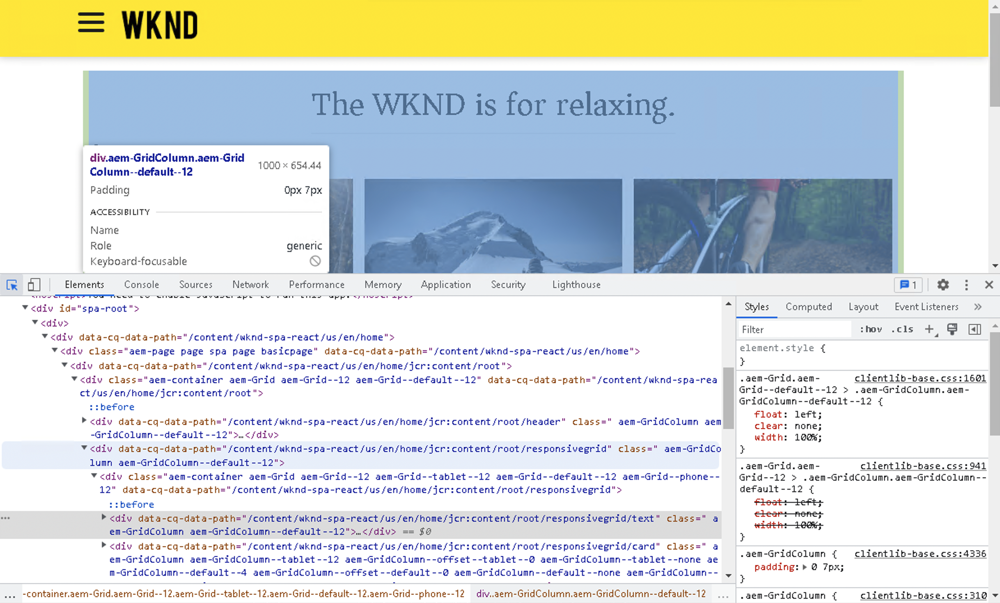

# SPA introduktion och genomgång {#spa-introduction-and-walkthrough}

Single page applications (SPA) can offer compelling experiences for website users. Utvecklare vill kunna skapa webbplatser med SPA ramverk och författare vill smidigt redigera innehåll i AEM för en webbplats som skapats med sådana ramverk.

SPA Editor erbjuder en omfattande lösning för SPA inom AEM. I den här artikeln går vi igenom hur du använder ett grundläggande SPA för att skapa och visar hur det är relaterat till den underliggande AEM SPA Editor.

>[!NOTE]
>
>SPA Editor är den rekommenderade lösningen för projekt som kräver SPA ramverksbaserad klientåtergivning (till exempel React eller Angular).

## Introduktion {#introduction}

### Artikelsyfte {#article-objective}

I den här artikeln introduceras de grundläggande begreppen för SPA innan läsaren vägleds genom en genomgång av SPA redigeringsprogram med hjälp av ett enkelt SPA som demonstrerar grundläggande innehållsredigering. Sedan går det ned på hur sidan är uppbyggd och hur det SPA programmet relaterar till och interagerar med AEM SPA.

Målet med den här introduktionen och genomgången är att visa AEM utvecklare varför SPA är relevanta, hur de i allmänhet fungerar, hur en SPA hanteras av AEM SPA Editor och hur det skiljer sig från ett AEM standardprogram.

## Krav {#requirements}

Genomgången baseras på AEM och exempelappen WKND SPA Project. Om du vill följa med i den här genomgången måste du ha följande till hands.

* [AEM version 6.5.4 eller senare](/help/release-notes/release-notes.md)
   * Du måste ha administratörsbehörighet för systemet.
* [Exempelappen WKND SPA Project som finns på GitHub](https://github.com/adobe/aem-guides-wknd-spa)
   * Ladda ned [den senaste versionen av React-appen.](https://github.com/adobe/aem-guides-wknd-spa/releases) Namnet liknar det `wknd-spa-react.all.classic-X.Y.Z-SNAPSHOT.zip`.
   * Ladda ned [senaste exempelbilder](https://github.com/adobe/aem-guides-wknd-spa/releases) för appen. Namnet liknar det `wknd-spa-sample-images-X.Y.Z.zip`.
   * [Använd pakethanteraren](/help/sites-administering/package-manager.md) om du vill installera paketen på samma sätt som andra paket i AEM.
   * Appen behöver inte installeras med Maven för den här genomgången.

>[!CAUTION]
>
>Det här dokumentet använder [WKND Spa Project-app](https://github.com/adobe/aem-guides-wknd-spa) endast i demonstrationssyfte. Använd inte för projektarbete.
>
>Alla AEM ska använda [AEM Project Archettype,](https://experienceleague.adobe.com/docs/experience-manager-core-components/using/developing/archetype/overview.html) som stöder SPA projekt med React eller Angular och använder SPA SDK.

### Vad är en SPA? {#what-is-a-spa}

Ett enkelsidigt program (SPA) skiljer sig från en konventionell sida genom att det återges på klientsidan och i huvudsak är JavaScript-styrt, beroende på Ajax-anrop för att läsa in data och dynamiskt uppdatera sidan. Det mesta eller allt innehåll hämtas en gång på en sida, och ytterligare resurser läses in asynkront efter behov baserat på användarinteraktionen med sidan.

Detta minskar behovet av siduppdatering och ger användaren en upplevelse som är smidig, snabb och som känns mer som en appupplevelse.

Med AEM SPA Editor kan gränssnittsutvecklare skapa SPA som kan integreras i en AEM webbplats, vilket gör att innehållsförfattarna kan redigera SPA innehåll lika enkelt som annat AEM.

### Varför en SPA? {#why-a-spa}

Genom att vara snabbare, smidigare och mer som ett systemspecifikt program blir en SPA en mycket attraktiv upplevelse inte bara för besökaren på webbsidan, utan även för marknadsförare och utvecklare på grund av hur SPA fungerar.

**Besökare**

* Besökarna vill ha upplevelser som påminner om varandra när de interagerar med innehållet.
* Det finns tydliga data om att ju snabbare en sida är, desto troligare blir konverteringen.

**Marknadsförare**

* Marknadsförarna vill erbjuda innehållsrika, verklighetstrogna upplevelser som lockar besökarna att engagera sig fullt ut i innehållet.
* Personalisering kan göra dessa upplevelser ännu mer övertygande.

**Utvecklare**

* Utvecklarna vill att det ska finnas tydliga skillnader mellan innehåll och presentation.
* Ren separation gör systemet mer utbyggbart och möjliggör oberoende frontendutveckling.

### Hur fungerar en SPA? {#how-does-a-spa-work}

Den främsta idén bakom en SPA är att anrop och beroende av en server minskas för att minimera fördröjningar som orsakas av serveranrop så att SPA närmar sig svarstiden för ett systemspecifikt program.

På en traditionell, sekventiell webbsida läses bara de data som behövs för den omedelbara sidan in. Det innebär att när besökaren flyttar till en annan sida anropas servern för de extra resurserna. Ytterligare anrop kan behövas eftersom besökaren interagerar med element på sidan. Dessa anrop kan ge en känsla av fördröjning eller fördröjning eftersom sidan måste hinna ifatt besökarens önskemål.

För en smidigare upplevelse, som närmar sig vad en besökare förväntar sig av mobilappar och appar, läser en SPA in alla nödvändiga data för besökaren vid den första inläsningen. Detta kan ta lite längre tid i början, men eliminerar sedan behovet av ytterligare serveranrop.

Genom att återge på klientsidan reagerar sidelementet snabbare och besökarens interaktion med sidan är omedelbar. Ytterligare data som kan behövas anropas asynkront för att maximera sidans hastighet.

>[!NOTE]
>
>Teknisk information om hur SPA fungerar i AEM finns i artikeln [Komma igång med SPA i AEM](/help/sites-developing/spa-getting-started-react.md).
>
>Mer information om design, arkitektur och tekniska arbetsflöden i SPA Editor finns i artikeln [SPA](/help/sites-developing/spa-overview.md).

## Innehållsredigering med SPA {#content-editing-experience-with-spa}

När en SPA har byggts för att använda AEM SPA Editor märker innehållsförfattaren ingen skillnad när innehållet redigeras och skapas. Vanliga AEM är tillgängliga och inga ändringar i författarens arbetsflöde krävs.

1. Redigera WKND-SPA i AEM.

   `http://<host>:<port>/editor.html/content/wknd-spa-react/us/en/home.html`

   

1. Markera en rubrikkomponent och lägg märke till att ett verktygsfält ser ut som en annan komponent. Välj **Redigera**.

   

1. Redigera innehållet som vanligt i AEM. Ändringarna sparas.

   

   >[!NOTE]
   >
   >Se [SPA](spa-overview.md#requirements-limitations) för mer information om textredigeraren och SPA på plats.

1. Använd Resursläsaren för att dra och släppa en ny bild i en bildkomponent.

   

1. Ändringen är beständig.

   

Ytterligare redigeringsverktyg som att dra och släppa ytterligare komponenter på sidan, ordna om komponenter och ändra layouten stöds som i andra program än SPA.

>[!NOTE]
>
>SPA redigerare ändrar inte programmets DOM. SPA är själv ansvarig för DOM.
>
>Fortsätt till nästa avsnitt i den här artikeln om du vill se hur det fungerar [SPA och AEM SPA](#spa-apps-and-the-aem-spa-editor).

## SPA och AEM SPA {#spa-apps-and-the-aem-spa-editor}

Genom att uppleva hur en SPA fungerar för slutanvändaren och sedan inspektera den SPA sidan blir det lättare att förstå hur en SAP-app fungerar med SPA Editor i AEM.

### Använda ett SPA {#using-an-spa-application}

1. Läs in WKND SPA Project-programmet antingen på publiceringsservern eller med alternativet **Visa som publicerad** från **Sidinformation** i sidredigeraren.

   `http://<host>:<port>/content/wknd-spa-react/us/en/home.html`

   

   Lägg märke till sidstrukturen, inklusive navigering till underordnade sidor, väderwidget och artiklar.

1. Navigera till en underordnad sida via menyn och se att sidan läses in omedelbart utan att behöva uppdateras.

   

1. Öppna webbläsarens inbyggda utvecklarverktyg och övervaka nätverksaktiviteten när du navigerar bland de underordnade sidorna.

   

   Trafiken är mycket liten när du går från sida till sida i appen. Sidan läses inte in igen och endast de nya bilderna begärs.

   SPA hanterar innehållet och routningen enbart på klientsidan.

Så om sidan inte läses in igen när du navigerar genom de underordnade sidorna, hur läses den in?

Nästa avsnitt, [Läsa in ett SPA,](#loading-an-spa-application) går djupare in i hur SPA läses in och hur innehåll kan läsas in synkront och asynkront.

### Läsa in ett SPA {#loading-an-spa-application}

1. Om den inte redan är inläst läser du in WKND SPA Project-appen antingen på publiceringsservern eller med alternativet **Visa som publicerad** från **Sidinformation** i sidredigeraren.

   `http://<host>:<port>/content/wknd-spa-react/us/en/home.html`

   

1. Använd det inbyggda verktyget i webbläsaren för att visa sidans källa.
1. Källans innehåll är extremt begränsat.

   * Sidan har inget innehåll i sin brödtext. Den består huvudsakligen av formatmallar och ett anrop till olika skript, som `clientlib-react.min.js`.
   * Dessa skript är de primära drivrutinerna för det här programmet och ansvarar för återgivningen av allt innehåll.

1. Använd webbläsarens inbyggda verktyg för att inspektera sidan. Se innehållet i DOM som är fullständigt inläst.

   

1. Växla till **Nätverk** -fliken för utvecklingsverktygen och läsa in sidan igen.

   När bildbegäranden ignoreras är de primära resurserna som har lästs in för sidan själva sidan, CSS, React JavaScript, dess beroenden och JSON-data för sidan.

   

1. Läs in `react.model.json` på en ny flik.

   `http://<host>:<port>/content/wknd-spa-react/us/en/home.model.json`

   

   AEM SPA Editor använder [AEM Content Services](/help/assets/content-fragments/content-fragments.md) för att leverera hela sidans innehåll som en JSON-modell.

   Genom att implementera specifika gränssnitt ger Sling Models den information som behövs för SPA. Leveransen av JSON-data delegeras nedåt till varje komponent (från sida, stycke, komponent osv.).

   Varje komponent väljer vad den visar och hur den återges (på serversidan med HTML eller på klientsidan med React). Den här artikeln fokuserar på klientåtergivning med React.

1. Modellen kan också gruppera sidor så att de läses in synkront, vilket minskar antalet sidomladdningar som behövs.

   I exemplet med WKND SPA Project-programmet `home`, `page-1`, `page-2`och `page-3` sidor läses in synkront eftersom besökarna vanligtvis besöker alla dessa sidor.

   Detta beteende är inte obligatoriskt och är helt definierbart.

   

1. Om du vill visa den här skillnaden i beteende läser du in sidan igen och rensar nätverksaktiviteten för utvecklingsverktygen. Navigera till `page-1` på sidmenyn och se att den enda nätverksaktiviteten är en begäran om bilden av `page-1`. `page-1` behöver inte läsas in.

   

### Interaktion med SPA {#interaction-with-the-spa-editor}

Med exempelprogrammet WKND SPA Project är det tydligt hur appen fungerar och läses in när den publiceras, med hjälp av innehållstjänster för JSON-innehållsleverans och asynkron inläsning av resurser.

Dessutom är det smidigt för innehållsförfattaren att skapa innehåll med en SPA redigerare i AEM.

I följande avsnitt utforskar vi kontraktet som gör det möjligt för SPA Editor att relatera komponenter i SPA till AEM komponenter och uppnå denna smidiga redigeringsupplevelse.

1. Läs in WKND SPA Project-programmet i redigeraren och växla till **Förhandsgranska** läge.

   `http://<host>:<port>/editor.html/content/wknd-spa-react/us/en/home.html`

1. Kontrollera sidans innehåll med hjälp av webbläsarens inbyggda utvecklarverktyg. Använd markeringsverktyget och markera en redigerbar komponent på sidan och visa elementinformationen.

   Komponenten har ett nytt dataattribut `data-cq-data-path`.

   

   Till exempel

   `data-cq-data-path="/content/wknd-spa-react/us/en/home/jcr:content/root/responsivegrid/text`

   Den här sökvägen tillåter hämtning och associering av konfigurationsobjektet för redigeringssammanhanget för varje komponent.

   Det här är det enda markeringsattribut som krävs för att redigeraren ska kunna identifiera det som en redigerbar komponent i SPA. Utifrån det här attributet avgör SPA redigerare vilken redigerbar konfiguration som är kopplad till komponenten så att rätt bildruta, verktygsfält och så vidare läses in.

   Vissa specifika klassnamn läggs också till för att markera platshållare och för att dra och släppa resurser.

   >[!NOTE]
   >
   >Detta är en förändring av serversidans renderade sidor i AEM, där det finns en `cq` -element infogat för varje redigerbar komponent.
   >
   >
   >Detta tillvägagångssätt i SPA tar bort behovet av att injicera anpassade element, endast genom att förlita sig på ett extra dataattribut, vilket gör markeringen enklare för klientutvecklaren.

## Nästa steg {#next-steps}

Nu när du förstår SPA redigeringsupplevelsen i AEM och hur en SPA relaterar till SPA redigerare kan du fördjupa dig i hur en SPA byggs.

* [Komma igång med SPA i AEM](/help/sites-developing/spa-getting-started-react.md) visar hur en grundläggande SPA fungerar med SPA Editor i AEM
* [SPA](/help/sites-developing/spa-overview.md) fördjupar sig i kommunikationsmodellen mellan AEM och SPA.
* [Utveckla SPA för AEM](/help/sites-developing/spa-architecture.md) beskriver hur man engagerar gränssnittsutvecklare för att utveckla en SPA för AEM och hur SPA interagerar med AEM arkitektur.
