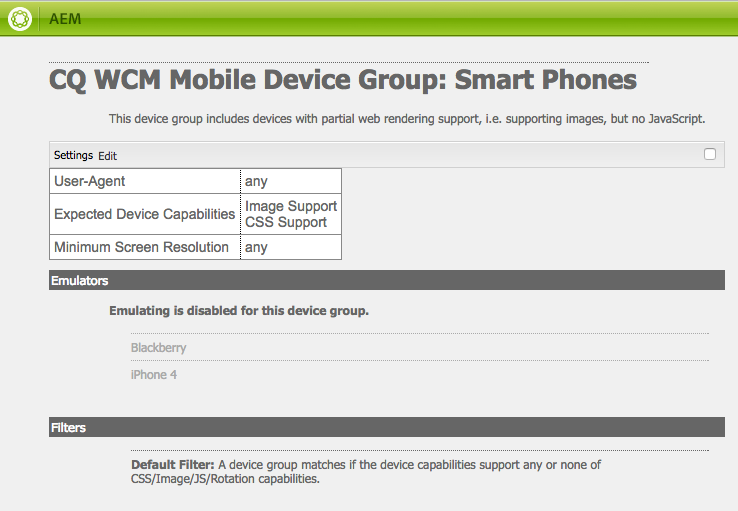

# Adaptiv mallåtergivning{#adaptive-template-rendering}

Med den adaptiva mallåtergivningen kan du hantera en sida med variationer. Den här funktionen är ursprungligen användbar när du vill leverera olika utdataformat för mobila enheter (till exempel från telefoner till smarttelefoner), men den är användbar när du vill leverera HTML till olika enheter som behöver olika märkningar eller HTML.

## Ökning {#overview}

Mallar byggs runt ett responsivt rutnät, och sidor som skapas baserat på dessa mallar är helt responsiva och justeras automatiskt till visningsrutan på klientenheten. Med verktygsfältet Emulator i sidredigeraren kan man rikta layouten till specifika enheter.

Det går också att skapa mallar som har stöd för adaptiv återgivning. När enhetsgrupper är korrekt konfigurerade återges sidan med en annan väljare i URL:en när en enhet väljs i emulatorläge. Om du använder en väljare kan en viss sidåtergivning anropas direkt via webbadressen.

Kom ihåg när du konfigurerar enhetsgrupper:

* Alla enheter måste finnas i minst en enhetsgrupp.
* En enhet kan finnas i flera enhetsgrupper.
* Eftersom enheter kan finnas i flera enhetsgrupper kan väljarna kombineras.
* Kombinationen av väljare utvärderas uppifrån och ned när de sparas i databasen.

>[!NOTE]
>
>Enhetsgruppen **Responsiva enheter har aldrig någon väljare eftersom enheter som identifieras som kompatibla med responsiv design antas inte behöva någon anpassad layout

## Konfiguration {#configuration}

Anpassningsbara återgivningsväljare kan konfigureras för befintliga enhetsgrupper eller till [grupper som du själv har skapat.](/help/sites-developing/mobile.md#device-groups)

I det här exemplet ska du konfigurera den befintliga enhetsgruppen **Smarta telefoner** för att ha en adaptiv återgivningsväljare som en del av **Experience Page** mall inom We.Retail.

1. Redigera enhetsgruppen som kräver en adaptiv väljare i `http://localhost:4502/miscadmin#/etc/mobile/groups`

   Ange alternativ **Inaktivera emulatorn** och spara.

   

1. Väljaren är tillgänglig för **BlackBerry®** och **IPHONE 4** tillhandahöll enhetsgruppen **Smart Phone** läggs till i mall- och sidstrukturerna i följande steg.

   

1. Tillåt att enhetsgruppen används i mallen med CRXDE Lite genom att lägga till den i egenskapen för flervärdessträngen `cq:deviceGroups` på mallens struktur.

   `/conf/<your-site>/settings/wcm/templates/<your-template>/structure/jcr:content`

   Om du till exempel vill lägga till enhetsgruppen Smart Phone:

   `/conf/we-retail/settings/wcm/templates/experience-page/structure/jcr:content`

   

1. Tillåt att enhetsgruppen kan användas på din plats med CRXDE Lite genom att lägga till den i egenskapen för flervärdessträngen `cq:deviceGroups` på webbplatsens struktur.

   `/content/<your-site>/jcr:content`

   Om du till exempel vill tillåta **Smart Phone** enhetsgrupp:

   `/content/we-retail/jcr:content`

   

Nu när du använder [emulator](/help/sites-authoring/responsive-layout.md#layout-definitions-device-emulation-and-breakpoints) i sidredigeraren (till exempel när [ändra layout](/help/sites-authoring/responsive-layout.md)) och du väljer en enhet i den konfigurerade enhetsgruppen återges sidan med en väljare som en del av URL:en.

I det här exemplet, när du redigerar en sida baserat på **Experience Page** och väljer iPhone 4 i emulatorn återges sidan med väljaren som `arctic-surfing-in-lofoten.smart.html` i stället för `arctic-surfing-in-lofoten.html`

Du kan även anropa sidan direkt med den här väljaren.

