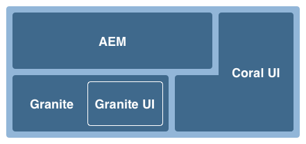

# Adobe Experience Manager Touch-aktiverade användargränssnitt{#concepts-of-the-aem-touch-enabled-ui}

Adobe Experience Manager (AEM) har ett pekaktiverat användargränssnitt med [responsiv design](/help/sites-authoring/responsive-layout.md) för redigeringsmiljön, som är utformat för att fungera både på pekskärmar och på stationära enheter.

>[!NOTE]
>
>Det beröringskänsliga användargränssnittet är standardgränssnittet för AEM. Det klassiska användargränssnittet har ersatts med AEM 6.4.

Användargränssnittet med pekfunktioner innehåller:

* Suite header som:
   * Visar logotypen
   * Tillhandahåller en länk till den globala navigeringen
   * Tillhandahåller länk till andra allmänna åtgärder, t.ex. Sök, Hjälp, Lösningar för Experience Cloud, Meddelanden och Användarinställningar.
* Den vänstra listen (visas när den behövs och är dold) som kan visa:
   * Tidslinje
   * Referenser
   * Filter
* Navigeringsrubriken, som återigen är sammanhangsberoende och kan visa:
   * Anger vilken konsol du använder, eller din plats, eller båda, i den konsolen
   * Markering för den vänstra rälen
   * Breadcrumbs
   * Åtkomst till lämpliga **Skapa**-åtgärder
   * Visa markeringar
* Innehållsområdet som:
   * Visar en lista med innehållsobjekt (sidor, resurser, foruminlägg osv.)
   * Kan formateras enligt begäran, till exempel kolumn, kort eller lista
   * Använder en responsiv design (bildskärmen ändrar automatiskt storlek efter enheten och/eller fönsterstorleken)
   * Använder oändlig rullning (ingen sidnumrering, alla objekt visas i ett fönster)


>[!NOTE]
>
>Nästan alla AEM funktioner har porterats till det pekaktiverade användargränssnittet. I vissa begränsade fall återställs dock funktionen till det klassiska användargränssnittet. Mer information finns i [Funktionsstatus för pekskärmsgränssnitt](/help/release-notes/touch-ui-features-status.md).

Det pekaktiverade användargränssnittet har utformats av Adobe för att ge en konsekvent användarupplevelse för flera produkter. Den bygger på följande:

* **Coral UI** (CUI) är en implementering av Adobe Visual-stil för det beröringsaktiverade användargränssnittet. Coral UI innehåller allt som din produkt/ditt projekt/ditt webbprogram behöver för att använda den visuella gränssnittsstilen.
* **Granska gränssnittskomponenter** har skapats med Coral UI.

De grundläggande principerna för det beröringskänsliga användargränssnittet är:

* Mobil först (med skrivbordet i åtanke)
* Responsiv design
* Sammanhangsberoende visning
* Återanvändbar
* Inkludera inbäddad referensdokumentation
* Inkludera inbäddade tester
* Nedifrån och upp-design för att säkerställa att dessa principer tillämpas på alla element och komponenter

Mer information om den beröringsaktiverade gränssnittsstrukturen finns i [Struktur för det AEM beröringsaktiverade gränssnittet](/help/sites-developing/touch-ui-structure.md).

## AEM Technology Stack {#aem-technology-stack}

AEM använder Granite-plattformen som bas och Granite-plattformen innehåller bland annat Java™ Content Repository.


## Granit {#granite}

Granite är en Adobe Open Web-stack med olika komponenter:

* En programstart
* Ett OSGi-ramverk där allt distribueras
* Flera OSGi-kompendium-tjänster som stöder byggapplikationer
* Ett omfattande loggningsramverk med olika loggnings-API:er
* Implementeringen av JCR API-specifikationen för CRX-databasen
* Apache Sling Web Framework
* Ytterligare delar av den aktuella CRX-produkten

>[!NOTE]
>
>Granite körs som ett öppet utvecklingsprojekt i Adobe: bidrag till koden, diskussioner och frågor görs i hela företaget.
>
>Granite är **inte** ett öppen källkodsprojekt. Den bygger till stor del på flera öppen källkodsprojekt (särskilt Apache Sling, Felix, Jackrabbit och Lucene), men Adobe har en tydlig gräns mellan vad som är offentligt och vad som är internt.

## Granite-gränssnitt {#granite-ui}

Granites teknikplattform utgör också ett grundläggande ramverk för användargränssnitt. De främsta målen med detta är att

* Tillhandahåll detaljerade gränssnittswidgetar
* Implementera gränssnittskoncept och illustrera vedertagna metoder (långa listor, återgivning, listfiltrering, objekt-CRUD, CUD-guider..).
* Ett utbyggbart och plugin-baserat administrationsgränssnitt

Dessa uppfyller kraven:

* Respektera&quot;mobilen först&quot;
* Var utökningsbar
* Enkelt att åsidosätta


GraniteUI.pdf

[Hämta fil](assets/graniteui.pdf)
Gränssnittet för Granite:

* Använder RESTful-arkitekturen i Sling
* Implementerar komponentbibliotek som är avsedda för att skapa innehållscentrerade webbprogram
* Tillhandahåller detaljerade gränssnittswidgetar
* Tillhandahåller ett standardiserat standardgränssnitt
* Är utökningsbar
* Är utformad för både mobila och stationära enheter (respekterar mobilen först)
* Kan användas i alla Granite-baserade plattformar/produkter/projekt, till exempel AEM


* [Bevilja UI Foundation-komponenter](#granite-ui-foundation-components)
Det här biblioteket med grundkomponenter kan användas eller utökas av andra bibliotek.
* [Granite UI Administration Components](#granite-ui-administration-components)

### Klientsida jämfört med serversida {#client-side-vs-server-side}

Klient-server-kommunikationen i Granite-gränssnittet består av hypertext, inte objekt, så kunden behöver inte förstå affärslogiken

* Servern berikar HTML med semantiska data
* Klienten förbättrar hypertexten med hypermedia (interaktion)


#### Klientsida {#client-side}

Detta innebär att ett tillägg till HTML-vokabulär används, förutsatt att författaren kan uttrycka sin avsikt att skapa en interaktiv webbapp. Detta liknar [WAI-ARIA](https://www.w3.org/TR/wai-aria/) och [microformats](https://microformats.org/).

Det består främst av en samling interaktionsmönster (till exempel asynkront skicka ett formulär) som tolkas av JS- och CSS-koder, som körs på klientsidan. Klientsidans roll är att förstärka markeringen (som serverns hypermedia) för interaktivitet.

Klientsidan är oberoende av serverteknik. Så länge servern ger rätt kod kan klientsidan uppfylla sin roll.

För närvarande levereras JS- och CSS-koderna som Granite [clientlibs](/help/sites-developing/clientlibs.md) under kategorin:

`granite.ui.foundation and granite.ui.foundation.admin`

Dessa levereras som en del av innehållspaketet:

`granite.ui.content`

#### Serversida {#server-side}

Detta formas av en samling sling-komponenter som gör att författaren snabbt kan *komponera* en webbapp. Utvecklaren utvecklar komponenter, författaren sätter ihop komponenterna till en webbapp. Serversidans roll är att förse klienten med hypermedia-överkomlighet (markup).

Komponenterna finns för närvarande i Granite-databasen på:

`/libs/granite/ui/components/foundation`

Detta levereras som en del av innehållspaketet:

`granite.ui.content`

### Skillnader med det klassiska användargränssnittet {#differences-with-the-classic-ui}

Skillnaderna mellan GRUI och ExtJS (används för det klassiska användargränssnittet) är också av intresse:

<table>
 <tbody>
  <tr>
   <td><strong>ExtJS</strong></td>
   <td><strong>Granite-gränssnitt</strong></td>
  </tr>
  <tr>
   <td>Fjärrproceduranrop<br /> </td>
   <td>Tillståndsövergångar</td>
  </tr>
  <tr>
   <td>Dataöverföringsobjekt</td>
   <td>Hypermedia</td>
  </tr>
  <tr>
   <td>Klienten känner till interna serverlösningar</td>
   <td>Klienten känner inte till interna</td>
  </tr>
  <tr>
   <td>"Fat client"</td>
   <td>"Tunn klient"</td>
  </tr>
  <tr>
   <td>Specialiserade klientbibliotek</td>
   <td>Universella klientbibliotek</td>
  </tr>
 </tbody>
</table>

### Granite UI Foundation Components {#granite-ui-foundation-components}

[Grund-gränssnittskomponenterna ](https://developer.adobe.com/experience-manager/reference-materials/6-5/granite-ui/api/jcr_root/libs/granite/ui/index.html) innehåller de grundläggande byggstenarna som behövs för att skapa ett användargränssnitt. De omfattar bland annat följande:

* Knapp
* Hyperlänk
* Avatar för användare

Grundkomponenterna finns under:

`/libs/granite/ui/components/foundation`

Det här biblioteket innehåller en Granite-gränssnittskomponent för varje Coral-element. En komponent är innehållsdriven och dess konfiguration finns i databasen. Detta gör det möjligt att skapa ett GRI-program utan att skriva HTML-kod manuellt.

Syfte:

* Komponentmodell för HTML Elements
* Komponentdisposition
* Automatisk enhets- och funktionstestning

Implementering:

* Databasbaserad disposition och konfiguration
* Användning av testutrustning från Granitplattformen
* JSP-mallar

Det här biblioteket med grundkomponenter kan användas eller utökas av andra bibliotek.

### ExtJS och motsvarande Granite-gränssnittskomponenter {#extjs-and-corresponding-granite-ui-components}

När du uppgraderar ExtJS-kod för att använda GRA-gränssnittet ger följande lista en bekväm översikt över ExtJS-xtyper och nodtyper med motsvarande Granite-gränssnittsresurstyper.

| **ExtJS xtype** | **Bevilja gränssnittsresurstyp** |
|---|---|
| `button` | `granite/ui/components/foundation/form/button` |
| `checkbox` | `granite/ui/components/foundation/form/checkbox` |
| `componentstyles` | `cq/gui/components/authoring/dialog/componentstyles` |
| `cqinclude` | `granite/ui/components/foundation/include` |
| `datetime` | `granite/ui/components/foundation/form/datepicker` |
| `dialogfieldset` | `granite/ui/components/foundation/form/fieldset` |
| `hidden` | `granite/ui/components/foundation/form/hidden` |
| `html5smartfile, html5smartimage` | `granite/ui/components/foundation/form/fileupload` |
| `multifield` | `granite/ui/components/foundation/form/multifield` |
| `numberfield` | `granite/ui/components/foundation/form/numberfield` |
| `pathfield, paragraphreference` | `granite/ui/components/foundation/form/pathbrowser` |
| `selection` | `granite/ui/components/foundation/form/select` |
| `sizefield` | `cq/gui/components/authoring/dialog/sizefield` |
| `tags` | `granite/ui/components/foundation/form/autocomplete``cq/gui/components/common/datasources/tags` |
| `textarea` | `granite/ui/components/foundation/form/textarea` |
| `textfield` | `granite/ui/components/foundation/form/textfield` |

| **Nodtyp** | **Bevilja gränssnittsresurstyp** |
|---|---|
| `cq:WidgetCollection` | `granite/ui/components/foundation/container` |
| `cq:TabPanel` | `granite/ui/components/foundation/container``granite/ui/components/foundation/layouts/tabs` |
| `cq:panel` | `granite/ui/components/foundation/container` |

### Granite UI Administration Components {#granite-ui-administration-components}

Administrationskomponenterna för [GRE UI-gränssnittet](https://developer.adobe.com/experience-manager/reference-materials/6-5/granite-ui/api/jcr_root/libs/granite/ui/index.html) bygger på grundkomponenterna och tillhandahåller generiska byggstenar som alla administrationsprogram kan implementera. Dessa omfattar bland annat följande:

* Globalt navigeringsfält
* Rail (skelett)
* Sökpanel

Syfte:

* Enhetlig look och känsla för administrationstillämpningar
* RAD för administrationsprogram

Implementering:

* Fördefinierade komponenter med baskomponenterna
* Komponenter kan anpassas

## Coral UI {#coral-ui}

CoralUI.pdf

[Hämta fil](assets/coralui.pdf)
Coral UI (CUI) är en implementering av Adobe visuell stil för det pekaktiverade användargränssnittet som är utformat för att ge en konsekvent användarupplevelse för flera produkter. Coral UI innehåller allt du behöver för att använda den visuella stil som används i redigeringsmiljön.

>[!CAUTION]
>
>Coral UI är ett användargränssnittsbibliotek som AEM kunder kan använda för att skapa applikationer och webbgränssnitt inom gränserna för deras licensierade användning av produkten.
>
>Användning av Coral UI är endast tillåten:
>
>
>* När den har levererats och paketerats med AEM.
>* Används när du utökar det befintliga gränssnittet i redigeringsmiljön.
>* Material, annonser och presentationer för Adobe.
>* Gränssnittet för program med Adobe-varumärke (teckensnittet får inte vara lätt tillgängligt för annan användning).
>* Med mindre anpassningar.
>
>Användning av Coral UI bör undvikas vid:
>
>* Dokument och andra objekt som inte är relaterade till Adobe.
>* Miljöer där innehållet skapas (där föregående objekt kan genereras av andra).
>* Program/komponenter/webbsidor som inte är tydligt kopplade till Adobe.
>

Coral UI är en samling byggstenar för utveckling av webbapplikationer.


Varje modul är utformad för att vara modulär från början och utgör ett distinkt lager baserat på dess primära roll. Även om lagren har utformats för att stödja varandra kan de också användas oberoende av varandra vid behov. Detta gör det möjligt att implementera Corals användarupplevelse i vilken miljö som helst med stöd för HTML.

Med Coral UI är det inte obligatoriskt att använda en viss utvecklingsmodell och/eller plattform. Det främsta målet för Coral är att tillhandahålla enhetlig och ren markering på HTML5, oberoende av den metod som faktiskt används för att generera markeringen. Detta kan användas för återgivning på klient- eller serversidan, mallar, JSP, PHP eller till och med Adobe Flash-RIA-program - för att nämna några få.

### HTML Elements - markeringslagret {#html-elements-the-markup-layer}

HTML-elementen ger ett gemensamt utseende och en gemensam känsla för alla grundläggande gränssnittselement (bland annat navigeringsfält, knapp, meny, räls).

På den mest grundläggande nivån är ett HTML-element en HTML-tagg med ett dedikerat klassnamn. Mer komplexa element kan bestå av flera taggar som är kapslade i varandra (på ett visst sätt).

CSS används för att ge det verkliga utseendet och känslan. För att det ska vara enkelt att anpassa utseendet och känslan (till exempel för varumärken) deklareras faktiska formatvärden som variabler som expanderas av [LESS](https://lesscss.org/) -preprocessorn under körningen.

Syfte:

* Ge grundläggande gränssnittselement en gemensam look och känsla
* Ange standardstödrastersystemet

Implementering:

* HTML-taggar med format som inspirerats av [Bootstrap](https://twitter.github.com/bootstrap/)
* Klasser definieras i LESS-filer
* Ikoner definieras som teckensnittssprites

Exempel:

```xml
<button class="btn btn-large btn-primary" type="button">Large button</button>
<button class="btn btn-large" type="button">Large button</button>
```

Visas som:


Utseendet definieras i LESS, som knyts till ett element med ett dedikerat klassnamn (följande utdrag har förkortats av utrymmesskäl):

```xml
.btn {
    font-size: @baseFontSize;
    line-height: @baseLineHeight;
    .buttonBackground(@btnBackground,
                                @btnBackgroundHighlight,
                                @grayDark, 0 1px 1px rgba(255,255,255,.75));
```

Faktiska värden definieras i en LESS-variabelfil (följande extrakt har förkortats av utrymmesskäl):

```xml
@btnBackgroundHighlight: darken(@white, 10%);
@btnPrimaryBackgroundHighlight: spin(@btnPrimaryBackground, 20%);
@baseFontSize: 17px;
@baseFontFamily: @sansFontFamily;
```

### Elementplugin-program {#element-plugins}

Många av elementen i HTML måste uppvisa någon typ av dynamiskt beteende, som att öppna och stänga snabbmenyer. Detta är rollen för elementplugin-program, som utför sådana åtgärder genom att ändra DOM med JavaScript.

Ett plugin-program är antingen:

* Utformad för att fungera på ett specifikt DOM-element. En dialogruteplugin förväntar sig till exempel att hitta `DIV class=dialog`
* Allmän till sin natur. En layouthanterare tillhandahåller till exempel layout för alla listor med `DIV`- eller `LI`-element

Plugin-beteendet kan anpassas med parametrar, antingen genom att:

* Skicka parametrarna med ett JavaScript-samtal
* Använda dedikerade `data-*`-attribut som är kopplade till HTML-koden

Även om utvecklaren kan välja det bästa sättet för alla plugin-program är tumregeln att använda:

* `data-*`-attribut för alternativ som är relaterade till HTML-layout. Du kan till exempel ange antalet kolumner
* API-alternativ/klasser för funktioner som är relaterade till data. Skapa till exempel en lista med objekt som ska visas

Samma koncept används för att implementera formulärvalidering. För ett element som du vill validera måste du ange det obligatoriska indataformuläret som ett anpassat `data-*`-attribut. Det här attributet används sedan som ett alternativ för ett validerings-plugin-program.

>[!NOTE]
>
>Inbyggd HTML5-formulärvalidering bör användas när det är möjligt och/eller utökas.

Syfte:

* Ange dynamiskt beteende för HTML Elements
* Skapa anpassade layouter som inte är möjliga med ren CSS
* Utför formulärvalidering
* Utför avancerad DOM-manipulering

Implementering:

* jQuery-plugin, kopplad till specifika DOM-element
* Använda `data-*`-attribut för att anpassa beteendet

Ett extrakt av exempelkod (observera de alternativ som anges som data-&#42;-attribut):

```xml
<ul data-column-width="220" data-layout="card" class="cards">
  <li class="item">
    <div class="thumbnail">
      
      <div class="caption">
        <h4>Toolbar</h4>
          <p><small>toolbar</small><br></p>
      </div>
    </div>
  </li>
  <li class="item">
    <div class="thumbnail">
      
      <div class="caption">
        <h4>Toolbar</h4>
        <p><small>toolbar</small><br></p>
      </div>
    </div>
  </li>
```

Anropet till jQuery-plugin-programmet:

```
$('.cards').cardlayout ();
```

Detta visas som:


Plugin-programmet `cardLayout` lägger ut de omslutna `UL`-elementen baserat på deras respektive höjder och tar även hänsyn till den överordnade objektets bredd.

### Widgetar för HTML Elements {#html-elements-widgets}

En widget kombinerar ett eller flera grundläggande element med ett JavaScript-plugin-program till gränssnittselement på en högre nivå. Dessa kan implementera mer komplexa beteenden och även mer komplexa utseenden och känsla än vad ett enskilt element kan ge. Bra exempel är taggväljaren eller rälswidgetar.

En widget kan både utlösa och lyssna på anpassade händelser för att samarbeta med andra widgetar på sidan. Vissa widgetar är inbyggda jQuery-widgetar som använder Coral HTML-element.

Syfte:

* Implementera högnivågränssnittselement med komplext beteende
* Utlösar- och hanteringshändelser

Implementering:

* jQuery plugin + HTML markup
* Kan använda klient-/serversidmallar

Exempelkoden är:

```
<input type="text" name="tags" placeholder="Tags" class="tagManager"/>
```

Anropet till jQuery-plugin-programmet (med alternativ):

```
$(".tagManager").tagsManager({
        prefilled: ["Pisa", "Rome"] })
```

Plugin-programmet genererar märkordet HTML (den här markeringen använder grundläggande element, som kan använda andra plugin-program internt):

```
<span>Pisa</code>
<a title="Removing tag" tagidtoremove="0"
   id="myRemover_0" class="myTagRemover" href="#">x</a></code>

<span id="myTag_1" class="myTag"><span>Rome</code>
<a title="Removing tag" tagidtoremove="1"
   id="myRemover_1" class="myTagRemover" href="#">x</a></code>

<input type="text" data-original-title="" class="input-medium tagManager"
       placeholder="Tags" name="tags" data-provide="typeahead" data-items="6"
       autocomplete="off">
```

Detta visas som:


### Verktygsbibliotek {#utility-library}

Det här biblioteket är en samling JavaScript hjälpplugin-program och/eller funktioner som är:

* Oberoende av användargränssnitt
* Ändå avgörande för att bygga kompletta webbapplikationer

Detta inkluderar XSS-hantering och händelsebussen.

Trots att plugin-program och widgetar för HTML-element kan förlita sig på funktioner från verktygsbiblioteket, kan verktygsbiblioteket inte ha något svårt beroende av själva elementen eller widgetarna.

Syfte:

* Tillhandahålla vanliga funktioner
* Implementering av händelsebuss
* Mallar på klientsidan
* XSS

Implementering:

* jQuery-plugin-program eller AMD-kompatibla JavaScript-moduler
