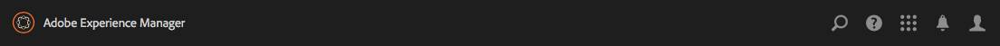

# Struktur för det användargränssnitt som kan användas med Adobe Experience Manager Touch{#structure-of-the-aem-touch-enabled-ui}

Adobe Experience Manager (AEM) touch-aktiverat användargränssnitt har flera bakomliggande principer och består av flera nyckelelement:

## Konsoler {#consoles}

### Grundläggande layout och storleksändring {#basic-layout-and-resizing}

Gränssnittet fungerar både för mobila och stationära enheter, men i stället för att skapa två format har Adobe valt att använda ett format som fungerar för alla skärmar och enheter.

Alla moduler använder samma grundläggande layout, AEM detta kan ses som:

Layouten följer en responsiv designstil och anpassas till storleken på enheten/fönstret som du använder.

Om upplösningen till exempel ligger under 1 024 pixlar (som på en mobil enhet) justeras skärmen därefter:

### Sidhuvudsfält {#header-bar}

Rubrikraden visar globala element som:

* logotypen och den specifika produkt/lösning som du använder för närvarande. För AEM utgör detta också en länk till Global Navigation
* Sök
* ikon för att komma åt hjälpresurserna
* ikon för att komma åt andra lösningar
* en indikator för (och åtkomst till) alla varningar eller inkorgsobjekt som väntar på dig
* användarikonen tillsammans med en länk till din profilhantering

### Verktygsfält {#toolbar}

Det här är kontextuellt för platsen och ytverktygen som är relevanta för att styra vyn eller resurserna på sidan nedan. Verktygsfältet är produktspecifikt, men det finns vissa gemensamma element.

Alla tillgängliga åtgärder visas i verktygsfältet:

Även beroende på om en resurs är markerad:

### Vänster linje {#left-rail}

Den vänstra listen kan öppnas/döljas efter behov för att visa:

* **Tidslinje**
* **Referenser**
* **Filter**

Standardvärdet är **Endast innehåll** (dold räl).

## Sidredigering {#page-authoring}

När du skapar sidor är de strukturella områdena följande.

### Innehållsram {#content-frame}

Sidinnehållet återges i innehållsramen. Innehållsramen är oberoende av redigeraren för att säkerställa att det inte uppstår några konflikter på grund av CSS eller JavaScript.

Innehållsramen finns till höger i fönstret, under verktygsfältet.

### Redigeringsram {#editor-frame}

Redigeringsramen har redigeringsfunktionerna.

Redigeringsramen är en behållare (abstrakt) för alla *sidelementen*. Den ligger ovanpå innehållsramen och innehåller:

* det övre verktygsfältet
* sidopanelen
* alla övertäckningar
* vilket annat sidredigeringselement som helst, till exempel komponentens verktygsfält

### Side Panel {#side-panel}

Detta innehåller två standardflikar där du kan välja resurser och komponenter. De kan dras härifrån och släppas på sidan.

Sidpanelen är dold som standard. När du väljer det här alternativet visas det antingen till vänster eller glids över så att det täcker hela fönstret (när fönsterstorleken är under bredden 1 024 px, till exempel på en mobil enhet).

### Side Panel - Assets {#side-panel-assets}

På fliken Assets kan du välja bland flera olika resurser. Du kan också filtrera efter en viss term eller välja en grupp.

### Side Panel - Resursgrupper {#side-panel-asset-groups}

På fliken Resurser finns det en listruta som du kan använda för att välja specifika resursgrupper.

### Side Panel - Components {#side-panel-components}

På fliken Komponenter kan du välja bland komponenterna. Du kan också filtrera efter en viss term eller välja en grupp.

### Övertäckningar {#overlays}

Dessa täcker över innehållsramen och används av [lagren](#layer) för att realisera mekanismerna för hur du kan interagera (genomskinligt) med komponenterna och deras innehåll.

Övertäckningarna finns i redigerarramen (med alla andra sidredigeringselement), även om de faktiskt täcker över rätt komponenter i innehållsramen.

### Lager {#layer}

Ett lager är ett oberoende funktionspaket som kan aktiveras för att:

* ger en annan vy av sidan
* kan du manipulera och/eller interagera med en sida

Lagren har avancerade funktioner för hela sidan, i motsats till specifika åtgärder för en enskild komponent.

AEM innehåller flera lager som redan har implementerats för sidredigering, t.ex. redigering, förhandsgranskning och anteckning.

>[!NOTE]
>
>Lager är ett kraftfullt koncept som påverkar användarens vy och interaktion med sidinnehållet. När du utvecklar egna lager måste du se till att lagret rensas när det avslutas.

### Lagerväxlare {#layer-switcher}

Med lagerväljaren kan du välja det lager som du vill använda. När det är stängt visas det lager som används.

Lagerväljaren är tillgänglig som en listruta från verktygsfältet (längst upp i fönstret, i redigeringsramen).

### Komponentverktygsfältet {#component-toolbar}

Varje instans av en komponent visar verktygsfältet när användaren klickar på det (antingen en gång eller med ett långsamt dubbelklick). Verktygsfältet innehåller de specifika åtgärder (till exempel kopiera, klistra in, öppna redigerare) som är tillgängliga för komponentinstansen (redigerbar) på sidan.

Beroende på vilket utrymme som är tillgängligt placeras komponentens verktygsfält i det övre, eller nedre, högra hörnet av respektive komponent.

## Ytterligare information {#further-information}

Mer information om begreppen kring det beröringsaktiverade användargränssnittet finns i [Concepts of the AEM Touch-Enabled UI](/help/sites-developing/touch-ui-concepts.md).

Mer teknisk information finns i [JS-dokumentationen ](https://helpx.adobe.com/experience-manager/6-5/sites/developing/using/reference-materials/jsdoc/ui-touch/editor-core/index.html) för den beröringsaktiverade sidredigeraren.
