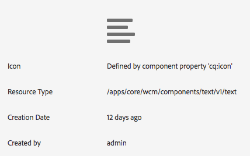

# Provar kärnkomponenter i We.Retail{#trying-out-core-components-in-we-retail}

De centrala komponenterna är moderna, flexibla komponenter som är enkla att utöka och som gör det enkelt att integrera i projekten. Kärnkomponenterna har byggts kring flera viktiga designprinciper, som HTML, användbarhet, färdig installation, konfigurerbarhet, versionshantering och utbyggbarhet. Vi.Retail har byggts på kärnkomponenter.

## Prova {#trying-it-out}

1. Starta AEM med exempelinnehållet We.Retail och öppna [komponentkonsolen](/help/sites-authoring/default-components-console.md).

   **Global navigering -> Verktyg -> Komponenter**

1. När du öppnar rälen i komponentkonsolen kan du filtrera efter en viss komponentgrupp. Kärnkomponenterna finns i

   * `.core-wcm`: Standardkärnkomponenterna
   * `.core-wcm-form`: Baskomponenter för att skicka in formulär
   Choose `.core-wcm`.

   

1. Observera att alla kärnkomponenter heter **v1**, vilket visar att det är den första versionen av kärnkomponenten. Vanliga versioner kommer att släppas framöver, vilket blir versionskompatibelt med AEM och gör det enkelt att uppgradera så att du kan utnyttja de senaste funktionerna.
1. Klicka på **Text (v1)**.

   Se till att komponentens **resurstyp** är `/apps/core/wcm/components/text/v1/text`. Kärnkomponenter finns under `/apps/core/wcm/components` och versionsindelas per komponent.

   

1. Klicka på fliken **Dokumentation** för att se utvecklardokumentationen för komponenten.

   

1. Återgå till komponentkonsolen. Filtrera för gruppen **We.Retail** och välj komponenten **Text** .
1. Se till att **resurstypen** pekar på en komponent som förväntat under `/apps/weretail` men att **resurssupertypen** pekar tillbaka till kärnkomponenten `/apps/core/wcm/components/text/v1/text`.

   

1. Klicka på fliken **Live-användning** för att se vilka sidor den här komponenten används för närvarande. Klicka på den första **Tack** -sidan för att redigera sidan.

   

1. På sidan Tack markerar du textkomponenten och klickar på ikonen Avbryt arv på komponentens Redigera-meny.

   [Vi.Retail har en globaliserad webbplatsstruktur](/help/sites-developing/we-retail-globalized-site-structure.md) där innehåll överförs från språkmallar till [live-kopior via en mekanism som kallas arv](/help/sites-administering/msm.md). Arvet måste därför avbrytas för att användaren ska kunna redigera text manuellt.

   

1. Bekräfta annulleringen genom att klicka på **Ja**.

   

1. När arvet har avbrutits och du väljer textkomponenterna finns det många fler alternativ. Klicka på** Redigera**.

   

1. Nu kan du se vilka redigeringsalternativ som är tillgängliga för textkomponenten.

   

1. På menyn **Sidinformation** väljer du **Redigera mall**.
1. Klicka på ikonen **Princip** för textkomponenten i sidans **layoutbehållare** i sidans mallredigerare.

   

1. Med huvudkomponenterna kan mallskapare konfigurera vilka egenskaper som är tillgängliga för sidförfattarna. Dessa innehåller funktioner som tillåtna inklistringskällor, formateringsalternativ, tillgängliga styckeformat osv.

   Sådana designdialogrutor är tillgängliga för många viktiga komponenter och fungerar tillsammans med mallredigeraren. När de är aktiverade är de tillgängliga för författaren via komponentredigerarna.

   

## Ytterligare information {#further-information}

Mer information om kärnkomponenterna finns i utvecklingsdokumentet [Core Components](https://docs.adobe.com/content/help/en/experience-manager-core-components/using/introduction.html) (Core-komponenter) för en översikt över kärnkomponenternas funktioner och i utvecklardokumentet [Developing Core Components](https://helpx.adobe.com/experience-manager/core-components/using/developing.html) (Utveckla kärnkomponenter) för en teknisk översikt.

Du kanske också vill undersöka [redigerbara mallar](/help/sites-developing/we-retail-editable-templates.md)ytterligare. Mer information om redigerbara mallar finns i redigeringsdokumentet [Skapa sidmallar](/help/sites-authoring/templates.md) eller i utvecklardokumentet [Sidmallar - redigerbara](/help/sites-developing/page-templates-editable.md) .
