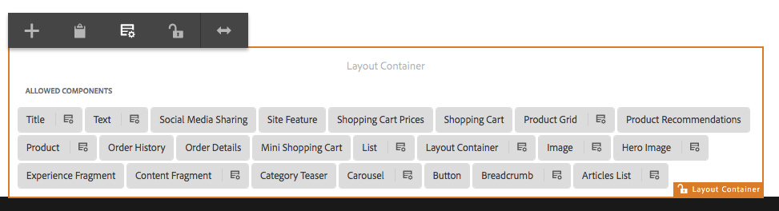

# Provar Editable Templates in We.Retail{#trying-out-editable-templates-in-we-retail}

Med de redigerbara mallarna är det inte längre bara en uppgift för utvecklare att skapa och underhålla mallar. En typ av avancerade användare, som kallas mallskapare, kan nu skapa mallar. Utvecklare måste fortfarande installera miljön, skapa klientbibliotek och skapa de komponenter som ska användas, men när dessa grunder väl är på plats kan mallskaparen skapa och konfigurera mallar utan något utvecklingsprojekt.

Alla sidor i We.Retail baseras på redigerbara mallar, vilket gör att icke-utvecklare kan anpassa och anpassa mallarna.

## Prova {#trying-it-out}

1. Redigera sidan Utrustning i huvudgrenen för språk.

   http://localhost:4502/editor.html/content/we-retail/language-masters/en/equipment.html

1. Observera att lägesväljaren inte längre har något designläge. Alla sidor för webben.Detaljhandel baseras på redigerbara mallar och för att ändra designen av redigerbara mallar måste de redigeras i mallredigeraren.
1. Från **Sidinformation** menyval **Redigera mall**.
1. Nu redigerar du Hero Page-mallen.

   Med hjälp av sidans strukturläge kan du ändra mallens struktur. Detta inkluderar till exempel de komponenter som är tillåtna i layoutbehållaren.

   

1. Konfigurera principerna för Layoutbehållaren för att definiera vilka komponenter som tillåts i behållaren.

   Profiler motsvarar designkonfigurationer.

   

1. I layoutdialogrutan för layoutbehållaren kan du

   * Välj en befintlig profil eller skapa en ny profil för behållaren
   * Välj vilka komponenter som tillåts i behållaren
   * Definiera de standardkomponenter som ska placeras när en resurs dras till behållaren

   

1. I mallredigeraren kan du redigera principen för textkomponenten i layoutbehållaren.

   På så sätt kan du:

   * Välj en befintlig profil eller skapa en ny profil för behållaren
   * Definiera de funktioner som är tillgängliga för sidförfattaren när den här komponenten, som

      * Tillåtna inklistringskällor
      * Formateringsalternativ
      * Tillåtna styckeformat
      * Specialtecken tillåts

   Många komponenter som bygger på kärnkomponenterna gör det möjligt att konfigurera alternativ på komponentnivå med hjälp av redigerbara mallar, vilket eliminerar behovet av anpassning av utvecklare.

   

1. I mallredigeraren kan du använda lägesväljaren för att ändra till **Ursprungligt innehåll** läge för att definiera vilket innehåll som krävs på sidan.

   **Layout** Du kan använda läget som det är på en normal sida för att definiera mallens layout.

## Mer information {#more-information}

Mer information finns i dokumentet [Skapa sidmallar](/help/sites-authoring/templates.md) eller utvecklardokumentsidan [Mallar - redigerbara](/help/sites-developing/page-templates-editable.md) för fullständig teknisk information om redigerbara mallar.

Du kanske också vill undersöka [kärnkomponenter](/help/sites-developing/we-retail-core-components.md). Se redigeringsdokumentet [Kärnkomponenter](https://experienceleague.adobe.com/docs/experience-manager-core-components/using/introduction.html) för en översikt över de viktigaste komponenternas och utvecklardokumentets funktioner [Utveckla kärnkomponenter](https://helpx.adobe.com/experience-manager/core-components/using/developing.html) för en teknisk översikt.
