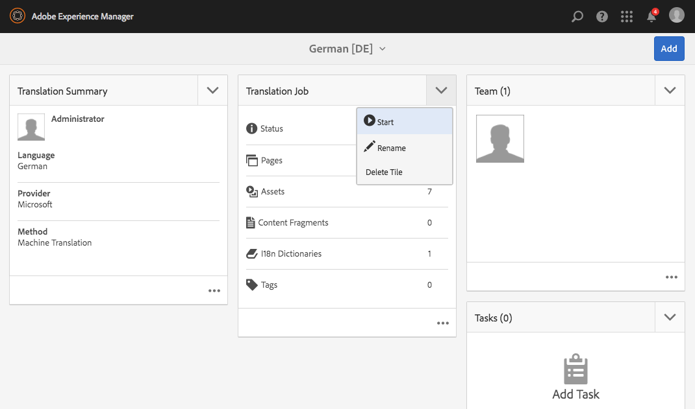

# Prova den globala webbplatsstrukturen i webb.butik{#trying-out-the-globalized-site-structure-in-we-retail}

Vi. Detaljhandeln har byggts med en global webbplatsstruktur som erbjuder en språkinställning som kan kopieras live till landsspecifika webbplatser. Allt är klart att användas för att experimentera med den här strukturen och de inbyggda översättningsfunktionerna.

## Prova {#trying-it-out}

1. Öppna webbplatskonsolen från **Global navigering > Platser**.
1. Växla till kolumnvyn (om den inte redan är aktiv) och välj We.Retail. Lägg märke till landstrukturen med Schweiz, USA, Frankrike och så vidare, tillsammans med Language Master.

   

1. Välj Schweiz och se språkrötterna för det landets språk. Det finns ännu inget innehåll under dessa rötter.

   

1. Växla till listvyn och se att språkkopiorna för länderna är live-kopior.

   

1. Återgå till kolumnvyn och klicka på Language Master och se språkinställningens rötter med innehåll. Det är bara engelska som har innehåll.

   Vi.Retail innehåller inget översatt innehåll, men strukturen och konfigurationen finns på plats så att du kan demonstrera översättningstjänsterna.

   

1. När den engelska språkversionen är markerad öppnar du **References** i webbplatskonsolen och väljer **Språkkopior**.

   

1. Markera kryssrutan bredvid etiketten **Språkkopior** om du vill välja alla språkkopior. I avsnittet **Uppdatera språkkopior** på listen väljer du alternativet **Skapa ett nytt översättningsprojekt**. Ange ett namn för projektet och klicka på **Uppdatera**.

   

1. Ett projekt skapas för varje språköversättning. Visa dem under **Navigering > Projekt**.

   

1. Klicka på tyska för att se information om översättningsprojektet. Status är i **Utkast**. Om du vill starta översättningen med Microsoft® översättningstjänst klickar du på markören bredvid rubriken **Översättningsjobb** och väljer **Start**.

   

1. Översättningsprojektet startar. Klicka på ellipsen längst ned på kortet Översättningsjobb för att se mer information. Sidor med läget **Klar för granskning** har redan översatts av översättningstjänsten.

   

1. Om du väljer en av sidorna i listan och sedan **Förhandsgranska på platser** i verktygsfältet öppnas den översatta sidan i sidredigeraren.

   

>[!NOTE]
>
>Den här proceduren demonstrerade den inbyggda integrationen med maskinöversättning från Microsoft®. Med [AEM Translation Integration Framework](/help/sites-administering/translation.md) kan du integrera med många standardöversättningstjänster för att samordna översättning av AEM.

## Mer information {#further-information}

Mer information finns i redigeringsdokumentet [Översätta innehåll för flerspråkiga platser](/help/sites-administering/translation.md) för fullständig teknisk information.
