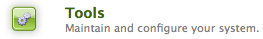
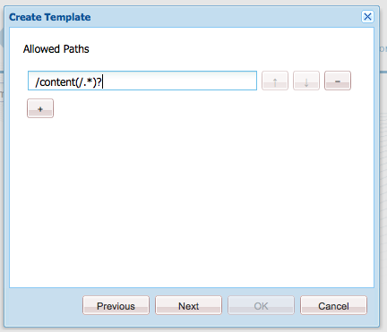
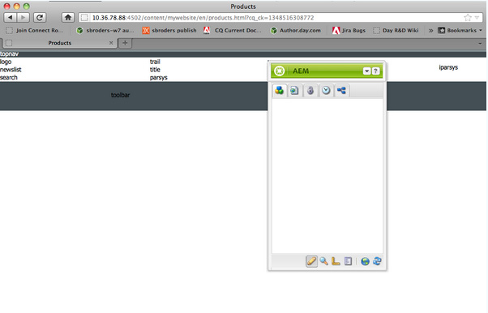
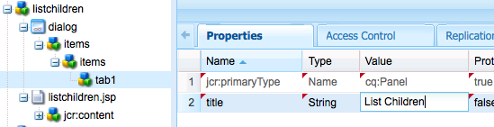
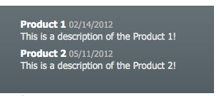
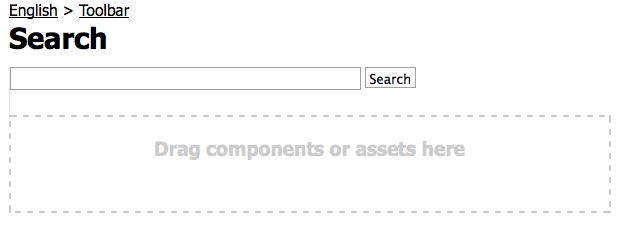

# Skapa en fullfjädrad webbplats (JSP){#create-a-fully-featured-website-jsp}

>[!NOTE]
>
>I den här artikeln beskrivs hur du skapar en webbplats med JSP och baserat på det klassiska användargränssnittet. Adobe rekommenderar att du använder de senaste AEM-teknikerna för dina webbplatser enligt beskrivningen i artikeln [Komma igång med att utveckla AEM-webbplatser](/help/sites-developing/getting-started.md).

Med den här självstudiekursen kan du skapa en komplett webbplats med Adobe Experience Manager (AEM). Webbplatsen kommer att vara baserad på en allmän webbplats och riktar sig främst till webbutvecklare. All utveckling sker i en författarmiljö.

I den här självstudien beskrivs hur du:

1. Installera AEM.
1. Få åtkomst till CRXDE Lite (utvecklingsmiljön).
1. Ställ in projektstrukturen i CRXDE Lite.
1. Skapa mallen, komponenten och skripten som används som bas för att skapa innehållssidor.
1. Skapa webbplatsens rotsida och sedan innehållssidorna.
1. Skapa följande komponenter som ska användas på sidorna:

   * Övre navigering
   * Lista underordnade
   * Logotyp
   * Bild
   * Text-Image
   * Sök

1. Inkludera olika grundkomponenter.

När du har utfört alla steg ser sidorna ut så här:


**Ladda ned slutresultatet**

Ladda ned webbplatsen-1.0.zip om du vill följa med i självstudiekursen i stället för att genomföra övningarna. Den här filen är ett AEM-innehållspaket som innehåller resultatet av den här självstudiekursen. Använd [Package Manager](/help/sites-administering/package-manager.md) för att installera paketet till din författarinstans.

**** OBS! Om du installerar det här paketet skrivs alla resurser på din redigeringsinstans som du har skapat med den här självstudiekursen över.

Webbplatsinnehållspaket

[Hämta fil](assets/website-1_0.zip)

## Installera Adobe Experience Manager {#installing-adobe-experience-manager}

Om du vill installera en AEM-instans för att utveckla din webbplats följer du instruktionerna för att konfigurera en [distributionsmiljö med författare- och publiceringsinstanser](/help/sites-deploying/deploy.md#author-and-publish-installs)eller utför en [allmän installation](/help/sites-deploying/deploy.md#default-local-install). Den generiska installationen innebär att du hämtar AEM Quickstart JAR-filen, placerar filen license.properties i samma katalog som JAR-filen och dubbelklickar på JAR-filen.

När du har installerat AEM får du tillgång till CRXDE Lite-utvecklingsmiljön genom att klicka på länken CRXDE Lite på välkomstsidan:


>[!NOTE]
>
>URL:en för CRXDE Lite för en AEM-redigeringsinstans som installeras lokalt med standardporten är [https://localhost:4502/crx/de/](https://localhost:4502/crx/de/).

### Konfigurera projektstrukturen i CRXDE Lite {#setting-up-the-project-structure-in-crxde-lite}

Använd CRXDE Lite för att skapa programstrukturen för mywebsite i databasen:

1. Högerklicka på mappen i trädet till vänster om CRXDE Lite och klicka på **`/apps`** Skapa **>** Skapa **** mapp ****. I dialogrutan **Skapa mapp** skriver du `mywebsite` mappnamnet och klickar på **OK**.
1. Högerklicka på **`/apps/mywebsite`** mappen och klicka på **Skapa** > **Skapa mapp**. I dialogrutan **Skapa mapp** skriver du `components` mappnamnet och klickar på **OK**.
1. Högerklicka på **`/apps/mywebsite`** mappen och klicka på **Skapa** > **Skapa mapp**. I dialogrutan **Skapa mapp** skriver du `templates` mappnamnet och klickar på **OK**.

   Strukturen i trädet bör nu se ut ungefär så här:

   

1. Klicka på **Spara alla**.

### Konfigurera designen {#setting-up-the-design}

I det här avsnittet skapar du designen för programmet med verktyget Designer. Designen innehåller CSS och bildresurser för din webbplats.

>[!NOTE]
>
>Klicka på följande länk för att ladda ned mywebsite.zip. Arkivet innehåller filerna static.css och image för din design.

Exempel på static.css-fil och bilder

[Hämta fil](assets/mywebsite.zip)

1. Klicka på **Verktyg** på välkomstsidan för AEM. ([https://localhost:4502/libs/cq/core/content/welcome.html](https://localhost:4502/libs/cq/core/content/welcome.html))

   

1. Markera mappen **Designs** i mappträdet och klicka sedan på **New** > **New Page**. Skriv `mywebsite` som titel och klicka på **Skapa**.

1. Om mywebsite-objektet inte visas i tabellen uppdaterar du trädet eller tabellen.

1. [Med WebDAV](/help/sites-administering/webdav-access.md) -åtkomst till URL:en på https://localhost:4502 kopierar du `static.css` exempelfilen och `images` -mappen från den hämtade filen minwebsite.zip till `/etc/designs/mywebsite` mappen.

   

### Skapa innehållsidesmallen, komponenten och skriptet {#creating-the-contentpage-template-component-and-script}

I det här avsnittet skapar du följande:

* Den innehållsidesmall som ska användas för att skapa innehållssidor på exempelwebbplatsen
* Den innehållsideskomponent som ska användas för att återge sidor med innehåll
* Innehållssidans skript

#### Skapa innehållsidesmallen {#creating-the-contentpage-template}

Skapa en mall som du kan använda som bas för webbplatsens webbsidor.

En mall definierar standardinnehållet för en ny sida. Komplexa webbplatser kan använda flera mallar för att skapa olika typer av sidor på webbplatsen. I den här övningen är alla sidor baserade på en enkel mall.

1. Högerklicka i mappträdet för CRXDE Lite `/apps/mywebsite/templates` och klicka på **Skapa** > **Skapa mall**.

1. I dialogrutan Skapa mall skriver du följande värden och klickar sedan på **Nästa**:

   * **Etikett**: innehållsida
   * **Titel**: Min mall för webbplatsinnehållssida
   * **Beskrivning**: Det här är min mall för webbplatsens innehållssida
   * **** Resurstyp: mywebsite/components/contentpage
   Använd standardvärdet för egenskapen Ranking.

   

   Resurstypen identifierar komponenten som återger sidan. I det här fallet återges alla sidor som skapas med innehållsidesmallen av `mywebsite/components/contentpage` komponenten.

1. Om du vill ange sökvägarna för sidorna som kan använda den här mallen klickar du på plusknappen och skriver `/content(/.*)?` i textrutan som visas. Klicka sedan på **Nästa**.

   

   Värdet för den tillåtna egenskapen path är ett *reguljärt uttryck.* Sidor som har en sökväg som matchar uttrycket kan använda mallen. I det här fallet matchar det reguljära uttrycket sökvägen till mappen **/content** och alla undersidor.

   När en författare skapar en sida under /content visas **innehållsmallen** i en lista över tillgängliga mallar som ska användas.

1. Klicka på **Nästa** på panelerna **Tillåtna överordnade** och **Tillåtna underordnade** och klicka på **OK**. Klicka på **Spara alla** i CRXDE Lite.

   

#### Skapa komponenten ContentPage {#creating-the-contentpage-component}

Skapa den *komponent* som definierar innehållet och återger sidorna som använder innehållsmallen. Platsen för komponenten måste motsvara värdet för egenskapen Resurstyp i innehållsidesmallen.

1. Högerklicka i CRXDE Lite `/apps/mywebsite/components` och klicka på **Skapa** > **Komponent**.
1. I dialogrutan **Skapa komponent** skriver du följande egenskapsvärden:

   * **Etikett**: innehållsida
   * **Titel**: Min webbsidkomponent
   * **Beskrivning**: Det här är min innehållskomponent för webbplats
   

   Platsen för den nya komponenten är `/apps/mywebsite/components/contentpage`. Den här sökvägen motsvarar innehållsmallens resurstyp (minus den inledande **`/apps/`** delen av sökvägen).

   Denna korrespondens kopplar mallen till komponenten och är avgörande för att webbplatsen ska fungera korrekt.

1. Klicka på **Nästa** tills panelen Tillåtna underordnade i dialogrutan visas och klicka sedan på **OK**. Klicka på **Spara alla** i CRXDE Lite.

   Strukturen ser nu ut så här:

   

#### Utveckla skript för komponenten ContentPage {#developing-the-contentpage-component-script}

Lägg till kod i skriptet contentpage.jsp för att definiera sidinnehållet.

1. Öppna filen i CRXDE Lite `contentpage.jsp` i `/apps/mywebsite/components/contentpage`. Filen innehåller följande kod som standard:

   ```java
   <%--
   
     My Website Content Page Component component.
   
     This is My Website Content Page Component.
   
   --%><%
   %><%@include file="/libs/foundation/global.jsp"%><%
   %><%@page session="false" %><%
   %><%
       /* TODO add you code here */
   %>
   ```

1. Kopiera följande kod och klistra in den i contentpage.jsp efter standardkoden:

   ```java
   <%@ page language="java" contentType="text/html; charset=ISO-8859-1"
       pageEncoding="ISO-8859-1"%>
   <!DOCTYPE html PUBLIC "-//W3C//DTD HTML 4.01 Transitional//EN"
   "https://www.w3.org/TR/html4/loose.dtd">
   <html>
   <head>
   <meta http-equiv="Content-Type" content="text/html; charset=ISO-8859-1">
   <title>My title</title>
   </head>
   <body>
   <div>My body</div>
   </body>
   </html>
   ```

1. Klicka på **Spara alla** för att spara ändringarna.

### Skapa webbsidor och innehållssidor {#creating-your-website-page-and-content-pages}

I det här avsnittet skapar du följande sidor som alla använder innehållsidesmallen: Min webbplats, engelska, produkter, tjänster och kunder.

1. Klicka på Webbplatser på AEM-välkomstsidan ([https://localhost:4502/libs/cq/core/content/welcome.html](https://localhost:4502/libs/cq/core/content/welcome.html)).

   

1. Markera mappen **Webbplatser** i mappträdet och klicka sedan på **Ny** > **Ny sida**.
1. I fönstret **Skapa sida** anger du följande:

   * Titel: `My Website`
   * Namn: `mywebsite`
   * Välj `My Website Content Page Template`
   

1. Klicka på **Skapa**. I mappträdet väljer du sidan **/Webbplatser/Min webbplats** och klickar på **Ny** > **Ny sida**.
1. Ange följande egenskapsvärden i dialogrutan Skapa sida och klicka sedan på Skapa:

   * Titel: Engelska
   * Namn: en
   * Välj sidmallen Min webbplats innehåll

1. I mappträdet väljer du sidan **/Webbplatser/Min webbplats/engelska** och klickar på **Ny**> **Ny sida**.
1. I dialogrutan **Skapa sida** anger du följande egenskapsvärden och klickar sedan på **Skapa**:

   * Titel:Produkter
   * Välj sidmallen Min webbplats innehåll

1. I mappträdet väljer du sidan **/Webbplatser/Min webbplats/engelska** och klickar på **Ny** > **Ny sida**.
1. I dialogrutan **Skapa sida** anger du följande egenskapsvärden och klickar sedan på **Skapa**:

   * Titel:Tjänster
   * Välj sidmallen Min webbplats innehåll

1. I mappträdet väljer du sidan **/Webbplatser/Min webbplats/engelska** och klickar på **Ny** > **Ny sida**.
1. I dialogrutan **Skapa sida** anger du följande egenskapsvärden och klickar sedan på **Skapa**:

   * Titel: Kunder
   * Välj sidmallen Min webbplats innehåll
   Din struktur ser ut så här:

   

1. Om du vill länka sidorna till mywebsite design väljer du `/content/mywebsite/en/jcr:content` noden i CRXDE Lite. På fliken Egenskaper anger du följande värden för en ny egenskap och klickar sedan på Lägg till:

   * Namn: cq:designPath
   * Typ:Sträng
   * Värde: /etc/designs/mywebsite
   

1. Öppna [https://localhost:4502/content/mywebsite/en/products.html](https://localhost:4502/content/mywebsite/en/products.html) i en ny webbläsarflik eller ett nytt fönster för att se sidan Produkter:

   

### Förbättra innehållssidans skript {#enhancing-the-contentpage-script}

I det här avsnittet beskrivs hur du förbättrar innehållssidans skript med AEM Foundation-komponentskript och genom att skriva egna skript.

Sidan **Produkter** ser ut så här:


#### Använda skript för startsidan {#using-the-foundation-page-scripts}

I den här övningen konfigurerar du sidinnehållskomponenten så att dess supertyp är AEM Page-komponenten. Eftersom komponenter ärver funktionerna i sin supertyp ärver sidinnehållet skripten och egenskaperna för sidkomponenten.

I en komponent-JSP-kod kan du till exempel referera till de skript som supertypskomponenten tillhandahåller som om de är inkluderade i komponenten.

1. I CRXDE Lite lägger du till en egenskap i `/apps/mywebsite/components/contentpage` noden.

   1. Select the `/apps/mywebsite/components/contentpage` node.
   1. Ange följande egenskapsvärden längst ned på fliken Egenskaper och klicka sedan på Lägg till:

      * **** Namn: sling:resourceSuperType
      * **** Typ:Sträng
      * **** Värde: grund/komponenter/sida
   1. Klicka på Spara alla.


1. Öppna `contentpage.jsp` filen under `/apps/mywebsite/components/contentpage` och ersätt den befintliga koden med följande kod:

   ```xml
   <%@include file="/libs/foundation/global.jsp"%><%
   %><%@page session="false" contentType="text/html; charset=utf-8" %><%
   %><!DOCTYPE HTML PUBLIC "-//W3C//DTD HTML 4.01//EN" "https://www.w3.org/TR/html4/strict.dtd">
   <html>
   <cq:include script="head.jsp"/>
   <cq:include script="body.jsp"/>
   </html>
   ```

1. Spara ändringarna.
1. Läs in sidan Produkter igen i webbläsaren. Den ser ut så här:

   

   Öppna sidans källa för att se de javascript- och HTML-element som skripten head.jsp och body.jsp genererar. Följande skriptutdrag öppnar Sidekick när du öppnar sidan:

   ```java
   CQ.WCM.launchSidekick("/content/mywebsite/en/products",
               {propsDialog: "/libs/foundation/components/page/dialog",
                  locked: false locked: false
                });
   ```

#### Använda egna skript {#using-your-own-scripts}

I det här avsnittet skapar du flera skript som varje skript skapar en del av sidans brödtext. Sedan skapar du filen body.jsp i pagcontent-komponenten för att åsidosätta body.jsp i AEM Page-komponenten. I filen body.jsp tar du med skript som genererar olika delar av sidans brödtext.

**** Tips: När en komponent innehåller en fil som har samma namn och relativa plats som en fil i komponentens supertyp, kallas den *overlay*.

1. I CRXDE Lite skapar du filen `left.jsp` under `/apps/mywebsite/components/contentpage`:

   1. Högerklicka på noden `/apps/mywebsite/components/contentpage`och välj sedan **Skapa **och **Skapa fil**.

   1. I fönstret skriver du `left.jsp` som **namn** och klickar på **OK**.

1. Redigera filen `left.jsp` för att ta bort befintligt innehåll och ersätta med följande kod:

   ```java
   <%@include file="/libs/foundation/global.jsp"%><%
   %><div class="left">
   <div>logo</div>
   <div>newslist</div>
   <div>search</div>
   </div>
   ```

1. Spara ändringarna.
1. I CRXDE Lite skapar du filen `center.jsp` under `/apps/mywebsite/components/contentpage`:

   1. Högerklicka på noden `/apps/mywebsite/components/contentpage`, välj **Skapa** och sedan **Skapa fil**.

   1. Skriv `center.jsp` som **Namn** i dialogrutan och klicka på **OK**.

1. Redigera filen `center.jsp` för att ta bort det befintliga innehållet och ersätta det med följande kod:

   ```java
   <%@include file="/libs/foundation/global.jsp"%><%
   %><div class="center">
   <div>trail</div>
   <div>title</div>
   <div>parsys</div>
   </div>
   ```

1. Spara ändringarna.
1. I CRXDE Lite skapar du filen `right.jsp` under `/apps/mywebsite/components/contentpage`:

   1. Högerklicka på noden `/apps/mywebsite/components/contentpage`, välj **Skapa** och sedan **Skapa fil**.

   1. Skriv `right.jsp` som **Namn** i dialogrutan och klicka på **OK**.

1. Redigera filen `right.jsp` för att ta bort befintligt innehåll och ersätta med följande kod:

   ```java
   <%@include file="/libs/foundation/global.jsp"%><%
   %><div class="right">
   <div>iparsys</div>
   </div>
   ```

1. Spara ändringarna.
1. I CRXDE Lite skapar du filen `body.jsp` under `/apps/mywebsite/components/contentpage`:
1. Redigera filen `body.jsp` för att ta bort befintligt innehåll och ersätta med följande kod:

   ```java
   <%@include file="/libs/foundation/global.jsp"%><%
   %><body>
   <div id="CQ">
   <div class="topnav">topnav</div>
   <div class="content">
   <cq:include script="left.jsp" />
   <cq:include script="center.jsp" />
   <cq:include script="right.jsp" />
   </div>
   <div class="footer">
   <div class="toolbar">toolbar</div>
   </div>
   </div>
   </body>
   ```

1. Spara ändringarna.
1. Läs in sidan Produkter igen i webbläsaren. Den ser ut så här:

   

### Skapa den övre navigeringskomponenten {#creating-the-top-navigation-component}

I det här avsnittet skapar du en komponent som visar länkar till alla sidor på den översta nivån på webbplatsen för att underlätta navigeringen. Det här komponentinnehållet visas överst på alla sidor som skapas med innehållsidesmallen.

I den första versionen av den översta navigeringskomponenten (överst) är navigeringsobjekten endast textlänkar. I den andra versionen implementerar du topnav med bildnavigeringslänkar.

Den övre navigeringen ser ut så här:


#### Skapa den övre navigeringskomponenten {#creating-the-top-navigation-component-1}

1. I CRXDE Lite högerklickar du `/apps/mywebsite/components`, väljer **Skapa** och sedan **Skapa komponent**.
1. Ange följande i fönstret **Skapa komponent** :

   * **Etikett**: `topnav`

   * **Titel**: `My Top Navigation Component`

   * **Beskrivning**: `This is My Top Navigation Component`

1. Klicka på **Nästa** tills du kommer till det sista fönstret där du klickar på **OK**. Spara ändringarna.

#### Skapa det övre navigeringsskriptet med textlänkar {#creating-the-top-navigation-script-with-textual-links}

Lägg till återgivningsskriptet längst upp för att generera textlänkar till underordnade sidor:

1. I CRXDE Lite öppnar du filen `topnav.jsp` under `/apps/mywebsite/components/topnav`.
1. Ersätt koden som finns där genom att kopiera och klistra in följande kod:

   ```xml
   <%@include file="/libs/foundation/global.jsp"%><%
   %><%@ page import="java.util.Iterator,
           com.day.text.Text,
           com.day.cq.wcm.api.PageFilter, com.day.cq.wcm.api.Page" %><%
       /* get starting point of navigation */
       Page navRootPage = currentPage.getAbsoluteParent(2);
       if (navRootPage == null && currentPage != null) {
       navRootPage = currentPage;
       }
       if (navRootPage != null) {
           Iterator<Page> children = navRootPage.listChildren(new PageFilter(request));
           while (children.hasNext()) {
               Page child = children.next();
               %><a href="<%= child.getPath() %>.html"><%=child.getTitle() %></a><%
           }
       }
   %>
   ```

#### Inkludera översta navigering i innehållsideskomponenten {#including-top-navigation-in-the-contentpage-component}

Så här inkluderar du topnav i innehållsideskomponenten:

1. I CRXDE Lite öppnar du `body.jsp` under `/apps/mywebsite/components/contentpage`och ersätter:

   ```xml
   <div class="topnav">topnav</div>
   ```

   med:

   ```xml
   <cq:include path="topnav" resourceType="mywebsite/components/topnav" />
   ```

1. Spara ändringarna.
1. Läs in produktsidan igen i webbläsaren. Den översta navigeringen ser ut så här:

   

#### Förbättra sidor med undertexter {#enhancing-pages-with-subtitles}

Komponenten Sida definierar egenskaper som gör att du kan ange underrubriker för sidor. Lägg till undertexter med information om sidinnehållet.

1. Öppna sidan **Produkter** i webbläsaren.
1. På fliken **Sidspark** klickar du på **Sidegenskaper**.
1. På fliken Grundläggande i dialogrutan expanderar du **Fler titlar och beskrivningar,** och för egenskapen **Underrubrik** skriver du **vad vi gör**. Click **OK**.
1. Upprepa föregående steg för att lägga till underrubriken **om våra tjänster** på sidan **Tjänster** .
1. Upprepa föregående steg för att lägga till underrubriken **till det förtroende vi tjänar** på sidan **Kunder** .

   **** Tips: I CRXDE Lite väljer du noden /content/mywebsite/en/products/jcr:content för att se att undertextegenskapen har lagts till.

#### Förbättra den övre navigeringen med hjälp av bildlänkar {#enhance-top-navigation-by-using-image-links}

Förbättra återgivningsskriptet för den övre komponenten så att bildlänkar används i stället för hypertext för navigeringskontrollerna. Bilden innehåller länkmålets titel och underrubrik.

Den här övningen visar hur [Sling-begäran behandlas](/help/sites-developing/the-basics.md#sling-request-processing). Skriptet topnav.jsp ändras för att anropa ett skript som dynamiskt genererar bilder som ska användas för sidnavigeringslänkarna. I den här övningen tolkar Sling URL:en för bildkällfiler för att avgöra vilket skript som ska användas för att återge bilderna.

Till exempel kan bildlänken till sidan Produkter vara https://localhost:4502/content/mywebsite/en/products.navimage.png. Sling tolkar denna URL för att fastställa resurstypen och skriptet som ska användas för att återge resursen:

1. Sling avgör sökvägen till resursen som ska `/content/mwebysite/en/products.png.`
1. Sling matchar den här sökvägen med `/content/mywebsite/en/products` noden.
1. Sling avgör vilken nod `sling:resourceType` som ska vara `mywebsite/components/contentpage`.

1. Sling hittar det skript i den här komponenten som bäst matchar URL-väljaren ( `navimage`) och filnamnstillägget ( `png`).

I den här övningen matchar Sling dessa URL:er med det /apps/mywebsite/components/contentpage/navimage.png.java-skript som du skapar.

1. I CRXDE Lite öppnar du `topnav.jsp` under `/apps/mywebsite/components/topnav.`Hitta innehållet i ankarelementet (rad 14):

   ```xml
   <%=child.getTitle() %>
   ```

1. Ersätt ankarinnehållet med följande kod:

   ```xml
   " src="<%= child.getPath() %>.navimage.png">
   ```

1. Spara ändringarna.
1. Högerklicka på `/apps/mywebsite/components/contentpage` noden och klicka på **Skapa** > **Skapa fil**.
1. I fönstret **Skapa fil** skriver du **Namn**`navimage.png.java`.

   Filnamnstillägget .java anger för Sling att stödet för Apache Sling Scripting Java ska användas för att kompilera skriptet och skapa en serverlet.

1. Kopiera följande kod till `navimage.png.java.`Koden utökar klassen AbstractImageServlet:

   * [AbstractImageServlet](https://helpx.adobe.com/experience-manager/6-5/sites/developing/using/reference-materials/javadoc/com/day/cq/wcm/commons/AbstractImageServlet.html) skapar ett ImageContext-objekt som lagrar den aktuella resursens egenskaper.
   * Resursens överordnade sida extraheras från ImageContext-objektet. Därefter hämtas sidans titel och underrubrik.
   * [ImageHelper](https://helpx.adobe.com/experience-manager/6-5/sites/developing/using/reference-materials/javadoc/com/day/cq/commons/ImageHelper.html) används för att generera bilden från filen name_bg.jpg för webbplatsdesignen, sidrubriken och sidans underrubrik.

   ```java
   package apps.mywebsite.components.contentpage;
   
   import java.awt.Color;
   import java.awt.Paint;
   import java.awt.geom.Rectangle2D;
   
   import java.io.IOException;
   import javax.jcr.RepositoryException;
   
   import com.day.cq.wcm.api.Page;
   import com.day.cq.wcm.api.PageManager;
   import com.day.cq.wcm.api.components.Component;
   import com.day.cq.wcm.api.designer.Designer;
   
   import com.day.cq.commons.SlingRepositoryException;
   import com.day.cq.wcm.commons.WCMUtils;
   import com.day.cq.wcm.commons.AbstractImageServlet;
   import com.day.cq.commons.ImageHelper;
   
   import com.day.image.Font;
   import com.day.image.Layer;
   
   import org.apache.sling.api.SlingHttpServletRequest;
   import org.apache.sling.api.SlingHttpServletResponse;
   import org.apache.sling.api.resource.Resource;
   import org.apache.sling.api.servlets.SlingSafeMethodsServlet;
   
   /**
     * Renders the navigation image
     */
   public class navimage_png extends AbstractImageServlet {
   
         protected Layer createLayer(ImageContext ctx)
                throws RepositoryException, IOException {
            PageManager pageManager = ctx.resolver.adaptTo(PageManager.class);
            Page currentPage = pageManager.getContainingPage(ctx.resource);
   
            /* constants for image appearance */
            int scale = 6;
            int paddingX = 24;
            int paddingY = 24;
            Color bgColor = new Color(0x004a565c, true);
   
            /* obtain the page title */
            String title = currentPage.getTitle();
            if (title == null) {
                title = currentPage.getName();
            }
   
            /* format the title text */
            title = title.toUpperCase();
            Paint titleColor = Color.WHITE;
            Font titleFont = new Font("Myriad Pro", 10 * scale, Font.BOLD);
            int titleBase = 10 * scale;
   
            /* obtain and format the page subtitle */
            String subtitle = currentPage.getProperties().get("subtitle", "");
            Paint subtitleColor = new Color(0xffa9afb1, true);
            Font subTitleFont = new Font("Tahoma", 7);
            int subTitleBase = 20;
   
            /* create a layer that contains the background image from the mywebsite design */
            Designer dg = ctx.resolver.adaptTo(Designer.class);
            String imgPath = new String(dg.getDesignPath(currentPage)+"/images/navimage_bg.jpg");
            Layer bg = ImageHelper.createLayer(ctx.resolver.resolve(imgPath));
   
            /* draw the title text (4 times bigger) */
            Rectangle2D titleExtent = titleFont.getTextExtent(0, 0, 0, 0, title, Font.ALIGN_LEFT, 0, 0);
            Rectangle2D subtitleExtent = subTitleFont.getTextExtent(0, 0, 0, 0, subtitle, Font.ALIGN_LEFT, 0, 0);
   
            /* ensure subtitleExtent is wide enough */
            if ( subtitle.length() > 0 ) {
                int titleWidth = (int)titleExtent.getWidth() / scale;
                if ( subtitleExtent.getWidth() > titleWidth && subtitleExtent.getWidth() + 2 * paddingX >
    bg.getWidth() ) {
                    int charWidth = (int)subtitleExtent.getWidth() / subtitle.length();
                    int maxWidth = (bg.getWidth() > titleWidth + 2  * paddingX ? bg.getWidth() - 2 * paddingX : titleWidth);
                    int len = (maxWidth - ( 2 * charWidth) ) / charWidth;
                    subtitle = subtitle.substring(0, len) + "...";
                    subtitleExtent = subTitleFont.getTextExtent(0, 0, 0, 0, subtitle, Font.ALIGN_LEFT, 0, 0);
                }
            }
            int width = Math.max((int) titleExtent.getWidth(), (int) subtitleExtent.getWidth());
           /* create the text layer */
            Layer text = new Layer(width, (int) titleExtent.getHeight() + 40, new Color(0x01ffffff, true));
            text.setPaint(titleColor);
            text.drawText(0, titleBase, 0, 0, title, titleFont, Font.ALIGN_LEFT | Font.ALIGN_BASE, 0, 0);
            text.resize(text.getWidth() / scale, text.getHeight() / scale);
            text.setX(0);
            text.setY(0);
   
            if (subtitle.length() > 0) {
                /* draw the subtitle normal sized */
                text.setPaint(subtitleColor);
                text.drawText(0, subTitleBase, 0, 0, subtitle, subTitleFont, Font.ALIGN_LEFT | Font.ALIGN_BASE, 0, 0);
            }
   
            /* merge the image and text layers */
            text.setY(paddingY);
            text.setX(paddingX);
            text.setBackgroundColor(bgColor);
   
            int bgWidth = bg.getWidth();
            if ( text.getWidth() + 2 * paddingX > bgWidth ) {
                bgWidth = text.getWidth() + 2 * paddingX;
                bg.resize(bgWidth, bg.getHeight());
            }
            bg.merge(text);
   
            return bg;
        }
    }
   ```

1. Spara ändringarna.
1. Läs in sidan Produkter igen i webbläsaren. Den övre navigeringen visas nu på följande sätt:

   

### Skapa komponenten List Children {#creating-the-list-children-component}

Skapa komponenten listchild som genererar en lista med sidlänkar som innehåller sidans titel, beskrivning och datum (till exempel produktsidor). Länkarna är avsedda för den aktuella sidans underordnade sidor, eller för en rotsida som anges i komponentdialogrutan.


#### Skapa produktsidor {#creating-product-pages}

Skapa två sidor under sidan Produkter. För varje sida, som beskriver två specifika produkter, anger du en titel, en beskrivning och ett datum.

1. I mappträdet på sidan Webbplatser väljer du alternativet Webbplatser/Min webbplats/engelska/Produkter och klickar på Ny > Ny sida.
1. Ange följande egenskapsvärden i dialogrutan och klicka sedan på Skapa:

   * Titel: Produkt 1.
   * Namn: product1.
   * Välj Min mall för webbplatsinnehållssida

1. Skapa en till sida under Produkter med följande egenskapsvärden:

   * Titel: Produkt 2
   * Namn: product2
   * Välj Min mall för webbplatsinnehållssida

1. I CRXDE Lite anger du en beskrivning och ett datum för sidan Product 1:

   1. Select the `/content/mywebsite/en/products/product1/jcr:content` node.
   1. Ange följande värden på fliken **Egenskaper** :

      * Namn: `jcr:description`
      * Typ: `String`
      * Värde: `This is a description of the Product 1!.`
   1. Click **Add**.
   1. Skapa en annan egenskap med följande värden på fliken **Egenskaper** :

      * Namn:datum
      * Typ:Sträng
      * Värde: 02/14/2008
      * Klicka på Lägg till
   1. Klicka på Spara alla.


1. I CRXDE Lite anger du en beskrivning och ett datum för sidan Product 2:

   1. Välj noden /content/mywebsite/en/products/product2/jcr:content.
   1. Ange följande värden på fliken **Egenskaper** :

      * Namn:jcr:description
      * Typ:Sträng
      * Värde: Detta är en beskrivning av produkt 2!.
   1. Click **Add**.
   1. Ersätt de tidigare värdena i samma textrutor med följande värden:

      * Namn:datum
      * Typ:Sträng
      * Värde: 05/11/2012
      * Klicka på Lägg till
   1. Klicka på Spara alla.


#### Skapa komponenten List Children {#creating-the-list-children-component-1}

Så här skapar du komponenten listchildren:

1. I CRXDE Lite högerklickar du `/apps/mywebsite/components`, väljer **Skapa** och sedan **Skapa komponent**.
1. Ange följande egenskapsvärden i dialogrutan och klicka sedan på Nästa:

   * Etikett: listchildren.
   * Titel: Min ListChildren-komponent.
   * Beskrivning: Det här är min ListChildren-komponent.

1. Fortsätt klicka på Nästa tills panelen Tillåtna underordnade visas och klicka sedan på OK.

#### Skapa skriptet List Children {#creating-the-list-children-script}

Utveckla skriptet för listchild-komponenten.

1. I CRXDE Lite öppnar du filen `listchildren.jsp` under `/apps/mywebsite/components/listchildren`.
1. Ersätt standardkoden med följande kod:

   ```xml
   <%@include file="/libs/foundation/global.jsp"%><%
   %><%@ page import="java.util.Iterator,
            com.day.cq.wcm.api.PageFilter"%><%
        /* Create a new Page object using the path of the current page */
         String listroot = properties.get("listroot", currentPage.getPath());
        Page rootPage = pageManager.getPage(listroot);
        /* iterate through the child pages and gather properties */
        if (rootPage != null) {
            Iterator<Page> children = rootPage.listChildren(new PageFilter(request));
            while (children.hasNext()) {
                Page child = children.next();
                String title = child.getTitle() == null ? child.getName() : child.getTitle();
                String date = child.getProperties().get("date","");
                %><div class="item">
                <a href="<%= child.getPath() %>.html"><b><%= title %></b></a>
                <span><%= date %></code><br>
                <%= child.getProperties().get("jcr:description","") %><br>
                </div><%
            }
        }
    %>
   ```

1. Spara ändringarna.

#### Skapa dialogrutan Lista underordnade {#creating-the-list-children-dialog}

Skapa den dialogruta som används för att konfigurera komponentegenskaperna listchildren.

1. Skapa dialognoden under komponenten listchildren:

   1. Högerklicka på `/apps/mywebsite/components/listchildren`noden i CRXDE Lite och klicka på **Skapa** > **Skapa dialogruta**.

   1. Ange följande egenskapsvärden i dialogrutan och klicka på OK

      * **Etikett**: `dialog`

      * **Titel**: `Edit Component` och klicka på **OK**.
   

   Med följande egenskaper:

   

1. Select the `/apps/mywebsite/components/listchildren/dialog/items/items/tab1` node.
1. Ändra värdet på **title** -egenskapen på fliken Egenskaper till `List Children`

   

1. Markera noden tab1 och klicka på Skapa > Skapa nod, ange följande egenskapsvärden och klicka på OK:

   * Namn: objekt
   * Typ: cq:WidgetCollection
   

1. Skapa en nod under noden items med följande egenskapsvärden:

   * Namn: listroot
   * Typ: cq:Widget
   

1. Lägg till egenskaper för listrotnoden för att konfigurera den som ett textfält. Varje rad i följande tabell representerar en egenskap. När du är klar klickar du på Spara alla.

   | Namn | Typ | Värde |
   |---|---|---|
   | fieldLabel | Sträng | Sökväg till listroten |
   | name | Sträng | ./listroot |
   | xtype | Sträng | textfält |

   

#### Ta med listunderordnade i komponenten ContentPage {#including-list-children-in-the-contentpage-component}

Så här tar du med komponenten listchild i innehållsideskomponenten:

1. I CRXDE Lite öppnar du filen `left.jsp` under `/apps/mywebsite/components/contentpage` och hittar följande kod (rad 4):

   ```xml
   <div>newslist</div>
   ```

1. Ersätt koden med följande kod:

   ```xml
   <cq:include path="newslist" resourceType="mywebsite/components/listchildren" />
   ```

1. Spara ändringarna.

#### Visa listans underordnade på en sida {#viewing-list-children-in-a-page}

Om du vill se den här komponentens fullständiga funktion kan du visa sidan Produkter:

* när den överordnade sidan (&quot;Sökväg till listrot&quot;) inte har definierats.
* när den överordnade sidan (&quot;Sökväg till listrot&quot;) har definierats.

1. Läs in produktsidan igen i webbläsaren. Komponenten listchildren visas så här:

   

1. 

1. Som sökväg till listroten anger du: `/content/mywebsite/en`. Klicka på OK. Komponenten listchildren på sidan ser nu ut så här:

   

### Skapa logokomponenten {#creating-the-logo-component}

Skapa en komponent som visar företagets logotyp och tillhandahåller en länk till webbplatsens hemsida. Komponenten innehåller en dialogruta för designläge så att egenskapsvärden lagras i webbplatsdesignen (/etc/designs/mywebsite):

* Egenskapsvärdena gäller för alla instanser av komponenten som läggs till på sidor som använder designen.
* Egenskaperna kan konfigureras med valfri instans av komponenten som finns på en sida som använder designen.

Dialogrutan för designläge innehåller egenskaper för att ange bilden och länksökvägen. Logotypkomponenten placeras på den övre vänstra sidan på alla sidor på webbplatsen.

Den kommer att se ut så här:


>[!NOTE]
>
>Adobe Experience Manager är en mer komplett logotypkomponent ( `/libs/foundation/components/logo`).

#### Skapa logokomponentnoden {#creating-the-logo-component-node}

Så här skapar du logotypkomponenten:

1. I CRXDE Lite högerklickar du på /apps/mywebsite/components, väljer **Create** och sedan **Create Component**.
1. I dialogrutan Skapa komponent anger du följande egenskapsvärden och klickar sedan på Nästa:

   * Etikett: `logo`.
   * Titel: `My Logo Component`.
   * Beskrivning: `This is My Logo Component`.

1. Klicka på Nästa tills du kommer till den sista panelen i dialogrutan och klicka sedan på **OK**.

#### Skapa logotypskript {#creating-the-logo-script}

I det här avsnittet beskrivs hur du skapar skriptet för att visa logotypbilden med en länk till hemsidan.

1. I CRXDE Lite öppnar du filen `logo.jsp` under `/apps/mywebsite/components/logo`.
1. Följande kod skapar länken till webbplatsens hemsida och lägger till en referens till logotypbilden. Kopiera koden till `logo.jsp`:

   ```xml
   <%@include file="/libs/foundation/global.jsp"%><%
   %><%@ page import="com.day.text.Text,
                      com.day.cq.wcm.foundation.Image,
                      com.day.cq.commons.Doctype" %><%
       /* obtain the path for home */
       long absParent = currentStyle.get("absParent", 2L);
       String home = Text.getAbsoluteParent(currentPage.getPath(), (int) absParent);
       /* obtain the image */
       Resource res = currentStyle.getDefiningResource("imageReference");
       if (res == null) {
           res = currentStyle.getDefiningResource("image");
       }
       /* if no image use text link, otherwise draw the image */
       %>
   <a href="<%= home %>.html"><%
       if (res == null) {
           %>Home<%
       } else {
           Image img = new Image(res);
           img.setItemName(Image.NN_FILE, "image");
           img.setItemName(Image.PN_REFERENCE, "imageReference");
           img.setSelector("img");
           img.setDoctype(Doctype.fromRequest(request));
           img.setAlt("Home");
           img.draw(out);
       }
       %></a>
   ```

1. Spara ändringarna.

#### Skapa dialogrutan Logotypdesign {#creating-the-logo-design-dialog}

Skapa en dialogruta där du kan konfigurera logotypkomponenten i designläge. Dialogrutans noder i designläge måste namnges `design_dialog`.

1. Skapa dialognoden under logokomponenten:

   1. Högerklicka på `/apps/mywebsite/components/logo` noden och klicka på **Skapa** > **Skapa dialogruta**.

   1. Ange följande egenskapsvärden och klicka sedan på OK:

      * **** Etikett: `design_dialog`

      * **** Titel: `Logo (Design)`

1. Högerklicka på noden tab1 i grenen design_dialog och klicka på Ta bort. Klicka på Spara alla.
1. Under `design_dialog/items/items`noden skapar du en ny nod med namnet `img` av typen `cq:Widget`. Lägg till följande egenskaper och klicka sedan på Spara alla:

   | Namn | Typ | Värde |
   |---|---|---|
   | fileNameParameter | Sträng | ./imageName |
   | fileReferenceParameter | Sträng | ./imageReference |
   | name | Sträng | ./image |
   | title | Sträng | Bild |
   | xtype | Sträng | html5smartimage |

   

#### Skapa logotypåtergivningsskript {#creating-the-logo-render-script}

Skapa skriptet som hämtar logotypbilden och skriver det på sidan.

1. Högerklicka på logotypkomponentnoden och klicka på Skapa > Skapa fil för att skapa skriptfilen img.GET.java.
1. Öppna filen, kopiera följande kod till filen och klicka sedan på Spara alla:

```java
package apps.mywebsite.components.logo;

import java.io.IOException;
import java.io.InputStream;

import javax.jcr.RepositoryException;
import javax.jcr.Property;
import javax.servlet.http.HttpServletResponse;

import com.day.cq.wcm.foundation.Image;
import com.day.cq.wcm.commons.RequestHelper;
import com.day.cq.wcm.commons.WCMUtils;
import com.day.cq.wcm.commons.AbstractImageServlet;
import com.day.cq.commons.SlingRepositoryException;
import com.day.image.Layer;
import org.apache.commons.io.IOUtils;
import org.apache.sling.api.SlingHttpServletRequest;
import org.apache.sling.api.SlingHttpServletResponse;
import org.apache.sling.api.resource.Resource;
import org.apache.sling.api.resource.ValueMap;
import org.apache.sling.api.servlets.SlingSafeMethodsServlet;

/**
 * Renders an image
 */
public class img_GET extends AbstractImageServlet {

    protected Layer createLayer(ImageContext c)
            throws RepositoryException, IOException {
        /* don't create the layer yet. handle everything later */
        return null;
    }

    protected void writeLayer(SlingHttpServletRequest req,
                              SlingHttpServletResponse resp,
                              ImageContext c, Layer layer)
            throws IOException, RepositoryException {

        Image image = new Image(c.resource);
        image.setItemName(Image.NN_FILE, "image");
        image.setItemName(Image.PN_REFERENCE, "imageReference");
        if (!image.hasContent()) {
            resp.sendError(HttpServletResponse.SC_NOT_FOUND);
            return;
        }
        /* get pure layer */
        layer = image.getLayer(false, false, false);

        /* do not re-encode layer, just spool */
        Property data = image.getData();
        InputStream in = data.getStream();
        resp.setContentLength((int) data.getLength());
        String contentType = image.getMimeType();
        if (contentType.equals("application/octet-stream")) {
            contentType=c.requestImageType;
        }
        resp.setContentType(contentType);
        IOUtils.copy(in, resp.getOutputStream());
        in.close();

        resp.flushBuffer();
    }
}
```

#### Lägga till Logo-komponenten i ContentPage-komponenten {#adding-the-logo-component-to-the-contentpage-component}

1. I CRXDE Lite öppnar du `left.jsp` under `/apps/mywebsite/components/contentpage file` och hittar följande kodrad:

   ```xml
   <div>logo</div>
   ```

1. Ersätt koden med följande kodrad:

   ```xml
   <cq:include path="logo" resourceType="mywebsite/components/logo" />
   ```

1. Spara ändringarna.
1. Läs in sidan Produkter igen i webbläsaren. Logotypen ser ut så här, men för närvarande visas bara den underliggande länken:

   

#### Ställa in logotypbilden på en sida {#setting-the-logo-image-in-a-page}

I det här avsnittet beskrivs hur du anger en bild som logotyp i dialogrutan för designläge.

1. Med sidan Produkter öppen i webbläsaren klickar du på knappen Design längst ned i Sidekick för att gå över till designläge.

   

1. Klicka på Redigera i fältet Design av logotyp för att använda dialogrutan för att redigera inställningarna för logotypkomponenten.
1. I dialogrutan klickar du på panelen på fliken Bild, bläddrar efter bilden logo.png som du extraherade från filen mywebsite.zip och klickar på OK.

   

1. Klicka på triangeln på namnlisten i Spark för att återgå till redigeringsläget.

   

1. Gå till följande nod i CRXDE Lite för att se de lagrade egenskapsvärdena:

   `/etc/designs/mywebsite/jcr:content/contentpage/logo`

### Inkludera komponenten Breadcrumb {#including-the-breadcrumb-component}

I det här avsnittet inkluderar du komponenten breadcrumb (trail), som är en av grundkomponenterna.

1. I CRXDE Lite bläddrar du till `/apps/mywebsite/components/contentpage`, öppnar filen `center.jsp` och ersätter:

   ```java
   <div>trail</div>
   ```

   med:

   ```xml
   <cq:include path="trail" resourceType="foundation/components/breadcrumb" />
   ```

1. Spara ändringarna.
1. Läs in sidan **Produkter 1** igen i webbläsaren. Spåra komponenten ser ut så här:

   

### Inkludera titelkomponenten {#including-the-title-component}

I det här avsnittet inkluderar du titelkomponenten, som är en av grundkomponenterna.

1. I CRXDE Lite bläddrar du till `/apps/mywebsite/components/contentpage`, öppnar filen `center.jsp` och ersätter:

   ```xml
   <div>title</div>
   ```

   med:

   ```xml
   <cq:include path="title" resourceType="foundation/components/title" />
   ```

1. Spara ändringarna.
1. Läs in sidan Produkter igen i webbläsaren. Titelkomponenten ser ut så här:

   

   **Obs**: Du kan ange en annan rubrik och text/storlek i redigeringsläge.

### Inkludera styckesystemkomponenten {#including-the-paragraph-system-component}

Styckesystemet (parsys) är en viktig del av en webbplats när det hanterar en lista med stycken. Det gör att författare kan lägga till styckekomponenter på sidan och ge struktur.

Lägg till den överordnade komponenten (en av grundkomponenterna) i innehållsideskomponenten.

1. I CRXDE Lite bläddrar du till `/apps/mywebsite/components/contentpage`, öppnar filen `center.jsp` och söker efter följande kodrad:

   ```xml
   <div>parsys</div>
   ```

1. Ersätt kodraden med följande kod och spara sedan ändringarna:

   ```xml
   <cq:include path="par" resourceType="foundation/components/parsys" />
   ```

1. Uppdatera sidan Produkter i webbläsaren. Den har nu komponenten parsys, som ser ut så här:

   

### Skapa bildkomponenten {#creating-the-image-component}

Skapa en komponent som visar en bild i styckesystemet. För att spara tid skapas bildkomponenten som en kopia av logotypkomponenten med vissa egenskapsändringar.

>[!NOTE]
>
>Adobe Experience Manager innehåller en mer komplett bildkomponent ( `/libs/foundation/components/image`).

#### Skapa bildkomponenten {#creating-the-image-component-1}

1. Högerklicka på `/apps/mywebsite/components/logo` noden och klicka på Kopiera.
1. Högerklicka på `/apps/mywebsite/components` noden och klicka på Klistra in.
1. Högerklicka på `Copy of logo` noden, klicka på Byt namn, ta bort befintlig text och skriv `image`.

1. Markera `image` komponentnoden och ändra följande egenskapsvärden:

   * `jcr:title:` Min bildkomponent.
   * `jcr:description`: Det här är min bildkomponent.

1. Lägg till en egenskap i `image` noden med följande egenskapsvärden:

   * Namn: componentGroup
   * Typ:Sträng
   * Värde: MinWebbplats

1. Under `image` noden byter du namn på `design_dialog` noden till `dialog`.

1. Byt namn `logo.jsp` till `image.jsp.`

1. Öppna img.GET.java och ändra paketet till `apps.mywebsite.components.image`.


#### Skapa bildskriptet {#creating-the-image-script}

I det här avsnittet beskrivs hur du skapar bildskriptet.

1. Öppna `/apps/mywebsite/components/image/` `image.jsp`
1. Ersätt den befintliga koden med följande kod och spara sedan ändringarna:

   ```xml
   <%@include file="/libs/foundation/global.jsp"%><%
   %><%@ page import="com.day.cq.commons.Doctype,
                       com.day.cq.wcm.foundation.Image,
                       com.day.cq.wcm.api.components.DropTarget,
                       com.day.cq.wcm.api.components.EditConfig,
                       com.day.cq.wcm.commons.WCMUtils" %><%
    /* global.jsp provides access to the current resource through the resource object */
           Image img = new Image(resource);
           img.setItemName(Image.NN_FILE, "image");
           img.setItemName(Image.PN_REFERENCE, "imageReference");
           img.setSelector("img");
           img.setDoctype(Doctype.fromRequest(request));
           img.setAlt("Home");
           img.draw(out); %>
   ```

1. Spara ändringarna.

#### Skapa Image cq:editConfig-noden {#creating-the-image-cq-editconfig-node}

Med `cq:editConfig` nodtypen kan du konfigurera vissa beteenden för komponenter när du redigerar deras egenskaper.

I det här avsnittet använder du en cq:editConfig-nod för att dra resurser från Content Finder till bildkomponenten.

1. I CRXDE Lite, under noden /apps/mywebsite/components/image, skapar du en ny nod enligt följande:

   * Namn: cq:editConfig.
   * Typ: cq:EditConfig.

1. Skapa en ny nod under noden cq:editConfig enligt följande:

   * Namn: cq:dropTargets.
   * Typ: cq:DropTargetConfig.

1. Skapa en ny nod under noden cq:dropTargets enligt följande:

   * Namn: bild.
   * Typ: nt:ostrukturerad.

1. I CRXDE anger du egenskaperna enligt följande:

| Namn | Typ | Värde |
|---|---|---|
| acceptera | Sträng | image/(gif | jpeg | png) |
| grupper | Sträng | media |
| propertyName | Sträng | ./imageReference |


#### Lägga till ikonen {#adding-the-icon}

I det här avsnittet lägger du till ikonen som ska visas bredvid bildkomponenten när den visas i Spark:

1. Högerklicka på filen i CRXDE Lite `/libs/foundation/components/image/icon.png` och välj **Kopiera.**
1. Högerklicka på noden `/apps/mywebsite/components/image` och klicka på **Klistra in**. Klicka sedan på **Spara alla**.

#### Använda bildkomponenten {#using-the-image-component}

I det här avsnittet ska du visa sidan **Produkter** och lägga till bildkomponenten i styckesystemet.

1. Läs in sidan **Produkter** igen i webbläsaren.
1. Klicka på ikonen för **designläge** i sidosparken.
1. Klicka på knappen Redigera om du vill redigera dekordialogrutan.
1. I dialogrutan visas en lista över **tillåtna komponenter** . navigera till **Min webbplats**, markera **Min bildkomponent** och klicka på **OK.**
1. Återgå till **redigeringsläget.**
1. Dubbelklicka på den parsys-bildrutan ( **Dra komponenter eller resurser här**). Väljarna **Infoga ny komponent** och **Sidekick** ser ut så här:

   

### Inkludera verktygsfältskomponenten {#including-the-toolbar-component}

I det här avsnittet inkluderar du verktygsfältskomponenten, som är en av grundkomponenterna.

Det finns flera alternativ, både i redigeringsläge och designläge.

1. I CRXDE Lite går du till `/apps/mywebsite/components/contentpage`, öppnar `body.jsp` filen och söker efter följande kod:

   ```java
   <div class="toolbar">toolbar</div>
   ```

1. Ersätt koden med följande kod och spara sedan ändringarna.

   ```java
   <cq:include path="toolbar" resourceType="foundation/components/toolbar"/>
   ```

1. I mappträdet på sidan AEM-webbplatser väljer du Webbplatser/Min webbplats/engelska och klickar sedan på Ny > Ny sida. Ange följande egenskapsvärden och klicka på Skapa:

   * Titel:Verktygsfält
   * Välj Min mall för webbplatsinnehållssida

1. Högerklicka på sidan Verktygsfält i listan med sidor och klicka på Egenskaper. Välj Dölj i navigering och klicka på OK.

   Alternativet Dölj i navigering förhindrar att sidan visas i navigeringskomponenter, till exempel topnav och listchild.

1. Skapa följande sidor i verktygsfältet:

   * Kontakter
   * Feedback
   * Inloggning
   * Sök

1. Läs in sidan Produkter igen i webbläsaren. Den ser ut så här:

   

### Skapa sökkomponenten {#creating-the-search-component}

I det här avsnittet skapar du komponenten som du vill söka efter innehåll på webbplatsen. Den här sökkomponenten kan placeras i styckesystemet på vilken sida som helst (till exempel på en specialiserad sökresultatsida).

Din sökruta ser ut så här på den **engelska** sidan:


#### Skapa sökkomponenten {#creating-the-search-component-1}

1. I CRXDE Lite högerklickar du `/apps/mywebsite/components`, väljer **Skapa** och sedan **Skapa komponent**.
1. Använd dialogrutan för att konfigurera komponenten:

   1. Ange följande egenskapsvärden på den första panelen:

      * Etikett: sök
      * Titel: Min sökkomponent
      * Beskrivning: Det här är min sökkomponent
      * Grupp: MinWebbplats
   1. Klicka på Nästa. och sedan på Nästa igen.
   1. Klicka på plusknappen (+) på panelen Tillåtna överordnade och skriv `*/parsys`.
   1. Klicka på Nästa och sedan på OK.


1. Klicka på Spara alla.
1. Kopiera följande noder och klistra in dem i noden apps/mywebsite/components/search:

   * `/libs/foundation/components/search/dialog`
   * `` `/libs/foundation/components/search/i18n`

   * `/libs/foundation/components/search/icon.png`

1. Klicka på Spara alla.

#### Skapa sökskriptet {#creating-the-search-script}

I det här avsnittet beskrivs hur du skapar sökskriptet:

1. Open the `/apps/mywebsite/components/search/search.jsp` file.
1. Kopiera följande kod till `search.jsp`:

   ```java
   <%@ page import="com.day.cq.wcm.foundation.Search,com.day.cq.tagging.TagManager" %>
   <%@include file="/libs/foundation/global.jsp" %><%
   %><cq:setContentBundle/><%
       Search search = new Search(slingRequest);
   
       String searchIn = (String) properties.get("searchIn");
       String requestSearchPath = request.getParameter("path");
       if (searchIn != null) {
           /* only allow the "path" request parameter to be used if it
            is within the searchIn path configured */
           if (requestSearchPath != null && requestSearchPath.startsWith(searchIn)) {
               search.setSearchIn(requestSearchPath);
           } else {
               search.setSearchIn(searchIn);
           }
       } else if (requestSearchPath != null) {
           search.setSearchIn(requestSearchPath);
       }
   
       pageContext.setAttribute("search", search);
       TagManager tm = resourceResolver.adaptTo(TagManager.class);
   %><c:set var="trends" value="${search.trends}"/><%
   %><center>
     <form action="${currentPage.path}.html">
       <input size="41" maxlength="2048" name="q" value="${fn:escapeXml(search.query)}"/>
       <input value="<fmt:message key="searchButtonText"/>" type="submit" />
     </form>
   </center>
   <br/>
   <c:set var="result" value="${search.result}"/>
   <c:choose>
     <c:when test="${empty result && empty search.query}">
     </c:when>
     <c:when test="${empty result.hits}">
       <c:if test="${result.spellcheck != null}">
         <p><fmt:message key="spellcheckText"/> <a href="<c:url value="${currentPage.path}.html"><c:param name="q" value="${result.spellcheck}"/></c:url>"><b><c:out value="${result.spellcheck}"/></b></a></p>
       </c:if>
       <fmt:message key="noResultsText">
         <fmt:param value="${fn:escapeXml(search.query)}"/>
       </fmt:message>
     </c:when>
     <c:otherwise>
       <p class="searchmeta">Results ${result.startIndex + 1} - ${result.startIndex + fn:length(result.hits)} of ${result.totalMatches} for <b>${fn:escapeXml(search.query)}</b>. (${result.executionTime} seconds)</p>
      <br/>
   
     <div class="searchresults">
       <div class="results">
         <c:forEach var="hit" items="${result.hits}" varStatus="status">
           <div class="hit">
           <a href="${hit.URL}">${hit.title}</a>
           <div class="excerpt">${hit.excerpt}</div>
          <div class="hiturl"> ${hit.URL}<c:if test="${!empty hit.properties['cq:lastModified']}"> - <c:catch><fmt:formatDate value="${hit.properties['cq:lastModified'].time}" dateStyle="medium"/></c:catch></c:if> - <a href="${hit.similarURL}"><fmt:message key="similarPagesText"/></a>
           </div></div>
         </c:forEach>
       </div>
         <br/>
   
        <div class="searchRight">
             <c:if test="${fn:length(trends.queries) > 0}">
                 <p><fmt:message key="searchTrendsText"/></p>
                 <div class="searchTrends">
                     <c:forEach var="query" items="${trends.queries}">
                         <a href="<c:url value="${currentPage.path}.html"><c:param name="q" value="${query.query}"/></c:url>"><span style="font-size:${query.size}px"><c:out value="${query.query}"/></code></a>
                     </c:forEach>
                 </div>
             </c:if>
             <c:if test="${result.facets.languages.containsHit}">
                 <p>Languages</p>
                 <c:forEach var="bucket" items="${result.facets.languages.buckets}">
                     <c:set var="bucketValue" value="${bucket.value}"/>
                     <c:set var="label" value='<%= new java.util.Locale((String) pageContext.getAttribute("bucketValue")).getDisplayLanguage(request.getLocale()) %>'/>
                     <c:choose>
                         <c:when test="${param.language != null}">${label} (${bucket.count}) - <a href="<cq:requestURL><cq:removeParam name="language"/></cq:requestURL>">remove filter</a></c:when>
                         <c:otherwise><a title="filter results" href="<cq:requestURL><cq:addParam name="language" value="${bucket.value}"/></cq:requestURL>">${label} (${bucket.count})</a></c:otherwise>
                     </c:choose><br/>
                 </c:forEach>
             </c:if>
             <c:if test="${result.facets.tags.containsHit}">
                 <p>Tags</p>
                 <c:forEach var="bucket" items="${result.facets.tags.buckets}">
                     <c:set var="bucketValue" value="${bucket.value}"/>
                     <c:set var="tag" value="<%= tm.resolve((String) pageContext.getAttribute("bucketValue")) %>"/>
                     <c:if test="${tag != null}">
                         <c:set var="label" value="${tag.title}"/>
                         <c:choose>
                             <c:when test="<%= request.getParameter("tag") != null && java.util.Arrays.asList(request.getParameterValues("tag")).contains(pageContext.getAttribute("bucketValue")) %>">${label} (${bucket.count}) - <a href="<cq:requestURL><cq:removeParam name="tag" value="${bucket.value}"/></cq:requestURL>">remove filter</a></c:when>
                             <c:otherwise><a title="filter results" href="<cq:requestURL><cq:addParam name="tag" value="${bucket.value}"/></cq:requestURL>">${label} (${bucket.count})</a></c:otherwise>
                         </c:choose><br/>
                     </c:if>
                 </c:forEach>
             </c:if>
             <c:if test="${result.facets.mimeTypes.containsHit}">
                 <jsp:useBean id="fileTypes" class="com.day.cq.wcm.foundation.FileTypes"/>
                 <p>File types</p>
                 <c:forEach var="bucket" items="${result.facets.mimeTypes.buckets}">
                     <c:set var="bucketValue" value="${bucket.value}"/>
                     <c:set var="label" value="${fileTypes[bucket.value]}"/>
                     <c:choose>
                         <c:when test="<%= request.getParameter("mimeType") != null && java.util.Arrays.asList(request.getParameterValues("mimeType")).contains(pageContext.getAttribute("bucketValue")) %>">${label} (${bucket.count}) - <a href="<cq:requestURL><cq:removeParam name="mimeType" value="${bucket.value}"/></cq:requestURL>">remove filter</a></c:when>
                         <c:otherwise><a title="filter results" href="<cq:requestURL><cq:addParam name="mimeType" value="${bucket.value}"/></cq:requestURL>">${label} (${bucket.count})</a></c:otherwise>
                     </c:choose><br/>
                 </c:forEach>
             </c:if>
             <c:if test="${result.facets.lastModified.containsHit}">
                 <p>Last Modified</p>
                 <c:forEach var="bucket" items="${result.facets.lastModified.buckets}">
                     <c:choose>
                         <c:when test="${param.from == bucket.from && param.to == bucket.to}">${bucket.value} (${bucket.count}) - <a href="<cq:requestURL><cq:removeParam name="from"/><cq:removeParam name="to"/></cq:requestURL>">remove filter</a></c:when>
                         <c:otherwise><a title="filter results" href="<cq:requestURL><cq:removeParam name="from"/><cq:removeParam name="to"/><c:if test="${bucket.from != null}"><cq:addParam name="from" value="${bucket.from}"/></c:if><c:if test="${bucket.to != null}"><cq:addParam name="to" value="${bucket.to}"/></c:if></cq:requestURL>">${bucket.value} (${bucket.count})</a></c:otherwise>
                     </c:choose><br/>
                 </c:forEach>
             </c:if>
   
         <c:if test="${fn:length(search.relatedQueries) > 0}">
   
          <br/><br/><div class="related">
           <fmt:message key="relatedSearchesText"/>
           <c:forEach var="rq" items="${search.relatedQueries}">
               <a href="${currentPage.path}.html?q=${rq}"><c:out value="${rq}"/></a>
           </c:forEach></div>
         </c:if>
         </div>
   
         <c:if test="${fn:length(result.resultPages) > 1}">
           <div class="pagination">
               <fmt:message key="resultPagesText"/>
           <c:if test="${result.previousPage != null}">
             <a href="${result.previousPage.URL}"><fmt:message key="previousText"/></a>
           </c:if>
           <c:forEach var="page" items="${result.resultPages}">
             <c:choose>
               <c:when test="${page.currentPage}">${page.index + 1}</c:when>
               <c:otherwise>
                 <a href="${page.URL}">${page.index + 1}</a>
               </c:otherwise>
             </c:choose>
           </c:forEach>
           <c:if test="${result.nextPage != null}">
             <a href="${result.nextPage.URL}"><fmt:message key="nextText"/></a>
           </c:if>
           </div>
         </c:if>
         </div>
   
     </c:otherwise>
   </c:choose>
   ```

1. Spara ändringarna.

#### Inkludera en sökruta i innehållsideskomponenten {#including-a-search-box-in-the-contentpage-component}

Om du vill ta med en sökruta i det vänstra avsnittet av innehållssidan gör du så här:

1. I CRXDE Lite öppnar du filen `left.jsp` under `/apps/mywebsite/components/contentpage` och hittar följande kod (rad 2):

   ```xml
   %><div class="left">
   ```

1. Infoga följande kod **före** raden:

   ```java
   %><%@ page import="com.day.text.Text"%><%
   %><% String docroot = currentDesign.getPath();
   String home = Text.getAbsoluteParent(currentPage.getPath(), 2);%><%
   ```

1. Leta reda på följande kodrad:

   ```xml
   <div>search</div>
   ```

1. Ersätt koden med följande kod och spara sedan ändringarna.

   ```java
   <div class="form_1">
        <form class="geo" action="<%= home %>/toolbar/search.html" id="form" >
             <p>
                  <input class="geo" type="text" name="q"><br>
                  <a href="<%= home %>/toolbar/search.html" class="link_1">advanced search</a>
             </p>
        </form>
   </div>
   ```

1. Läs in sidan Produkter igen i webbläsaren. Sökkomponenten ser ut så här:

   

#### Inkludera sökkomponenten på söksidan {#including-the-search-component-in-the-search-page}

I det här avsnittet lägger du till sökkomponenten i styckesystemet.

1. Öppna söksidan i webbläsaren.
1. Klicka på ikonen för designläge i sidsparken.
1. Klicka på Redigera i designen av paragrafblocket (under sökrubriken).
1. Bläddra nedåt till gruppen **Mina webbplatser** i dialogrutan, markera **Min sökkomponent** och klicka på **OK**.
1. Klicka på triangeln när du vill återgå till redigeringsläget.
1. Dra My Search Component från Sidekick till den parsys-bildrutan. Den ser ut så här:

   

1. Gå till din produktsida. Sök efter kunder i inmatningsrutan och tryck på Retur. Du omdirigeras till söksidan. Växla till förhandsgranskningsläge: Utdata har ett liknande format som följande:

   

### Inkludera Iparsys-komponenten {#including-the-iparsys-component}

I det här avsnittet inkluderar du komponenten Inheritance Paragraph System (iparsys), som är en av grundkomponenterna. Med den här komponenten kan du skapa en styckestruktur på en överordnad sida och låta underordnade sidor ärva styckena.

För den här komponenten kan du ange flera parametrar i både redigeringsläge och designläge.

1. I CRXDE Lite navigerar du till `/apps/mywebsite/components/contentpage`filen `right.jsp` och ersätter:

   ```java
   <div>iparsys</div>
   ```

   med:

   ```java
   <cq:include path="rightpar" resourceType="foundation/components/iparsys" />
   ```

1. Spara ändringarna.
1. Läs in sidan** Products** på nytt i webbläsaren. Hela sidan ser ut så här:

   
