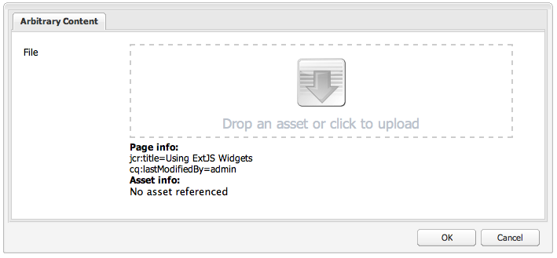

# Använda och utöka widgetar (Classic UI){#using-and-extending-widgets-classic-ui}

>[!NOTE]
>
>Den här sidan beskriver användningen av widgetar i det klassiska användargränssnittet, som togs bort i AEM 6.4.
>
>Adobe rekommenderar att du utnyttjar det moderna [pekaktiverat användargränssnitt](/help/sites-developing/touch-ui-concepts.md) baserat på [Coral UI](/help/sites-developing/touch-ui-concepts.md#coral-ui) och [Granite-gränssnitt](/help/sites-developing/touch-ui-concepts.md#granite-ui-foundation-components).

Adobe Experience Manager webbaserade gränssnitt använder AJAX och andra moderna webbläsartekniker för att möjliggöra WYSIWYG-redigering och -formatering av innehåll som författarna skapar direkt på webbsidan.

Adobe Experience Manager (AEM) använder [ExtJS](https://www.sencha.com/) widgetbiblioteket, som innehåller mycket prydliga gränssnittselement som fungerar i alla de viktigaste webbläsarna och gör det möjligt att skapa användargränssnitt i skrivbordsmiljö.

Dessa widgetar ingår i AEM och kan användas av alla webbplatser som byggs med AEM, utöver AEM.

En fullständig referens till alla tillgängliga widgetar i AEM finns i [API-dokumentation för widget](https://helpx.adobe.com/experience-manager/6-5/sites/developing/using/reference-materials/widgets-api/index.html) eller till [lista över befintliga xtypes](/help/sites-developing/xtypes.md). Dessutom finns det många exempel på hur du använder ExtJS-ramverket på [Sencha](https://www.sencha.com/products/extjs/examples/) webbplats, ramverkets ägare.

På den här sidan finns information om hur du använder och utökar widgetar. Först beskrivs hur [inkludera klientsidig kod på en sida](#including-the-client-sided-code-in-a-page). Sedan beskrivs några exempelkomponenter som har skapats för att illustrera grundläggande användning och tillägg. Dessa komponenter är tillgängliga i **Använda ExtJS-widgetar** package on **Paketresurs**.

Paketet innehåller exempel på:

* [Grundläggande dialogrutor](#basic-dialogs) med färdiga widgetar.
* [Dynamiska dialogrutor](#dynamic-dialogs) som har byggts med färdiga widgetar och skräddarsydd javascript-logik.
* Dialogrutor baserade på [anpassade widgetar](#custom-widgets).
* A [trädpanel](#tree-overview) visa ett JCR-träd under en angiven sökväg.
* A [stödrasterpanel](#grid-overview) visa data i tabellformat.

>[!NOTE]
>
>Adobe Experience Manager klassiska gränssnitt bygger på [ExtJS 3.4.0](https://extjs.cachefly.net/ext-3.4.0/docs/).

## Inkludera klientsideskoden på en sida {#including-the-client-sided-code-in-a-page}

Klientsidig javascript- och formatmallskod ska placeras i ett klientbibliotek.

Så här skapar du ett klientbibliotek:

1. Skapa en nod nedan `/apps/<project>` med följande egenskaper:

   * name=&quot;clientlib&quot;
   * jcr:mixinTypes=&quot;[mixa:låsbar]&quot;
   * jcr:primärType=&quot;cq:ClientLibraryFolder&quot;
   * sling:resourceType=&quot;widgets/clientlib&quot;
   * categories=&quot;[&lt;category-name>]&quot;
   * beroenden=&quot;[cq.widgets]&quot;

   `Note: <category-name> is the name of the custom library (e.g. "cq.extjstraining") and is used to include the library on the page.`

1. Nedanför `clientlib` skapa `css` och `js` mappar (not:folder).

1. Nedanför `clientlib` skapa `css.txt` och `js.txt` filer (inte:filer). Dessa .txt-filer listar de filer som ingår i biblioteket.

1. Redigera `js.txt`: måste börja med &#39; `#base=js`&quot; följt av en lista över de filer som kommer att sammanställas av CQ-klientbibliotekstjänsten, t.ex.:

   ```
   #base=js
    components.js
    exercises.js
    CustomWidget.js
    CustomBrowseField.js
    InsertTextPlugin.js
   ```

1. Redigera `css.txt`: måste börja med &#39; `#base=css`&quot; följt av en lista över de filer som kommer att sammanställas av CQ-klientbibliotekstjänsten, t.ex.:

   ```
   #base=css
    components.css
   ```

1. Under `js` placerar du de javascript-filer som tillhör biblioteket.

1. Under `css` mapp, placera `.css` filer och de resurser som används av css-filerna (t.ex. `my_icon.png`).

>[!NOTE]
>
>Det är valfritt att hantera formatmallar som beskrivs ovan.

Så här inkluderar du klientbiblioteket i sidkomponentens jsp:

* för att inkludera både javascript-kod och formatmallar:
   `<ui:includeClientLib categories="<category-name1>, <category-name2>, ..."/>`
där 
`<category-nameX>` är namnet på klientbiblioteket.

* att endast inkludera javascript-kod:
   `<ui:includeClientLib js="<category-name>"/>`

Mer information finns i beskrivningen av [&lt;ui:includeclientlib>](/help/sites-developing/taglib.md#lt-ui-includeclientlib) -tagg.

I vissa fall bör ett klientbibliotek endast vara tillgängligt i redigeringsläge och inte finnas i publiceringsläge. Det kan uppnås på följande sätt:

```xml
    if (WCMMode.fromRequest(request) != WCMMode.DISABLED) {
        %><ui:includeClientLib categories="cq.collab.blog"/><%
    }
```

### Komma igång med exemplen {#getting-started-with-the-samples}

Installera det paket som kallas om du vill följa självstudiekurserna på den här sidan **Använda ExtJS-widgetar** i en lokal AEM och skapa en exempelsida där komponenterna ska inkluderas. Så här gör du:

1. Hämta AEM paket som anropas **Använda ExtJS-widgetar (v01)** från Paketresurs och installera paketet. Det skapar projektet `extjstraining` nedan `/apps` i databasen.
1. Inkludera klientbiblioteket som innehåller skripten (js) och formatmallen (css) i head-taggen för geometrixx-sidan jsp, eftersom du tar med exempelkomponenterna på en ny sida i **Geometrixx** gren: in **CRXDE Lite** öppna filen `/apps/geometrixx/components/page/headlibs.jsp` och lägg till `cq.extjstraining` till befintlig `<ui:includeClientLib>` -tagg enligt följande:
   `%><ui:includeClientLib categories="apps.geometrixx-main, cq.extjstraining"/><%`
1. Skapa en ny sida i **Geometrixx** förgrening nedan `/content/geometrixx/en/products` och ringa **Använda ExtJS-widgetar**.
1. Gå till designläge och lägg till alla komponenterna i gruppen som kallas **Använda ExtJS-widgetar** till utformningen av Geometrixx
1. Gå tillbaka i redigeringsläge: komponenterna i gruppen **Använda ExtJS-widgetar** finns i The Sidekick.

>[!NOTE]
>
>Exemplen på den här Geometrixx baseras på exempelinnehållet, som inte längre levereras med AEM, som har ersatts av We.Retail. Se dokumentet [Implementering av referens för Vi.butik](/help/sites-developing/we-retail.md#we-retail-geometrixx) för att hämta och installera Geometrixx.

### Grundläggande dialogrutor {#basic-dialogs}

Dialogrutor används ofta för att redigera innehåll, men kan även visa enbart information. Ett enkelt sätt att visa en komplett dialogruta är att få tillgång till dess representation i json-format. Om du vill göra det pekar du i webbläsaren på:

`https://localhost:4502/<path-to-dialog>.-1.json`

Den första komponenten i **Använda ExtJS-widgetar** gruppen i Sidesparken kallas **1. Grundläggande om dialogrutor** och innehåller fyra grundläggande dialogrutor som är byggda med färdiga widgetar och utan anpassad javascript-logik. Dialogrutorna sparas nedan `/apps/extjstraining/components/dialogbasics`. De grundläggande dialogrutorna är:

* Dialogrutan Fullständig ( `full` nod): visas ett fönster med 3 flikar, där varje flik har 2 textfält.
* dialogrutan Enstaka panel( `singlepanel` nod): visas ett fönster med en flik som innehåller 2 textfält.
* dialogrutan Flera paneler( `multipanel` nod): den visas på samma sätt som i den fullständiga dialogrutan, men den har skapats på ett annat sätt.
* dialogrutan Design( `design` nod): visas ett fönster med 2 flikar. Den första fliken har ett textfält, en nedrullningsbar meny och ett komprimerbart textområde. Den andra fliken har ett fält med fyra textfält och ett komprimerbart fält med två textfält.

Inkludera **1. Grundläggande om dialogrutor** -komponenten på exempelsidan:

1. Lägg till **1. Grundläggande om dialogrutor** till exempelsidan från **Använda ExtJS-widgetar** i **Sidekick**.
1. Komponenten visar en titel, lite text och en **EGENSKAPER** länk: Klicka på länken för att visa egenskaperna för det stycke som lagras i databasen. Klicka på länken igen för att dölja egenskaperna.

Komponenten visas enligt följande:


#### Exempel 1: Fullständig dialogruta {#example-full-dialog}

The **Fullständig** visas ett fönster med tre flikar där varje flik har två textfält. Det är standarddialogrutan för **Grundläggande om dialogrutor** -komponenten. Dess egenskaper är:

* Definieras av en nod: nodtyp = `cq:Dialog`, xtype = ` [dialog](/help/sites-developing/xtypes.md#dialog)`.
* Visar 3 flikar (nodtyp = `cq:Panel`).
* Varje flik har två textfält (nodtyp = `cq:Widget`, xtype = ` [textfield](/help/sites-developing/xtypes.md#textfield)`).
* Definieras av noden:
   `/apps/extjstraining/components/dialogbasics/full`
* Renderas i JSON-format genom att begära:
   `https://localhost:4502/apps/extjstraining/components/dialogbasics/full.-1.json`

Dialogrutan visas enligt följande:


#### Exempel 2: Dialogrutan En panel {#example-single-panel-dialog}

The **Enkel panel** visas ett fönster med en flik som innehåller två textfält. Dess egenskaper är:

* Visar en flik (nodtyp = `cq:Dialog`, xtype = ` [panel](/help/sites-developing/xtypes.md#panel)`)
* Fliken har två textfält (nodtyp = `cq:Widget`, xtype = ` [textfield](/help/sites-developing/xtypes.md#textfield)`)
* Definieras av noden:
   `/apps/extjstraining/components/dialogbasics/singlepanel`
* Renderas i json-format genom att begära:
   `https://localhost:4502/apps/extjstraining/components/dialogbasics/singlepanel.-1.json`
* En fördel framför **Fullständig dialogruta** är att mindre konfiguration behövs.
* Rekommenderad användning: för enkla dialogrutor som visar information eller bara har ett fåtal fält.

Så här använder du dialogrutan En panel:

1. Ersätta dialogrutan **Grundläggande om dialogrutor** med **Enkel panel** dialog:
   1. I **CRXDE Lite**, ta bort noden: `/apps/extjstraining/components/dialogbasics/dialog`
   1. Klicka **Spara alla** för att spara ändringarna.
   1. Kopiera noden: `/apps/extjstraining/components/dialogbasics/singlepanel`
   1. Klistra in den kopierade noden nedan: `/apps/extjstraining/components/dialogbasics`
   1. Markera noden: `/apps/extjstraining/components/dialogbasics/Copy of singlepanel`och byta namn på den `dialog`.
1. Redigera komponenten: dialogrutan visas enligt följande:


#### Exempel 3: Dialogruta med flera paneler {#example-multi-panel-dialog}

The **Flera paneler** visas på samma sätt som **Fullständig** men den är uppbyggd på ett annat sätt. Dess egenskaper är:

* Definieras av en nod (nodtyp = `cq:Dialog`, xtype = ` [tabpanel](/help/sites-developing/xtypes.md#tabpanel)`).
* Visar 3 flikar (nodtyp = `cq:Panel`).
* Varje flik har två textfält (nodtyp = `cq:Widget`, xtype = ` [textfield](/help/sites-developing/xtypes.md#textfield)`).
* Definieras av noden:
   `/apps/extjstraining/components/dialogbasics/multipanel`
* Renderas i json-format genom att begära:
   `https://localhost:4502/apps/extjstraining/components/dialogbasics/multipanel.-1.json`
* En fördel framför **Fullständig dialogruta** är att den har en förenklad struktur.
* Rekommenderad användning: för dialogrutor med flera flikar.

Så här använder du dialogrutan Flera paneler:

1. Ersätta dialogrutan **Grundläggande om dialogrutor** med **Flera paneler** dialog: följer de steg som beskrivs för [Exempel 2: Dialogrutan En panel](#example-single-panel-dialog)
1. Redigera komponenten: dialogrutan visas enligt följande:


#### Exempel 4: Dialogrutan Multimedia {#example-rich-dialog}

The **Rich** visas ett fönster med två flikar. Den första fliken har ett textfält, en nedrullningsbar meny och ett komprimerbart textområde. Den andra fliken har ett fält med fyra textfält och ett komprimerbart fält med två textfält. Dess egenskaper är:

* Definieras av en nod (nodtyp = `cq:Dialog`, xtype = ` [dialog](/help/sites-developing/xtypes.md#dialog)`).
* Visar 2 flikar (nodtyp = `cq:Panel`).
* Den första fliken har en ` [dialogfieldset](/help/sites-developing/xtypes.md#dialogfieldset)` widget med en ` [textfield](/help/sites-developing/xtypes.md#textfield)` och ` [selection](/help/sites-developing/xtypes.md#selection)` widget med 3 alternativ och en komprimerbar ` [dialogfieldset](/help/sites-developing/xtypes.md#dialogfieldset)` med ` [textarea](/help/sites-developing/xtypes.md#textarea)` widget.
* Den andra fliken har en ` [dialogfieldset](/help/sites-developing/xtypes.md#dialogfieldset)` widget med 4 ` [textfield](/help/sites-developing/xtypes.md#textfield)` och en komprimerbar `dialogfieldset` med 2 ` [textfield](/help/sites-developing/xtypes.md#textfield)` widgetar.
* Definieras av noden:
   `/apps/extjstraining/components/dialogbasics/rich`
* Renderas i json-format genom att begära:
   `https://localhost:4502/apps/extjstraining/components/dialogbasics/rich.-1.json`

Så här använder du **Rich** dialog:

1. Ersätta dialogrutan **Grundläggande om dialogrutor** med **Rich** dialog: följer de steg som beskrivs för [Exempel 2: Dialogrutan En panel](#example-single-panel-dialog)
1. Redigera komponenten: dialogrutan visas enligt följande:

 

### Dynamiska dialogrutor {#dynamic-dialogs}

Den andra komponenten i **Använda ExtJS-widgetar** gruppen i Sidesparken kallas **2. Dynamiska dialogrutor** och innehåller tre dynamiska dialogrutor som är byggda med färdiga widgetar och **med anpassad javascript-logik**. Dialogrutorna sparas nedan `/apps/extjstraining/components/dynamicdialogs`. De dynamiska dialogrutorna är:

* dialogrutan Byt flikar ( `switchtabs` nod): visas ett fönster med två flikar. Den första fliken har en alternativmarkering med tre alternativ: När ett alternativ är markerat visas en flik som relaterar till alternativet. Den andra fliken har två textfält.
* den godtyckliga dialogen ( `arbitrary` nod): visas ett fönster med en flik. Fliken innehåller ett fält där en resurs och ett fält som visar information om sidan som innehåller objektet och om resursen, om det finns någon referens till det, ska släppas eller överföras.
* dialogrutan Växla fält ( `togglefield` nod): visas ett fönster med en flik. Fliken har en kryssruta: när den är markerad visas en fältuppsättning med två textfält.

Inkludera **2. Dynamiska dialogrutor** -komponenten på exempelsidan:

1. Lägg till **2. Dynamiska dialogrutor** till exempelsidan från **Använda ExtJS-widgetar** i **Sidekick**.
1. Komponenten visar en titel, lite text och en **EGENSKAPER** länk: klicka för att visa egenskaperna för det stycke som lagras i databasen. Klicka igen för att dölja egenskaperna.

Komponenten visas enligt följande:


#### Exempel 1: Dialogrutan Växla flikar {#example-switch-tabs-dialog}

The **Växla flikar** visas ett fönster med två flikar. Den första fliken har en alternativmarkering med tre alternativ: När ett alternativ är markerat visas en flik som relaterar till alternativet. Den andra fliken har två textfält.

Dess huvudsakliga egenskaper är:

* Definieras av en nod (nodtyp = `cq:Dialog`, xtype = ` [dialog](/help/sites-developing/xtypes.md#dialog)`).
* Visar 2 flikar (nodtyp = `cq:Panel`): Den andra fliken beror på vad du har valt på den första fliken (3 alternativ).
* Har tre valfria flikar (nodtyp = `cq:Panel`) har vart och ett två textfält (nodtyp = `cq:Widget`, xtype = ` [textfield](/help/sites-developing/xtypes.md#textfield)`). Endast en valfri flik i taget visas.
* Definieras av `switchtabs` nod vid:
   `/apps/extjstraining/components/dynamicdialogs/switchtabs`
* Renderas i json-format genom att begära:
   `https://localhost:4502/apps/extjstraining/components/dynamicdialogs/switchtabs.-1.json`

Logiken implementeras med händelseavlyssnare och javascript-kod enligt följande:

* Dialognoden har en `beforeshow`&quot; som döljer alla valfria flikar innan dialogrutan visas:
   `beforeshow="function(dialog){Ejst.x2.manageTabs(dialog.items.get(0));}"`

   `dialog.items.get(0)` hämtar den flikpanel som innehåller markeringspanelen och de tre valfria panelerna.
* The `Ejst.x2` -objektet definieras i `exercises.js` fil på:
   `/apps/extjstraining/clientlib/js/exercises.js`
* I `Ejst.x2.manageTabs()` metod, som värdet för `index` är -1 är alla valfria flikar dolda (i går från 1 till 3).
* Markeringsfliken har två avlyssnare: som visar den valda fliken när dialogrutan läses in (&quot; `loadcontent`&quot; -händelse) och en som visar den valda fliken när markeringen ändras (&quot; `selectionchanged`&quot; event):
   `loadcontent="function(field,rec,path){Ejst.x2.showTab(field);}"`

   `selectionchanged="function(field,value){Ejst.x2.showTab(field);}"`
* I `Ejst.x2.showTab()` metod:
   `field.findParentByType('tabpanel')` hämtar flikpanelen som innehåller alla flikar ( `field` representerar markeringswidgeten)
   `field.getValue()` hämtar värdet för markeringen, t.ex.: tab2
   `Ejst.x2.manageTabs()` visar den valda fliken.
* Varje valfri flik har en avlyssnare som döljer fliken på `render`&quot; event:
   `render="function(tab){Ejst.x2.hideTab(tab);}"`
* I `Ejst.x2.hideTab()` metod:
   `tabPanel` är den flikpanel som innehåller alla flikar
   `index` är indexvärdet för den valfria fliken
   `tabPanel.hideTabStripItem(index)` döljer fliken

Den visas enligt följande:


#### Exempel 2: Godtycklig dialogruta {#example-arbitrary-dialog}

I en dialogruta visas ofta innehåll från den underliggande komponenten. Dialogrutan som beskrivs här kallas **Godtycklig** används för att hämta innehåll från en annan komponent.

The **Godtycklig** visas ett fönster med en flik. Fliken har två fält: en om du vill släppa eller överföra en resurs och en som visar viss information om behållarsidan och om resursen, om någon sådan har refererats.

Dess huvudsakliga egenskaper är:

* Definieras av en nod (nodtyp = `cq:Dialog`, xtype = ` [dialog](/help/sites-developing/xtypes.md#dialog)`).
* Visar en flikpanelswidget (nodtyp = `cq:Widget`, xtype = ` [tabpanel](/help/sites-developing/xtypes.md#tabpanel)`) med 1 panel (nodtyp = `cq:Panel`)
* Panelen har en smartfile-widget (nodtyp = `cq:Widget`, xtype = ` [smartfile](/help/sites-developing/xtypes.md#smartfile)`) och en egen widget (nodtyp = `cq:Widget`, xtype = ` [ownerdraw](/help/sites-developing/xtypes.md#ownerdraw)`)
* Definieras av `arbitrary` nod vid:
   `/apps/extjstraining/components/dynamicdialogs/arbitrary`
* Renderas i json-format genom att begära:
   `https://localhost:4502/apps/extjstraining/components/dynamicdialogs/arbitrary.-1.json`

Logiken implementeras med händelseavlyssnare och javascript-kod enligt följande:

* Widgeten för egen ritning har en `loadcontent`&quot; avlyssnare som visar information om sidan som innehåller komponenten och resursen som refereras av smartfile-widgeten när innehållet läses in:
   `loadcontent="function(field,rec,path){Ejst.x2.showInfo(field,rec,path);}"`

   `field` anges med objektet ownerdraw
   `path` anges med komponentens innehållssökväg (t.ex.: /content/geometrixx/en/products/triangle/ui-tutorial/jcr:content/par/dynamicdialogs)
* The `Ejst.x2` -objektet definieras i `exercises.js` fil på:
   `/apps/extjstraining/clientlib/js/exercises.js`
* I `Ejst.x2.showInfo()` metod:
   `pagePath` är sökvägen till sidan som innehåller komponenten
   `pageInfo` representerar sidegenskaperna i json-format
   `reference` är sökvägen till den refererade resursen
   `metadata` representerar metadata för resursen i json-format
   `ownerdraw.getEl().update(html);` visar den skapade HTML-koden i dialogrutan

Så här använder du **Godtycklig** dialog:

1. Ersätta dialogrutan **Dynamisk dialogruta** med **Godtycklig** dialog: följer de steg som beskrivs för [Exempel 2: Dialogrutan En panel](#example-single-panel-dialog)
1. Edit the component: the dialog displays as follows:



#### Example 3: Toggle Fields Dialog {#example-toggle-fields-dialog}

The **Växla fält** visas ett fönster med en flik. Fliken har en kryssruta: när den är markerad visas en fältuppsättning med två textfält.

Dess huvudsakliga egenskaper är:

* Definieras av en nod (nodtyp = `cq:Dialog`, xtype = ` [dialog](/help/sites-developing/xtypes.md#dialog)`).
* Visar en flikpanelswidget (nodtyp = `cq:Widget`, xtype = ` [tabpanel](/help/sites-developing/xtypes.md#textpanel)`) med 1 panel (nodtyp = `cq:Panel`).
* `cq:Widget`` [selection](/help/sites-developing/xtypes.md#selection)`` [checkbox](/help/sites-developing/xtypes.md#checkbox)``cq:Widget`` [dialogfieldset](/help/sites-developing/xtypes.md#dialogfieldset)``cq:Widget`` [textfield](/help/sites-developing/xtypes.md#textfield)`
* `togglefields`
   `/apps/extjstraining/components/dynamicdialogs/togglefields`
* Renderas i json-format genom att begära:
   `https://localhost:4502/apps/extjstraining/components/dynamicdialogs/togglefields.-1.json`

Logiken implementeras med händelseavlyssnare och javascript-kod enligt följande:

* på markeringsfliken finns två avlyssnare: som visar dialogrutorna när innehållet läses in (&quot; `loadcontent`&quot; event) och en som visar dialogrutans fältuppsättning när markeringen ändras (&quot; `selectionchanged`&quot; event):
   `loadcontent="function(field,rec,path){Ejst.x2.toggleFieldSet(field);}"`

   `selectionchanged="function(field,value){Ejst.x2.toggleFieldSet(field);}"`
* The `Ejst.x2` -objektet definieras i `exercises.js` fil på:
   `/apps/extjstraining/clientlib/js/exercises.js`
* I `Ejst.x2.toggleFieldSet()` metod:
   `box` är markeringsobjektet
   `panel` är den panel som innehåller markeringen och dialogfältuppsättningswidgetar
   `fieldSet` är dialogfältuppsättningsobjektet
   `show` är värdet för markeringen (true eller false) baserat på &#39; `show`&#39; dialogfältuppsättningen visas eller inte

Så här använder du **Växla fält** dialog:

1. Ersätta dialogrutan **Dynamisk dialogruta** med **Växla fält** dialog: följer de steg som beskrivs för [Exempel 2: Dialogrutan En panel](#example-single-panel-dialog)
1. Redigera komponenten: dialogrutan visas enligt följande:


### Anpassade widgetar {#custom-widgets}

De färdiga widgetarna som levereras med AEM bör omfatta de flesta användningsfall. Ibland kan det dock vara nödvändigt att skapa en anpassad widget som täcker ett projektspecifikt krav. Du kan skapa anpassade widgetar genom att utöka befintliga. För att du ska komma igång med en sådan anpassning **Använda ExtJS-widgetar** paketet innehåller tre dialogrutor som använder tre olika anpassade widgetar:

* dialogrutan Flerfält ( `multifield` nod) visar ett fönster med en flik. Fliken har en anpassad widget för flera fält som har två fält: en nedrullningsbar meny med två alternativ och ett textfält. Baserat på färdiga `multifield` widgeten (som bara har ett textfält) har den alla funktioner som finns i `multifield` widget.
* dialogrutan Trädbläddring ( `treebrowse` nod) visar ett fönster med en flik som innehåller en sökvägswidget: När du klickar på pilen öppnas ett fönster där du kan bläddra i en hierarki och markera ett objekt. Sökvägen för objektet läggs sedan till i sökvägsfältet och bevaras när dialogrutan stängs.
* en dialogruta baserad på ett plugin-program för RTF-redigering ( `rteplugin` nod) som lägger till en anpassad knapp i RTF-redigeraren för att infoga anpassad text i huvudtexten. Den består av en `richtext` widgeten (RTE) och en anpassad funktion som läggs till via plugin-programmet för textredigering.

De anpassade widgetarna och plugin-programmet ingår i komponenten som kallas **3. Anpassade widgetar** i **Använda ExtJS-widgetar** paket. Så här inkluderar du den här komponenten på exempelsidan:

1. Lägg till **3. Anpassade widgetar** till exempelsidan från **Använda ExtJS-widgetar** i **Sidekick**.
1. Komponenten visar en titel, en del text och när du klickar på **EGENSKAPER** -länk, egenskaperna för det stycke som lagras i databasen. Om du klickar igen döljs egenskaperna.
Komponenten visas enligt följande:


#### Exempel 1: Anpassad widget för flera fält {#example-custom-multifield-widget}

The **Anpassat multifält** widgetbaserad dialogruta visar ett fönster med en flik. Fliken har en anpassad widget för flera fält som, till skillnad från den som har ett fält, har två fält: en nedrullningsbar meny med två alternativ och ett textfält.

The **Anpassat multifält** widgetbaserad dialogruta:

* Definieras av en nod (nodtyp = `cq:Dialog`, xtype = ` [dialog](/help/sites-developing/xtypes.md#dialog)`).
* Visar en flikpanelswidget (nodtyp = `cq:Widget`, xtype = ` [tabpanel](/help/sites-developing/xtypes.md#tabpanel)`) som innehåller en panel (nodtyp = `cq:Widget`, xtype = ` [panel](/help/sites-developing/xtypes.md#panel)`).
* Panelen har en `multifield` widget (nodtyp = `cq:Widget`, xtype = ` [multifield](/help/sites-developing/xtypes.md#multifield)`).
* The `multifield` widgeten har en fältkonfiguration (nodtyp = `nt:unstructured`, xtype = `ejstcustom`, optionsProvider = `Ejst.x3.provideOptions`) som baseras på den anpassade xtype &#39; `ejstcustom`&#39;:
   * &#39; `fieldconfig`&#39; är ett config-alternativ för ` [CQ.form.MultiField](https://helpx.adobe.com/experience-manager/6-5/sites/developing/using/reference-materials/widgets-api/index.html?class=CQ.form.MultiField)` -objekt.
   * &#39; `optionsProvider`&#39; är en konfiguration av `ejstcustom` widget. Den är inställd med `Ejst.x3.provideOptions` metod som definieras i `exercises.js` vid:
      `/apps/extjstraining/clientlib/js/exercises.js`
och returnerar 2 alternativ.
* Definieras av `multifield` nod vid:
   `/apps/extjstraining/components/customwidgets/multifield`
* Renderas i json-format genom att begära:
   `https://localhost:4502/apps/extjstraining/components/customwidgets/multifield.-1.json`

Den anpassade widgeten för flera fält (xtype = `ejstcustom`):

* Är ett javascript-objekt anropat `Ejst.CustomWidget`.
* Är definierad i `CustomWidget.js` javascript-fil på:
   `/apps/extjstraining/clientlib/js/CustomWidget.js`
* Utökar ` [CQ.form.CompositeField](https://helpx.adobe.com/experience-manager/6-5/sites/developing/using/reference-materials/widgets-api/index.html?class=CQ.form.CompositeField)` widget.
* Har tre fält: `hiddenField` (textfält), `allowField` (ComboBox) och `otherField` (Textfält)
* Åsidosättningar `CQ.Ext.Component#initComponent` så här lägger du till de tre fälten:
   * `allowField` är en [CQ.form.Selection](https://helpx.adobe.com/experience-manager/6-5/sites/developing/using/reference-materials/widgets-api/index.html?class=CQ.form.Selection) objekt av typen &#39;select&#39;. optionsProvider är en konfiguration av Selection-objektet som initieras med optionsProvider-konfigurationen för CustomWidget som definierats i dialogrutan
   * `otherField` är en [CQ.Ext.form.TextField](https://helpx.adobe.com/experience-manager/6-5/sites/developing/using/reference-materials/widgets-api/index.html?class=CQ.Ext.form.TextField) object
* Åsidosätter metoderna `setValue`, `getValue` och `getRawValue` av [CQ.form.CompositeField](https://helpx.adobe.com/experience-manager/6-5/sites/developing/using/reference-materials/widgets-api/index.html?class=CQ.form.CompositeField) för att ställa in och hämta värdet för CustomWidget med formatet:
   `<allowField value>/<otherField value>, e.g.: 'Bla1/hello'`.
* `ejstcustom`
   `CQ.Ext.reg('ejstcustom', Ejst.CustomWidget);`

****


#### Exempel 2: Widget för anpassad trädbläddring {#example-custom-treebrowse-widget}

Den anpassade **Treebrowse** widgetbaserad dialogruta visar ett fönster med en flik som innehåller en anpassad widget för sökvägsurfning: När du klickar på pilen öppnas ett fönster där du kan bläddra i en hierarki och markera ett objekt. Sökvägen för objektet läggs sedan till i sökvägsfältet och bevaras när dialogrutan stängs.

The custom treebrowse dialog:

* `cq:Dialog`` [dialog](/help/sites-developing/xtypes.md#dialog)`
* `cq:Widget`` [tabpanel](/help/sites-developing/xtypes.md#tabpanel)``cq:Widget`` [panel](/help/sites-developing/xtypes.md#panel)`
* Panelen har en anpassad widget (nodtyp = `cq:Widget`, xtype = `ejstbrowse`)
* Definieras av `treebrowse` nod vid:
   `/apps/extjstraining/components/customwidgets/treebrowse`
* Renderas i json-format genom att begära:
   `https://localhost:4502/apps/extjstraining/components/customwidgets/treebrowse.-1.json`

Widgeten för anpassad webbläsare (xtype = `ejstbrowse`):

* Är ett javascript-objekt anropat `Ejst.CustomWidget`.
* Är definierad i `CustomBrowseField.js` javascript-fil på:
   `/apps/extjstraining/clientlib/js/CustomBrowseField.js`
* Utökar ` [CQ.Ext.form.TriggerField](https://helpx.adobe.com/experience-manager/6-5/sites/developing/using/reference-materials/widgets-api/index.html?class=CQ.Ext.form.TriggerField)`.
* Definierar ett bläddringsfönster med namnet `browseWindow`.
* Åsidosättningar ` [CQ.Ext.form.TriggerField](https://helpx.adobe.com/experience-manager/6-5/sites/developing/using/reference-materials/widgets-api/index.html?class=CQ.Ext.form.TriggerField)#onTriggerClick` för att visa bläddringsfönstret när någon klickar på pilen.
* Definierar en [CQ.Ext.tree.TreePanel](https://helpx.adobe.com/experience-manager/6-5/sites/developing/using/reference-materials/widgets-api/index.html?class=CQ.Ext.tree.TreePanel) objekt:
   * Den hämtar sina data genom att anropa den server som är registrerad på `/bin/wcm/siteadmin/tree.json`.
   * Dess rot är &quot; `apps/extjstraining`&quot;.
* Definierar en `window` objekt ( ` [CQ.Ext.Window](https://helpx.adobe.com/experience-manager/6-5/sites/developing/using/reference-materials/widgets-api/index.html?class=CQ.Ext.Window)`):
   * Baserat på den fördefinierade panelen.
   * Har en **OK** som anger värdet för den markerade banan och döljer panelen.
* Fönstret är förankrat under **Bana** fält.
* Den valda sökvägen skickas från bläddringsfältet till fönstret på `show` -händelse.
* Registrerar sig själv som `ejstbrowse`&#39; xtype:
   `CQ.Ext.reg('ejstbrowse', Ejst.CustomBrowseField);`

Så här använder du **Anpassad trädbläddring** widgetbaserad dialogruta:

1. Ersätta dialogrutan **Anpassade widgetar** med **Anpassad trädbläddring** dialog: följer de steg som beskrivs för [Exempel 2: Dialogrutan En panel](#example-single-panel-dialog)
1. Redigera komponenten: dialogrutan visas enligt följande:


#### Exempel 3: RTE-plugin (Rich Text Editor) {#example-rich-text-editor-rte-plug-in}

The **RTE-plugin (Rich Text Editor)** är en dialogruta som är baserad på RTF-redigeraren och som har en egen knapp för att infoga text inom hakparenteser. Den anpassade texten kan tolkas av en del logik på serversidan (som inte implementeras i det här exemplet), till exempel för att lägga till text som definieras i den angivna sökvägen:

The **RTE-plugin** baserad dialogruta:

* Definieras av plugin-programnoden på:
   `/apps/extjstraining/components/customwidgets/rteplugin`
* Renderas i json-format genom att begära:
   `https://localhost:4502/apps/extjstraining/components/customwidgets/rteplugin.-1.json`
* The `rtePlugins` noden har en underordnad nod `inserttext` (nodtyp = `nt:unstructured`) som namnges efter plugin-programmet. Den har en egenskap som heter `features`, som definierar vilka av plugin-programfunktionerna som är tillgängliga för RTE.

RTE-plugin:

* Är ett javascript-objekt anropat `Ejst.InsertTextPlugin`.
* Är definierad i `InsertTextPlugin.js` javascript-fil på:
   `/apps/extjstraining/clientlib/js/InsertTextPlugin.js`
* Utökar ` [CQ.form.rte.plugins.Plugin](https://helpx.adobe.com/experience-manager/6-5/sites/developing/using/reference-materials/widgets-api/index.html?class=CQ.form.rte.plugins.Plugin)` -objekt.
* Följande metoder definierar ` [CQ.form.rte.plugins.Plugin](https://helpx.adobe.com/experience-manager/6-5/sites/developing/using/reference-materials/widgets-api/index.html?class=CQ.form.rte.plugins.Plugin)` -objekt och åsidosätts i implementerings-plugin-programmet:
   * `getFeatures()` returnerar en array med alla funktioner som plugin-programmet gör tillgängliga.
   * `initializeUI()` lägger till den nya knappen i verktygsfältet för textredigering.
   * `notifyPluginConfig()` visar rubrik och text när knappen hovras.
   * `execute()` anropas när någon klickar på knappen och utför plug-in-åtgärden: visas ett fönster som används för att definiera texten som ska inkluderas.
* `insertText()` infogar en text med hjälp av motsvarande dialogobjekt `Ejst.InsertTextPlugin.Dialog` (se efteråt).
* `executeInsertText()` anropas av `apply()` metod i dialogrutan som aktiveras när **OK** klickas på knappen.
* Registrerar sig själv som `inserttext`&#39; plugin:
   `CQ.form.rte.plugins.PluginRegistry.register("inserttext", Ejst.InsertTextPlugin);`
* den `Ejst.InsertTextPlugin.Dialog` -objektet definierar den dialogruta som öppnas när plugin-knappen klickas. Dialogrutan består av en panel, ett formulär, ett textfält och två knappar (**OK** och **Avbryt**).

Så här använder du **RTE-plugin (Rich Text Editor)** baserad dialogruta:

1. Ersätta dialogrutan **Anpassade widgetar** med **RTE-plugin (Rich Text Editor)** baserad dialogruta: följer de steg som beskrivs för [Exempel 2: Dialogrutan En panel](#example-single-panel-dialog)
1. Redigera komponenten.
1. Klicka på den sista ikonen till höger (den med fyra pilar). Ange en bana och klicka **OK**: Sökvägen visas inom hakparenteser ([ ]).
1. Klicka **OK** för att stänga RTF-redigeraren.

The **RTE-plugin (Rich Text Editor)** visas enligt följande:


>[!NOTE]
>
>*[]*

### Tree Overview {#tree-overview}

` [CQ.Ext.tree.TreePanel](https://helpx.adobe.com/experience-manager/6-5/sites/developing/using/reference-materials/widgets-api/index.html?class=CQ.Ext.tree.TreePanel)` ****`TreePanel` Själva fönstret kan dockas/avdockas. I det här exemplet är fönsterlogiken inbäddad i komponenten jsp mellan &lt;script>&lt;/script> -taggar.

Inkludera **Översikt över träd** -komponent till exempelsidan:

1. Lägg till **4. Översikt över träd** till exempelsidan från **Använda ExtJS-widgetar** i **Sidekick**.
1. The component displays:
   * a title, with some text
   * a **EGENSKAPER** länk: klicka för att visa egenskaperna för det stycke som lagras i databasen. Klicka igen för att dölja egenskaperna.
   * ett flytande fönster med en trädrepresentation av databasen som kan expanderas.

Komponenten visas enligt följande:


Komponenten Trädöversikt:

* Definieras vid:
   `/apps/extjstraining/components/treeoverview`

* I dialogrutan kan du ange fönstrets storlek och docka/avdocka fönstret (se informationen nedan).

Komponenten jsp:

* Hämtar egenskaperna width, height och dockad från databasen.
* Visar text om trädöversiktens dataformat.
* Bäddar in fönsterlogiken i komponent-jsp mellan javascript-taggar.
* Definieras vid:
   `apps/extjstraining/components/treeoverview/content.jsp`

JavaScript-koden som är inbäddad i komponent-jsp:

* Definierar en `tree` genom att försöka hämta ett trädfönster från sidan.
* Om fönstret som visar trädet inte finns, `treePanel` ([CQ.Ext.tree.TreePanel](https://helpx.adobe.com/experience-manager/6-5/sites/developing/using/reference-materials/widgets-api/index.html?class=CQ.Ext.tree.TreePanel)) skapas:
   * `treePanel` innehåller de data som används för att skapa fönstret.
   * Data hämtas genom att anropa servern som är registrerad på:
      `/bin/wcm/siteadmin/tree.json`
* The `beforeload` avlyssnaren kontrollerar att den klickade noden är inläst.
* The `root` objektet anger sökvägen `apps/extjstraining` som trädroten.
* `tree` ( ` [CQ.Ext.Window](https://helpx.adobe.com/experience-manager/6-5/sites/developing/using/reference-materials/widgets-api/index.html?class=CQ.Ext.Window)`) anges baserat på fördefinierade `treePanel`och visas med:
   `tree.show();`
* Om fönstret redan finns visas det baserat på egenskaperna width, height och dockad som hämtats från databasen.

Komponentdialogrutan:

* Visar en flik med två fält som anger storleken (bredd och höjd) för trädöversiktsfönstret och ett fält som dockar/avdockar fönstret
* Definieras av en nod (nodtyp = `cq:Dialog`, xtype = ` [panel](/help/sites-developing/xtypes.md#panel)`).
* Panelen har en widget för storleksfält (nodtyp = `cq:Widget`, xtype = ` [sizefield](/help/sites-developing/xtypes.md#sizefield)`) och en markeringswidget (nodtyp = `cq:Widget`, xtype = ` [selection](/help/sites-developing/xtypes.md#selection)`, typ = `radio`) med 2 alternativ (true/false)
* Definieras av dialognoden vid:
   `/apps/extjstraining/components/treeoverview/dialog`
* Renderas i json-format genom att begära:
   `https://localhost:4502/apps/extjstraining/components/treeoverview/dialog.-1.json`
* Visar följande:


### Översikt över stödraster {#grid-overview}

En rutnätspanel representerar data i tabellformat för rader och kolumner. Den består av följande:

* Butik: Den modell som innehåller dataposterna (rader).
* Kolumnmodell: kolumnmakeup.
* Visa: kapslar in användargränssnittet.
* Markeringsmodell: markeringsbeteendet.

Stödrasteröversiktskomponenten som ingår i **Använda ExtJS-widgetar** paketet visar hur du visar data i tabellformat:

* I exempel 1 används statiska data.
* I exempel 2 används data som hämtats från databasen.

Så här tar du med komponenten Stödrasteröversikt till exempelsidan:

1. Lägg till **5. Översikt över stödraster** till exempelsidan från **Använda ExtJS-widgetar** i **Sidekick**.
1. Komponenten visar:
   * en titel med text
   * a **EGENSKAPER** länk: klicka för att visa egenskaperna för det stycke som lagras i databasen. Klicka igen för att dölja egenskaperna.
   * ett flytande fönster som innehåller data i tabellformat.

Komponenten visas enligt följande:


#### Exempel 1: Standardstödraster {#example-default-grid}

I den färdiga versionen är **Översikt över stödraster** visas ett fönster med statiska data i tabellformat. I det här exemplet är logiken inbäddad i komponentjsp på två sätt:

* the generic logic is defined between &lt;script>&lt;/script> tags
* the specific logic is available in a separate .js file and is linked to in the jsp. This setup enables to easily switch between the two logic (static/dynamic) by commenting the desired &lt;script> tags.

The Grid Overview component:

* Is defined at:
   `/apps/extjstraining/components/gridoverview`
* I dialogrutan kan du ange fönstrets storlek och docka/avdocka fönstret.

Komponenten jsp:

* Hämtar egenskaperna width, height och dockad från databasen.
* Displays some text as introduction to the grid overview data format.
* References javascript code that defines the GridPanel object:
   `<script type="text/javascript" src="/apps/extjstraining/components/gridoverview/defaultgrid.js"></script>`

   `defaultgrid.js`
* Bäddar in javascript-kod mellan javascript-taggar som definierar det Window-objekt som använder GridPanel-objektet.
* Definieras vid:
   `apps/extjstraining/components/gridoverview/content.jsp`

JavaScript-koden som är inbäddad i komponent-jsp:

* Definierar `grid` genom att försöka hämta fönsterkomponenten från sidan:
   `var grid = CQ.Ext.getCmp("<%= node.getName() %>-grid");`
* If `grid` finns inte, [CQ.Ext.grid.GridPanel](https://helpx.adobe.com/experience-manager/6-5/sites/developing/using/reference-materials/widgets-api/index.html?class=CQ.Ext.grid.GridPanel) objekt ( `gridPanel`) definieras genom att anropa `getGridPanel()` metod (se nedan). Den här metoden definieras i `defaultgrid.js`.
* `grid` är en ` [CQ.Ext.Window](https://helpx.adobe.com/experience-manager/6-5/sites/developing/using/reference-materials/widgets-api/index.html?class=CQ.Ext.Window)` -objekt, baserat på den fördefinierade GridPanel, och visas: `grid.show();`
* If `grid` finns redan, visas den baserat på bredd, höjd och dockade egenskaper som hämtats från databasen.

JavaScript-filen ( `defaultgrid.js`) som refereras i komponenten jsp definierar `getGridPanel()` som anropas av skriptet som är inbäddat i JSP och returnerar en ` [CQ.Ext.grid.GridPanel](https://helpx.adobe.com/experience-manager/6-5/sites/developing/using/reference-materials/widgets-api/index.html?class=CQ.Ext.grid.GridPanel)` -objekt, baserat på statiska data. Logiken är följande:

* `myData` är en array med statiska data som formaterats som en tabell med 5 kolumner och 4 rader.
* `store` är en `CQ.Ext.data.Store` objekt som förbrukar `myData`.
* `store` har lästs in i minnet:
   `store.load();`
* `gridPanel` är en ` [CQ.Ext.grid.GridPanel](https://helpx.adobe.com/experience-manager/6-5/sites/developing/using/reference-materials/widgets-api/index.html?class=CQ.Ext.grid.GridPanel)` objekt som förbrukar `store`:
   * kolumnbredderna ändras alltid:
      `forceFit: true`
   * bara en rad åt gången kan markeras:
      `singleSelect:true`

#### Exempel 2: Referenssökstödraster {#example-reference-search-grid}

När du installerar paketet `content.jsp` i **Översikt över stödraster** -komponenten visar ett rutnät som baseras på statiska data. Det går att ändra komponenten så att ett rutnät visas med följande egenskaper:

* Har tre kolumner.
* Baseras på data som hämtats från databasen genom att anropa en server.
* Cellerna i den sista kolumnen kan redigeras. Värdet sparas i en `test` egenskapen under noden som definieras av sökvägen som visas i den första kolumnen.

Fönsterobjektet får sin ` [CQ.Ext.grid.GridPanel](https://helpx.adobe.com/experience-manager/6-5/sites/developing/using/reference-materials/widgets-api/index.html?class=CQ.Ext.grid.GridPanel)` genom att anropa `getGridPanel()` metod som definieras i `defaultgrid.js` fil på `/apps/extjstraining/components/gridoverview/defaultgrid.js`. Komponenten **Grid Overview **ger en annan implementering för `getGridPanel()` metod, definition i `referencesearch.js` fil på `/apps/extjstraining/components/gridoverview/referencesearch.js`. Genom att byta .js-fil som refereras i komponentens jsp, kommer rutnätet att baseras på data som hämtas från databasen.

Byt .js-fil som refereras i komponent-jsp:

1. I **CRXDE Lite**, i `content.jsp` komponentfilen, kommentera raden som innehåller `defaultgrid.js` så att den ser ut så här:
   `<!-- script type="text/javascript" src="/apps/extjstraining/components/gridoverview/defaultgrid.js"></script-->`
1. Ta bort kommentaren från raden som innehåller `referencesearch.js` så att den ser ut så här:
   `<script type="text/javascript" src="/apps/extjstraining/components/gridoverview/referencesearch.js"></script>`
1. Spara ändringarna.
1. Uppdatera exempelsidan.

Komponenten visas enligt följande:


JavaScript-koden som komponenten jsp refererar till ( `referencesearch.js`) definierar `getGridPanel()` metod som anropas från komponenten jsp och returnerar en ` [CQ.Ext.grid.GridPanel](https://helpx.adobe.com/experience-manager/6-5/sites/developing/using/reference-materials/widgets-api/index.html?class=CQ.Ext.grid.GridPanel)` -objekt, baserat på data som hämtas dynamiskt från databasen. Logiken i `referencesearch.js` definierar vissa dynamiska data som bas för GridPanel:

* `reader` är en ` [CQ.Ext.data.JsonReader](https://helpx.adobe.com/experience-manager/6-5/sites/developing/using/reference-materials/widgets-api/index.html?class=CQ.Ext.data.JsonReader)`objekt som läser serverletssvaret i json-format för 3 kolumner.
* `cm` är en ` [CQ.Ext.grid.ColumnModel](https://helpx.adobe.com/experience-manager/6-5/sites/developing/using/reference-materials/widgets-api/index.html?class=CQ.Ext.grid.ColumnModel)` -objekt för 3 kolumner.
Kolumncellerna i kolumnen&quot;Testa&quot; kan redigeras så som de definieras med en redigerare:
   `editor: new [CQ.Ext.form.TextField](https://helpx.adobe.com/experience-manager/6-5/sites/developing/using/reference-materials/widgets-api/index.html?class=CQ.Ext.form.TextField)({})`
* kolumnerna kan sorteras:
   `cm.defaultSortable = true;`
* `store` är en ` [CQ.Ext.data.GroupingStore](https://helpx.adobe.com/experience-manager/6-5/sites/developing/using/reference-materials/widgets-api/index.html?class=CQ.Ext.data.GroupingStore)` objekt:
   * hämtar data genom att anropa den server som är registrerad på &quot; `/bin/querybuilder.json`&quot; med några parametrar som används för att filtrera frågan
   * baseras på `reader`, definierad i förväg
   * tabellen sorteras enligt &#39;**jcr:sökväg**&#39; kolumn i stigande ordning
* `gridPanel` är en ` [CQ.Ext.grid.EditorGridPanel](https://helpx.adobe.com/experience-manager/6-5/sites/developing/using/reference-materials/widgets-api/index.html?class=CQ.Ext.grid.EditorGridPanel)` objekt som kan redigeras:
   * baseras på den fördefinierade `store` och i kolumnmodellen `cm`
   * bara en rad åt gången kan markeras:
      `sm: new [CQ.Ext.grid.RowSelectionModel](https://helpx.adobe.com/experience-manager/6-5/sites/developing/using/reference-materials/widgets-api/index.html?class=CQ.Ext.grid.RowSelectionModel)({singleSelect:true})`
   * den `afteredit` avlyssnaren ser till att efter en cell i **Testa** kolumnen har redigerats:
      * egenskapen &#39; `test`&#39; för noden vid sökvägen som definieras av &quot;**jcr:sökväg**&quot; -kolumnen ställs in i databasen med cellens värde
      * om POSTEN lyckas läggs värdet till i `store` objekt, annars avvisas det
