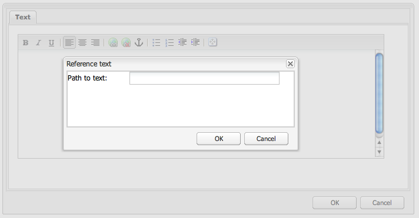

# Använda och utöka widgetar (Classic UI){#using-and-extending-widgets-classic-ui}

>[!NOTE]
>
>Den här sidan beskriver användningen av widgetar i det klassiska användargränssnittet, som togs bort i AEM 6.4.
>
>Adobe rekommenderar att du använder det moderna, [pekaktiverade användargränssnittet](/help/sites-developing/touch-ui-concepts.md) baserat på användargränssnittet i [Coral](/help/sites-developing/touch-ui-concepts.md#coral-ui) och [Granite](/help/sites-developing/touch-ui-concepts.md#granite-ui-foundation-components).

Adobe Experience Managers webbaserade gränssnitt använder AJAX och andra moderna webbläsartekniker för att möjliggöra WYSIWYG-redigering och -formatering av innehåll som författare direkt på webbsidan.

Adobe Experience Manager (AEM) använder [ExtJS](https://www.sencha.com/) -widgetbiblioteket, som innehåller de mycket optimerade elementen i användargränssnittet som fungerar i alla de viktigaste webbläsarna och gör det möjligt att skapa användargränssnitt på skrivbordsnivå.

Dessa widgetar ingår i AEM och kan användas av alla webbplatser som byggs med AEM, utöver de som används av AEM.

En fullständig referens till alla tillgängliga widgetar i AEM finns i dokumentationen [för](https://helpx.adobe.com/experience-manager/6-5/sites/developing/using/reference-materials/widgets-api/index.html) widgetens API eller i [listan över befintliga xtyper](/help/sites-developing/xtypes.md). Dessutom finns det många exempel som visar hur du använder ExtJS-ramverket på webbplatsen [Sencha](https://www.sencha.com/products/extjs/examples/) , ramverkets ägare.

På den här sidan finns information om hur du använder och utökar widgetar. Först beskrivs hur du [inkluderar klientsidig kod på en sida](#including-the-client-sided-code-in-a-page). Sedan beskrivs några exempelkomponenter som har skapats för att illustrera grundläggande användning och tillägg. Dessa komponenter är tillgängliga i paketet **Använda ExtJS-widgetar** på **paketresursen**.

Paketet innehåller exempel på:

* [Grundläggande dialogrutor](#basic-dialogs) med färdiga widgetar.
* [Dynamiska dialogrutor](#dynamic-dialogs) med färdiga widgetar och anpassad javascript-logik.
* Dialogrutor baserade på [anpassade widgetar](#custom-widgets).
* En [trädpanel](#tree-overview) som visar ett JCR-träd under en angiven sökväg.
* En [rutnätspanel](#grid-overview) som visar data i tabellformat.

>[!NOTE]
>
>Det klassiska användargränssnittet i Adobe Experience Manager bygger på [ExtJS 3.4.0](https://extjs.cachefly.net/ext-3.4.0/docs/).

## Inkludera klientsideskoden på en sida {#including-the-client-sided-code-in-a-page}

Klientsidig javascript- och formatmallskod ska placeras i ett klientbibliotek.

Så här skapar du ett klientbibliotek:

1. Skapa en nod nedan `/apps/<project>` med följande egenskaper:

   * name=&quot;clientlib&quot;
   * jcr:mixinTypes=&quot;[mix:lockable]&quot;
   * jcr:primärType=&quot;cq:ClientLibraryFolder&quot;
   * sling:resourceType=&quot;widgets/clientlib&quot;
   * categories=&quot;[&lt;category-name>]&quot;
   * beroenden=&quot;[cq.widgets]&quot;
   `Note: <category-name> is the name of the custom library (e.g. "cq.extjstraining") and is used to include the library on the page.`

1. Nedan `clientlib` skapar du mapparna `css` och `js` (not:folder).

1. Nedan `clientlib` skapar du filerna `css.txt` och `js.txt` (inte:filer). Dessa .txt-filer listar de filer som ingår i biblioteket.

1. Redigera `js.txt`: måste börja med &#39; `#base=js`&#39; följt av listan över de filer som ska sammanställas av CQ-klientbibliotekstjänsten, som:

   ```
   #base=js
    components.js
    exercises.js
    CustomWidget.js
    CustomBrowseField.js
    InsertTextPlugin.js
   ```

1. Redigera `css.txt`: måste börja med &#39; `#base=css`&#39; följt av listan över de filer som ska sammanställas av CQ-klientbibliotekstjänsten, som:

   ```
   #base=css
    components.css
   ```

1. Placera de javascript-filer som hör till biblioteket nedanför `js` mappen.

1. Under `css` mappen placerar du `.css` filerna och resurserna som används av css-filerna (t.ex. `my_icon.png`).

>[!NOTE]
>
>Det är valfritt att hantera formatmallar som beskrivs ovan.

Så här inkluderar du klientbiblioteket i sidkomponentens jsp:

* för att inkludera både javascript-kod och formatmallar:
   `<ui:includeClientLib categories="<category-name1>, <category-name2>, ..."/>`
där `<category-nameX>` är namnet på klientbiblioteket.

* att endast inkludera javascript-kod:
   `<ui:includeClientLib js="<category-name>"/>`

Mer information finns i beskrivningen av [&lt;ui:includeClientLib>](/help/sites-developing/taglib.md#lt-ui-includeclientlib) -taggen.

I vissa fall bör ett klientbibliotek endast vara tillgängligt i redigeringsläge och inte finnas i publiceringsläge. Det kan uppnås på följande sätt:

```xml
    if (WCMMode.fromRequest(request) != WCMMode.DISABLED) {
        %><ui:includeClientLib categories="cq.collab.blog"/><%
    }
```

### Komma igång med exemplen {#getting-started-with-the-samples}

Om du vill följa självstudiekurserna på den här sidan installerar du paketet **Använda ExtJS-widgetar** i en lokal AEM-instans och skapar en exempelsida där komponenterna ska inkluderas. Så här gör du:

1. I din AEM-instans hämtar du paketet **Using ExtJS Widgets (v01)** från Package Share och installerar paketet. Projektet skapas `extjstraining` nedan `/apps` i databasen.
1. Inkludera klientbiblioteket som innehåller skripten (js) och formatmallen (css) i head-taggen för geometrixx-sidan jsp, eftersom du inkluderar exempelkomponenterna på en ny sida i **Geometrixx** -grenen:
i **CRXDE Lite** öppnar du filen `/apps/geometrixx/components/page/headlibs.jsp` och lägger till `cq.extjstraining` kategorin i den befintliga `<ui:includeClientLib>` taggen enligt följande:
   `%><ui:includeClientLib categories="apps.geometrixx-main, cq.extjstraining"/><%`
1. Skapa en ny sida i grenen **Geometrixx** nedan `/content/geometrixx/en/products` och anropa den **med ExtJS-widgetar**.
1. Gå i designläge och lägg till alla komponenter i gruppen **Using ExtJS Widgets** i designen av Geometrixx
1. Gå tillbaka i redigeringsläge: komponenterna i gruppen **med ExtJS-widgetar** är tillgängliga i Sidekick.

>[!NOTE]
>
>Exemplen på den här sidan baseras på exempelinnehållet i Geometrixx, som inte längre levereras med AEM, som har ersatts av We.Retail. I dokumentet [We.Retail Reference Implementation](/help/sites-developing/we-retail.md#we-retail-geometrixx) finns information om hur du hämtar och installerar Geometrixx.

### Grundläggande dialogrutor {#basic-dialogs}

Dialogrutor används ofta för att redigera innehåll, men kan även visa enbart information. Ett enkelt sätt att visa en komplett dialogruta är att få tillgång till dess representation i json-format. Om du vill göra det pekar du i webbläsaren på:

`https://localhost:4502/<path-to-dialog>.-1.json`

Den första komponenten i gruppen **Using ExtJS Widgets** i Sidespark kallas **1. Dialogrutegrunder** och innehåller fyra grundläggande dialogrutor som är byggda med färdiga widgetar och utan anpassad javascript-logik. Dialogrutorna sparas nedan `/apps/extjstraining/components/dialogbasics`. De grundläggande dialogrutorna är:

* dialogrutan Fullständig ( `full` nod): visas ett fönster med 3 flikar, där varje flik har 2 textfält.
* dialogrutan för en panel ( `singlepanel` nod): visas ett fönster med en flik som innehåller 2 textfält.
* dialogrutan Flera paneler ( `multipanel` nod): den visas på samma sätt som i den fullständiga dialogrutan, men den har skapats på ett annat sätt.
* dialogrutan Design ( `design` nod): visas ett fönster med 2 flikar. Den första fliken har ett textfält, en nedrullningsbar meny och ett komprimerbart textområde. Den andra fliken har ett fält med fyra textfält och ett komprimerbart fält med två textfält.

Inkludera **1. Komponenten Dialog Basics** på exempelsidan:

1. Lägg till **1. Dialogrutekomponenten** till exempelsidan från fliken **Använda ExtJS-widgetar** i **Sidekick**.
1. Komponenten visar en titel, text och en **PROPERTIES** -länk: Klicka på länken för att visa egenskaperna för det stycke som lagras i databasen. Klicka på länken igen för att dölja egenskaperna.

Komponenten visas enligt följande:


#### Exempel 1: Fullständig dialogruta {#example-full-dialog}

I dialogrutan **Fullständig** visas ett fönster med tre flikar, där varje flik har två textfält. Det är standarddialogrutan för komponenten **Dialog Basics** . Dess egenskaper är:

* Definieras av en nod: nodtyp = `cq:Dialog`, xtype = ` [dialog](/help/sites-developing/xtypes.md#dialog)`.
* Visar 3 flikar (nodtyp = `cq:Panel`).
* Varje flik har 2 textfält (nodtyp = `cq:Widget`, xtype = ` [textfield](/help/sites-developing/xtypes.md#textfield)`).
* Definieras av noden:
   `/apps/extjstraining/components/dialogbasics/full`
* Renderas i JSON-format genom att begära:
   `https://localhost:4502/apps/extjstraining/components/dialogbasics/full.-1.json`

Dialogrutan visas enligt följande:


#### Exempel 2: Dialogrutan En panel {#example-single-panel-dialog}

I dialogrutan **Enstaka panel** visas ett fönster med en flik som har två textfält. Dess egenskaper är:

* Visar en flik (nodtyp = `cq:Dialog`, xtype = ` [panel](/help/sites-developing/xtypes.md#panel)`)
* Fliken har två textfält (nodtyp = `cq:Widget`, xtype = ` [textfield](/help/sites-developing/xtypes.md#textfield)`)
* Definieras av noden:
   `/apps/extjstraining/components/dialogbasics/singlepanel`
* Renderas i json-format genom att begära:
   `https://localhost:4502/apps/extjstraining/components/dialogbasics/singlepanel.-1.json`
* En fördel jämfört med **Fullständig dialogruta** är att mindre konfiguration behövs.
* Rekommenderad användning: för enkla dialogrutor som visar information eller bara har ett fåtal fält.

Så här använder du dialogrutan En panel:

1. Ersätt dialogrutan för **Dialog Basics** -komponenten med dialogrutan **Single Panel** :
   1. Ta bort noden i **CRXDE Lite**: `/apps/extjstraining/components/dialogbasics/dialog`
   1. Klicka på **Spara alla** för att spara ändringarna.
   1. Kopiera noden: `/apps/extjstraining/components/dialogbasics/singlepanel`
   1. Klistra in den kopierade noden nedan: `/apps/extjstraining/components/dialogbasics`
   1. Markera noden: och `/apps/extjstraining/components/dialogbasics/Copy of singlepanel`byt namn på den `dialog`.
1. Redigera komponenten: dialogrutan visas enligt följande:


#### Exempel 3: Dialogruta med flera paneler {#example-multi-panel-dialog}

Dialogrutan **Flera paneler** visas på samma sätt som dialogrutan **Fullständig** , men den har skapats på ett annat sätt. Dess egenskaper är:

* Definieras av en nod (nodtyp = `cq:Dialog`, xtype = ` [tabpanel](/help/sites-developing/xtypes.md#tabpanel)`).
* Visar 3 flikar (nodtyp = `cq:Panel`).
* Varje flik har 2 textfält (nodtyp = `cq:Widget`, xtype = ` [textfield](/help/sites-developing/xtypes.md#textfield)`).
* Definieras av noden:
   `/apps/extjstraining/components/dialogbasics/multipanel`
* Renderas i json-format genom att begära:
   `https://localhost:4502/apps/extjstraining/components/dialogbasics/multipanel.-1.json`
* En fördel jämfört med **Fullständig dialogruta** är att den har en förenklad struktur.
* Rekommenderad användning: för dialogrutor med flera flikar.

Så här använder du dialogrutan Flera paneler:

1. Ersätt dialogrutan **Dialogrutan Grundläggande** dialogruta med dialogrutan **Flera paneler** :
Följ stegen som beskrivs i [exempel 2: Dialogrutan En panel](#example-single-panel-dialog)
1. Redigera komponenten: dialogrutan visas enligt följande:


#### Exempel 4: Dialogrutan Multimedia {#example-rich-dialog}

Dialogrutan **Detaljrik** visar ett fönster med två flikar. Den första fliken har ett textfält, en nedrullningsbar meny och ett komprimerbart textområde. Den andra fliken har ett fält med fyra textfält och ett komprimerbart fält med två textfält. Dess egenskaper är:

* Definieras av en nod (nodtyp = `cq:Dialog`, xtype = ` [dialog](/help/sites-developing/xtypes.md#dialog)`).
* Visar 2 flikar (nodtyp = `cq:Panel`).
* Den första fliken har en ` [dialogfieldset](/help/sites-developing/xtypes.md#dialogfieldset)` widget med en ` [textfield](/help/sites-developing/xtypes.md#textfield)` och en ` [selection](/help/sites-developing/xtypes.md#selection)` widget med tre alternativ, och en fällbar ` [dialogfieldset](/help/sites-developing/xtypes.md#dialogfieldset)` med en ` [textarea](/help/sites-developing/xtypes.md#textarea)` widget.
* Den andra fliken har en ` [dialogfieldset](/help/sites-developing/xtypes.md#dialogfieldset)` widget med fyra ` [textfield](/help/sites-developing/xtypes.md#textfield)` widgetar och en komprimerbar `dialogfieldset` med två ` [textfield](/help/sites-developing/xtypes.md#textfield)` widgetar.
* Definieras av noden:
   `/apps/extjstraining/components/dialogbasics/rich`
* Renderas i json-format genom att begära:
   `https://localhost:4502/apps/extjstraining/components/dialogbasics/rich.-1.json`

Så här använder du dialogrutan **Multimedia** :

1. Ersätt dialogrutan **Dialog Basics** -komponent med dialogrutan **Rich** :
Följ stegen som beskrivs i [exempel 2: Dialogrutan En panel](#example-single-panel-dialog)
1. Redigera komponenten: dialogrutan visas enligt följande:

 

### Dynamiska dialogrutor {#dynamic-dialogs}

Den andra komponenten i gruppen **Using ExtJS Widgets** i Sidespark kallas **2. Dynamiska dialogrutor** och innehåller tre dynamiska dialogrutor som är byggda med färdiga widgetar och **med anpassad javascript-logik**. Dialogrutorna sparas nedan `/apps/extjstraining/components/dynamicdialogs`. De dynamiska dialogrutorna är:

* dialogrutan Byt flikar ( `switchtabs` nod): visas ett fönster med två flikar. Den första fliken har en alternativmarkering med tre alternativ: När ett alternativ är markerat visas en flik som relaterar till alternativet. Den andra fliken har två textfält.
* den godtyckliga dialogrutan ( `arbitrary` nod): visas ett fönster med en flik. Fliken innehåller ett fält där en resurs och ett fält som visar information om sidan som innehåller objektet och om resursen, om det finns någon referens till det, ska släppas eller överföras.
* dialogrutan Växla fält ( `togglefield` nod): visas ett fönster med en flik. Fliken har en kryssruta: när den är markerad visas en fältuppsättning med två textfält.

Inkludera **2. Komponenten Dynamiska dialogrutor** på exempelsidan:

1. Lägg till **2. Komponenten Dynamiska dialogrutor** till exempelsidan från fliken **Använda ExtJS-widgetar** i **Sidekick**.
1. Komponenten visar en titel, text och en **PROPERTIES** -länk: klicka för att visa egenskaperna för det stycke som lagras i databasen. Klicka igen för att dölja egenskaperna.

Komponenten visas enligt följande:


#### Exempel 1: Dialogrutan Växla flikar {#example-switch-tabs-dialog}

Dialogrutan **Byt flikar** innehåller två flikar. Den första fliken har en alternativmarkering med tre alternativ: När ett alternativ är markerat visas en flik som relaterar till alternativet. Den andra fliken har två textfält.

Dess huvudsakliga egenskaper är:

* Definieras av en nod (nodtyp = `cq:Dialog`, xtype = ` [dialog](/help/sites-developing/xtypes.md#dialog)`).
* Visar 2 flikar (nodtyp = `cq:Panel`): Den andra fliken beror på vad du har valt på den första fliken (3 alternativ).
* Har tre valfria flikar (nodtyp = `cq:Panel`), där var och en har två textfält (nodtyp = `cq:Widget`, xtype = ` [textfield](/help/sites-developing/xtypes.md#textfield)`). Endast en valfri flik i taget visas.
* Definieras av `switchtabs` noden vid:
   `/apps/extjstraining/components/dynamicdialogs/switchtabs`
* Renderas i json-format genom att begära:
   `https://localhost:4502/apps/extjstraining/components/dynamicdialogs/switchtabs.-1.json`

Logiken implementeras med händelseavlyssnare och javascript-kod enligt följande:

* Dialognoden har en &quot; `beforeshow`&quot;-avlyssnare som döljer alla valfria flikar innan dialogrutan visas:
   `beforeshow="function(dialog){Ejst.x2.manageTabs(dialog.items.get(0));}"`
   `dialog.items.get(0)` hämtar den flikpanel som innehåller markeringspanelen och de tre valfria panelerna.
* Objektet `Ejst.x2` definieras i `exercises.js` filen vid:
   `/apps/extjstraining/clientlib/js/exercises.js`
* I `Ejst.x2.manageTabs()` metoden är alla valfria flikar dolda eftersom värdet för `index` är -1 (det går från 1 till 3).
* Markeringsfliken har två avlyssnare: en som visar den valda fliken när dialogrutan läses in (&quot; `loadcontent`&quot;-händelse) och en som visar den valda fliken när markeringen ändras (&quot; `selectionchanged`&quot;-händelse):
   `loadcontent="function(field,rec,path){Ejst.x2.showTab(field);}"`
   `selectionchanged="function(field,value){Ejst.x2.showTab(field);}"`
* I `Ejst.x2.showTab()` metoden:
   `field.findParentByType('tabpanel')` hämtar flikpanelen som innehåller alla flikar ( `field` representerar markeringswidgeten)
   `field.getValue()` hämtar värdet för markeringen, t.ex.: tab2
   `Ejst.x2.manageTabs()` visar den valda fliken.
* Varje valfri flik har en avlyssnare som döljer fliken för händelsen &quot; `render`&quot;:
   `render="function(tab){Ejst.x2.hideTab(tab);}"`
* I `Ejst.x2.hideTab()` metoden:
   `tabPanel` är den flikpanel som innehåller alla flikar
   `index` är indexvärdet för den valfria fliken
   `tabPanel.hideTabStripItem(index)` döljer fliken

Den visas enligt följande:


#### Exempel 2: Godtycklig dialogruta {#example-arbitrary-dialog}

I en dialogruta visas ofta innehåll från den underliggande komponenten. Dialogrutan som beskrivs här, kallas **godtycklig** dialogruta, hämtar innehåll från en annan komponent.

Dialogrutan **Godtycklig** visar ett fönster med en flik. Fliken har två fält: en om du vill släppa eller överföra en resurs och en som visar viss information om behållarsidan och om resursen, om någon sådan har refererats.

Dess huvudsakliga egenskaper är:

* Definieras av en nod (nodtyp = `cq:Dialog`, xtype = ` [dialog](/help/sites-developing/xtypes.md#dialog)`).
* Visar widgeten 1 flikpanel (nodtyp = `cq:Widget`, xtype = ` [tabpanel](/help/sites-developing/xtypes.md#tabpanel)`) med 1 panel (nodtyp = `cq:Panel`)
* Panelen har en smartfile-widget (nodtyp = `cq:Widget`, xtype = ` [smartfile](/help/sites-developing/xtypes.md#smartfile)`) och en widget för egenritning (nodtyp = `cq:Widget`, xtype = ` [ownerdraw](/help/sites-developing/xtypes.md#ownerdraw)`)
* Definieras av `arbitrary` noden vid:
   `/apps/extjstraining/components/dynamicdialogs/arbitrary`
* Renderas i json-format genom att begära:
   `https://localhost:4502/apps/extjstraining/components/dynamicdialogs/arbitrary.-1.json`

Logiken implementeras med händelseavlyssnare och javascript-kod enligt följande:

* Widgeten för ritning har en `loadcontent`avlyssnare som visar information om sidan som innehåller komponenten och resursen som refereras av widgeten när innehållet läses in:
   `loadcontent="function(field,rec,path){Ejst.x2.showInfo(field,rec,path);}"`
   `field` anges med objektet ownerdraw
   `path` anges med komponentens innehållssökväg (t.ex.: /content/geometrixx/en/products/triangle/ui-tutorial/jcr:content/par/dynamicdialogs)
* Objektet `Ejst.x2` definieras i `exercises.js` filen vid:
   `/apps/extjstraining/clientlib/js/exercises.js`
* I `Ejst.x2.showInfo()` metoden:
   `pagePath` är sökvägen till sidan som innehåller komponenten
   `pageInfo` representerar sidegenskaperna i json-format
   `reference` är sökvägen till den refererade resursen
   `metadata` representerar metadata för resursen i json-format
   `ownerdraw.getEl().update(html);` visar den skapade HTML-koden i dialogrutan

Så här använder du dialogrutan **Godtycklig** :

1. Ersätt dialogrutan för komponenten **Dynamisk dialog** med dialogrutan **Godtycklig** :
Följ stegen som beskrivs i [exempel 2: Dialogrutan En panel](#example-single-panel-dialog)
1. Redigera komponenten: dialogrutan visas enligt följande:


#### Exempel 3: Växla fält, dialogruta {#example-toggle-fields-dialog}

I dialogrutan **Växla fält** visas ett fönster med en flik. Fliken har en kryssruta: när den är markerad visas en fältuppsättning med två textfält.

Dess huvudsakliga egenskaper är:

* Definieras av en nod (nodtyp = `cq:Dialog`, xtype = ` [dialog](/help/sites-developing/xtypes.md#dialog)`).
* Visar en flikpanelswidget (nodtyp = `cq:Widget`, xtype = ` [tabpanel](/help/sites-developing/xtypes.md#textpanel)`) med 1 panel (nodtyp = `cq:Panel`).
* Panelen har en markerings-/kryssrutewidget (nodtyp = `cq:Widget`, xtype = ` [selection](/help/sites-developing/xtypes.md#selection)`, type = ` [checkbox](/help/sites-developing/xtypes.md#checkbox)`) och en komprimerbar dialogfältuppsättningswidget (nodtyp = `cq:Widget`, xtype = ` [dialogfieldset](/help/sites-developing/xtypes.md#dialogfieldset)`) som är dold som standard, med två textfältswidgetar (nodtyp = `cq:Widget`, xtype = ` [textfield](/help/sites-developing/xtypes.md#textfield)`).
* Definieras av `togglefields` noden vid:
   `/apps/extjstraining/components/dynamicdialogs/togglefields`
* Renderas i json-format genom att begära:
   `https://localhost:4502/apps/extjstraining/components/dynamicdialogs/togglefields.-1.json`

Logiken implementeras med händelseavlyssnare och javascript-kod enligt följande:

* på markeringsfliken finns två avlyssnare: en som visar dialogfältuppsättningen när innehållet läses in (&quot; `loadcontent`&quot;-händelse) och en som visar dialogfältuppsättningen när markeringen ändras (&quot; `selectionchanged`&quot;-händelse):
   `loadcontent="function(field,rec,path){Ejst.x2.toggleFieldSet(field);}"`
   `selectionchanged="function(field,value){Ejst.x2.toggleFieldSet(field);}"`
* Objektet `Ejst.x2` definieras i `exercises.js` filen vid:
   `/apps/extjstraining/clientlib/js/exercises.js`
* I `Ejst.x2.toggleFieldSet()` metoden:
   `box` är markeringsobjektet
   `panel` är den panel som innehåller markeringen och dialogfältuppsättningswidgetar
   `fieldSet` är dialogfältuppsättningsobjektet
   `show` är värdet på markeringen (true eller false) baserat på &#39; `show`&#39; som dialogfältuppsättningen visas eller inte

Så här använder du dialogrutan **Växla fält** :

1. Ersätt dialogrutan för komponenten **Dynamisk dialogruta** med dialogrutan **Växla fält** :
Följ stegen som beskrivs i [exempel 2: Dialogrutan En panel](#example-single-panel-dialog)
1. Redigera komponenten: dialogrutan visas enligt följande:


### Anpassade widgetar {#custom-widgets}

De färdiga widgetarna som levereras med AEM bör omfatta de flesta användningsfall. Ibland kan det dock vara nödvändigt att skapa en anpassad widget som täcker ett projektspecifikt krav. Du kan skapa anpassade widgetar genom att utöka befintliga. För att hjälpa dig komma igång med en sådan anpassning innehåller paketet **Använda ExtJS-widgetar** tre dialogrutor som använder tre olika anpassade widgetar:

* I dialogrutan Flerfält ( `multifield` nod) visas ett fönster med en flik. Fliken har en anpassad widget för flera fält som har två fält: en nedrullningsbar meny med två alternativ och ett textfält. Eftersom den baseras på den färdiga `multifield` widgeten (som bara har ett textfält) har den alla funktioner som finns i `multifield` widgeten.
* I dialogrutan Trädbläddring ( `treebrowse` nod) visas ett fönster med en flik som innehåller en sökvägswidget: När du klickar på pilen öppnas ett fönster där du kan bläddra i en hierarki och markera ett objekt. Sökvägen för objektet läggs sedan till i sökvägsfältet och bevaras när dialogrutan stängs.
* en plugin-dialogruta ( `rteplugin` nod) för Rich Text Editor som lägger till en anpassad knapp i RTF-redigeraren för att infoga en del egen text i huvudtexten. Den består av en `richtext` widget (RTE) och en anpassad funktion som läggs till via plugin-programmet för textredigering.

De anpassade widgetarna och plugin-programmet ingår i komponenten **3. Anpassade widgetar** för paketet **Använda ExtJS-widgetar** . Så här inkluderar du den här komponenten på exempelsidan:

1. Lägg till **3. Anpassade widgetar** till exempelsidan från fliken **Använda ExtJS-widgetar** i **Sidspark**.
1. Komponenten visar en titel, en del text och, när du klickar på länken **EGENSKAPER** , egenskaperna för det stycke som lagras i databasen. Om du klickar igen döljs egenskaperna.
Komponenten visas enligt följande:


#### Exempel 1: Anpassad widget för flera fält {#example-custom-multifield-widget}

I den **anpassade dialogrutan för widgeten Multifält** visas ett fönster med en flik. Fliken har en anpassad widget för flera fält som, till skillnad från standardwidgeten som har ett fält, har två fält: en nedrullningsbar meny med två alternativ och ett textfält.

Dialogrutan **Anpassad** flerfältswidget:

* Definieras av en nod (nodtyp = `cq:Dialog`, xtype = ` [dialog](/help/sites-developing/xtypes.md#dialog)`).
* Visar en flikpanelswidget (nodtyp = `cq:Widget`, xtype = ` [tabpanel](/help/sites-developing/xtypes.md#tabpanel)`) som innehåller en panel (nodtyp = `cq:Widget`, xtype = ` [panel](/help/sites-developing/xtypes.md#panel)`).
* Panelen har en `multifield` widget (nodtyp = `cq:Widget`, xtype = ` [multifield](/help/sites-developing/xtypes.md#multifield)`).
* Widgeten har `multifield` en fieldConfig (nodtyp = `nt:unstructured`, xtype = `ejstcustom`, optionsProvider = `Ejst.x3.provideOptions`) som är baserad på den anpassade xtype &#39; `ejstcustom`&#39;:
   * &#39; `fieldconfig`&#39; är ett config-alternativ för ` [CQ.form.MultiField](https://helpx.adobe.com/experience-manager/6-5/sites/developing/using/reference-materials/widgets-api/index.html?class=CQ.form.MultiField)` objektet.
   * &#39; `optionsProvider`&#39; är en konfiguration av `ejstcustom` widgeten. Den ställs in med den `Ejst.x3.provideOptions` metod som definieras i `exercises.js` :
      `/apps/extjstraining/clientlib/js/exercises.js`
och returnerar 2 alternativ.
* Definieras av `multifield` noden vid:
   `/apps/extjstraining/components/customwidgets/multifield`
* Renderas i json-format genom att begära:
   `https://localhost:4502/apps/extjstraining/components/customwidgets/multifield.-1.json`

Den anpassade widgeten för flera fält (xtype = `ejstcustom`):

* Är ett javascript-objekt som kallas `Ejst.CustomWidget`.
* Definieras i `CustomWidget.js` javascript-filen på:
   `/apps/extjstraining/clientlib/js/CustomWidget.js`
* Utökar ` [CQ.form.CompositeField](https://helpx.adobe.com/experience-manager/6-5/sites/developing/using/reference-materials/widgets-api/index.html?class=CQ.form.CompositeField)` widgeten.
* Har tre fält: `hiddenField` (Textfield), `allowField` (ComboBox) och `otherField` (TextField)
* Åsidosätter `CQ.Ext.Component#initComponent` för att lägga till de tre fälten:
   * `allowField` är ett [CQ.form.Selection](https://helpx.adobe.com/experience-manager/6-5/sites/developing/using/reference-materials/widgets-api/index.html?class=CQ.form.Selection) -objekt av typen &#39;select&#39;. optionsProvider är en konfiguration av Selection-objektet som initieras med optionsProvider-konfigurationen för CustomWidget som definierats i dialogrutan
   * `otherField` är ett [CQ.Ext.form.TextField](https://helpx.adobe.com/experience-manager/6-5/sites/developing/using/reference-materials/widgets-api/index.html?class=CQ.Ext.form.TextField) -objekt
* Åsidosätter metoderna `setValue`, `getValue` och `getRawValue` för [CQ.form.CompositeField](https://helpx.adobe.com/experience-manager/6-5/sites/developing/using/reference-materials/widgets-api/index.html?class=CQ.form.CompositeField) för att ange och hämta värdet för CustomWidget med formatet:
   `<allowField value>/<otherField value>, e.g.: 'Bla1/hello'`.
* Registrerar sig som &#39; `ejstcustom`&#39; xtype:
   `CQ.Ext.reg('ejstcustom', Ejst.CustomWidget);`

Den **anpassade dialogrutan för widgeten Multifält** visas enligt följande:


#### Exempel 2: Widget för anpassad trädbläddring {#example-custom-treebrowse-widget}

I den anpassade **widgeten** för webbläsarwidget visas ett fönster med en flik som innehåller en anpassad widget för sökvägsurfning: När du klickar på pilen öppnas ett fönster där du kan bläddra i en hierarki och markera ett objekt. Sökvägen för objektet läggs sedan till i sökvägsfältet och bevaras när dialogrutan stängs.

Dialogrutan för anpassad trädbläddring:

* Definieras av en nod (nodtyp = `cq:Dialog`, xtype = ` [dialog](/help/sites-developing/xtypes.md#dialog)`).
* Visar en flikpanelswidget (nodtyp = `cq:Widget`, xtype = ` [tabpanel](/help/sites-developing/xtypes.md#tabpanel)`) som innehåller en panel (nodtyp = `cq:Widget`, xtype = ` [panel](/help/sites-developing/xtypes.md#panel)`).
* Panelen har en anpassad widget (nodtyp = `cq:Widget`, xtype = `ejstbrowse`)
* Definieras av `treebrowse` noden vid:
   `/apps/extjstraining/components/customwidgets/treebrowse`
* Renderas i json-format genom att begära:
   `https://localhost:4502/apps/extjstraining/components/customwidgets/treebrowse.-1.json`

Widgeten för anpassad trädbläddring (xtype = `ejstbrowse`):

* Är ett javascript-objekt som kallas `Ejst.CustomWidget`.
* Definieras i `CustomBrowseField.js` javascript-filen på:
   `/apps/extjstraining/clientlib/js/CustomBrowseField.js`
* Utökar ` [CQ.Ext.form.TriggerField](https://helpx.adobe.com/experience-manager/6-5/sites/developing/using/reference-materials/widgets-api/index.html?class=CQ.Ext.form.TriggerField)`.
* Definierar ett bläddringsfönster med namnet `browseWindow`.
* Åsidosätter ` [CQ.Ext.form.TriggerField](https://helpx.adobe.com/experience-manager/6-5/sites/developing/using/reference-materials/widgets-api/index.html?class=CQ.Ext.form.TriggerField)#onTriggerClick` för att visa bläddringsfönstret när någon klickar på pilen.
* Definierar ett [CQ.Ext.tree.TreePanel](https://helpx.adobe.com/experience-manager/6-5/sites/developing/using/reference-materials/widgets-api/index.html?class=CQ.Ext.tree.TreePanel) -objekt:
   * Den får sina data genom att anropa den server som är registrerad på `/bin/wcm/siteadmin/tree.json`.
   * Dess rot är &quot; `apps/extjstraining`&quot;.
* Definierar ett `window` objekt ( ` [CQ.Ext.Window](https://helpx.adobe.com/experience-manager/6-5/sites/developing/using/reference-materials/widgets-api/index.html?class=CQ.Ext.Window)`):
   * Baserat på den fördefinierade panelen.
   * Har en **OK** -knapp som anger värdet för den markerade banan och döljer panelen.
* Fönstret är förankrat under fältet **Bana** .
* Den valda sökvägen skickas från bläddringsfältet till fönstret vid `show` händelse.
* Registrerar sig som &#39; `ejstbrowse`&#39; xtype:
   `CQ.Ext.reg('ejstbrowse', Ejst.CustomBrowseField);`

Så här använder du den **anpassade** widgetens widgetbaserade dialogruta:

1. Ersätt dialogrutan med komponenten **Anpassade widgetar** med dialogrutan **Anpassad** trädbläddring:
Följ stegen som beskrivs i [exempel 2: Dialogrutan En panel](#example-single-panel-dialog)
1. Redigera komponenten: dialogrutan visas enligt följande:


#### Exempel 3: RTE-plugin (Rich Text Editor) {#example-rich-text-editor-rte-plug-in}

Den **plugin-baserade dialogrutan för textredigeraren (RTE** ) är en dialogruta som innehåller en anpassad knapp för att infoga text inom hakparenteser. Den anpassade texten kan tolkas av en del logik på serversidan (som inte implementeras i det här exemplet), till exempel för att lägga till text som definieras i den angivna sökvägen:

Dialogrutan **RTE plugin** :

* Definieras av plugin-programnoden på:
   `/apps/extjstraining/components/customwidgets/rteplugin`
* Renderas i json-format genom att begära:
   `https://localhost:4502/apps/extjstraining/components/customwidgets/rteplugin.-1.json`
* Noden har `rtePlugins` en underordnad nod `inserttext` (nodtyp = `nt:unstructured`) som namnges efter plugin-programmet. Den har en egenskap med namnet `features`, som definierar vilka av plugin-funktionerna som är tillgängliga för RTE.

RTE-plugin:

* Är ett javascript-objekt som kallas `Ejst.InsertTextPlugin`.
* Definieras i `InsertTextPlugin.js` javascript-filen på:
   `/apps/extjstraining/clientlib/js/InsertTextPlugin.js`
* Utökar ` [CQ.form.rte.plugins.Plugin](https://helpx.adobe.com/experience-manager/6-5/sites/developing/using/reference-materials/widgets-api/index.html?class=CQ.form.rte.plugins.Plugin)` objektet.
* Följande metoder definierar ` [CQ.form.rte.plugins.Plugin](https://helpx.adobe.com/experience-manager/6-5/sites/developing/using/reference-materials/widgets-api/index.html?class=CQ.form.rte.plugins.Plugin)` objektet och åsidosätts i det implementerande plugin-programmet:
   * `getFeatures()` returnerar en array med alla funktioner som plugin-programmet gör tillgängliga.
   * `initializeUI()` lägger till den nya knappen i verktygsfältet för textredigering.
   * `notifyPluginConfig()` visar rubrik och text när knappen hovras.
   * `execute()` anropas när någon klickar på knappen och utför plug-in-åtgärden: visas ett fönster som används för att definiera texten som ska inkluderas.
* `insertText()` infogar en text med motsvarande dialogobjekt `Ejst.InsertTextPlugin.Dialog` (se efteråt).
* `executeInsertText()` anropas av metoden i dialogrutan, som aktiveras när användaren klickar på `apply()` OK **** .
* Registrerar sig som `inserttext`&#39; plugin:
   `CQ.form.rte.plugins.PluginRegistry.register("inserttext", Ejst.InsertTextPlugin);`
* objektet definierar den dialogruta som öppnas när användaren klickar på plugin-knappen. `Ejst.InsertTextPlugin.Dialog` Dialogrutan består av en panel, ett formulär, ett textfält och två knappar (**OK** och **Avbryt**).

Så här använder du den **plugin-baserade** dialogrutan RTF-redigerare:

1. Ersätt dialogrutan för komponenten **Anpassade widgetar** med den plugin-baserade dialogrutan **RTF-redigerare** :
Följ stegen som beskrivs i [exempel 2: Dialogrutan En panel](#example-single-panel-dialog)
1. Redigera komponenten.
1. Klicka på den sista ikonen till höger (den med fyra pilar). Ange en bana och klicka på **OK**:
Sökvägen visas inom hakparenteser ([ ]).
1. Klicka på **OK** för att stänga RTF-redigeraren.

Den **plugin-baserade** dialogrutan för textredigeraren (RTE) visas enligt följande:



>[!NOTE]
>
>I det här exemplet visas bara hur du implementerar klientdelen av logiken: platshållarna (*[text]*) måste sedan tolkas explicit på serversidan (t.ex. i komponent-JSP).

### Översikt över träd {#tree-overview}

Det färdiga ` [CQ.Ext.tree.TreePanel](https://helpx.adobe.com/experience-manager/6-5/sites/developing/using/reference-materials/widgets-api/index.html?class=CQ.Ext.tree.TreePanel)` objektet ger en trädstrukturerad gränssnittsrepresentation av trädstrukturerade data. Komponenten Tree Overview som ingår i paketet **Using ExtJS Widgets** visar hur du använder `TreePanel` objektet för att visa ett JCR-träd under en angiven sökväg. Själva fönstret kan dockas/avdockas. I det här exemplet är fönsterlogiken inbäddad i komponentens jsp mellan &lt;script>&lt;/script>-taggar.

Så här inkluderar du komponenten **Trädöversikt** på exempelsidan:

1. Lägg till **4. Komponenten Tree Overview** till exempelsidan på fliken **Using ExtJS Widgets** på **Sidekick**.
1. Komponenten visar:
   * en titel, med text
   * en **PROPERTIES** -länk: klicka för att visa egenskaperna för det stycke som lagras i databasen. Klicka igen för att dölja egenskaperna.
   * ett flytande fönster med en trädrepresentation av databasen som kan expanderas.

Komponenten visas enligt följande:


Komponenten Trädöversikt:

* Definieras vid:
   `/apps/extjstraining/components/treeoverview`

* I dialogrutan kan du ange fönstrets storlek och docka/avdocka fönstret (se informationen nedan).

Komponenten jsp:

* Hämtar egenskaperna width, height och dockad från databasen.
* Visar text om trädöversiktens dataformat.
* Bäddar in fönsterlogiken i komponent-jsp mellan javascript-taggar.
* Definieras vid:
   `apps/extjstraining/components/treeoverview/content.jsp`

JavaScript-koden som är inbäddad i komponent-jsp:

* Definierar ett `tree` objekt genom att försöka hämta ett trädfönster från sidan.
* Om fönstret som visar trädet inte finns skapas `treePanel` ([CQ.Ext.tree.TreePanel](https://helpx.adobe.com/experience-manager/6-5/sites/developing/using/reference-materials/widgets-api/index.html?class=CQ.Ext.tree.TreePanel)):
   * `treePanel` innehåller de data som används för att skapa fönstret.
   * Data hämtas genom att anropa servern som är registrerad på:
      `/bin/wcm/siteadmin/tree.json`
* Avlyssnaren ser till att den nod du klickade på läses in `beforeload` .
* Objektet anger `root` sökvägen `apps/extjstraining` som trädrot.
* `tree` ( ` [CQ.Ext.Window](https://helpx.adobe.com/experience-manager/6-5/sites/developing/using/reference-materials/widgets-api/index.html?class=CQ.Ext.Window)`) anges baserat på den fördefinierade `treePanel`inställningen och visas med:
   `tree.show();`
* Om fönstret redan finns visas det baserat på egenskaperna width, height och dockad som hämtats från databasen.

Komponentdialogrutan:

* Visar en flik med två fält som anger storleken (bredd och höjd) för trädöversiktsfönstret och ett fält som dockar/avdockar fönstret
* Definieras av en nod (nodtyp = `cq:Dialog`, xtype = ` [panel](/help/sites-developing/xtypes.md#panel)`).
* Panelen har en widget för storleksfält (nodtyp = `cq:Widget`, xtype = ` [sizefield](/help/sites-developing/xtypes.md#sizefield)`) och en markeringswidget (nodtyp = `cq:Widget`, xtype = ` [selection](/help/sites-developing/xtypes.md#selection)`, type = `radio`) med 2 alternativ (true/false)
* Definieras av dialognoden vid:
   `/apps/extjstraining/components/treeoverview/dialog`
* Renderas i json-format genom att begära:
   `https://localhost:4502/apps/extjstraining/components/treeoverview/dialog.-1.json`
* Visar följande:


### Översikt över stödraster {#grid-overview}

En rutnätspanel representerar data i tabellformat för rader och kolumner. Den består av följande:

* Butik: Den modell som innehåller dataposterna (rader).
* Kolumnmodell: kolumnmakeup.
* Visa: kapslar in användargränssnittet.
* Markeringsmodell: markeringsbeteendet.

Komponenten för stödrasteröversikt som ingår i paketet **Använda ExtJS-widgetar** visar hur du visar data i tabellformat:

* I exempel 1 används statiska data.
* I exempel 2 används data som hämtats från databasen.

Så här tar du med komponenten Stödrasteröversikt till exempelsidan:

1. Lägg till **5. Komponenten för rutnätsöversikt** till exempelsidan på fliken **Använda ExtJS-widgetar** i **Sidekick**.
1. Komponenten visar:
   * en titel med text
   * en **PROPERTIES** -länk: klicka för att visa egenskaperna för det stycke som lagras i databasen. Klicka igen för att dölja egenskaperna.
   * ett flytande fönster som innehåller data i tabellformat.

Komponenten visas enligt följande:


#### Exempel 1: Standardstödraster {#example-default-grid}

I den färdiga versionen visas ett fönster med statiska data i tabellformat i **komponenten Stödrasteröversikt** . I det här exemplet är logiken inbäddad i komponentjsp på två sätt:

* den generiska logiken definieras mellan &lt;script>&lt;/script>-taggar
* den specifika logiken finns i en separat .js-fil och är länkad till den i jsp-filen. Med den här inställningen kan du enkelt växla mellan de två logiken (statisk/dynamisk) genom att kommentera de önskade &lt;script>-taggarna.

Komponenten Stödrasteröversikt:

* Definieras vid:
   `/apps/extjstraining/components/gridoverview`
* I dialogrutan kan du ange fönstrets storlek och docka/avdocka fönstret.

Komponenten jsp:

* Hämtar egenskaperna width, height och dockad från databasen.
* Visar text som introduktion till dataformatet för översiktsrutnät.
* Refererar till javascript-kod som definierar GridPanel-objektet:
   `<script type="text/javascript" src="/apps/extjstraining/components/gridoverview/defaultgrid.js"></script>`
   `defaultgrid.js` definierar vissa statiska data som bas för GridPanel-objektet.
* Bäddar in javascript-kod mellan javascript-taggar som definierar det Window-objekt som använder GridPanel-objektet.
* Definieras vid:
   `apps/extjstraining/components/gridoverview/content.jsp`

JavaScript-koden som är inbäddad i komponent-jsp:

* Definierar `grid` objektet genom att försöka hämta fönsterkomponenten från sidan:
   `var grid = CQ.Ext.getCmp("<%= node.getName() %>-grid");`
* Om det `grid` inte finns något [CQ.Ext.grid.GridPanel](https://helpx.adobe.com/experience-manager/6-5/sites/developing/using/reference-materials/widgets-api/index.html?class=CQ.Ext.grid.GridPanel) -objekt ( `gridPanel`) definieras genom att anropa `getGridPanel()` metoden (se nedan). Den här metoden definieras i `defaultgrid.js`.
* `grid` är ett ` [CQ.Ext.Window](https://helpx.adobe.com/experience-manager/6-5/sites/developing/using/reference-materials/widgets-api/index.html?class=CQ.Ext.Window)` objekt som baseras på den fördefinierade GridPanel-panelen och visas: `grid.show();`
* Om det `grid` redan finns visas den baserat på egenskaperna width, height och dockad som hämtats från databasen.

JavaScript-filen ( `defaultgrid.js`) som refereras i komponent-jsp definierar den `getGridPanel()` metod som anropas av skriptet som är inbäddat i JSP och returnerar ett ` [CQ.Ext.grid.GridPanel](https://helpx.adobe.com/experience-manager/6-5/sites/developing/using/reference-materials/widgets-api/index.html?class=CQ.Ext.grid.GridPanel)` objekt baserat på statiska data. Logiken är följande:

* `myData` är en array med statiska data som formaterats som en tabell med 5 kolumner och 4 rader.
* `store` är ett `CQ.Ext.data.Store` objekt som förbrukar `myData`.
* `store` har lästs in i minnet:
   `store.load();`
* `gridPanel` är ett ` [CQ.Ext.grid.GridPanel](https://helpx.adobe.com/experience-manager/6-5/sites/developing/using/reference-materials/widgets-api/index.html?class=CQ.Ext.grid.GridPanel)` objekt som förbrukar `store`:
   * kolumnbredderna ändras alltid:
      `forceFit: true`
   * bara en rad åt gången kan markeras:
      `singleSelect:true`

#### Exempel 2: Referenssökstödraster {#example-reference-search-grid}

När du installerar paketet visas ett stödraster som är baserat på statiska data `content.jsp` i komponenten **Stödrasteröversikt** . Det går att ändra komponenten så att ett rutnät visas med följande egenskaper:

* Har tre kolumner.
* Baseras på data som hämtats från databasen genom att anropa en server.
* Cellerna i den sista kolumnen kan redigeras. Värdet behålls i en `test` egenskap under noden som definieras av sökvägen som visas i den första kolumnen.

Så som förklaras i avsnittet ovan hämtar Window-objektet sitt ` [CQ.Ext.grid.GridPanel](https://helpx.adobe.com/experience-manager/6-5/sites/developing/using/reference-materials/widgets-api/index.html?class=CQ.Ext.grid.GridPanel)` objekt genom att anropa den `getGridPanel()` metod som definieras i `defaultgrid.js` filen på `/apps/extjstraining/components/gridoverview/defaultgrid.js`. Komponenten **Grid Overview **ger en annan implementering av `getGridPanel()` metoden som definieras i `referencesearch.js` filen `/apps/extjstraining/components/gridoverview/referencesearch.js`. Genom att byta .js-fil som refereras i komponentens jsp, kommer rutnätet att baseras på data som hämtas från databasen.

Byt .js-fil som refereras i komponent-jsp:

1. I **CRXDE Lite**, i komponentens `content.jsp` fil, kommenterar du raden som innehåller `defaultgrid.js` filen så att den ser ut så här:
   `<!-- script type="text/javascript" src="/apps/extjstraining/components/gridoverview/defaultgrid.js"></script-->`
1. Ta bort kommentaren från raden som innehåller `referencesearch.js` filen så att den ser ut så här:
   `<script type="text/javascript" src="/apps/extjstraining/components/gridoverview/referencesearch.js"></script>`
1. Spara ändringarna.
1. Uppdatera exempelsidan.

Komponenten visas enligt följande:


JavaScript-koden som komponentens jsp ( `referencesearch.js`) refererar till definierar den `getGridPanel()` metod som anropas från komponentens jsp och returnerar ett ` [CQ.Ext.grid.GridPanel](https://helpx.adobe.com/experience-manager/6-5/sites/developing/using/reference-materials/widgets-api/index.html?class=CQ.Ext.grid.GridPanel)` objekt baserat på data som hämtas dynamiskt från databasen. Logiken i `referencesearch.js` definierar vissa dynamiska data som bas för GridPanel:

* `reader` är ett ` [CQ.Ext.data.JsonReader](https://helpx.adobe.com/experience-manager/6-5/sites/developing/using/reference-materials/widgets-api/index.html?class=CQ.Ext.data.JsonReader)`objekt som läser serverletssvaret i json-format för 3 kolumner.
* `cm` är ett ` [CQ.Ext.grid.ColumnModel](https://helpx.adobe.com/experience-manager/6-5/sites/developing/using/reference-materials/widgets-api/index.html?class=CQ.Ext.grid.ColumnModel)` objekt för 3 kolumner.
Kolumncellerna i kolumnen&quot;Testa&quot; kan redigeras så som de definieras med en redigerare:
   `editor: new [CQ.Ext.form.TextField](https://helpx.adobe.com/experience-manager/6-5/sites/developing/using/reference-materials/widgets-api/index.html?class=CQ.Ext.form.TextField)({})`
* kolumnerna kan sorteras:
   `cm.defaultSortable = true;`
* `store` är ett ` [CQ.Ext.data.GroupingStore](https://helpx.adobe.com/experience-manager/6-5/sites/developing/using/reference-materials/widgets-api/index.html?class=CQ.Ext.data.GroupingStore)` objekt:
   * hämtar data genom att anropa servern som är registrerad på &quot; `/bin/querybuilder.json`&quot; med några parametrar som används för att filtrera frågan
   * den baseras på `reader`, definieras i förväg
   * tabellen sorteras enligt kolumnen &#39;**jcr:path**&#39; i stigande ordning
* `gridPanel` är ett ` [CQ.Ext.grid.EditorGridPanel](https://helpx.adobe.com/experience-manager/6-5/sites/developing/using/reference-materials/widgets-api/index.html?class=CQ.Ext.grid.EditorGridPanel)` objekt som kan redigeras:
   * den baseras på fördefinierad `store` och på kolumnmodellen `cm`
   * bara en rad åt gången kan markeras:
      `sm: new [CQ.Ext.grid.RowSelectionModel](https://helpx.adobe.com/experience-manager/6-5/sites/developing/using/reference-materials/widgets-api/index.html?class=CQ.Ext.grid.RowSelectionModel)({singleSelect:true})`
   * avlyssnaren ser till att `afteredit` när en cell i kolumnen &quot;**Test**&quot; har redigerats:
      * egenskapen &#39; `test`&#39; för noden vid sökvägen som definieras av kolumnen &quot;**jcr:path**&quot; ställs in i databasen med cellens värde
      * om POST lyckas läggs värdet till i `store` objektet, annars avvisas det
