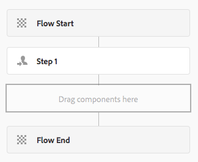
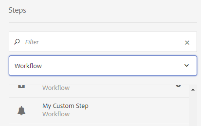
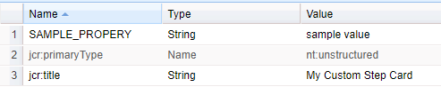
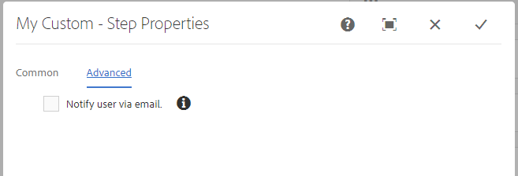

# Utöka arbetsflödesfunktioner{#extending-workflow-functionality}

I det här avsnittet beskrivs hur du utvecklar anpassade stegkomponenter för dina arbetsflöden och hur du interagerar programmatiskt med arbetsflöden.

När du skapar ett anpassat arbetsflödessteg ingår följande aktiviteter:

* Utveckla stegkomponenten för arbetsflödet.
* Implementera stegfunktionerna som en OSGi-tjänst eller ett ECMA-skript.

Du kan också [interagera med arbetsflödena från program och skript](/help/sites-developing/workflows-program-interaction.md).

## Steg-komponenter för arbetsflöde - Grunderna {#workflow-step-components-the-basics}

En arbetsflödesstegkomponent definierar utseendet och beteendet för steget när du skapar arbetsflödesmodeller:

* Kategori- och stegnamn i arbetsflödets sidospark.
* Stegen i arbetsflödesmodeller.
* Redigeringsdialogrutan för konfiguration av komponentegenskaper.
* Tjänsten eller skriptet som körs vid körning.

Precis som för [alla komponenter](/help/sites-developing/components.md)ärver stegkomponenter i arbetsflödet från den komponent som har angetts för `sling:resourceSuperType` egenskapen. I följande diagram visas hierarkin med `cq:component` noder som utgör grunden för alla komponenter i arbetsflödessteg. Diagrammet innehåller också komponenterna **Processsteg**, **Deltagarsteg** och **Dynamic Deltagare Step** , eftersom dessa är de vanligaste (och mest grundläggande) startpunkterna för utveckling av anpassade stegkomponenter.


>[!CAUTION]
>
>Du ***får*** inte ändra något i `/libs` banan.
>
>Detta beror på att innehållet i `/libs` skrivs över nästa gång du uppgraderar din instans (och kan mycket väl skrivas över när du använder en snabbkorrigering eller ett funktionspaket).
>
>Den rekommenderade metoden för konfiguration och andra ändringar är:
>
>1. Återskapa önskat objekt (d.v.s. som det finns i `/libs` under `/apps`
>2. Gör ändringar i `/apps`


Komponenten är den närmaste gemensamma överordnade för `/libs/cq/workflow/components/model/step` Processsteg **,** Deltagarsteg **och** Dynamiskt deltagarsteg ****, som alla ärver följande objekt:

* `step.jsp`

   Skriptet återger `step.jsp` titeln på stegkomponenten när den läggs till i en modell.

   

* [cq:dialog](/help/sites-developing/developing-components.md#creating-and-configuring-a-dialog)

   En dialogruta med följande flikar:

   * **Vanliga**: för att redigera titeln och beskrivningen.
   * **Avancerat**: för att redigera egenskaper för e-postmeddelanden.
    

   >[!NOTE]
   >
   >När flikarna i redigeringsdialogrutan för en stegkomponent inte matchar det här standardutseendet har stegkomponenten definierat skript, nodegenskaper eller dialogruteflikar som åsidosätter de ärvda flikarna.

### ECMA-skript {#ecma-scripts}

Följande objekt är tillgängliga (beroende på stegtyp) i ECMA-skript:

* [WorkItem](https://helpx.adobe.com/experience-manager/6-5/sites/developing/using/reference-materials/javadoc/com/day/cq/workflow/exec/WorkItem.html) workItem
* [WorkflowSession](https://helpx.adobe.com/experience-manager/6-5/sites/developing/using/reference-materials/javadoc/com/day/cq/workflow/WorkflowSession.html) workflowSession
* [WorkflowData](https://helpx.adobe.com/experience-manager/6-5/sites/developing/using/reference-materials/javadoc/com/day/cq/workflow/exec/WorkflowData.html) workflowData
* `args`: -array med processargumenten.

* `sling`: för att få tillgång till andra tjänster.
* `jcrSession`

### MetaDataMaps {#metadatamaps}

Du kan använda arbetsflödets metadata för att behålla information som krävs under arbetsflödets livstid. Ett vanligt krav för arbetsflödessteg är att behålla data för framtida användning i arbetsflödet eller att hämta beständiga data.

Det finns tre typer av MetaDataMap-objekt - för `Workflow`, `WorkflowData` och `WorkItem` objekt. De har alla samma syfte - att lagra metadata.

En WorkItem har en egen MetaDataMap som bara kan användas medan arbetsobjektet (t.ex. steg) körs.

Både `Workflow` och `WorkflowData` metadatamappningar delas över hela arbetsflödet. I så fall bör du bara använda metadatamappningen `WorkflowData` .

## Skapa anpassade komponenter för arbetsflödessteg {#creating-custom-workflow-step-components}

Du kan [skapa komponenter för arbetsflödessteg på samma sätt som andra komponenter](/help/sites-developing/components.md).

Om du vill ärva från en av de (befintliga) grundläggande stegkomponenterna lägger du till följande egenskap i `cq:Component` noden:

* Namn: `sling:resourceSuperType`
* Typ: `String`
* Värde: En av följande sökvägar som matchar en baskomponent:

   * `cq/workflow/components/model/process`
   * `cq/workflow/components/model/participant`
   * `cq/workflow/components/model/dynamic_participant`

### Ange standardtitel och beskrivning för steginstanser {#specifying-the-default-title-and-description-for-step-instances}

Använd följande procedur för att ange standardvärden för fälten **Titel** och **Beskrivning** på fliken **Allmänt** .

>[!NOTE]
>
>Fältvärdena visas i steginstansen när båda följande krav är uppfyllda:
>
>* I redigeringsdialogrutan för steget lagras titeln och beskrivningen på följande platser: >
>* `./jcr:title`
>* `./jcr:description` platser
>
>  
Detta krav uppfylls när redigeringsdialogrutan använder fliken Allmänt som `/libs/cq/flow/components/step/step` komponenten implementerar.
>
>* Stegkomponenten eller ett överordnat element för komponenten åsidosätter inte det skript som `step.jsp` implementeras av `/libs/cq/flow/components/step/step` komponenten.


1. Lägg till följande nod under `cq:Component` noden:

   * Namn: `cq:editConfig`
   * Typ: `cq:EditConfig`
   >[!NOTE]
   >
   >Mer information om cq:editConfig-noden finns i [Konfigurera redigeringsbeteendet för en komponent](/help/sites-developing/developing-components.md#configuring-the-edit-behavior).

1. Lägg till följande nod under `cq:EditConfig` noden:

   * Namn: `cq:formParameters`
   * Typ: `nt:unstructured`

1. Lägg till `String` egenskaper för följande namn i `cq:formParameters` noden:

   * `jcr:title`: Värdet fyller i fältet **Titel** på fliken **Allmänt** .
   * `jcr:description`: Värdet fyller i fältet **Beskrivning** på fliken **Allmänt** .

### Spara egenskapsvärden i arbetsflödesmetadata {#saving-property-values-in-workflow-metadata}

>[!NOTE]
>
>Se [Bevara och få åtkomst till data](#persisting-and-accessing-data). Mer information om hur du får åtkomst till egenskapsvärdet vid körning finns i [Åtkomst till egenskapsvärden för dialogrutor vid körning](#accessing-dialog-property-values-at-runtime).

Egenskapen name för `cq:Widget` objekt anger den JCR-nod som lagrar widgetens värde. När widgetar i dialogrutan för arbetsflödesstegkomponenter lagrar värden under `./metaData` noden läggs värdet till i arbetsflödet `MetaDataMap`.

Ett textfält i en dialogruta är till exempel en `cq:Widget` nod som har följande egenskaper:

| Namn | Typ | Värde |
|---|---|---|
| `xtype` | `String` | `textarea` |
| `name` | `String` | `./metaData/subject` |
| `fieldLabel` | `String` | `Email Subject` |

Värdet som anges i det här textfältet läggs till i arbetsflödesinstansens ` [MetaDataMap](#metadatamaps)` objekt och kopplas till `subject` nyckeln.

>[!NOTE]
>
>När nyckeln är `PROCESS_ARGS`tillgänglig är värdet enkelt tillgängligt i ECMA-skriptimplementeringar via `args` variabeln. I det här fallet är värdet för name-egenskapen `./metaData/PROCESS_ARGS.`

### Åsidosätta stegimplementeringen {#overriding-the-step-implementation}

Med varje basstegskomponent kan utvecklare av arbetsflödesmodeller konfigurera följande nyckelfunktioner i designläge:

* Processsteg: Tjänsten eller ECMA-skriptet som ska köras under körning.
* Deltagarsteg: ID för den användare som har tilldelats den genererade arbetsposten.
* Dynamiskt deltagarsteg: Tjänsten eller ECMA-skriptet som väljer ID för användaren som är tilldelad arbetsposten.

Om du vill fokusera komponenten för användning i ett specifikt arbetsflödesscenario konfigurerar du nyckelfunktionen i designen och tar bort möjligheten för modellutvecklare att ändra den.

1. Lägg till följande nod under cq:component-noden:

   * Namn: `cq:editConfig`
   * Typ: `cq:EditConfig`
   Mer information om cq:editConfig-noden finns i [Konfigurera redigeringsbeteendet för en komponent](/help/sites-developing/developing-components.md#configuring-the-edit-behavior).

1. Under cq:EditConfig-noden lägger du till följande nod:

   * Namn: `cq:formParameters`
   * Typ: `nt:unstructured`

1. Lägg till en `String` egenskap i `cq:formParameters` noden. Komponentens överordnade typ avgör egenskapens namn:

   * Processsteg: `PROCESS`
   * Deltagarsteg: `PARTICIPANT`
   * Dynamiskt deltagarsteg: `DYNAMIC_PARTICIPANT`

1. Ange egenskapens värde:

   * `PROCESS`: Sökvägen till ECMA-skriptet eller PID för den tjänst som implementerar stegbeteendet.
   * `PARTICIPANT`: ID för den användare som är tilldelad arbetsuppgiften.
   * `DYNAMIC_PARTICIPANT`: Sökvägen till ECMA-skriptet eller PID för den tjänst som väljer användaren att tilldela arbetsposten.

1. Om du vill ta bort möjligheten för modellutvecklare att ändra egenskapsvärden åsidosätter du dialogrutan för komponentens supertyp.

### Lägga till formulär och dialogrutor i deltagarsteg {#adding-forms-and-dialogs-to-participant-steps}

Anpassa deltagarstegskomponenten för att tillhandahålla funktioner som finns i komponenterna [Formulärdeltagarsteg](/help/sites-developing/workflows-step-ref.md#form-participant-step) och [Dialog Participant Step](/help/sites-developing/workflows-step-ref.md#dialog-participant-step) :

* Visa ett formulär för användaren när han/hon öppnar det genererade arbetsobjektet.
* Visa en anpassad dialogruta för användaren när han/hon slutför det genererade arbetsobjektet.

Utför följande procedur för den nya komponenten (se [Skapa anpassade stegkomponenter](#creating-custom-workflow-step-components)för arbetsflöde):

1. Lägg till följande nod under `cq:Component` noden:

   * Namn: `cq:editConfig`
   * Typ: `cq:EditConfig`
   Mer information om cq:editConfig-noden finns i [Konfigurera redigeringsbeteendet för en komponent](/help/sites-developing/components-basics.md#edit-behavior).

1. Under cq:EditConfig-noden lägger du till följande nod:

   * Namn: `cq:formParameters`
   * Typ: `nt:unstructured`

1. Om du vill visa ett formulär när användaren öppnar arbetsposten lägger du till följande egenskap i `cq:formParameters` noden:

   * Namn: `FORM_PATH`
   * Typ: `String`
   * Värde: Sökvägen som matchar formuläret

1. Om du vill visa en anpassad dialogruta när användaren slutför arbetsposten lägger du till följande egenskap i `cq:formParameters` noden

   * Namn: `DIALOG_PATH`
   * Typ: `String`
   * Värde: Sökvägen som leder till dialogrutan

### Konfigurera beteende för arbetsflödesstegets körningsmiljö {#configuring-the-workflow-step-runtime-behavior}

Lägg till en `cq:Component` nod nedanför `cq:EditConfig` noden. Under den lägger du till en `nt:unstructured` nod (måste namnges `cq:formParameters`) och i den noden lägger du till följande egenskaper:

* Namn: `PROCESS_AUTO_ADVANCE`

   * Typ: `Boolean`
   * Värde:

      * när `true` arbetsflödet är inställt kommer det att köras och fortsätta - detta är standard och rekommenderas också
      * När `false`arbetsflödet ska köras och stoppas. detta kräver extra hantering, så `true` vi rekommenderar

* Namn: `DO_NOTIFY`

   * Typ: `Boolean`
   * Värde: anger om e-postmeddelanden ska skickas för användardeltagande (och förutsätter att e-postservern är korrekt konfigurerad)

## Bevara och få åtkomst till data {#persisting-and-accessing-data}

### Beständiga data för efterföljande arbetsflödessteg {#persisting-data-for-subsequent-workflow-steps}

Du kan använda arbetsflödets metadata för att behålla information som krävs under arbetsflödets livstid - och mellan steg. Ett vanligt krav för arbetsflödessteg är att bevara data för framtida bruk eller att hämta beständiga data från tidigare steg.

Metadata för arbetsflöde lagras i ett [`MetaDataMap`](#metadatamaps) objekt. Java-API:t innehåller en metod för [`Workflow.getWorkflowData`](https://helpx.adobe.com/experience-manager/6-5/sites/developing/using/reference-materials/javadoc/com/adobe/granite/workflow/exec/Workflow.html) att returnera ett [`WorkflowData`](https://helpx.adobe.com/experience-manager/6-5/sites/developing/using/reference-materials/javadoc/com/adobe/granite/workflow/exec/WorkflowData.html) objekt som innehåller rätt `MetaDataMap` objekt. Det här `WorkflowData``MetaDataMap` objektet är tillgängligt för OSGi-tjänsten eller ECMA-skriptet för en stegkomponent.

#### Java {#java}

Implementeringens körningsmetod `WorkflowProcess` skickas till `WorkItem` objektet. Använd det här objektet för att hämta `WorkflowData` objektet för den aktuella arbetsflödesinstansen. I följande exempel läggs ett objekt till i arbetsflödesobjektet `MetaDataMap` och sedan loggas varje objekt. Objektet (&quot;minkey&quot;,&quot;My Step Value&quot;) är tillgängligt för efterföljande steg i arbetsflödet.

```java
public void execute(WorkItem item, WorkflowSession session, MetaDataMap args) throws WorkflowException {

    MetaDataMap wfd = item.getWorkflow().getWorkflowData().getMetaDataMap();

    wfd.put("mykey", "My Step Value");

    Set<String> keyset = wfd.keySet();
    Iterator<String> i = keyset.iterator();
    while (i.hasNext()){
     Object key = i.next();
     log.info("The workflow medata includes key {} and value {}",key.toString(),wfd.get(key).toString());
    }
}
```

#### ECMA-skript {#ecma-script}

Variabeln är ECMA-skriptrepresentationen av det aktuella `graniteWorkItem` `WorkItem` Java-objektet. Du kan därför använda variabeln `graniteWorkItem` för att hämta arbetsflödets metadata. Följande ECMA-skript kan användas för att implementera ett **processteg** för att lägga till ett objekt i `MetaDataMap` arbetsflödesobjektet och sedan logga varje objekt. Dessa objekt är sedan tillgängliga för efterföljande steg i arbetsflödet.

>[!NOTE]
>
>Den `metaData` variabel som är omedelbart tillgänglig för stegskriptet är metadata för steget. Metadata för steget skiljer sig från metadata för arbetsflödet.

```
var currentDateInMillis = new Date().getTime();

graniteWorkItem.getWorkflowData().getMetaDataMap().put("hardcodedKey","theKey");

graniteWorkItem.getWorkflowData().getMetaDataMap().put("currentDateInMillisKey",currentDateInMillis);

var iterator = graniteWorkItem.getWorkflowData().getMetaDataMap().keySet().iterator();
while (iterator.hasNext()){
    var key = iterator.next();
    log.info("Workflow metadata key, value = " + key.toString() + ", " + graniteWorkItem.getWorkflowData().getMetaDataMap().get(key));
}
```

### Åtkomst till egenskapsvärden för dialogrutor vid körning {#accessing-dialog-property-values-at-runtime}

Objektet med arbetsflödesinstanser är användbart när du vill lagra och hämta data under arbetsflödets livstid. `MetaDataMap` För implementeringar av komponenter för arbetsflödessteg är funktionen särskilt användbar när du vill hämta egenskapsvärden för komponenter vid körning. `MetaDataMap`

>[!NOTE]
>
>Mer information om hur du konfigurerar komponentdialogrutan för att lagra egenskaper som arbetsflödesmetadata finns i [Spara egenskapsvärden i arbetsflödesmetadata](#saving-property-values-in-workflow-metadata).

Arbetsflödet `MetaDataMap` är tillgängligt för implementering av Java- och ECMA-skriptprocessen:

* I Java-implementeringar av WorkflowProcess-gränssnittet är parametern `args` objektet `MetaDataMap` för arbetsflödet.

* I ECMA-skriptimplementeringar är värdet tillgängligt med hjälp av variablerna `args` och `metadata` .

### Exempel: Hämtar argument för processtegskomponenten {#example-retrieving-the-arguments-of-the-process-step-component}

Redigeringsdialogrutan för komponenten **Processsteg** innehåller egenskapen **Arguments** . Värdet för egenskapen **Arguments** lagras i arbetsflödets metadata och associeras med `PROCESS_ARGS` nyckeln.

I följande diagram är värdet för egenskapen **Arguments** `argument1, argument2`:


#### Java {#java-1}

Följande Java-kod är `execute` metod för en `WorkflowProcess` implementering. Metoden loggar värdet i `args` den `MetaDataMap` som är associerad med `PROCESS_ARGS` nyckeln.

```java
public void execute(WorkItem item, WorkflowSession session, MetaDataMap args) throws WorkflowException {
     if (args.containsKey("PROCESS_ARGS")){
      log.info("workflow metadata for key PROCESS_ARGS and value {}",args.get("PROCESS_ARGS","string").toString());
     }
    }
```

När ett processsteg som använder den här Java-implementeringen körs innehåller loggen följande post:

```xml
16.02.2018 12:07:39.566 *INFO* [JobHandler: /var/workflow/instances/server0/2018-02-16/model_855140139900189:/content/we-retail/de] com.adobe.example.workflow.impl.process.LogArguments workflow metadata for key PROCESS_ARGS and value argument1, argument2
```

#### ECMA-skript {#ecma-script-1}

Följande ECMA-skript används som process för **processteget**. Här loggas antalet argument och argumentvärdena:

```
var iterator = graniteWorkItem.getWorkflowData().getMetaDataMap().keySet().iterator();
while (iterator.hasNext()){
    var key = iterator.next();
    log.info("Workflow metadata key, value = " + key.toString() + ", " + graniteWorkItem.getWorkflowData().getMetaDataMap().get(key));
}
log.info("hardcodedKey "+ graniteWorkItem.getWorkflowData().getMetaDataMap().get("hardcodedKey"));
log.info("currentDateInMillisKey "+ graniteWorkItem.getWorkflowData().getMetaDataMap().get("currentDateInMillisKey"));
```

>[!NOTE]
>
>I det här avsnittet beskrivs hur du arbetar med argument för processsteg. Informationen gäller även för dynamiska deltagarval.

>[!NOTE]
>Ett annat exempel på hur du lagrar komponentegenskaper i arbetsflödets metadata finns i Exempel: Skapa ett steg för loggningsarbetsflöde. Det här exemplet innehåller en dialogruta som associerar metadatavärde med en annan nyckel än PROCESS_ARGS.

### Skript och processargument {#scripts-and-process-arguments}

I ett skript för en **Process Step** -komponent är argument tillgängliga via `args` objektet.

När du skapar en anpassad stegkomponent `metaData` är objektet tillgängligt i ett skript. Det här objektet är begränsat till ett strängargument.

## Utveckla stegimplementeringar för processer {#developing-process-step-implementations}

När processteg startas under en arbetsflödesprocess skickar stegen en begäran till en OSGi-tjänst eller kör ett ECMA-skript. Utveckla den tjänst eller det ECMA-skript som utför de åtgärder som arbetsflödet kräver.

>[!NOTE]
>
>Mer information om hur du associerar processstegskomponenten med tjänsten eller skriptet finns i [Processsteg](/help/sites-developing/workflows-step-ref.md#process-step) eller [Åsidosätta stegimplementeringen](#overriding-the-step-implementation).

### Implementera ett processsteg med en Java-klass {#implementing-a-process-step-with-a-java-class}

Så här definierar du ett processteg som en OSGI-tjänstkomponent (Java bundle):

1. Skapa paketet och distribuera det i OSGI-behållaren. Mer information finns i dokumentationen om hur du skapar ett paket med [CRXDE Lite](/help/sites-developing/developing-with-crxde-lite.md) eller [Eclipse](/help/sites-developing/howto-projects-eclipse.md).

   >[!NOTE]
   >
   >OSGI-komponenten måste implementera `WorkflowProcess` gränssnittet med sin `execute()` metod. Se exempelkoden nedan.

   >[!NOTE]
   >
   >Paketnamnet måste läggas till i avsnittet `<*Private-Package*>` i `maven-bundle-plugin` konfigurationen.

1. Lägg till SCR-egenskapen `process.label` och ange värdet efter behov. Detta är det namn som processsteget listas som när du använder den generiska **processstegskomponenten** . Se exemplet nedan.
1. I **modellredigeraren** lägger du till processsteget i arbetsflödet med den generiska **processstegskomponenten** .
1. Gå till fliken **Process** i dialogrutan Redigera (i **Processsteget** ) och välj processimplementering.
1. Om du använder argument i koden anger du **Processargument**. Till exempel: false.
1. Spara ändringarna för både steget och arbetsflödesmodellen (modellredigerarens övre vänstra hörn).

Java-metoderna, respektive klasserna som implementerar den körbara Java-metoden, registreras som OSGI-tjänster, vilket gör att du kan lägga till metoder när som helst under körningen.

Följande OSGI-komponent lägger till egenskapen `approved` i sidinnehållsnoden när nyttolasten är en sida:

```java
package com.adobe.example.workflow.impl.process;

import com.adobe.granite.workflow.WorkflowException;
import com.adobe.granite.workflow.WorkflowSession;
import com.adobe.granite.workflow.exec.WorkItem;
import com.adobe.granite.workflow.exec.WorkflowData;
import com.adobe.granite.workflow.exec.WorkflowProcess;
import com.adobe.granite.workflow.metadata.MetaDataMap;

import org.apache.felix.scr.annotations.Component;
import org.apache.felix.scr.annotations.Property;
import org.apache.felix.scr.annotations.Service;

import org.osgi.framework.Constants;

import javax.jcr.Node;
import javax.jcr.RepositoryException;
import javax.jcr.Session;

/**
 * Sample workflow process that sets an <code>approve</code> property to the payload based on the process argument value.
 */
@Component
@Service
public class MyProcess implements WorkflowProcess {

 @Property(value = "An example workflow process implementation.")
 static final String DESCRIPTION = Constants.SERVICE_DESCRIPTION;
 @Property(value = "Adobe")
 static final String VENDOR = Constants.SERVICE_VENDOR;
 @Property(value = "My Sample Workflow Process")
 static final String LABEL="process.label";

 private static final String TYPE_JCR_PATH = "JCR_PATH";

 public void execute(WorkItem item, WorkflowSession session, MetaDataMap args) throws WorkflowException {
  WorkflowData workflowData = item.getWorkflowData();
  if (workflowData.getPayloadType().equals(TYPE_JCR_PATH)) {
   String path = workflowData.getPayload().toString() + "/jcr:content";
   try {
    Session jcrSession = session.adaptTo(Session.class);
    Node node = (Node) jcrSession.getItem(path);
    if (node != null) {
     node.setProperty("approved", readArgument(args));
     jcrSession.save();
    }
   } catch (RepositoryException e) {
    throw new WorkflowException(e.getMessage(), e);
   }
  }
 }

 private boolean readArgument(MetaDataMap args) {
  String argument = args.get("PROCESS_ARGS", "false");
  return argument.equalsIgnoreCase("true");
 }
}
```

>[!NOTE]
>
>Om processen misslyckas tre gånger i rad placeras ett objekt i Inkorgen för arbetsflödesadministratören.

### Använda ECMAScript {#using-ecmascript}

Med ECMA-skript kan skriptutvecklare implementera processsteg. Skripten finns i JCR-databasen och körs därifrån.

I följande tabell visas de variabler som är omedelbart tillgängliga för att bearbeta skript, vilket ger tillgång till objekt i arbetsflödets Java API.

| Java-klass | Skriptvariabelnamn | Beskrivning |
|---|---|---|
| `com.adobe.granite.workflow.exec.WorkItem` | `graniteWorkItem` | Den aktuella steginstansen. |
| `com.adobe.granite.workflow.WorkflowSession` | `graniteWorkflowSession` | Arbetsflödessessionen för den aktuella steginstansen. |
| `String[]` (innehåller processargument) | `args` | Stegargumenten. |
| `com.adobe.granite.workflow.metadata.MetaDataMap` | `metaData` | Metadata för den aktuella steginstansen. |
| `org.apache.sling.scripting.core.impl.InternalScriptHelper` | `sling` | Ger åtkomst till Sling-miljön. |

Följande exempelskript visar hur du får åtkomst till JCR-noden som representerar arbetsflödets nyttolast. Variabeln `graniteWorkflowSession` anpassas till en JCR-sessionsvariabel, som används för att hämta noden från nyttolastsökvägen.

```
var workflowData = graniteWorkItem.getWorkflowData();
if (workflowData.getPayloadType() == "JCR_PATH") {
    var path = workflowData.getPayload().toString();
    var jcrsession = graniteWorkflowSession.adaptTo(Packages.javax.jcr.Session);
    var node = jcrsession.getNode(path);
    if (node.hasProperty("approved")){
     node.setProperty("approved", args[0] == "true" ? true : false);
     node.save();
 }
}
```

Följande skript kontrollerar om nyttolasten är en bild ( `.png` fil), skapar en svartvit bild från den och sparar den som en nod på samma nivå.

```
var workflowData = graniteWorkItem.getWorkflowData();
if (workflowData.getPayloadType() == "JCR_PATH") {
    var path = workflowData.getPayload().toString();
    var jcrsession = graniteWorkflowSession.adaptTo(Packages.javax.jcr.Session);
    var node = jcrsession.getRootNode().getNode(path.substring(1));
     if (node.isNodeType("nt:file") && node.getProperty("jcr:content/jcr:mimeType").getString().indexOf("image/") == 0) {
        var is = node.getProperty("jcr:content/jcr:data").getStream();
        var layer = new Packages.com.day.image.Layer(is);
        layer.grayscale();
                var parent = node.getParent();
                var gn = parent.addNode("grey" + node.getName(), "nt:file");
        var content = gn.addNode("jcr:content", "nt:resource");
                content.setProperty("jcr:mimeType","image/png");
                var cal = Packages.java.util.Calendar.getInstance();
                content.setProperty("jcr:lastModified",cal);
                var f = Packages.java.io.File.createTempFile("test",".png");
        var tout = new Packages.java.io.FileOutputStream(f);
        layer.write("image/png", 1.0, tout);
        var fis = new Packages.java.io.FileInputStream(f);
                content.setProperty("jcr:data", fis);
                parent.save();
        tout.close();
        fis.close();
        is.close();
        f.deleteOnExit();
    }
}
```

Så här använder du skriptet:

1. Skapa skriptet (till exempel med CRXDE Lite) och spara det i databasen nedan `/apps/myapp/workflow/scripts`
1. Om du vill ange en titel som identifierar skriptet i dialogrutan **Processstegsredigering** lägger du till följande egenskaper i skriptets `jcr:content` nod:

   | Namn | Typ | Värde |
   |---|---|---|
   | `jcr:mixinTypes` | `Name[]` | `mix:title` |
   | `jcr:title` | `String` | Namnet som ska visas i redigeringsdialogrutan. |

1. Redigera instansen **Processsteg** och ange det skript som ska användas.

## Utveckla deltagarväljare {#developing-participant-choosers}

Du kan utveckla deltagarval för komponenter i **Dynamic Deltagare Step** .

När en komponent för **dynamiskt deltagarsteg** startas under ett arbetsflöde, måste steget definiera deltagaren som det genererade arbetsobjektet kan tilldelas till. Så här gör du i det här steget:

* skickar en begäran till en OSGi-tjänst
* kör ett ECMA-skript för att välja deltagaren

Du kan utveckla en tjänst eller ett ECMA-skript som väljer deltagare enligt kraven i ditt arbetsflöde.

>[!NOTE]
>
>Mer information om hur du associerar **komponenten Dynamic Participant Step** med tjänsten eller skriptet finns i [Dynamic Participant Step](/help/sites-developing/workflows-step-ref.md#dynamic-participant-step) eller [Override the Step Implementation](#persisting-and-accessing-data).

### Utveckla en deltagarväljare Använda en Java-klass {#developing-a-participant-chooser-using-a-java-class}

Så här definierar du ett deltagarsteg som en OSGI-tjänstkomponent (Java-klass):

1. OSGI-komponenten måste implementera `ParticipantStepChooser` gränssnittet med sin `getParticipant()` metod. Se exempelkoden nedan.

   Skapa paketet och distribuera det i OSGI-behållaren.

1. Lägg till SCR-egenskapen `chooser.label` och ställ in värdet efter behov. Detta är namnet som deltagarväljaren visas med hjälp av komponenten **Dynamic Deltagare Step** . Se exemplet:

   ```java
   package com.adobe.example.workflow.impl.process;
   
   import com.adobe.granite.workflow.WorkflowException;
   import com.adobe.granite.workflow.WorkflowSession;
   import com.adobe.granite.workflow.exec.ParticipantStepChooser;
   import com.adobe.granite.workflow.exec.WorkItem;
   import com.adobe.granite.workflow.exec.WorkflowData;
   import com.adobe.granite.workflow.metadata.MetaDataMap;
   
   import org.apache.felix.scr.annotations.Component;
   import org.apache.felix.scr.annotations.Property;
   import org.apache.felix.scr.annotations.Service;
   
   import org.osgi.framework.Constants;
   
   /**
    * Sample dynamic participant step that determines the participant based on a path given as argument.
    */
   @Component
   @Service
   
   public class MyDynamicParticipant implements ParticipantStepChooser {
   
    @Property(value = "An example implementation of a dynamic participant chooser.")
    static final String DESCRIPTION = Constants.SERVICE_DESCRIPTION;
       @Property(value = "Adobe")
       static final String VENDOR = Constants.SERVICE_VENDOR;
       @Property(value = "Dynamic Participant Chooser Process")
       static final String LABEL=ParticipantStepChooser.SERVICE_PROPERTY_LABEL;
   
       private static final String TYPE_JCR_PATH = "JCR_PATH";
   
       public String getParticipant(WorkItem workItem, WorkflowSession workflowSession, MetaDataMap args) throws WorkflowException {
           WorkflowData workflowData = workItem.getWorkflowData();
           if (workflowData.getPayloadType().equals(TYPE_JCR_PATH)) {
               String path = workflowData.getPayload().toString();
               String pathFromArgument = args.get("PROCESS_ARGS", String.class);
               if (pathFromArgument != null && path.startsWith(pathFromArgument)) {
                   return "admin";
               }
           }
           return "administrators";
       }
   }
   ```

1. I **modellredigeraren** lägger du till det dynamiska deltagarsteget i arbetsflödet med den generiska komponenten **Dynamic Participant Step** .
1. I redigeringsdialogrutan väljer du fliken **Deltagarväljaren** och väljer en implementering av väljaren.
1. Om du använder argument i koden anger du **Processargument**. I det här exemplet: `/content/we-retail/de`.
1. Spara ändringarna för både steget och arbetsflödesmodellen.

### Utveckla en deltagarväljare med hjälp av ett ECMA-skript {#developing-a-participant-chooser-using-an-ecma-script}

Du kan skapa ett ECMA-skript som väljer den användare som tilldelas arbetsposten som **Deltagarsteget** genererar. Skriptet måste innehålla en funktion med namnet `getParticipant` som inte kräver några argument, och returnerar en `String` som innehåller användarens eller gruppens ID.

Skript finns i JCR-databasen och körs därifrån.

I följande tabell visas de variabler som ger omedelbar åtkomst till Java-objekt i arbetsflöden i dina skript.

| Java-klass | Skriptvariabelnamn |
|---|---|
| `com.adobe.granite.workflow.exec.WorkItem` | `graniteWorkItem` |
| `com.adobe.granite.workflow.WorkflowSession` | `graniteWorkflowSession` |
| `String[]` (innehåller processargument) | `args` |
| `com.adobe.granite.workflow.metadata.MetaDataMap` | `metaData` |
| `org.apache.sling.scripting.core.impl.InternalScriptHelper` | `sling` |

```
function getParticipant() {
    var workflowData = graniteWorkItem.getWorkflowData();
    if (workflowData.getPayloadType() == "JCR_PATH") {
        var path = workflowData.getPayload().toString();
        if (path.indexOf("/content/we-retail/de") == 0) {
            return "admin";
        } else {
            return "administrators";
        }
    }
}
```

1. Skapa skriptet (till exempel med CRXDE Lite) och spara det i databasen nedan `/apps/myapp/workflow/scripts`
1. Om du vill ange en titel som identifierar skriptet i dialogrutan **Processstegsredigering** lägger du till följande egenskaper i skriptets `jcr:content` nod:

   | Namn | Typ | Värde |
   |---|---|---|
   | `jcr:mixinTypes` | `Name[]` | `mix:title` |
   | `jcr:title` | `String` | Namnet som ska visas i redigeringsdialogrutan. |

1. Redigera instansen [Dynamic Participant Step](/help/sites-developing/workflows-step-ref.md#dynamic-participant-step) och ange det skript som ska användas.

## Hantera arbetsflödespaket {#handling-workflow-packages}

[Arbetsflödespaket](/help/sites-authoring/workflows-applying.md#specifying-workflow-details-in-the-create-workflow-wizard) kan skickas till ett arbetsflöde för bearbetning. Arbetsflödespaket innehåller referenser till resurser som sidor och resurser.

>[!NOTE]
>
>Följande arbetsflödessteg accepterar arbetsflödespaket för aktivering av gruppsidor:
>
>* [`com.day.cq.wcm.workflow.process.ActivatePageProcess`](https://helpx.adobe.com/experience-manager/6-5/sites/developing/using/reference-materials/javadoc/com/day/cq/wcm/workflow/process/ActivatePageProcess.html)
>* [`com.day.cq.wcm.workflow.process.DeactivatePageProcess`](https://helpx.adobe.com/experience-manager/6-5/sites/developing/using/reference-materials/javadoc/com/day/cq/wcm/workflow/process/DeactivatePageProcess.html)
>


Du kan utveckla arbetsflödessteg som hämtar paketresurserna och bearbetar dem. Följande medlemmar i paketet ger åtkomst till arbetsflödespaket `com.day.cq.workflow.collection` :

* `ResourceCollection`: Klassen för arbetsflödespaket.
* `ResourceCollectionUtil`: Används för att hämta ResourceCollection-objekt.
* `ResourceCollectionManager`: Skapar och hämtar samlingar. En implementering distribueras som en OSGi-tjänst.

I följande exempel visas hur Java-klassen hämtar paketresurser:

```java
package com.adobe.example;

import java.util.ArrayList;
import java.util.List;

import com.day.cq.workflow.WorkflowException;
import com.day.cq.workflow.WorkflowSession;
import com.day.cq.workflow.collection.ResourceCollection;
import com.day.cq.workflow.collection.ResourceCollectionManager;
import com.day.cq.workflow.collection.ResourceCollectionUtil;
import com.day.cq.workflow.exec.WorkItem;
import com.day.cq.workflow.exec.WorkflowData;
import com.day.cq.workflow.exec.WorkflowProcess;
import com.day.cq.workflow.metadata.MetaDataMap;

import org.apache.felix.scr.annotations.Component;
import org.apache.felix.scr.annotations.Property;
import org.apache.felix.scr.annotations.Service;
import org.apache.felix.scr.annotations.Reference;
import org.osgi.framework.Constants;

import org.slf4j.Logger;
import org.slf4j.LoggerFactory;

import javax.jcr.Node;
import javax.jcr.PathNotFoundException;
import javax.jcr.RepositoryException;
import javax.jcr.Session;

@Component
@Service
public class LaunchBulkActivate implements WorkflowProcess {

 private static final Logger log = LoggerFactory.getLogger(LaunchBulkActivate.class);

 @Property(value="Bulk Activate for Launches")
  static final String PROCESS_NAME ="process.label";
 @Property(value="A sample workflow process step to support Launches bulk activation of pages")
 static final String SERVICE_DESCRIPTION = Constants.SERVICE_DESCRIPTION;

 @Reference
 private ResourceCollectionManager rcManager;
public void execute(WorkItem workItem, WorkflowSession workflowSession) throws Exception {
    Session session = workflowSession.getSession();
    WorkflowData data = workItem.getWorkflowData();
    String path = null;
    String type = data.getPayloadType();
    if (type.equals(TYPE_JCR_PATH) && data.getPayload() != null) {
        String payloadData = (String) data.getPayload();
        if (session.itemExists(payloadData)) {
            path = payloadData;
        }
    } else if (data.getPayload() != null && type.equals(TYPE_JCR_UUID)) {
        Node node = session.getNodeByUUID((String) data.getPayload());
        path = node.getPath();
    }

    // CUSTOMIZED CODE IF REQUIRED....

    if (path != null) {
        // check for resource collection
        ResourceCollection rcCollection = ResourceCollectionUtil.getResourceCollection((Node)session.getItem(path), rcManager);
        // get list of paths to replicate (no resource collection: size == 1
        // otherwise size >= 1
        List<String> paths = getPaths(path, rcCollection);
        for (String aPath: paths) {

            // CUSTOMIZED CODE....

        }
    } else {
        log.warn("Cannot process because path is null for this " + "workitem: " + workItem.toString());
    }
}

/**
 * helper
 */
private List<String> getPaths(String path, ResourceCollection rcCollection) {
    List<String> paths = new ArrayList<String>();
    if (rcCollection == null) {
        paths.add(path);
    } else {
        log.debug("ResourceCollection detected " + rcCollection.getPath());
        // this is a resource collection. the collection itself is not
        // replicated. only its members
        try {
            List<Node> members = rcCollection.list(new String[]{"cq:Page", "dam:Asset"});
            for (Node member: members) {
                String mPath = member.getPath();
                paths.add(mPath);
            }
        } catch(RepositoryException re) {
            log.error("Cannot build path list out of the resource collection " + rcCollection.getPath());
        }
    }
    return paths;
}
}
```

## Exempel: Skapa ett anpassat steg {#example-creating-a-custom-step}

Ett enkelt sätt att börja skapa ett eget anpassat steg är att kopiera ett befintligt steg från:

`/libs/cq/workflow/components/model`

### Skapa det grundläggande steget {#creating-the-basic-step}

1. Återskapa sökvägen under /apps; till exempel:

   `/apps/cq/workflow/components/model`

   De nya mapparna är av typen `nt:folder`:

   ```xml
   - apps
     - cq
       - workflow (nt:folder)
         - components (nt:folder)
           - model (nt:folder)
   ```

   >[!NOTE]
   >
   >Det här steget gäller inte för den klassiska UI-modellredigeraren.

1. Placera sedan det kopierade steget i mappen /apps; till exempel som:

   `/apps/cq/workflow/components/model/myCustomStep`

   Här är resultatet av vårt skräddarsydda steg:

   

   >[!CAUTION]
   >
   >Eftersom det i standardgränssnittet inte visas mer än bara texten och inte informationen på kortet behövs inte `details.jsp` som den var för den klassiska gränssnittsredigeraren.

1. Använd följande egenskaper på noden:

   `/apps/cq/workflow/components/model/myCustomStep`

   **Intresseområden:**

   * `sling:resourceSuperType`

      Måste ärva från ett befintligt steg.

      I det här exemplet ärver vi från bassteget vid `cq/workflow/components/model/step`, men du kan använda andra supertyper som `participant`, `process`osv.

   * `jcr:title`

      Visar titeln när komponenten visas i stegwebbläsaren (den vänstra panelen i arbetsflödesmodellredigeraren).

   * `cq:icon`

      Används för att ange en [koralikon](https://helpx.adobe.com/experience-manager/6-5/sites/developing/using/reference-materials/coral-ui/coralui3/Coral.Icon.html) för steget.

   * `componentGroup`

      Måste vara något av följande:

      * Arbetsflöde för samarbete
      * DAM-arbetsflöde
      * Formulärarbetsflöde
      * Projekt
      * WCM-arbetsflöde
      * Arbetsflöde
   

1. Nu kan du öppna en arbetsflödesmodell för redigering. I stegwebbläsaren kan du filtrera så att **Mina anpassade steg** visas:

   

   Kortet visas när **du drar det anpassade steget** till modellen:

   

   Om ingen `cq:icon` har definierats för steget återges en standardikon med de två första bokstäverna i titeln. Exempel:

   

#### Definiera dialogrutan Stega in konfiguration {#defining-the-step-configure-dialog}

När du har [skapat det grundläggande steget](#creating-the-basic-step)definierar du dialogrutan **Konfigurera** enligt följande:

1. Konfigurera egenskaperna på noden `cq:editConfig` enligt följande:

   **Intresseområden:**

   * `cq:inherit`

      Om du anger `true`det ärver stegkomponenten egenskaperna från det steg du angav i `sling:resourceSuperType`.

   * `cq:disableTargeting`

      Ange efter behov.
   

1. Konfigurera egenskaperna på noden `cq:formsParameter` enligt följande:

   **Intresseområden:**

   * `jcr:title`

      Anger standardtiteln på stegkortet i modellkartan och i fältet **Titel** i dialogrutan **Min egen konfiguration - stegegenskaper** .

   * Du kan också definiera egna anpassade egenskaper.
   

1. Konfigurera egenskaperna på noden `cq:listeners`.

   Med `cq:listener` noden och dess egenskaper kan du ange händelsehanterare som reagerar på händelser i den pekaktiverade modellredigeraren i användargränssnittet. som att dra ett steg till en modellsida eller redigera en stegegenskap.

   **Intresseområden:**

   * `afterMove: REFRESH_PAGE`
   * `afterdelete: CQ.workflow.flow.Step.afterDelete`
   * `afteredit: CQ.workflow.flow.Step.afterEdit`
   * `afterinsert: CQ.workflow.flow.Step.afterInsert`
   Den här konfigurationen är viktig för att redigeraren ska fungera korrekt. I de flesta fall får den här konfigurationen inte ändras.

   Om du ställer in `cq:inherit` på true (på `cq:editConfig` noden se ovan) kan du ärva den här konfigurationen utan att explicit behöva inkludera den i stegdefinitionen. Om inget arv finns på plats måste du lägga till den här noden med följande egenskaper och värden.

   I det här exemplet har arv aktiverats så att vi kan ta bort `cq:listeners` noden och steget fungerar fortfarande korrekt.

   

1. Nu kan du lägga till en instans av steget i en arbetsflödesmodell. När du **konfigurerar** steget visas dialogrutan:

    

#### Exempelkod som används i det här exemplet {#sample-markup-used-in-this-example}

Markeringar för ett anpassat steg visas i `.content.xml` komponentens rotnod. Det exempel `.content.xml` som används i det här exemplet:

`/apps/cq/workflow/components/model/myCustomStep/.content.xml`

```xml
<?xml version="1.0" encoding="UTF-8"?>
<jcr:root xmlns:sling="https://sling.apache.org/jcr/sling/1.0" xmlns:cq="https://www.day.com/jcr/cq/1.0" xmlns:jcr="https://www.jcp.org/jcr/1.0"
    cq:icon="bell"
    jcr:primaryType="cq:Component"
    jcr:title="My Custom Step"
    sling:resourceSuperType="cq/workflow/components/model/process"
    allowedParents="[*/parsys]"
    componentGroup="Workflow"/>
```

Det exempel som används i det här exemplet `_cq_editConfig.xml` :

```xml
<?xml version="1.0" encoding="UTF-8"?>
<jcr:root xmlns:cq="https://www.day.com/jcr/cq/1.0" xmlns:jcr="https://www.jcp.org/jcr/1.0" xmlns:nt="https://www.jcp.org/jcr/nt/1.0"
    cq:disableTargeting="{Boolean}true"
    cq:inherit="{Boolean}true"
    jcr:primaryType="cq:EditConfig">
    <cq:formParameters
        jcr:primaryType="nt:unstructured"
        jcr:title="My Custom Step Card"
        SAMPLE_PROPERY="sample value"/>
    <cq:listeners
        jcr:primaryType="cq:EditListenersConfig"
        afterdelete="CQ.workflow.flow.Step.afterDelete"
        afteredit="CQ.workflow.flow.Step.afterEdit"
        afterinsert="CQ.workflow.flow.Step.afterInsert"
        afterMove="REFRESH_PAGE"/>
</jcr:root>
```

Det exempel som används i det här exemplet `_cq_dialog/.content.xml` :

```xml
<?xml version="1.0" encoding="UTF-8"?>
<jcr:root xmlns:sling="https://sling.apache.org/jcr/sling/1.0" xmlns:cq="https://www.day.com/jcr/cq/1.0" xmlns:jcr="https://www.jcp.org/jcr/1.0" xmlns:nt="https://www.jcp.org/jcr/nt/1.0"
    jcr:primaryType="nt:unstructured"
    jcr:title="My Custom - Step Properties"
    sling:resourceType="cq/gui/components/authoring/dialog">
    <content
        jcr:primaryType="nt:unstructured"
        sling:resourceType="granite/ui/components/coral/foundation/tabs">
        <items jcr:primaryType="nt:unstructured">
            <common
                cq:hideOnEdit="true"
                jcr:primaryType="nt:unstructured"
                jcr:title="Common"
                sling:resourceType="granite/ui/components/coral/foundation/fixedcolumns"/>
            <process
                cq:hideOnEdit="true"
                jcr:primaryType="nt:unstructured"
                jcr:title="Process"
                sling:resourceType="granite/ui/components/coral/foundation/fixedcolumns"/>
            <mycommon
                jcr:primaryType="nt:unstructured"
                jcr:title="Common"
                sling:resourceType="granite/ui/components/coral/foundation/fixedcolumns">
                <items jcr:primaryType="nt:unstructured">
                    <columns
                        jcr:primaryType="nt:unstructured"
                        sling:resourceType="granite/ui/components/coral/foundation/container">
                        <items jcr:primaryType="nt:unstructured">
                            <title
                                jcr:primaryType="nt:unstructured"
                                sling:resourceType="granite/ui/components/coral/foundation/form/textfield"
                                fieldLabel="Title"
                                name="./jcr:title"/>
                            <description
                                jcr:primaryType="nt:unstructured"
                                sling:resourceType="granite/ui/components/coral/foundation/form/textarea"
                                fieldLabel="Description"
                                name="./jcr:description"/>
                        </items>
                    </columns>
                </items>
            </mycommon>
            <advanced
                jcr:primaryType="nt:unstructured"
                jcr:title="Advanced"
                sling:resourceType="granite/ui/components/coral/foundation/fixedcolumns">
                <items jcr:primaryType="nt:unstructured">
                    <columns
                        jcr:primaryType="nt:unstructured"
                        sling:resourceType="granite/ui/components/coral/foundation/container">
                        <items jcr:primaryType="nt:unstructured">
                            <email
                                jcr:primaryType="nt:unstructured"
                                sling:resourceType="granite/ui/components/coral/foundation/form/checkbox"
                                fieldDescription="Notify user via email."
                                fieldLabel="Email"
                                name="./metaData/PROCESS_AUTO_ADVANCE"
                                text="Notify user via email."
                                value="true"/>
                        </items>
                    </columns>
                </items>
            </advanced>
        </items>
    </content>
</jcr:root>
```

>[!NOTE]
>
>Lägg märke till de gemensamma noderna och processnoderna i dialogdefinitionen. Dessa ärvs från det processteg som vi använde som supertyp för vårt anpassade steg:
>
>`sling:resourceSuperType : cq/workflow/components/model/process`

>[!NOTE]
>
>Klassiska dialogrutor för modellredigering i användargränssnittet fungerar fortfarande med den pekaktiverade standardredigeraren.
>
>Även om AEM har ett [dialogkonverteringsverktyg](/help/sites-developing/dialog-conversion.md) om du vill uppgradera dina klassiska dialogrutor för användargränssnittssteg till standarddialogrutor för användargränssnitt. Efter konverteringen finns det fortfarande några manuella förbättringar som kan göras i dialogrutan för vissa fall.
>
>* Om en uppgraderad dialogruta är tom kan du titta på dialogrutor i `/libs` som har liknande funktionalitet som exempel på hur en lösning kan tillhandahållas. Exempel:
   >
   >
* `/libs/cq/workflow/components/model`
>* `/libs/cq/workflow/components/workflow`
>* `/libs/dam/components`
>* `/libs/wcm/workflow/components/autoassign`
>* `/libs/cq/projects`
>
>  
Du får inte ändra något i `/libs`utan bara använda dem som exempel. Om du vill utnyttja något av de befintliga stegen kopierar du dem till `/apps` och ändrar dem där.
