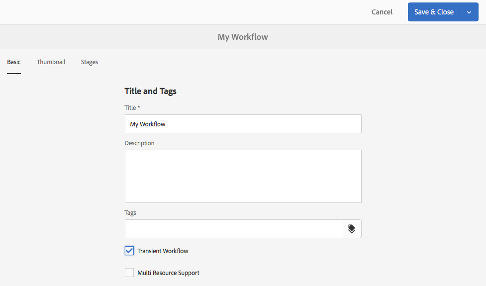

# Skapa arbetsflödesmodeller{#creating-workflow-models}

>[!CAUTION]
>
>Om du vill använda det klassiska användargränssnittet läser du i [AEM 6.3-dokumentation](https://helpx.adobe.com/experience-manager/6-3/help/sites-developing/workflows-models.html) för referens.

Du skapar en [arbetsflödesmodell](/help/sites-developing/workflows.md#model) för att definiera serie steg som körs när en användare startar arbetsflödet. Du kan också definiera modellegenskaper, t.ex. om arbetsflödet är tillfälligt eller använder flera resurser.

När en användare startar ett arbetsflöde startas en instans. Det här är motsvarande körningsmodell som skapas när du [Synkronisera](#sync-your-workflow-generate-a-runtime-model) dina ändringar.

## Skapa ett nytt arbetsflöde {#creating-a-new-workflow}

När du först skapar en arbetsflödesmodell innehåller den:

* Stegen, **Flödesstart** och **Flödesslut**.
Dessa representerar början och slutet av arbetsflödet. Dessa steg är obligatoriska och kan inte redigeras/tas bort.
* Ett exempel **Deltagare** step named **Steg 1**.
Det här steget är konfigurerat för att tilldela en arbetsuppgift till arbetsflödesinitieraren. Redigera eller ta bort det här steget och lägg till steg efter behov.

Så här skapar du ett arbetsflöde med redigeraren:

1. Öppna **Arbetsflödesmodeller** konsol, via **verktyg**, **Arbetsflöde**, **Models** eller, till exempel: [https://localhost:4502/aem/workflow](https://localhost:4502/aem/workflow)
1. Välj **Skapa** sedan **Skapa modell**.
1. The **Lägg till arbetsflödesmodell** visas. Ange **Titel** och **Namn** (valfritt) före markering **Klar**.
1. Den nya modellen listas i **Arbetsflödesmodeller** konsol.
1. Välj ditt nya arbetsflöde och använd sedan [**Redigera** för att öppna den för konfiguration](#editinganexistingworkflow):
   

>[!NOTE]
>
>Om du skapar modeller programmatiskt (med ett crx-paket) kan du även skapa en undermapp i:
>
>`/var/workflow/models`
>
>Till exempel, `/var/workflow/models/prototypes`
>
>Den här mappen kan sedan användas för [hantera åtkomst till modellerna i den mappen](/help/sites-administering/workflows-managing.md#create-a-subfolder-in-var-workflow-models-and-apply-the-acl-to-that).

## Redigera ett arbetsflöde {#editing-a-workflow}

Du kan redigera alla befintliga arbetsflödesmodeller till:

* [definiera steg](#addingasteptoamodel-) och [parameters](#configuring-a-workflow-step)
* konfigurera arbetsflödesegenskaper, inklusive [faser](#configuring-workflow-stages-that-show-workflow-progress), [om arbetsflödet är tillfälligt](#creatingatransientworkflow-) och/eller [använder flera resurser](#configuring-a-workflow-for-multi-resource-support)

Redigera en [**Standard och/eller äldre** arbetsflöde](#editing-a-default-or-legacy-workflow-for-the-first-time) har ytterligare ett steg för att säkerställa att [säker kopia](/help/sites-developing/workflows-best-practices.md#locations-workflow-models) tas innan ändringarna görs.

När uppdateringarna av arbetsflödet är klara måste du använda **Synkronisera** till **Generera en körningsmodell**. Se [Synkronisera arbetsflödet](#sync-your-workflow-generate-a-runtime-model) för mer information.

### Synkronisera arbetsflödet - Skapa en körningsmodell {#sync-your-workflow-generate-a-runtime-model}

**Synkronisera** (direkt i redigeringsverktygsfältet) genererar ett [körningsmodell](/help/sites-developing/workflows.md#runtime-model). Körningsmodellen är den modell som faktiskt används när en användare startar ett arbetsflöde. Om du inte **Synkronisera** Om du ändrar något kommer ändringarna inte att vara tillgängliga vid körning.

När du (eller någon annan användare) gör några ändringar i arbetsflödet måste du använda **Synkronisera** för att generera en körningsmodell - även när enskilda dialogrutor (till exempel för steg) har egna sparalternativ.

När ändringarna synkroniseras med körningsmodellen (sparad), **Synkroniserad** visas i stället.

Vissa steg har obligatoriska fält och/eller inbyggd validering. När dessa villkor inte uppfylls visas ett fel när du försöker **Synkronisera** modellen. Om till exempel ingen deltagare har definierats för **Deltagare** steg:


### Redigera ett standardarbetsflöde eller äldre arbetsflöde för första gången {#editing-a-default-or-legacy-workflow-for-the-first-time}

När du öppnar en [Standardmodell och/eller äldre modell](/help/sites-developing/workflows.md#workflow-types) för redigering:

* Stegwebbläsaren är inte tillgänglig (vänster sida).
* Det finns en **Redigera** åtgärd som finns i verktygsfältet (höger sida).
* Till att börja med visas modellen och dess egenskaper i skrivskyddat läge som:
   * Standardarbetsflöden är i `/libs`
   * Äldre arbetsflöden är `/etc`
Markera **Redigera** kommer att
* ta en kopia av arbetsflödet till `/conf`
* göra stegwebbläsaren tillgänglig
* gör att du kan göra ändringar

>[!NOTE]
>
>Se [Platser för arbetsflödesmodeller](/help/sites-developing/workflows-best-practices.md#locations-workflow-models) för ytterligare information.


### Lägga till ett steg i en modell {#adding-a-step-to-a-model}

Du måste lägga till steg i modellen för att representera aktiviteten som ska utföras - varje steg utför en specifik aktivitet. Ett urval stegkomponenter är tillgängliga i en AEM.

När du redigerar en modell visas de tillgängliga stegen i de olika grupperna i **Steg, webbläsare**. Till exempel:


>[!NOTE]
>
>Mer information om de komponenter i det primära steget som installeras med AEM finns i [Referens för arbetsflödessteg](/help/sites-developing/workflows-step-ref.md).

Så här lägger du till steg i arbetsflödesmodellen:

1. Öppna en befintlig arbetsflödesmodell för redigering. Från **Arbetsflödesmodell** konsol, välj önskad modell och sedan **Redigera**.
1. Öppna stegwebbläsaren med **Växla sidopanel**, längst till vänster i det övre verktygsfältet. Här kan du:

   * **Filter** för specifika steg.
   * Använd listruteväljaren för att begränsa markeringen till en viss grupp steg.
   * Välj ikonen Visa beskrivning  om du vill visa mer information om rätt steg.

   

1. Dra lämpliga steg till önskad plats i modellen.

   Till exempel en **Deltagarsteg**.

   När du har lagt till det i flödet kan du [konfigurera steget](#configuring-a-workflow-step).

   

1. Lägg till så många steg eller andra uppdateringar som behövs.

   Vid körning utförs stegen i den ordning som de visas i modellen. När du har lagt till stegkomponenter kan du dra dem till en annan plats i modellen.

   Du kan också kopiera, klippa ut, klistra in, gruppera eller ta bort befintliga steg, som med [sidredigeraren.](/help/sites-authoring/editing-content.md)

   Delade steg kan också komprimeras/expanderas med verktygsfältsalternativet: 

1. Bekräfta ändringarna med **Synkronisera** (redigeringsverktygsfältet) för att generera körningsmodellen.

   Se [Synkronisera arbetsflödet](#sync-your-workflow-generate-a-runtime-model) för mer information.

### Konfigurera ett arbetsflödessteg {#configuring-a-workflow-step}

Du kan **Konfigurera** och anpassa ett arbetsflödesstegs beteende med **Stegegenskaper** dialogrutor.

1. Öppna **Stegegenskaper** för ett steg:

   * Klicka/tryck på steget* *i arbetsflödesmodellen och välj **Konfigurera** i komponentens verktygsfält.

   * Dubbelklicka på steget.

   >[!NOTE]
   >
   >Mer information om de komponenter i det primära steget som installeras med AEM finns i [Referens för arbetsflödessteg](/help/sites-developing/workflows-step-ref.md).

1. Konfigurera **Stegegenskaper** om det behövs. Vilka egenskaper som är tillgängliga beror på stegtypen. Det kan också finnas flera tillgängliga flikar. Som standard **Deltagarsteg**, visas i ett nytt arbetsflöde som `Step 1`:

   

1. Bekräfta uppdateringarna.
1. Bekräfta ändringarna med **Synkronisera** (redigeringsverktygsfältet) för att generera körningsmodellen.

   Se [Synkronisera arbetsflödet](#sync-your-workflow-generate-a-runtime-model) för mer information.

### Skapa ett tillfälligt arbetsflöde {#creating-a-transient-workflow}

Du kan skapa [Övergående](/help/sites-developing/workflows.md#transient-workflows) arbetsflödesmodell när du skapar en modell eller redigerar en befintlig:

1. Öppna arbetsflödesmodellen för [redigera](#editinganexistingworkflow).
1. Välj **Egenskaper för arbetsflödesmodell** i verktygsfältet.
1. Aktivera i dialogrutan **Övergående arbetsflöde** (eller inaktivera vid behov):

   

1. Bekräfta ändringen med **Spara och stäng**; följt av **Synkronisera** (redigeringsverktygsfältet) för att generera körningsmodellen.

   Se [Synkronisera arbetsflödet](#sync-your-workflow-generate-a-runtime-model) för mer information.

>[!NOTE]
>
>När du kör ett arbetsflöde i [övergående](/help/sites-developing/workflows.md#transient-workflows) AEM lagrar ingen arbetsflödeshistorik. Därför bör [Tidslinje](/help/sites-authoring/basic-handling.md#timeline) visar inte någon information om det arbetsflödet.

## Göra arbetsflödesmodeller tillgängliga i Touch UI {#classic2touchui}

Om det finns en arbetsflödesmodell i det klassiska användargränssnittet, men den saknas på snabbmenyn för val i **[!UICONTROL Timeline]** pekskärmsgränssnittet och följ sedan konfigurationen för att göra det tillgängligt. Följande steg visar hur du använder arbetsflödesmodellen med namnet **[!UICONTROL Request for Activation]**.

1. Bekräfta att modellen inte är tillgänglig i det beröringsaktiverade användargränssnittet. Åtkomst till en resurs med `/assets.html/content/dam` bana. Välj en resurs. Öppna **[!UICONTROL Timeline]** i vänster räl. Klicka **[!UICONTROL Start Workflow]** och bekräfta att **[!UICONTROL Request for Activation]** Modellen finns inte i popup-listan.

1. Navigera genom **[!UICONTROL Tools > General > Tagging]**. Välj **[!UICONTROL Workflow]**.

1. Välj **[!UICONTROL Create > Create Tag]**. Ange **[!UICONTROL Title]** as `DAM` och **[!UICONTROL Name]** as `dam`. Välj **[!UICONTROL Submit]**.
   

1. Navigera till **[!UICONTROL Tools > Workflow > Models]**. Välj **[!UICONTROL Request for Activation]** väljer **[!UICONTROL Edit]**.

1. Välj **[!UICONTROL Edit]**&#x200B;öppnar du **[!UICONTROL Page Information]** och där väljer du **[!UICONTROL Open Properties]** och går till **[!UICONTROL Basic]** -flik (om den inte redan är öppen).

1. Lägg till `Workflow : DAM` till **[!UICONTROL Tags]** fält. Bekräfta markeringen med bocken.

1. Bekräfta tillägget av taggen med **[!UICONTROL Save & Close]**.
   

1. Slutför processen med **[!UICONTROL Sync]**. Arbetsflödet är nu tillgängligt i det Touch-aktiverade gränssnittet.

### Konfigurera ett arbetsflöde för stöd för flera resurser {#configuring-a-workflow-for-multi-resource-support}

Du kan konfigurera en arbetsflödesmodell för [Stöd för flera resurser](/help/sites-developing/workflows.md#multi-resource-support) när du skapar en modell eller redigerar en befintlig:

1. Öppna arbetsflödesmodellen för [redigera](#editinganexistingworkflow).
1. Välj **Egenskaper för arbetsflödesmodell** i verktygsfältet.

1. Aktivera i dialogrutan **Stöd för flera resurser** (eller inaktivera vid behov):

   

1. Bekräfta ändringen med **Spara och stäng**; följt av **Synkronisera** (redigeringsverktygsfältet) för att generera körningsmodellen.

   Se [Synkronisera arbetsflödet](#sync-your-workflow-generate-a-runtime-model) för mer information.

### Konfigurera arbetsflödessteg (som visar förlopp för arbetsflöde) {#configuring-workflow-stages-that-show-workflow-progress}

[Arbetsflödessteg](/help/sites-developing/workflows.md#workflow-stages) visualisera arbetsflödets förlopp när du hanterar uppgifter.

>[!CAUTION]
>
>Om arbetsflödesfaser definieras i **Sidegenskaper** men inte för något av arbetsflödesstegen kommer förloppsindikatorn inte att visa några förlopp (oavsett aktuellt arbetsflödessteg).

De steg som ska vara tillgängliga definieras i arbetsflödesmodellerna. Befintliga arbetsflödesmodeller kan uppdateras för att inkludera scendefinitioner. Du kan definiera valfritt antal steg för arbetsflödesmodellen.

Definiera **Steg** för ditt arbetsflöde:

1. Öppna arbetsflödesmodellen för redigering.
1. Välj **Egenskaper för arbetsflödesmodell** i verktygsfältet. Öppna sedan **Steg** -fliken.
1. Lägg till (och positionera) det du behöver **Steg**. Du kan definiera valfritt antal steg för arbetsflödesmodellen.

   Till exempel:

   

1. Klicka **Spara och stäng** för att spara egenskaperna.
1. Tilldela en fas till varje steg i arbetsflödesmodellen. Till exempel:

   

   En scen kan tilldelas till mer än ett steg. Till exempel:

   | **Steg** | **Scen** |
   |---|---|
   | Steg 1 | Skapa |
   | Steg 2 | Skapa |
   | Steg 3 | Granska |
   | Steg 4 | Godkänn |
   | Steg 5 | Godkänn |
   | Steg 6 | Complete |

1. Bekräfta ändringarna med **Synkronisera** (redigeringsverktygsfältet) för att generera körningsmodellen.

   Se [Synkronisera arbetsflödet](#sync-your-workflow-generate-a-runtime-model) för mer information.

## Exportera en arbetsflödesmodell i ett paket {#exporting-a-workflow-model-in-a-package}

Så här exporterar du en arbetsflödesmodell i ett paket:

1. Skapa ett paket med [Pakethanteraren](/help/sites-administering/package-manager.md#package-manager):

   1. Navigera till Package Manager via **verktyg**, **Distribution**, **Paket**.

   1. Klicka **Skapa paket**.
   1. Ange **Paketnamn** och annan information efter behov.
   1. Klicka **OK**.

1. Klicka **Redigera** i verktygsfältet i det nya paketet.

1. Öppna **Filter** -fliken.

1. Välj **Lägg till filter** och ange sökvägen till arbetsflödesmodellen *design*:

   `/conf/global/settings/workflow/models/<*your-model-name*>`

   Klicka **Klar**.

1. Välj **Lägg till filter** och ange sökvägen till *runtime* arbetsflödesmodell:

   `/var/workflow/models/<*your-model-name*>`

   Klicka **Klar**.

1. Lägg till ytterligare filter för anpassade skript som används av modellen.
1. Klicka **Spara** för att bekräfta filterdefinitionerna.
1. Välj **Bygge** i verktygsfältet i paketdefinitionen.
1. Välj **Ladda ned** i paketets verktygsfält.

## Använda arbetsflöden för att bearbeta inskickade formulär {#using-workflows-to-process-form-submissions}

Du kan konfigurera ett formulär som ska bearbetas av det valda arbetsflödet. När användare skickar formuläret skapas en ny arbetsflödesinstans med data från formuläröverföringen som nyttolast.

Så här konfigurerar du arbetsflödet som ska användas med formuläret:

1. Skapa en sida och öppna den för redigering.
1. Lägg till en **Formulär** till sidan.
1. **Konfigurera** den **Formulärstart** -komponent som visades på sidan.
1. Använd **Starta arbetsflöde** för att välja önskat arbetsflöde bland de tillgängliga:

   

1. Bekräfta den nya formulärkonfigurationen med krysset.

## Testa arbetsflöden {#testing-workflows}

Det är en god vana att testa ett arbetsflöde för att använda olika typer av nyttolast, inklusive typer som skiljer sig från den som arbetsflödet har utvecklats för. Om du t.ex. vill att ditt arbetsflöde ska hantera resurser testar du det genom att ange en sida som nyttolast och se till att den inte orsakar fel.

Testa till exempel ditt nya arbetsflöde på följande sätt:

1. [Starta arbetsflödesmodellen](/help/sites-administering/workflows-starting.md) från konsolen.
1. Definiera **Nyttolast** och bekräfta.

1. Utför de åtgärder som behövs så att arbetsflödet fortsätter.
1. Övervaka loggfilerna medan arbetsflödet körs.

Du kan även konfigurera AEM att visa **FELSÖKNING** meddelanden i loggfilerna. Se [Loggning](/help/sites-deploying/configure-logging.md) för mer information och när utvecklingen är klar, ange **Loggnivå** tillbaka till **Info**.

## Exempel {#examples}

### Exempel: Skapa ett (enkelt) arbetsflöde för att acceptera eller avvisa en begäran om publicering {#example-creating-a-simple-workflow-to-accept-or-reject-a-request-for-publication}

För att illustrera några av möjligheterna att skapa ett arbetsflöde skapar följande exempel en variant av `Publish Example` arbetsflöde.

1. [Skapa en arbetsflödesmodell](#creating-a-new-workflow).

   Det nya arbetsflödet kommer att innehålla:

   * **Flödesstart**
   * `Step 1`
   * **Flödesslut**

1. Ta bort `Step 1` (eftersom det är fel stegtyp för det här exemplet):

   * Klicka på steget och välj **Ta bort** i komponentens verktygsfält. Bekräfta åtgärden.

1. Från **Arbetsflöde** välj stegwebbläsare, dra en **Deltagarsteg** till arbetsflödet och placera det mellan **Flödesstart** och **Flödesslut**.
1. Så här öppnar du egenskapsdialogrutan:

   * Klicka på deltagarsteget och välj **Konfigurera** i komponentens verktygsfält.
   * Dubbelklicka på deltagarsteget.

1. I **Vanliga** tabbtangenter `Validate Content` för båda **Titel** och **Beskrivning**.
1. Öppna **Användare/grupp** tab:

   * Aktivera **Meddela användare via e-post**.
   * Välj `Administrator` ( `admin`) för **Användare/grupp** fält.

   >[!NOTE]
   >
   >För att mejl ska skickas [e-posttjänsten och användarkontoinformationen måste konfigureras](/help/sites-administering/notification.md).

1. Bekräfta uppdateringarna med en bock.

   Du kommer tillbaka till översikten över arbetsflödesmodellen där deltagarsteget har bytt namn till `Validate Content`.

1. Dra en **Eller dela** till arbetsflödet och placera det mellan `Validate Content` och **Flödesslut**.
1. Öppna **Eller dela** för konfiguration.
1. Konfigurera:

   * **Vanliga**: ange delningens namn.
   * **Gren 1**: select **Standardflöde**.

   * **Gren 2**: se **Standardflöde** är inte markerat.

1. Bekräfta dina uppdateringar av **ELLER Dela**.
1. Dra en **Deltagarsteg** till vänster gren öppnar du egenskaperna, anger följande värden och bekräftar sedan ändringarna:

   * **Titel**: `Reject Publish Request`

   * **Användare/grupp**: till exempel `projects-administrators`

   * **Meddela användare via e-post**: Aktivera om du vill att användaren ska meddelas via e-post.

1. Dra en **Processsteg** till höger gren öppnar du egenskaperna, anger följande värden och bekräftar sedan ändringarna:

   * **Titel**: `Publish Page as Requested`

   * **Process**: select `Activate Page`. Den här processen publicerar den valda sidan till utgivarinstanserna.

1. Klicka **Synkronisera** (redigeringsverktygsfältet) för att generera körningsmodellen.

   Se [Synkronisera arbetsflödet](#sync-your-workflow-generate-a-runtime-model) för mer information.

   Den nya arbetsflödesmodellen ser ut så här:

   

1. Använd det här arbetsflödet på sidan så att när användaren flyttar till **Complete** den **Validera innehåll** kan de välja om de vill **Publicera sidan som begärd**, eller **Avvisa publiceringsbegäran**.

   

### Exempel: Definiera en regel för en OR-delning med ECMA-skript {#defineruleecmascript}

**ELLER Dela** kan du använda villkorsstyrda bearbetningssökvägar i arbetsflödet.

Så här definierar du en OR-regel:

1. Skapa två skript och spara dem i databasen, till exempel under:

   `/apps/myapp/workflow/scripts`

   >[!NOTE]
   >
   >Skripten måste ha en [function `check()`](#function-check) som returnerar ett booleskt värde.

1. Redigera arbetsflödet och lägg till **ELLER Dela** till modellen.
1. Redigera egenskaperna för **Gren 1** i **ELLER Dela**:

   * Definiera det här som **Standardflöde** genom att ange **Värde** till `true`.

   * Som **Regel**, anger sökvägen till skriptet. Till exempel:
     `/apps/myapp/workflow/scripts/myscript1.ecma`

   >[!NOTE]
   >
   >Du kan ändra grenordningen om det behövs.

1. Redigera egenskaperna för **Gren 2** i **ELLER Dela**.

   * Som **Regel**anger du sökvägen till det andra skriptet. Till exempel:
     `/apps/myapp/workflow/scripts/myscript2.ecma`

1. Ange egenskaperna för de enskilda stegen i varje gren. Se till att **Användare/grupp** är inställt.
1. Klicka **Synkronisera** (redigeringsverktygsfältet) för att behålla ändringarna i körningsmodellen.

   Se [Synkronisera arbetsflödet](#sync-your-workflow-generate-a-runtime-model) för mer information.

#### Funktionskontroll() {#function-check}

>[!NOTE]
>
>Se [Använda ECMAScript](/help/sites-developing/workflows-customizing-extending.md#using-ecmascript).

Följande exempelskript returnerar `true` om noden är en `JCR_PATH` finns under `/content/we-retail/us/en`:

```
function check() {
    if (workflowData.getPayloadType() == "JCR_PATH") {
      var path = workflowData.getPayload().toString();
      var node = jcrSession.getItem(path);

      if (node.getPath().indexOf("/content/we-retail/us/en") >= 0) {
       return true;
      } else {
       return false;
      }
     } else {
      return false;
     }
}
```

### Exempel: Anpassad aktiveringsbegäran {#example-customized-request-for-activation}

Du kan anpassa alla färdiga arbetsflöden. Om du vill ha ett anpassat beteende lägger du över information om rätt arbetsflöde.

Till exempel: **Ansökan om aktivering**. Det här arbetsflödet används för att publicera sidor i **Webbplatser** och aktiveras automatiskt när en innehållsförfattare inte har rätt replikeringsbehörighet. Se [Anpassa sidredigering - Anpassa arbetsflödet för begäran om aktivering](/help/sites-developing/customizing-page-authoring-touch.md#customizing-the-request-for-activation-workflow) för mer information.
