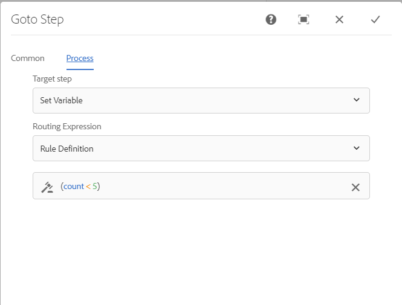

# Referens för arbetsflödessteg {#workflow-step-reference}

Arbetsflödesmodeller består av en serie steg av olika typer. Beroende på typ kan dessa steg konfigureras och utökas med parametrar och skript för att ge den funktionalitet och kontroll som du behöver.

>[!NOTE]
>
>I det här avsnittet beskrivs de vanliga arbetsflödesstegen.
>
>Följande modulspecifika steg finns:
>
>* [AEM Forms Workflow Step Reference](/help/forms/using/aem-forms-workflow-step-reference.md)
>* [Bearbeta resurser med mediehanterare och arbetsflöden](/help/assets/media-handlers.md)
>

## Stegegenskaper {#step-properties}

Varje stegkomponent har en **Stegegenskaper** som gör att du kan definiera och redigera de önskade egenskaperna.

### Stegegenskaper - fliken Allmänt {#step-properties-common-tab}

En kombination av följande egenskaper är tillgängliga för de flesta arbetsflödesstegkomponenter på **Vanliga** i egenskapsdialogrutan:

* **Titel**
Stegets titel.

* **Beskrivning**
En beskrivning av steget.

* **Arbetsflödesfas**

  En nedrullningsbar väljare för att använda en [Scen](/help/sites-developing/workflows.md#workflow-stages) till steget.

* **Timeout**

  Den period efter vilken steget&quot;timeout&quot; inträffar.
Du kan välja mellan: **Av**, **Omedelbar**, **1h**, **6 tim**, **12h**, **24h**.

* **Timeout-hanterare**

  Hanteraren som styr arbetsflödet när steget avbryts. Exempel: `Auto Advancer`

* **Avancerad hanterare**

  Välj det här alternativet om du vill att arbetsflödet automatiskt ska gå vidare till nästa steg efter körningen. Om du inte väljer det här alternativet måste implementeringsskriptet hantera arbetsflödets utveckling.

### Stegegenskaper - fliken Användare/grupp {#step-properties-user-group-tab}

Följande egenskaper är tillgängliga för många arbetsflödesstegkomponenter på **Användare/grupp** i egenskapsdialogrutan:

* **Meddela användare via e-post**

   * Du kan meddela deltagarna genom att skicka ett e-postmeddelande när arbetsflödet når steget.
   * Om det här alternativet är aktiverat skickas ett e-postmeddelande till användaren som definieras av egenskapen **Användare/grupp** eller till varje medlem i gruppen om en grupp har definierats.

* **Användare/grupp**

   * I en nedrullningsbar markeringsruta kan du navigera till och välja en användare eller grupp.
   * Om du tilldelar steget till en viss användare kan bara den här användaren utföra åtgärden.
   * Om du tilldelar ett steg till en hel grupp kommer alla användare i den gruppen att ha åtgärden i sin grupp när arbetsflödet når det här steget **Inkorgen för arbetsflöde**.
   * Se [Delta i arbetsflöden](/help/sites-authoring/workflows-participating.md) för mer information.

## OCH dela {#and-split}

The **OCH dela** skapar en delning i arbetsflödet, efter vilken båda grenarna är aktiva. Du kan lägga till arbetsflödessteg i varje gren efter behov. I det här steget kan du lägga in flera bearbetningssökvägar i arbetsflödet. Du kan till exempel tillåta att vissa granskningssteg utförs parallellt, vilket sparar tid.


### AND Split - Configuration {#and-split-configuration}

Så här konfigurerar du delningen:

* Redigera **OCH Dela egenskaper**:

   * **Delningsnamn**: tilldela ett namn för förklarande ändamål
   * Ange antalet förgreningar som krävs: 2, 3, 4 eller 5.

* Lägg till arbetsflödessteg i grenarna efter behov.

  

## Behållarsteg {#container-step}

Ett behållarsteg startar en annan arbetsflödesmodell som körs som ett underordnat arbetsflöde.

Med den här behållaren kan du återanvända arbetsflödesmodeller för att implementera vanliga stegsekvenser. En arbetsflödesmodell för översättning kan till exempel användas i flera redigeringsarbetsflöden.


### Behållarsteg - konfiguration {#container-step-configuration}

Om du vill konfigurera steget redigerar du och använder följande flikar:

* [Vanliga](#step-properties-common-tab)
* **Behållare**

   * **Delarbetsflöde**: Välj arbetsflödet som ska startas.

## Gå till steg {#goto-step}

The **Gå till steg** I kan du ange nästa steg som ska köras i arbetsflödesmodellen. Du kan ange en regeldefinition, ett externt skript eller ett ECMA-skript som routningsuttryck för att utvärdera nästa steg för arbetsflödesmodellen.

* Om villkoret som du anger är true visas **Gå till steg** slutförs och arbetsflödesmotorn kör det angivna steget.
* Om villkoret som du anger inte håller true visas **Gå till steg** slutförs och den normala routningslogiken bestämmer nästa steg som ska köras.

The **Gå till steg** I kan du implementera avancerade routningsstrukturer i dina arbetsflödesmodeller. Om du till exempel vill implementera en slinga **Gå till steg** kan definieras för att köra ett föregående steg i arbetsflödet, där routningsuttrycket utvärderar ett slingvillkor.

### Gå till steg - konfiguration {#goto-step-configuration}

Om du vill konfigurera steget redigerar du och använder följande flikar:

* [Vanliga](#step-properties-common-tab)
* **Process**

   * **Målsteg**: Välj det steg som ska köras när villkoret för routningsuttrycket har utvärderats.
   * **Routningsuttryck**: Välj regeldefinition, externt skript eller ett ECMA-skript som avgör om körningen av **Målsteg**.

      * **Regeldefinition:** Använd [uttrycksredigerare](/help/forms/using/variable-in-aem-workflows.md#use-expression-editor) för att definiera regeln.
      * **Externt skript:** Det externa skriptets sökväg.
      * **ECMA-skript**: Skriptet som avgör om körningen av **Gå till steg**.

#### Simulera en for-slinga {#simulating-a-for-loop}

Simulering av en for-slinga kräver att du håller reda på antalet upprepningar av slingor som har inträffat:

* Antalet representerar vanligtvis ett index med objekt som hanteras i arbetsflödet.
* Antalet utvärderas som avslutningskriterier för slingan.

Om du till exempel vill implementera ett arbetsflöde som utför en åtgärd på flera JCR-noder kan du använda en loopräknare som index för noderna. Om du vill behålla antalet lagrar du en `integer` värdet i datamappningen för arbetsflödesinstansen. Om du vill öka antalet och jämföra antalet med avslutningskriterierna använder du skriptet i **Gå till steg**.

```
function check(){
   var count=0;
   var keyname="loopcount"
   try{
      if (workflowData.getMetaDataMap().containsKey(keyname)){
        log.info("goto script: found loopcount key");
        count= parseInt(workflowData.getMetaDataMap().get(keyname))+1;
      }

     workflowData.getMetaDataMap().put(keyname,count);

     }catch(err) {
         log.info(err.message);
         return false;
    }
   if (parseInt(count) <7){
       return true;
   } else {
      return false;
   }
}
```

### Simulera en for-slinga med hjälp av regeldefinition {#simulateforloop}

Du kan också simulera en for-slinga med hjälp av Regeldefinition som routningsuttryck. [Skapa en **antal** variabel](/help/forms/using/variable-in-aem-workflows.md#create-a-variable) av datatypen Long. Använd **Uttryck** som mappningsläget i **[Ange variabel](/help/sites-developing/using-variables-in-aem-workflows.md#set-a-variable)** steg för att ange värdet för **antal** variabel till **antal + 1** vid varje genomförande av **Ange variabel** steg.


I **Gå till steg**, använda **Ange variabel** som **Målsteg** och **antal &lt; 5** som routningsuttryck.



The **Ange variabel** stegen körs upprepade gånger och värdet för **antal** variabel med 1 för varje körning tills värdet når 5.

## ELLER Dela {#or-split}

The **ELLER Dela** skapar en delning i arbetsflödet, varefter endast en gren är aktiv. I det här steget kan du lägga in sökvägar för villkorlig bearbetning i arbetsflödet. Du kan lägga till arbetsflödessteg i varje gren efter behov.

>[!NOTE]
>
>Se [ELLER Dela upp steg](https://experienceleague.adobe.com/docs/experience-manager-65/developing/extending-aem/extending-workflows/using-variables-in-aem-workflows.html?lang=en#use-a-variable)


### Eller delad - konfiguration {#or-split-configuration}

Så här konfigurerar du delningen:

* Redigera **ELLER Dela egenskaper**:

   * **Vanliga**

      * Ange delningsnamnet.

   * **Förgreningar (*x)***

      * **Lägg till gren:** Lägg till fler grenar i steget.
      * **Välj routningsuttryck**: Om du vill utvärdera den aktiva grenen väljer du routningsuttrycket. Möjliga värden är: Regeldefinition, Externt skript och ECMA-skript.
      * **Klicka för att lägga till uttryck**: Lägg till uttryck för att utvärdera den aktiva grenen om du väljer **Regeldefinition** som routningsuttryck.
      * **Skriptsökväg**: Sökvägen till en fil som innehåller skriptet som ska utvärdera den aktiva grenen om du väljer **Externt skript** som routningsuttryck.
      * **Skript**: Lägg till skriptet i rutan för att utvärdera den aktiva grenen om du väljer **ECMA-skript** som routningsuttryck.
      * **Standardflöde**: Standardförgreningen följs om det finns flera förgreningar. Du kan bara ange en gren som standard.

  >[!NOTE]
  >
  >    * En gren utvärderas i taget baserat på routningsuttrycket.
  >    * Förgreningarna utvärderas uppifrån och ned.
  >    * Det första skriptet som utvärderas till true körs.
  >    * Om ingen gren utvärderas till true, går arbetsflödet inte framåt.
  >
  >

  >[!NOTE]
  >
  >Se [Definiera en regel för en OR-delning](/help/sites-developing/workflows-models.md#defineruleecmascript).

* Lägg till arbetsflödessteg i grenarna efter behov.

## Deltagarsteg och väljare {#participant-steps-and-choosers}

### Deltagarsteg {#participant-step}

A **Deltagarsteg** I kan du tilldela ägarskap för en viss åtgärd. Arbetsflödet fortsätter bara när användaren har bekräftat steget manuellt. Det här arbetsflödet används när du vill att någon ska arbeta med arbetsflödet. Exempel: ett granskningssteg.

Även om det inte är direkt relaterat måste användarauktorisering beaktas när en åtgärd tilldelas. Användaren måste ha åtkomst till sidan som är arbetsflödets nyttolast.

#### Deltagarsteg - konfiguration {#participant-step-configuration}

Om du vill konfigurera steget redigerar du och använder följande flikar:

* [Vanliga](#step-properties-common-tab)
* [Användare/grupp](#step-properties-user-group-tab)

>[!NOTE]
>
>Arbetsflödesinitieraren meddelas alltid när:
>
>* Arbetsflödet är slutfört (färdigt).
>* Arbetsflödet avbryts (avslutas).
>

>[!NOTE]
>
>Vissa egenskaper måste konfigureras för att e-postmeddelanden ska kunna aktiveras. Du kan också anpassa e-postmallen eller lägga till en e-postmall för ett nytt språk. Information om hur du konfigurerar e-postmeddelanden i AEM finns i [Konfigurerar e-postmeddelande](/help/sites-administering/notification.md#configuringemailnotification).

### Steg för dialogdeltagare {#dialog-participant-step}

Använd en **Steg för dialogdeltagare** för att samla in information från den användare som har tilldelats arbetsuppgiften. Det här steget är användbart när du vill samla in små mängder data som används senare i arbetsflödet.

När du är klar med steget **Slutför arbetsuppgift** -dialogrutan innehåller de fält som du definierar i dialogrutan. De data som samlas in i fälten lagras i noder i arbetsflödets nyttolast. Efterföljande arbetsflödessteg kan sedan läsa värdet från databasen.

Om du vill konfigurera steget anger du vilken grupp eller användare som arbetsposten ska tilldelas till och sökvägen till dialogrutan.

#### Steg för dialogdeltagare - konfiguration {#dialog-participant-step-configuration}

Om du vill konfigurera steget redigerar du och använder följande flikar:

* [Vanliga](#step-properties-common-tab)
* [Användare/grupp](#step-properties-user-group-tab)
* **Dialog**

   * **Dialogrutesökväg**: Sökvägen till dialognoden för [dialogruta som du skapar](#dialog-participant-step-creating-a-dialog).

#### Steg för dialogdeltagare - Skapa en dialogruta {#dialog-participant-step-creating-a-dialog}

Om du vill skapa en dialogruta måste du skapa den:

* Bestäm var de resulterande uppgifterna finns [lagras i nyttolasten](#dialog-participant-step-storing-data-in-the-payload).
* [Definiera dialogrutan; innehåller definitioner av de fält som används för att samla in och spara data](#dialog-participant-step-dialog-definition).

#### Steg för dialogdeltagare - lagra data i nyttolasten {#dialog-participant-step-storing-data-in-the-payload}

Du kan lagra widgetdata i arbetsflödets nyttolast eller i arbetsobjektets metadata. Formatet på `name` widgetnodens egenskap avgör var data lagras.

* **Lagra data med nyttolasten**

   * Om du vill lagra widgetdata som en egenskap för arbetsflödets nyttolast använder du följande format för värdet för namnegenskapen för widgetnoden:
     `./jcr:content/nodename`

   * Data lagras i `nodename` nyttolastnodens egenskap. Om noden inte innehåller den egenskapen skapas egenskapen.
   * När den lagras med nyttolasten skriver efterföljande användning av dialogrutan med samma nyttolast över egenskapens värde.

* **Lagra data med arbetsobjektet**

   * Om du vill lagra widgetdata som en egenskap för arbetsobjektets metadata använder du följande format för värdet för egenskapen name:
     `nodename`

   * Data lagras i `nodename` arbetsuppgiftens egenskap `metadata`. Data bevaras om dialogrutan senare används med samma nyttolast.

#### Steg för dialogdeltagare - Dialogrutedefinition {#dialog-participant-step-dialog-definition}

1. **Dialogstruktur**

   Dialogrutorna för Dialog Deltagare-steg liknar dialogrutor som du skapar för redigeringskomponenter. De lagras under:

   `/apps/myapp/workflow/dialogs`

   Dialogrutor för det pekaktiverade standardgränssnittet har följande nodstruktur:

   ```xml
   newComponent (cq:Component)
     |- cq:dialog (nt:unstructured)
       |- content
         |- layout
           |- items
             |- column
               |- items
                 |- component0
                 |- component1
                 |- ...
   ```

   >[!NOTE]
   >
   >Se [Skapa och konfigurera en dialogruta](/help/sites-developing/developing-components.md#creating-and-configuring-a-dialog).

1. **Dialogrutans sökvägsegenskap**

   The **Steg för dialogdeltagare** har **Dialogrutesökväg** egenskap (tillsammans med egenskaperna för en [Deltagarsteg](#participant-step)). Värdet för **Dialogrutesökväg** egenskapen är sökvägen till `dialog` noden i dialogrutan.

   Dialogrutan finns till exempel i en komponent med namnet `EmailWatch` som lagras i noden:

   `/apps/myapp/workflows/dialogs`

   För det beröringsaktiverade användargränssnittet används följande värde för **Dialogrutesökväg** egenskap:

   `/apps/myapp/workflow/dialogs/EmailWatch/cq:dialog`

   

1. **Exempeldialogrutedefinition**

   Följande XML-kodfragment representerar en dialogruta där en `String` värdet i `watchEmail` Nod för nyttolastinnehållet. Titelnoden representerar [TextField](https://developer.adobe.com/experience-manager/reference-materials/6-5/granite-ui/api/jcr_root/libs/granite/ui/components/coral/foundation/form/textfield/index.html) komponent:

   ```xml
   jcr:primaryType="nt:unstructured"
       jcr:title="Watcher Email Address Dialog"
       sling:resourceType="cq/gui/components/authoring/dialog">
       <content jcr:primaryType="nt:unstructured"
           sling:resourceType="granite/ui/components/foundation/container">
           <layout jcr:primaryType="nt:unstructured"
               margin="false"
               sling:resourceType="granite/ui/components/foundation/layouts/fixedcolumns"
           />
           <items jcr:primaryType="nt:unstructured">
               <column jcr:primaryType="nt:unstructured"
                   sling:resourceType="granite/ui/components/foundation/container">
                   <items jcr:primaryType="nt:unstructured">
                       <title jcr:primaryType="nt:unstructured"
                           fieldLabel="Notification Email Address"
                           name="./jcr:content/watchEmails"
                           sling:resourceType="granite/ui/components/foundation/form/textfield"
                       />
                   </items>
               </column>
           </items>
       </content>
   </cq:dialog>
   ```

   I det beröringsaktiverade användargränssnittet resulterar det här exemplet i en dialogruta som följande:

   

### Dynamiskt deltagarsteg {#dynamic-participant-step}

The **Dynamiskt deltagarsteg** -komponenten liknar **[Deltagarsteg](#participant-step)** med skillnaden att deltagaren väljs automatiskt vid körning.

Om du vill konfigurera steget väljer du en **Väljare för deltagare** som identifierar deltagaren som arbetsposten ska tilldelas till, tillsammans med en dialogruta.

#### Dynamiskt deltagarsteg - konfiguration {#dynamic-participant-step-configuration}

Om du vill konfigurera steget redigerar du och använder följande flikar:

* [Vanliga](#step-properties-common-tab)
* **Väljare för deltagare**

   * **Väljare för deltagare**: Namnet på [deltagarväljaren som du skapar](#developingtheparticipantchooser).
   * **Argument**: Alla obligatoriska argument.
   * **E-post**: Om ett e-postmeddelande ska skickas till användaren.

* **Dialog**

   * **Dialogrutesökväg**: Sökvägen till dialognoden för [som du skapar (som med **Steg för dialogdeltagare**)](#dialog-participant-step-creating-a-dialog).

#### Dynamiskt deltagarsteg - Utveckla deltagarväljaren {#dynamic-participant-step-developing-the-participant-chooser}

Du skapar deltagarväljaren. Därför kan du använda valfri urvalslogik eller valfria villkor. Din deltagarväljare kan t.ex. välja den användare (i en grupp) som har minst arbetsobjekt. Du kan skapa valfritt antal deltagaralternativ som du kan använda med olika instanser av **Dynamiskt deltagarsteg** i dina arbetsflödesmodeller.

Skapa en OSGi-tjänst eller ett ECMAScript-skript som väljer en användare att tilldela arbetsposten till.

* **ECMAscript**

  Skript måste innehålla funktionen getParticipant som returnerar ett användar-ID som `String` värde. Lagra egna skript i `/apps/myapp/workflow/scripts` eller en undermapp.

  Ett exempelskript ingår i en AEM standardinstans:

  `/libs/workflow/scripts/initiator-participant-chooser.ecma`

  >[!CAUTION]
  >
  >Ändra ingenting i dialogrutan `/libs` bana.
  >
  >
  >Orsaken är att innehållet i `/libs` skrivs över nästa gång du uppgraderar din instans (och kan skrivas över när du använder en snabbkorrigering eller ett funktionspaket).

  Det här skriptet väljer arbetsflödesinitieraren som deltagare:

  ```
  function getParticipant() {
      return workItem.getWorkflow().getInitiator();
  }
  ```

  >[!NOTE]
  >
  >The **Väljare för deltagare i arbetsflödesinitieraren** -komponenten utökar **Dynamiskt deltagarsteg** och använder det här skriptet som stegimplementering.

* **OSGi-tjänst**

  Tjänsterna måste implementera [com.day.cq.workflow.exec.ParticipantStepChooser](https://developer.adobe.com/experience-manager/reference-materials/6-5/javadoc/com/day/cq/workflow/exec/ParticipantStepChooser.html) gränssnitt. Gränssnittet definierar följande medlemmar:

   * `SERVICE_PROPERTY_LABEL` fält: Använd det här fältet för att ange namnet på deltagarväljaren. Namnet visas i en lista med tillgängliga deltagarval i dialogrutan **Dynamiskt deltagarsteg** egenskaper.

   * `getParticipant` metod: Returnerar det dynamiskt lösta huvud-ID:t som `String` värde.

  >[!CAUTION]
  >
  >The `getParticipant` returnerar det dynamiskt lösta huvud-ID:t. Detta ID kan antingen vara ett grupp-ID eller ett användar-ID.
  >
  >
  >Ett grupp-ID kan dock bara användas för **Deltagarsteg**, när en lista över deltagare returneras. För **Dynamiskt deltagarsteg**, returneras en tom lista som inte kan användas för delegering.

  Gör implementeringen tillgänglig för **Dynamiskt deltagarsteg** lägger du till Java™-klassen i ett OSGi-paket som exporterar tjänsten och distribuerar paketet till AEM.

  >[!NOTE]
  >
  >**Slumpmässig deltagarväljare** är en exempeltjänst som väljer en slumpmässig användare ( `com.day.cq.workflow.impl.process.RandomParticipantChooser`). The **Välj slumpmässig deltagare** r step component sample extends the **Dynamiskt deltagarsteg** och använder den här tjänsten som stegimplementering.

#### Dynamiskt deltagarsteg - Exempel på deltagarväljartjänst {#dynamic-participant-step-example-participant-chooser-service}

Följande Java™-klass implementerar `ParticipantStepChooser` gränssnitt. Klassen returnerar namnet på deltagaren som initierade arbetsflödet. Koden använder samma logik som exempelskriptet (`initiator-participant-chooser.ecma`) används.

The `@Property` anteckningen anger värdet för `SERVICE_PROPERTY_LABEL` fält till `Workflow Initiator Participant Chooser`.

```java
package com.adobe.example;

import org.apache.felix.scr.annotations.Component;
import org.apache.felix.scr.annotations.Properties;
import org.apache.felix.scr.annotations.Property;
import org.apache.felix.scr.annotations.Service;
import org.osgi.framework.Constants;
import org.slf4j.Logger;
import org.slf4j.LoggerFactory;

import com.adobe.granite.workflow.WorkflowException;
import com.adobe.granite.workflow.WorkflowSession;
import com.adobe.granite.workflow.exec.ParticipantStepChooser;
import com.adobe.granite.workflow.exec.WorkItem;
import com.adobe.granite.workflow.metadata.MetaDataMap;

@Component
@Service
@Properties({
        @Property(name = Constants.SERVICE_DESCRIPTION, value = "An example implementation of a dynamic participant chooser."),
        @Property(name = ParticipantStepChooser.SERVICE_PROPERTY_LABEL, value = "Workflow Initiator Participant Chooser (service)") })
public class InitiatorParticipantChooser implements ParticipantStepChooser {

 private Logger logger = LoggerFactory.getLogger(this.getClass());

 public String getParticipant(WorkItem arg0, WorkflowSession arg1,
   MetaDataMap arg2) throws WorkflowException {

  String initiator = arg0.getWorkflow().getInitiator();
  logger.info("Assigning Dynamic Participant Step work item to {}",initiator);

  return initiator;
 }
}
```

I **Dynamiskt deltagarsteg** egenskapsdialogrutan, **Väljare för deltagare** listan innehåller objektet `Workflow Initiator Participant Chooser (script)`, som representerar den här tjänsten.

När arbetsflödesmodellen startas anger loggen ID:t för användaren som initierade arbetsflödet och vem som tilldelats arbetsposten. I det här exemplet `admin` användaren har startat arbetsflödet.

`13.09.2015 15:48:53.037 *INFO* [10.176.129.223 [1347565733037] POST /etc/workflow/instances HTTP/1.1] com.adobe.example.InitiatorParticipantChooser Assigning Dynamic Participant Step work item to admin`

### Steg för formulärdeltagare {#form-participant-step}

The **Steg för formulärdeltagare** visar ett formulär när arbetsuppgiften öppnas. När användaren fyller i och skickar formuläret lagras fältdata i noderna i arbetsflödets nyttolast.

Om du vill konfigurera steget anger du vilken grupp eller användare som arbetsposten ska tilldelas till och sökvägen till formuläret.

>[!CAUTION]
>
>Det här avsnittet handlar om [Forms-delen av Foundation Components för sidredigering](/help/sites-authoring/default-components-foundation.md#form).

#### Steg för formulärdeltagare - Konfiguration {#form-participant-step-configuration}

Om du vill konfigurera steget redigerar du och använder följande flikar:

* [Vanliga](#step-properties-common-tab)
* [Användare/grupp](#step-properties-user-group-tab)
* **Formulär**

   * **Formulärsökväg**: Sökvägen till [formulär som du skapar](#form-participant-step-creating-the-form).

#### Steg för formulärdeltagare - Skapa formuläret {#form-participant-step-creating-the-form}

Skapa ett formulär som ska användas med en **Steg för formulärdeltagare** som vanligt. Formulär för ett steg för formulärdeltagare måste dock ha följande konfigurationer:

* The **Formulärets början** måste ha **Åtgärdstyp** egenskap inställd på `Edit Workflow Controlled Resource(s)`.
* The **Formulärets början** måste ha ett värde för `Form Identifier` -egenskap.
* Formulärkomponenterna måste ha **Elementnamn** egenskapen är angiven till sökvägen för noden där fältdata lagras. Sökvägen måste hitta en nod i arbetsflödets nyttolastinnehåll. Värdet har följande format:

  `./jcr:content/path_to_node`

* Formuläret måste innehålla en **Skicka-knapp för arbetsflöde** -komponenten. Du konfigurerar inga egenskaper för komponenten.

Arbetsflödets krav avgör var fältdata ska lagras. Fältdata kan till exempel användas för att konfigurera egenskaper för sidinnehåll. Följande värde för en **Elementnamn** egenskapen lagrar fältdata som värdet för `redirectTarget` egenskapen för `jcr:content` nod:

`./jcr:content/redirectTarget`

I följande exempel används fältdata som innehåll i en **Text** på nyttolastsidan:

`./jcr:content/par/text_3/text`

Det första exemplet kan användas för alla sidor som `cq:Page` komponentåtergivningar. Det andra exemplet kan bara användas när nyttolastsidan innehåller en **Text** -komponent som har ett ID för `text_3`.

Formuläret kan finnas var som helst i databasen, men arbetsflödesanvändare måste ha behörighet att läsa formuläret.

### Slumpmässig deltagarväljare {#random-participant-chooser}

The **Slumpmässig deltagarväljare** är en deltagarväljare som tilldelar den genererade arbetsposten till en användare som väljs slumpmässigt från en lista.


#### Slumpmässig deltagarväljare - konfiguration {#random-participant-chooser-configuration}

Om du vill konfigurera steget redigerar du och använder följande flikar:

* [Vanliga](#step-properties-common-tab)
* **Argument**

   * **Deltagare**: Anger listan med användare som är tillgängliga för markering. Om du vill lägga till en användare i listan klickar du på **Lägg till objekt** och skriv hemsökvägen för användarnoden eller användar-ID:t. Användarnas ordning påverkar inte sannolikheten att tilldelas en arbetsuppgift.

### Väljare för deltagare i arbetsflödesinitieraren {#workflow-initiator-participant-chooser}

The **Väljare för deltagare i arbetsflödesinitieraren** är en deltagarväljare som tilldelar den genererade arbetsposten till användaren som startade arbetsflödet. Det finns inga andra egenskaper än **Vanliga** egenskaper.

#### Väljare för deltagare i arbetsflödesinitiering - Konfiguration {#workflow-initiator-participant-chooser-configuration}

Om du vill konfigurera steget redigerar du på följande flikar:

* [Vanliga](#step-properties-common-tab)

## Processsteg {#process-step}

A **Processsteg** kör ett ECMAScript eller anropar en OSGi-tjänst för att utföra automatisk bearbetning.


### Processsteg - Konfiguration {#process-step-configuration}

Om du vill konfigurera steget redigerar du och använder följande flikar:

* [Vanliga](#step-properties-common-tab)
* **Process**

   * **Process**: Den processimplementering som ska köras. Använd listrutan för att välja ECMAScript- eller OSGi-tjänsten. Mer information om:

      * Standardtjänsterna ECMAScripts och OSGi, se [Inbyggda processer för processteg](/help/sites-developing/workflows-process-ref.md).
      * Skapa ECMAScript för ett steg i processen, se [Implementera ett processsteg med ett ECMAScript](/help/sites-developing/workflows-customizing-extending.md#using-ecmascript).
      * Skapa OSGi-tjänster för ett steg i processen, se [Implementera ett processsteg med en Java™-klass](/help/sites-developing/workflows-customizing-extending.md#implementing-a-process-step-with-a-java-class).

   * **Avancerad hanterare**: Välj det här alternativet om du vill att arbetsflödet automatiskt ska gå vidare till nästa steg efter körningen. Om du inte väljer det här alternativet måste implementeringsskriptet hantera arbetsflödets utveckling.
   * **Argument**: Argument som ska skickas till processen.

## Ange variabel {#set-variable}

Med steget Ange variabel kan du ange ett värde för en variabel och definiera i vilken ordning värdena ska anges. Variabeln ställs in i den ordning som variabelmappningarna visas i steget Ange variabel.


### Ange variabel - konfiguration {#setvariable}

Om du vill konfigurera steget redigerar du och använder följande flikar:

* [Vanliga](/help/sites-developing/workflows-step-ref.md#step-properties-common-tab)
* **Mappning**

   * **Välj variabel:** Använd det här alternativet om du vill välja en variabel för att ange dess värde.
   * **Välj mappningsläge:**  Välj ett mappningsläge för att ange variabelns värde. Beroende på variabelns datatyp kan du använda följande alternativ för att ange värdet för en variabel:

      * **Literal:** Använd alternativet när du vet exakt vilket värde du ska ange.
      * **Uttryck:** Använd alternativet när värdet som ska användas beräknas baserat på ett uttryck. Uttrycket skapas i angiven uttrycksredigerare.
      * **JSON-punktnotation:** Använd alternativet för att hämta ett värde från en JSON- eller FDM-typvariabel.
      * **XPATH:** Använd alternativet för att hämta ett värde från en XML-typvariabel.
      * **I förhållande till nyttolast:** Använd alternativet när värdet som ska sparas till variabeln är tillgängligt på en sökväg som är relativ till nyttolasten.
      * **Absolut sökväg:** Använd alternativet när värdet som ska sparas i variabeln är tillgängligt på en absolut sökväg.

   * **Ange värde:** Om du vill mappa till variabeln anger du ett värde. Vilket värde du anger i det här fältet beror på mappningsläget.
   * **Lägg till mappning:** Använd det här alternativet om du vill lägga till fler mappningar för att ange ett värde för variabeln.
